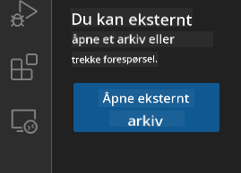
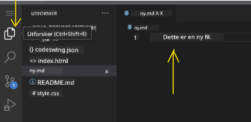
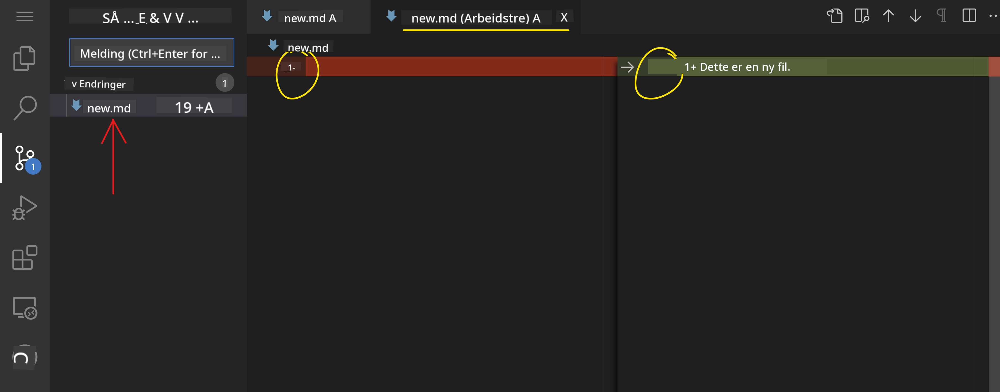
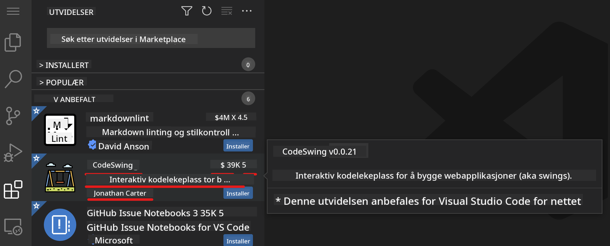
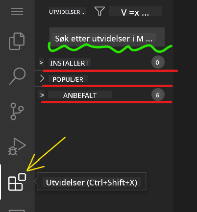
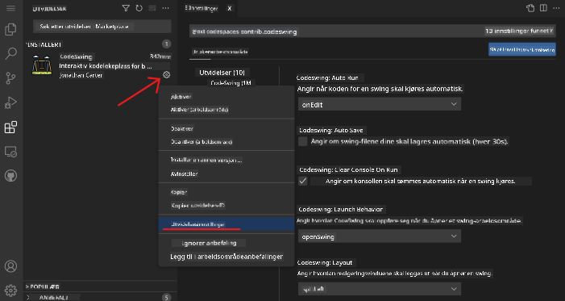

<!--
CO_OP_TRANSLATOR_METADATA:
{
  "original_hash": "7aa6e4f270d38d9cb17f2b5bd86b863d",
  "translation_date": "2025-08-26T22:27:54+00:00",
  "source_file": "8-code-editor/1-using-a-code-editor/README.md",
  "language_code": "no"
}
-->
# Bruke en kodeeditor

Denne leksjonen dekker det grunnleggende om å bruke [VSCode.dev](https://vscode.dev), en nettbasert kodeeditor, slik at du kan gjøre endringer i koden din og bidra til et prosjekt uten å installere noe på datamaskinen din.

## Læringsmål

I denne leksjonen vil du lære å:

- Bruke en kodeeditor i et kodeprosjekt
- Holde oversikt over endringer med versjonskontroll
- Tilpasse editoren for utvikling

### Forutsetninger

Før du begynner, må du opprette en konto hos [GitHub](https://github.com). Gå til [GitHub](https://github.com/) og opprett en konto hvis du ikke allerede har gjort det.

### Introduksjon

En kodeeditor er et essensielt verktøy for å skrive programmer og samarbeide med eksisterende kodeprosjekter. Når du forstår det grunnleggende om en editor og hvordan du bruker dens funksjoner, kan du anvende dem når du skriver kode.

## Komme i gang med VSCode.dev

[VSCode.dev](https://vscode.dev) er en kodeeditor på nettet. Du trenger ikke å installere noe for å bruke den, akkurat som å åpne en hvilken som helst nettside. For å komme i gang med editoren, åpne følgende lenke: [https://vscode.dev](https://vscode.dev). Hvis du ikke er logget inn på [GitHub](https://github.com/), følg instruksjonene for å logge inn eller opprette en ny konto og deretter logge inn.

Når den lastes inn, bør den se ut som dette bildet:


Det er tre hovedseksjoner, fra venstre til høyre:

1. _Aktivitetslinjen_, som inkluderer noen ikoner, som forstørrelsesglasset 🔎, tannhjulet ⚙️, og noen andre.
2. Den utvidede aktivitetslinjen som standard er satt til _Utforsker_, kalt _sidepanelet_.
3. Og til slutt kodeområdet til høyre.

Klikk på hvert av ikonene for å vise en annen meny. Når du er ferdig, klikk på _Utforsker_ for å komme tilbake til der du startet.

Når du begynner å lage kode eller endre eksisterende kode, vil det skje i det største området til høyre. Du vil også bruke dette området til å visualisere eksisterende kode, noe du vil gjøre neste gang.

## Åpne et GitHub-repositorium

Det første du trenger er å åpne et GitHub-repositorium. Det finnes flere måter å åpne et repositorium på. I denne delen vil du se to forskjellige måter du kan åpne et repositorium på, slik at du kan begynne å jobbe med endringer.

### 1. Med editoren

Bruk selve editoren for å åpne et eksternt repositorium. Hvis du går til [VSCode.dev](https://vscode.dev), vil du se en knapp som heter _"Open Remote Repository"_:



Du kan også bruke kommandopaletten. Kommandopaletten er en inntastingsboks der du kan skrive inn et hvilket som helst ord som er en del av en kommando eller handling for å finne riktig kommando å utføre. Bruk menyen øverst til venstre, velg _View_, og deretter _Command Palette_, eller bruk følgende hurtigtast: Ctrl-Shift-P (på MacOS er det Command-Shift-P).


Når menyen åpnes, skriv _open remote repository_, og velg deretter det første alternativet. Flere repositorier som du er en del av eller som du har åpnet nylig, vil vises. Du kan også bruke en full GitHub-URL for å velge ett. Bruk følgende URL og lim den inn i boksen:

```
https://github.com/microsoft/Web-Dev-For-Beginners
```

✅ Hvis det lykkes, vil du se alle filene for dette repositoriet lastet inn i teksteditoren.

### 2. Bruke URL

Du kan også bruke en URL direkte for å laste inn et repositorium. For eksempel er den fullstendige URL-en for det nåværende repositoriet [https://github.com/microsoft/Web-Dev-For-Beginners](https://github.com/microsoft/Web-Dev-For-Beginners), men du kan bytte ut GitHub-domenet med `VSCode.dev/github` og laste inn repositoriet direkte. Den resulterende URL-en vil være [https://vscode.dev/github/microsoft/Web-Dev-For-Beginners](https://vscode.dev/github/microsoft/Web-Dev-For-Beginners).

## Redigere filer

Når du har åpnet repositoriet i nettleseren/vscode.dev, er neste steg å gjøre oppdateringer eller endringer i prosjektet.

### 1. Opprette en ny fil

Du kan enten opprette en fil inne i en eksisterende mappe eller opprette den i rotkatalogen/mappen. For å opprette en ny fil, åpne en plassering/katalog der du vil lagre filen og velg ikonet _'New file ...'_ på aktivitetslinjen _(venstre)_, gi den et navn og trykk enter.


### 2. Redigere og lagre en fil i repositoriet

Å bruke vscode.dev er nyttig når du vil gjøre raske oppdateringer i prosjektet ditt uten å måtte laste inn programvare lokalt.  
For å oppdatere koden din, klikk på 'Utforsker'-ikonet, som også ligger på aktivitetslinjen, for å vise filer og mapper i repositoriet.  
Velg en fil for å åpne den i kodeområdet, gjør endringene dine og lagre.



Når du er ferdig med å oppdatere prosjektet ditt, velg ikonet _`source control`_, som inneholder alle de nye endringene du har gjort i repositoriet.

For å se endringene du har gjort i prosjektet, velg filene i `Changes`-mappen i det utvidede aktivitetsfeltet. Dette vil åpne et 'Working Tree' der du visuelt kan se endringene du har gjort i filen. Rødt viser en utelatelse i prosjektet, mens grønt indikerer en tillegg.



Hvis du er fornøyd med endringene du har gjort, hold musepekeren over `Changes`-mappen og klikk på `+`-knappen for å stage endringene. Å stage betyr å forberede endringene dine for å sende dem til GitHub.

Hvis du derimot ikke er komfortabel med noen endringer og vil forkaste dem, hold musepekeren over `Changes`-mappen og velg ikonet for `angre`.

Deretter skriver du inn en `commit-melding` _(En beskrivelse av endringen du har gjort i prosjektet)_, klikker på `sjekk-ikonet` for å committe og pushe endringene dine.

Når du er ferdig med å jobbe med prosjektet ditt, velg `hamburger-menyikonet` øverst til venstre for å gå tilbake til repositoriet på github.com.


## Bruke utvidelser

Å installere utvidelser i VSCode lar deg legge til nye funksjoner og tilpasse utviklingsmiljøet i editoren for å forbedre arbeidsflyten din. Disse utvidelsene hjelper deg også med å legge til støtte for flere programmeringsspråk og er ofte enten generelle utvidelser eller språkbaserte utvidelser.

For å bla gjennom listen over alle tilgjengelige utvidelser, klikk på _`Utvidelsesikonet`_ på aktivitetslinjen og begynn å skrive navnet på utvidelsen i tekstfeltet merket _'Search Extensions in Marketplace'_.  
Du vil se en liste over utvidelser, hver med **utvidelsesnavn, utgiverens navn, en kort beskrivelse, antall nedlastinger** og **stjernerangering**.



Du kan også se alle tidligere installerte utvidelser ved å utvide mappen _`Installed`_, populære utvidelser brukt av de fleste utviklere i mappen _`Popular`_, og anbefalte utvidelser for deg enten av brukere i samme arbeidsområde eller basert på nylig åpnet filer i mappen _`Recommended`_.



### 1. Installere utvidelser

For å installere en utvidelse, skriv inn navnet på utvidelsen i søkefeltet og klikk på den for å se tilleggsinformasjon om utvidelsen i kodeområdet når den vises i det utvidede aktivitetsfeltet.

Du kan enten klikke på den _blå installasjonsknappen_ i det utvidede aktivitetsfeltet for å installere eller bruke installasjonsknappen som vises i kodeområdet når du velger utvidelsen for å laste inn tilleggsinformasjon.


### 2. Tilpasse utvidelser

Etter å ha installert utvidelsen, kan det hende du må endre dens oppførsel og tilpasse den basert på dine preferanser. For å gjøre dette, velg Utvidelsesikonet, og denne gangen vil utvidelsen din vises i mappen _Installed_, klikk på _**Tannhjulikonet**_ og naviger til _Extensions Setting_.



### 3. Administrere utvidelser

Etter å ha installert og brukt utvidelsen, tilbyr vscode.dev alternativer for å administrere utvidelsen basert på ulike behov. For eksempel kan du velge å:

- **Deaktivere:** _(Du deaktiverer midlertidig en utvidelse når du ikke lenger trenger den, men ikke vil avinstallere den helt)_

    Velg den installerte utvidelsen i det utvidede aktivitetsfeltet > klikk på Tannhjulikonet > velg 'Disable' eller 'Disable (Workspace)' **ELLER** Åpne utvidelsen i kodeområdet og klikk på den blå Deaktiver-knappen.

- **Avinstallere:** Velg den installerte utvidelsen i det utvidede aktivitetsfeltet > klikk på Tannhjulikonet > velg 'Uninstall' **ELLER** Åpne utvidelsen i kodeområdet og klikk på den blå Avinstaller-knappen.

---

## Oppgave

[Lag en CV-nettside ved hjelp av vscode.dev](https://github.com/microsoft/Web-Dev-For-Beginners/blob/main/8-code-editor/1-using-a-code-editor/assignment.md)

## Gjennomgang og selvstudium

Les mer om [VSCode.dev](https://code.visualstudio.com/docs/editor/vscode-web?WT.mc_id=academic-0000-alfredodeza) og noen av de andre funksjonene.

---

**Ansvarsfraskrivelse**:  
Dette dokumentet er oversatt ved hjelp av AI-oversettelsestjenesten [Co-op Translator](https://github.com/Azure/co-op-translator). Selv om vi streber etter nøyaktighet, vær oppmerksom på at automatiske oversettelser kan inneholde feil eller unøyaktigheter. Det originale dokumentet på sitt opprinnelige språk bør anses som den autoritative kilden. For kritisk informasjon anbefales profesjonell menneskelig oversettelse. Vi er ikke ansvarlige for misforståelser eller feiltolkninger som oppstår ved bruk av denne oversettelsen.