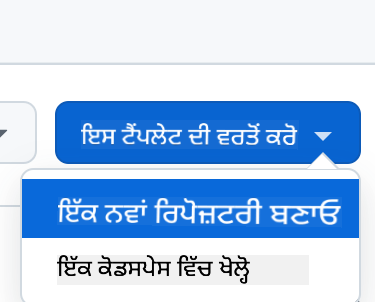
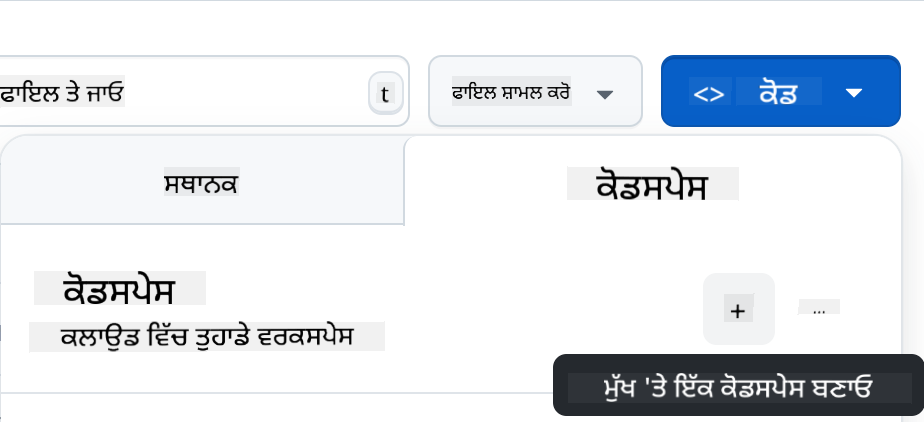

<!--
CO_OP_TRANSLATOR_METADATA:
{
  "original_hash": "cf15ff7770c5a484349383bb27d1131f",
  "translation_date": "2025-08-28T17:21:14+00:00",
  "source_file": "9-chat-project/README.md",
  "language_code": "pa"
}
-->
# ਚੈਟ ਪ੍ਰੋਜੈਕਟ

ਇਹ ਚੈਟ ਪ੍ਰੋਜੈਕਟ ਦਿਖਾਉਂਦਾ ਹੈ ਕਿ ਗਿਟਹੱਬ ਮਾਡਲਜ਼ ਦੀ ਵਰਤੋਂ ਕਰਕੇ ਇੱਕ ਚੈਟ ਅਸਿਸਟੈਂਟ ਕਿਵੇਂ ਬਣਾਇਆ ਜਾ ਸਕਦਾ ਹੈ।

ਇਹ ਹੈ ਕਿ ਤਿਆਰ ਪ੍ਰੋਜੈਕਟ ਕਿਵੇਂ ਲੱਗਦਾ ਹੈ:

<div>
  
</div>

ਕੁਝ ਸੰਦਰਭ, ਜਨਰੇਟਿਵ AI ਦੀ ਵਰਤੋਂ ਕਰਕੇ ਚੈਟ ਅਸਿਸਟੈਂਟ ਬਣਾਉਣਾ AI ਬਾਰੇ ਸਿੱਖਣ ਦੀ ਸ਼ੁਰੂਆਤ ਕਰਨ ਦਾ ਵਧੀਆ ਤਰੀਕਾ ਹੈ। ਇਸ ਪਾਠ ਦੌਰਾਨ ਤੁਸੀਂ ਸਿੱਖੋਗੇ ਕਿ ਜਨਰੇਟਿਵ AI ਨੂੰ ਵੈੱਬ ਐਪ ਵਿੱਚ ਕਿਵੇਂ ਜੋੜਨਾ ਹੈ। ਆਓ ਸ਼ੁਰੂ ਕਰੀਏ।

## ਜਨਰੇਟਿਵ AI ਨਾਲ ਕਨੈਕਟ ਕਰਨਾ

ਬੈਕਐਂਡ ਲਈ, ਅਸੀਂ ਗਿਟਹੱਬ ਮਾਡਲਜ਼ ਦੀ ਵਰਤੋਂ ਕਰ ਰਹੇ ਹਾਂ। ਇਹ ਇੱਕ ਸ਼ਾਨਦਾਰ ਸੇਵਾ ਹੈ ਜੋ ਤੁਹਾਨੂੰ ਮੁਫ਼ਤ ਵਿੱਚ AI ਦੀ ਵਰਤੋਂ ਕਰਨ ਦੀ ਆਗਿਆ ਦਿੰਦੀ ਹੈ। ਇਸਦੇ ਪਲੇਗ੍ਰਾਊਂਡ ਤੇ ਜਾਓ ਅਤੇ ਆਪਣੇ ਚੁਣੇ ਹੋਏ ਬੈਕਐਂਡ ਭਾਸ਼ਾ ਨਾਲ ਸਬੰਧਤ ਕੋਡ ਲਵੋ। ਇਹ [GitHub Models Playground](https://github.com/marketplace/models/azure-openai/gpt-4o-mini/playground) 'ਤੇ ਇਸ ਤਰ੍ਹਾਂ ਲੱਗਦਾ ਹੈ।

<div>
  
</div>

ਜਿਵੇਂ ਅਸੀਂ ਕਿਹਾ ਸੀ, "Code" ਟੈਬ ਅਤੇ ਆਪਣੀ ਚੁਣੀ ਹੋਈ ਰਨਟਾਈਮ ਚੁਣੋ।

<div>
  
</div>

ਇਸ ਮਾਮਲੇ ਵਿੱਚ ਅਸੀਂ Python ਚੁਣਦੇ ਹਾਂ, ਜਿਸਦਾ ਮਤਲਬ ਹੈ ਕਿ ਅਸੀਂ ਇਹ ਕੋਡ ਚੁਣਾਂਗੇ:

```python
"""Run this model in Python

> pip install openai
"""
import os
from openai import OpenAI

# To authenticate with the model you will need to generate a personal access token (PAT) in your GitHub settings. 
# Create your PAT token by following instructions here: https://docs.github.com/en/authentication/keeping-your-account-and-data-secure/managing-your-personal-access-tokens
client = OpenAI(
    base_url="https://models.github.ai/inference",
    api_key=os.environ["GITHUB_TOKEN"],
)

response = client.chat.completions.create(
    messages=[
        {
            "role": "system",
            "content": "",
        },
        {
            "role": "user",
            "content": "What is the capital of France?",
        }
    ],
    model="openai/gpt-4o-mini",
    temperature=1,
    max_tokens=4096,
    top_p=1
)

print(response.choices[0].message.content)
```

ਆਓ ਇਸ ਕੋਡ ਨੂੰ ਕੁਝ ਸਾਫ ਕਰੀਏ ਤਾਂ ਜੋ ਇਹ ਦੁਬਾਰਾ ਵਰਤਣ ਯੋਗ ਹੋਵੇ:

```python
def call_llm(prompt: str, system_message: str):
    response = client.chat.completions.create(
        messages=[
            {
                "role": "system",
                "content": system_message,
            },
            {
                "role": "user",
                "content": prompt,
            }
        ],
        model="openai/gpt-4o-mini",
        temperature=1,
        max_tokens=4096,
        top_p=1
    )

    return response.choices[0].message.content
```

ਇਸ ਫੰਕਸ਼ਨ `call_llm` ਨਾਲ ਹੁਣ ਅਸੀਂ ਇੱਕ ਪ੍ਰੌਮਪਟ ਅਤੇ ਇੱਕ ਸਿਸਟਮ ਪ੍ਰੌਮਪਟ ਲੈ ਸਕਦੇ ਹਾਂ ਅਤੇ ਫੰਕਸ਼ਨ ਨਤੀਜਾ ਵਾਪਸ ਕਰਦਾ ਹੈ।

### AI ਅਸਿਸਟੈਂਟ ਨੂੰ ਕਸਟਮਾਈਜ਼ ਕਰੋ

ਜੇ ਤੁਸੀਂ AI ਅਸਿਸਟੈਂਟ ਨੂੰ ਕਸਟਮਾਈਜ਼ ਕਰਨਾ ਚਾਹੁੰਦੇ ਹੋ ਤਾਂ ਤੁਸੀਂ ਸਿਸਟਮ ਪ੍ਰੌਮਪਟ ਨੂੰ ਇਸ ਤਰ੍ਹਾਂ ਭਰ ਕੇ ਇਸਦੀ ਵਰਤੋਂ ਨੂੰ ਨਿਰਧਾਰਤ ਕਰ ਸਕਦੇ ਹੋ:

```python
call_llm("Tell me about you", "You're Albert Einstein, you only know of things in the time you were alive")
```

## ਇਸਨੂੰ ਵੈੱਬ API ਰਾਹੀਂ ਐਕਸਪੋਜ਼ ਕਰੋ

ਵਧੀਆ, ਅਸੀਂ AI ਹਿੱਸਾ ਤਿਆਰ ਕਰ ਲਿਆ ਹੈ, ਆਓ ਵੇਖੀਏ ਕਿ ਅਸੀਂ ਇਸਨੂੰ ਵੈੱਬ API ਵਿੱਚ ਕਿਵੇਂ ਜੋੜ ਸਕਦੇ ਹਾਂ। ਵੈੱਬ API ਲਈ, ਅਸੀਂ Flask ਦੀ ਵਰਤੋਂ ਕਰ ਰਹੇ ਹਾਂ, ਪਰ ਕੋਈ ਵੀ ਵੈੱਬ ਫਰੇਮਵਰਕ ਚੰਗਾ ਹੋਵੇਗਾ। ਆਓ ਇਸਦਾ ਕੋਡ ਵੇਖੀਏ:

```python
# api.py
from flask import Flask, request, jsonify
from llm import call_llm
from flask_cors import CORS

app = Flask(__name__)
CORS(app)   # *   example.com

@app.route("/", methods=["GET"])
def index():
    return "Welcome to this API. Call POST /hello with 'message': 'my message' as JSON payload"


@app.route("/hello", methods=["POST"])
def hello():
    # get message from request body  { "message": "do this taks for me" }
    data = request.get_json()
    message = data.get("message", "")

    response = call_llm(message, "You are a helpful assistant.")
    return jsonify({
        "response": response
    })

if __name__ == "__main__":
    app.run(host="0.0.0.0", port=5000)
```

ਇੱਥੇ, ਅਸੀਂ ਇੱਕ Flask API ਬਣਾਉਂਦੇ ਹਾਂ ਅਤੇ ਇੱਕ ਡਿਫਾਲਟ ਰੂਟ "/" ਅਤੇ "/chat" ਪਰਿਭਾਸ਼ਿਤ ਕਰਦੇ ਹਾਂ। ਦੂਜਾ ਰੂਟ ਸਾਡੇ ਫਰੰਟਐਂਡ ਦੁਆਰਾ ਪ੍ਰਸ਼ਨ ਭੇਜਣ ਲਈ ਵਰਤਿਆ ਜਾਂਦਾ ਹੈ।

*llm.py* ਨੂੰ ਜੋੜਨ ਲਈ, ਅਸੀਂ ਇਹ ਕਰਨਾ ਹੈ:

- `call_llm` ਫੰਕਸ਼ਨ ਨੂੰ ਇੰਪੋਰਟ ਕਰੋ:

   ```python
   from llm import call_llm
   from flask import Flask, request
   ```

- "/chat" ਰੂਟ ਤੋਂ ਇਸਨੂੰ ਕਾਲ ਕਰੋ:

   ```python
   @app.route("/hello", methods=["POST"])
   def hello():
      # get message from request body  { "message": "do this taks for me" }
      data = request.get_json()
      message = data.get("message", "")

      response = call_llm(message, "You are a helpful assistant.")
      return jsonify({
         "response": response
      })
   ```

   ਇੱਥੇ ਅਸੀਂ ਆਉਣ ਵਾਲੀ ਰਿਕਵੈਸਟ ਨੂੰ ਪਾਰਸ ਕਰਦੇ ਹਾਂ ਤਾਂ ਜੋ JSON ਬਾਡੀ ਤੋਂ `message` ਪ੍ਰਾਪਰਟੀ ਪ੍ਰਾਪਤ ਕੀਤੀ ਜਾ ਸਕੇ। ਇਸ ਤੋਂ ਬਾਅਦ ਅਸੀਂ LLM ਨੂੰ ਇਸ ਕਾਲ ਨਾਲ ਕਾਲ ਕਰਦੇ ਹਾਂ:

   ```python
   response = call_llm(message, "You are a helpful assistant")

   # return the response as JSON
   return jsonify({
      "response": response 
   })
   ```

ਵਧੀਆ, ਹੁਣ ਅਸੀਂ ਜੋ ਲੋੜ ਸੀ ਉਹ ਕਰ ਲਿਆ ਹੈ।

### Cors ਕਨਫਿਗਰ ਕਰੋ

ਸਾਨੂੰ ਇਹ ਗੱਲ ਦੱਸਣੀ ਚਾਹੀਦੀ ਹੈ ਕਿ ਅਸੀਂ CORS (ਕਰਾਸ-ਓਰਿਜਿਨ ਰਿਸੋਰਸ ਸ਼ੇਅਰਿੰਗ) ਸੈਟਅੱਪ ਕੀਤਾ ਹੈ। ਇਸਦਾ ਮਤਲਬ ਹੈ ਕਿ ਕਿਉਂਕਿ ਸਾਡਾ ਬੈਕਐਂਡ ਅਤੇ ਫਰੰਟਐਂਡ ਵੱਖ-ਵੱਖ ਪੋਰਟਾਂ 'ਤੇ ਚੱਲਣਗੇ, ਸਾਨੂੰ ਫਰੰਟਐਂਡ ਨੂੰ ਬੈਕਐਂਡ ਵਿੱਚ ਕਾਲ ਕਰਨ ਦੀ ਆਗਿਆ ਦੇਣੀ ਪਵੇਗੀ। *api.py* ਵਿੱਚ ਇੱਕ ਕੋਡ ਦਾ ਟੁਕੜਾ ਹੈ ਜੋ ਇਸਨੂੰ ਸੈਟਅੱਪ ਕਰਦਾ ਹੈ:

```python
from flask_cors import CORS

app = Flask(__name__)
CORS(app)   # *   example.com
```

ਇਸ ਵੇਲੇ ਇਹ "*" (ਸਾਰੇ ਓਰਿਜਿਨ) ਦੀ ਆਗਿਆ ਦੇਣ ਲਈ ਸੈਟ ਕੀਤਾ ਗਿਆ ਹੈ ਜੋ ਕਿ ਕੁਝ ਅਸੁਰੱਖਿਅਤ ਹੈ। ਜਦੋਂ ਅਸੀਂ ਪ੍ਰੋਡਕਸ਼ਨ ਵਿੱਚ ਜਾਵਾਂਗੇ ਤਾਂ ਇਸਨੂੰ ਸੀਮਿਤ ਕਰਨਾ ਚਾਹੀਦਾ ਹੈ।

## ਆਪਣਾ ਪ੍ਰੋਜੈਕਟ ਚਲਾਓ

ਠੀਕ ਹੈ, ਤਾਂ ਸਾਡੇ ਕੋਲ *llm.py* ਅਤੇ *api.py* ਹੈ। ਹੁਣ ਅਸੀਂ ਇਸਨੂੰ ਬੈਕਐਂਡ ਨਾਲ ਕਿਵੇਂ ਚਲਾ ਸਕਦੇ ਹਾਂ? ਖੈਰ, ਦੋ ਚੀਜ਼ਾਂ ਕਰਨ ਦੀ ਲੋੜ ਹੈ:

- ਡਿਪੈਂਡੈਂਸੀਜ਼ ਇੰਸਟਾਲ ਕਰੋ:

   ```sh
   cd backend
   python -m venv venv
   source ./venv/bin/activate

   pip install openai flask flask-cors openai
   ```

- API ਸ਼ੁਰੂ ਕਰੋ:

   ```sh
   python api.py
   ```

   ਜੇ ਤੁਸੀਂ Codespaces ਵਿੱਚ ਹੋ ਤਾਂ ਤੁਹਾਨੂੰ ਐਡੀਟਰ ਦੇ ਹੇਠਲੇ ਹਿੱਸੇ ਵਿੱਚ ਪੋਰਟਸ 'ਤੇ ਜਾਣਾ ਪਵੇਗਾ, ਇਸ 'ਤੇ ਰਾਈਟ-ਕਲਿਕ ਕਰੋ ਅਤੇ "Port Visibility" ਤੇ ਕਲਿਕ ਕਰੋ ਅਤੇ "Public" ਚੁਣੋ।

### ਫਰੰਟਐਂਡ 'ਤੇ ਕੰਮ ਕਰੋ

ਹੁਣ ਜਦੋਂ ਸਾਡਾ API ਚੱਲ ਰਿਹਾ ਹੈ, ਆਓ ਇਸ ਲਈ ਇੱਕ ਫਰੰਟਐਂਡ ਬਣਾਈਏ। ਇੱਕ ਬੇਸਿਕ ਫਰੰਟਐਂਡ ਜੋ ਅਸੀਂ ਕਦਮ-ਦਰ-ਕਦਮ ਸੁਧਾਰਾਂਗੇ। ਇੱਕ *frontend* ਫੋਲਡਰ ਵਿੱਚ ਇਹ ਬਣਾਓ:

```text
backend/
frontend/
index.html
app.js
styles.css
```

**index.html** ਨਾਲ ਸ਼ੁਰੂ ਕਰੀਏ:

```html
<html>
    <head>
        <link rel="stylesheet" href="styles.css">
    </head>
    <body>
      <form>
        <textarea id="messages"></textarea>
        <input id="input" type="text" />
        <button type="submit" id="sendBtn">Send</button>  
      </form>  
      <script src="app.js" />
    </body>
</html>    
```

ਉਪਰੋਕਤ ਘੱਟੋ-ਘੱਟ ਹੈ ਜੋ ਤੁਹਾਨੂੰ ਇੱਕ ਚੈਟ ਵਿੰਡੋ ਨੂੰ ਸਹਾਰਾ ਦੇਣ ਲਈ ਲੋੜੀਂਦਾ ਹੈ। ਇਸ ਵਿੱਚ ਇੱਕ ਟੈਕਸਟਏਰੀਆ ਹੈ ਜਿੱਥੇ ਸੁਨੇਹੇ ਰੈਂਡਰ ਕੀਤੇ ਜਾਣਗੇ, ਇੱਕ ਇਨਪੁਟ ਜਿੱਥੇ ਸੁਨੇਹਾ ਲਿਖਿਆ ਜਾਵੇਗਾ ਅਤੇ ਇੱਕ ਬਟਨ ਜੋ ਤੁਹਾਡੇ ਸੁਨੇਹੇ ਨੂੰ ਬੈਕਐਂਡ ਨੂੰ ਭੇਜਣ ਲਈ ਹੈ। ਆਓ *app.js* ਵਿੱਚ ਜਾਵਾਸਕ੍ਰਿਪਟ ਵੇਖੀਏ।

**app.js**

```js
// app.js

(function(){
  // 1. set up elements  
  const messages = document.getElementById("messages");
  const form = document.getElementById("form");
  const input = document.getElementById("input");

  const BASE_URL = "change this";
  const API_ENDPOINT = `${BASE_URL}/hello`;

  // 2. create a function that talks to our backend
  async function callApi(text) {
    const response = await fetch(API_ENDPOINT, {
      method: "POST",
      headers: { "Content-Type": "application/json" },
      body: JSON.stringify({ message: text })
    });
    let json = await response.json();
    return json.response;
  }

  // 3. add response to our textarea
  function appendMessage(text, role) {
    const el = document.createElement("div");
    el.className = `message ${role}`;
    el.innerHTML = text;
    messages.appendChild(el);
  }

  // 4. listen to submit events
  form.addEventListener("submit", async(e) => {
    e.preventDefault();
   // someone clicked the button in the form
   
   // get input
   const text = input.value.trim();

   appendMessage(text, "user")

   // reset it
   input.value = '';

   const reply = await callApi(text);

   // add to messages
   appendMessage(reply, "assistant");

  })
})();
```

ਆਓ ਕੋਡ ਨੂੰ ਹਰੇਕ ਭਾਗ ਅਨੁਸਾਰ ਸਮਝੀਏ:

- 1) ਇੱਥੇ ਅਸੀਂ ਸਾਰੇ ਐਲੀਮੈਂਟਸ ਦੇ ਰਿਫਰੈਂਸ ਲੈਂਦੇ ਹਾਂ ਜਿਨ੍ਹਾਂ ਨੂੰ ਅਸੀਂ ਬਾਅਦ ਵਿੱਚ ਕੋਡ ਵਿੱਚ ਵਰਤਾਂਗੇ।
- 2) ਇਸ ਭਾਗ ਵਿੱਚ, ਅਸੀਂ ਇੱਕ ਫੰਕਸ਼ਨ ਬਣਾਉਂਦੇ ਹਾਂ ਜੋ ਬਿਲਟ-ਇਨ `fetch` ਮੈਥਡ ਦੀ ਵਰਤੋਂ ਕਰਦਾ ਹੈ ਜੋ ਸਾਡੇ ਬੈਕਐਂਡ ਨੂੰ ਕਾਲ ਕਰਦਾ ਹੈ।
- 3) `appendMessage` ਸਹਾਇਕ ਹੁੰਦਾ ਹੈ ਜਵਾਬਾਂ ਅਤੇ ਜੋ ਤੁਸੀਂ ਯੂਜ਼ਰ ਵਜੋਂ ਲਿਖਦੇ ਹੋ, ਦੋਹਾਂ ਨੂੰ ਸ਼ਾਮਲ ਕਰਨ ਵਿੱਚ।
- 4) ਇੱਥੇ ਅਸੀਂ ਸਬਮਿਟ ਇਵੈਂਟ ਨੂੰ ਸੁਣਦੇ ਹਾਂ ਅਤੇ ਅਸੀਂ ਇਨਪੁਟ ਫੀਲਡ ਨੂੰ ਪੜ੍ਹਦੇ ਹਾਂ, ਯੂਜ਼ਰ ਦਾ ਸੁਨੇਹਾ ਟੈਕਸਟਏਰੀਆ ਵਿੱਚ ਰੱਖਦੇ ਹਾਂ, API ਨੂੰ ਕਾਲ ਕਰਦੇ ਹਾਂ ਅਤੇ ਟੈਕਸਟਏਰੀਆ ਵਿੱਚ ਜਵਾਬ ਰੈਂਡਰ ਕਰਦੇ ਹਾਂ।

ਹੁਣ ਸਟਾਈਲਿੰਗ ਵੇਖੀਏ। ਇੱਥੇ ਤੁਸੀਂ ਆਪਣੀ ਪਸੰਦ ਅਨੁਸਾਰ ਬਦਲਾਅ ਕਰ ਸਕਦੇ ਹੋ, ਪਰ ਇੱਥੇ ਕੁਝ ਸੁਝਾਅ ਹਨ:

**styles.css**

```
.message {
    background: #222;
    box-shadow: 0 0 0 10px orange;
    padding: 10px:
    margin: 5px;
}

.message.user {
    background: blue;
}

.message.assistant {
    background: grey;
} 
```

ਇਹ ਤਿੰਨ ਕਲਾਸਾਂ ਨਾਲ, ਤੁਸੀਂ ਸੁਨੇਹਿਆਂ ਨੂੰ ਸਟਾਈਲ ਕਰ ਸਕਦੇ ਹੋ ਕਿ ਉਹ ਕਿੱਥੋਂ ਆ ਰਹੇ ਹਨ - ਅਸਿਸਟੈਂਟ ਤੋਂ ਜਾਂ ਯੂਜ਼ਰ ਤੋਂ। ਜੇ ਤੁਸੀਂ ਪ੍ਰੇਰਿਤ ਹੋਣਾ ਚਾਹੁੰਦੇ ਹੋ, ਤਾਂ `solution/frontend/styles.css` ਫੋਲਡਰ ਵੇਖੋ।

### ਬੇਸ URL ਬਦਲੋ

ਇੱਥੇ ਇੱਕ ਗੱਲ ਸੀ ਜੋ ਅਸੀਂ ਸੈਟ ਨਹੀਂ ਕੀਤੀ ਸੀ ਅਤੇ ਉਹ ਸੀ `BASE_URL`, ਇਹ ਤੁਹਾਡੇ ਬੈਕਐਂਡ ਦੇ ਸ਼ੁਰੂ ਹੋਣ ਤੱਕ ਪਤਾ ਨਹੀਂ ਹੁੰਦੀ। ਇਸਨੂੰ ਸੈਟ ਕਰਨ ਲਈ:

- ਜੇ ਤੁਸੀਂ API ਨੂੰ ਲੋਕਲ ਚਲਾਉਂਦੇ ਹੋ, ਤਾਂ ਇਹ ਕੁਝ ਇਸ ਤਰ੍ਹਾਂ ਹੋਣਾ ਚਾਹੀਦਾ ਹੈ `http://localhost:5000`।
- ਜੇ Codespaces ਵਿੱਚ ਚਲਾਇਆ ਜਾਵੇ, ਤਾਂ ਇਹ ਕੁਝ ਇਸ ਤਰ੍ਹਾਂ ਲੱਗੇਗਾ "[name]app.github.dev"।

## ਅਸਾਈਨਮੈਂਟ

ਆਪਣਾ ਇੱਕ ਫੋਲਡਰ *project* ਬਣਾਓ ਜਿਸ ਵਿੱਚ ਇਸ ਤਰ੍ਹਾਂ ਦੀ ਸਮੱਗਰੀ ਹੋਵੇ:

```text
project/
  frontend/
    index.html
    app.js
    styles.css
  backend/
    api.py
    llm.py
```

ਉਪਰ ਦਿੱਤੇ ਨਿਰਦੇਸ਼ਾਂ ਤੋਂ ਸਮੱਗਰੀ ਕਾਪੀ ਕਰੋ ਪਰ ਆਪਣੀ ਪਸੰਦ ਅਨੁਸਾਰ ਕਸਟਮਾਈਜ਼ ਕਰੋ।

## ਹੱਲ

[ਹੱਲ](./solution/README.md)

## ਬੋਨਸ

AI ਅਸਿਸਟੈਂਟ ਦੀ ਪਸੰਸਨਲਿਟੀ ਬਦਲਣ ਦੀ ਕੋਸ਼ਿਸ਼ ਕਰੋ। ਜਦੋਂ ਤੁਸੀਂ *api.py* ਵਿੱਚ `call_llm` ਨੂੰ ਕਾਲ ਕਰਦੇ ਹੋ, ਤਾਂ ਤੁਸੀਂ ਦੂਜੇ ਆਰਗੂਮੈਂਟ ਨੂੰ ਆਪਣੀ ਪਸੰਦ ਅਨੁਸਾਰ ਬਦਲ ਸਕਦੇ ਹੋ, ਉਦਾਹਰਨ ਲਈ:

```python
call_llm(message, "You are Captain Picard")
```

CSS ਅਤੇ ਟੈਕਸਟ ਨੂੰ ਵੀ ਆਪਣੀ ਪਸੰਦ ਅਨੁਸਾਰ ਬਦਲੋ, ਇਸ ਲਈ *index.html* ਅਤੇ *styles.css* ਵਿੱਚ ਬਦਲਾਅ ਕਰੋ।

## ਸਾਰ

ਵਧੀਆ, ਤੁਸੀਂ ਸ਼ੁਰੂ ਤੋਂ ਸਿੱਖ ਲਿਆ ਕਿ AI ਦੀ ਵਰਤੋਂ ਕਰਕੇ ਇੱਕ ਨਿੱਜੀ ਅਸਿਸਟੈਂਟ ਕਿਵੇਂ ਬਣਾਇਆ ਜਾ ਸਕਦਾ ਹੈ। ਅਸੀਂ ਇਹ ਗਿਟਹੱਬ ਮਾਡਲਜ਼, Python ਵਿੱਚ ਬੈਕਐਂਡ ਅਤੇ HTML, CSS ਅਤੇ ਜਾਵਾਸਕ੍ਰਿਪਟ ਵਿੱਚ ਫਰੰਟਐਂਡ ਦੀ ਵਰਤੋਂ ਕਰਕੇ ਕੀਤਾ।

## Codespaces ਨਾਲ ਸੈਟਅੱਪ ਕਰੋ

- ਜਾਓ: [Web Dev For Beginners repo](https://github.com/microsoft/Web-Dev-For-Beginners)
- ਇੱਕ ਟੈਂਪਲੇਟ ਤੋਂ ਬਣਾਓ (ਪੱਕਾ ਕਰੋ ਕਿ ਤੁਸੀਂ ਗਿਟਹੱਬ ਵਿੱਚ ਲੌਗਇਨ ਹੋ):

    

- ਜਦੋਂ ਤੁਸੀਂ ਆਪਣੇ ਰਿਪੋ ਵਿੱਚ ਹੋ, ਤਾਂ ਇੱਕ ਕੋਡਸਪੇਸ ਬਣਾਓ:

    

    ਇਹ ਇੱਕ ਐਨਵਾਇਰਨਮੈਂਟ ਸ਼ੁਰੂ ਕਰੇਗਾ ਜਿਸ ਵਿੱਚ ਤੁਸੀਂ ਹੁਣ ਕੰਮ ਕਰ ਸਕਦੇ ਹੋ।

---

**ਅਸਵੀਕਾਰਨਾ**:  
ਇਹ ਦਸਤਾਵੇਜ਼ AI ਅਨੁਵਾਦ ਸੇਵਾ [Co-op Translator](https://github.com/Azure/co-op-translator) ਦੀ ਵਰਤੋਂ ਕਰਕੇ ਅਨੁਵਾਦ ਕੀਤਾ ਗਿਆ ਹੈ। ਹਾਲਾਂਕਿ ਅਸੀਂ ਸਹੀਅਤ ਲਈ ਯਤਨਸ਼ੀਲ ਹਾਂ, ਕਿਰਪਾ ਕਰਕੇ ਧਿਆਨ ਦਿਓ ਕਿ ਸਵੈਚਾਲਿਤ ਅਨੁਵਾਦਾਂ ਵਿੱਚ ਗਲਤੀਆਂ ਜਾਂ ਅਸੁੱਤੀਆਂ ਹੋ ਸਕਦੀਆਂ ਹਨ। ਮੂਲ ਦਸਤਾਵੇਜ਼, ਜੋ ਇਸਦੀ ਮੂਲ ਭਾਸ਼ਾ ਵਿੱਚ ਹੈ, ਨੂੰ ਅਧਿਕਾਰਤ ਸਰੋਤ ਮੰਨਿਆ ਜਾਣਾ ਚਾਹੀਦਾ ਹੈ। ਮਹੱਤਵਪੂਰਨ ਜਾਣਕਾਰੀ ਲਈ, ਪੇਸ਼ੇਵਰ ਮਨੁੱਖੀ ਅਨੁਵਾਦ ਦੀ ਸਿਫਾਰਸ਼ ਕੀਤੀ ਜਾਂਦੀ ਹੈ। ਇਸ ਅਨੁਵਾਦ ਦੀ ਵਰਤੋਂ ਤੋਂ ਪੈਦਾ ਹੋਣ ਵਾਲੇ ਕਿਸੇ ਵੀ ਗਲਤਫਹਿਮੀ ਜਾਂ ਗਲਤ ਵਿਆਖਿਆ ਲਈ ਅਸੀਂ ਜ਼ਿੰਮੇਵਾਰ ਨਹੀਂ ਹਾਂ।