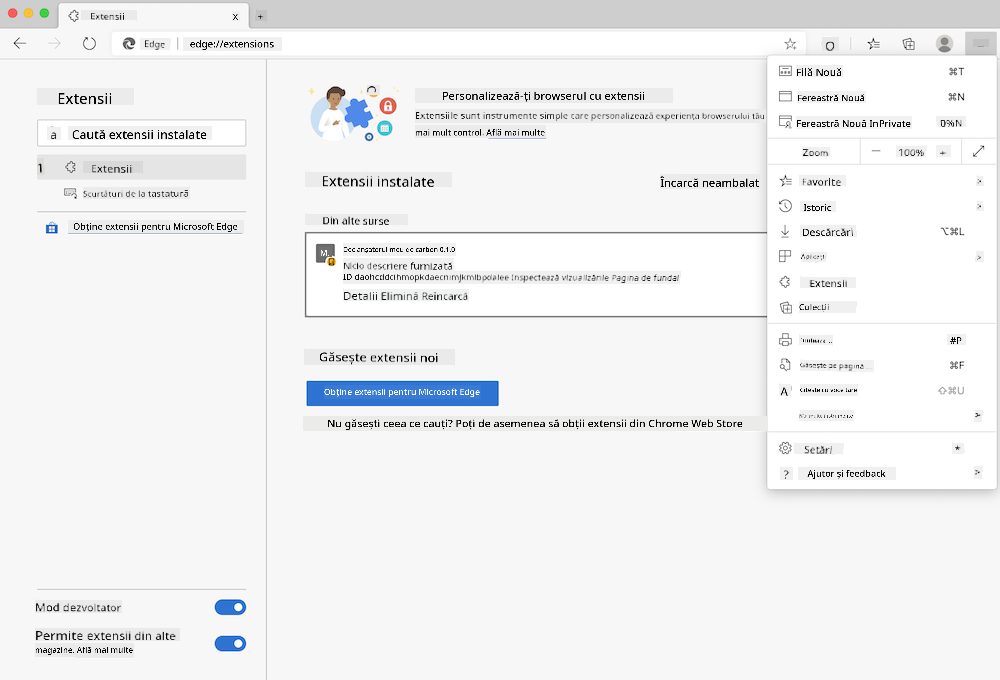
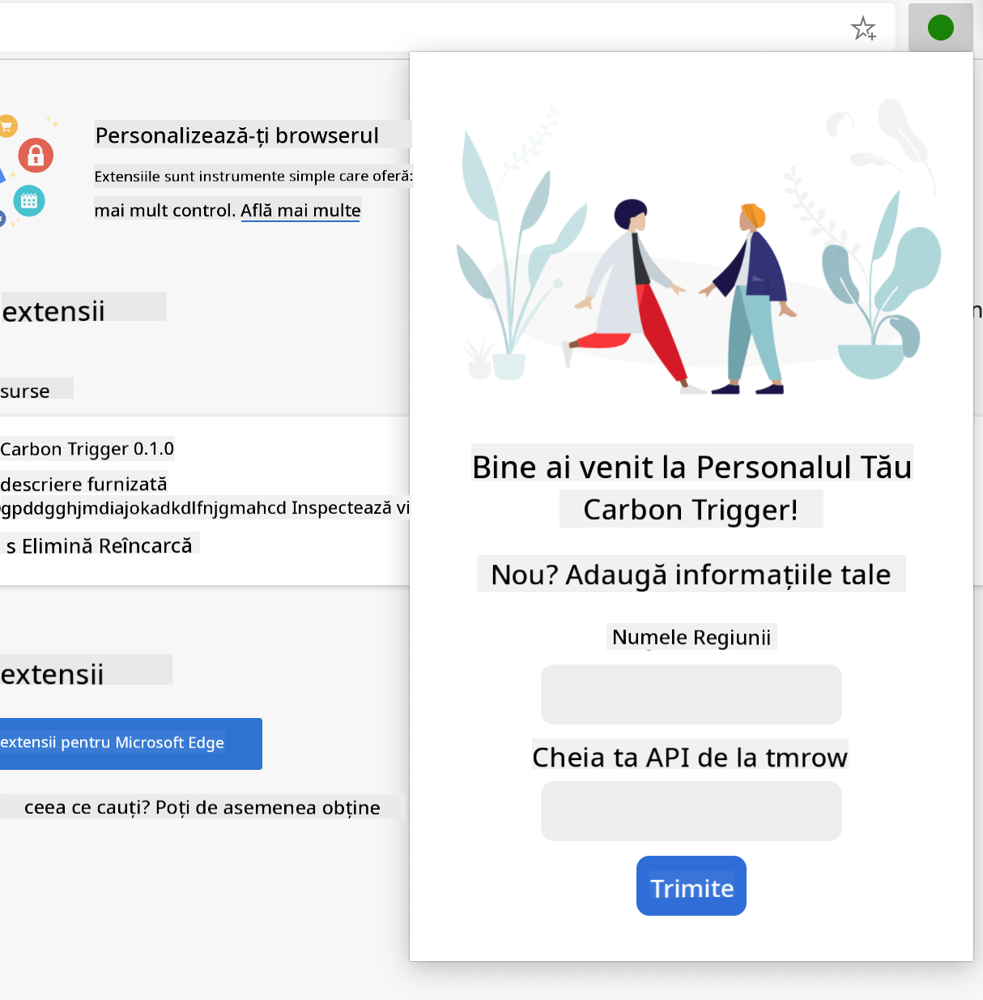
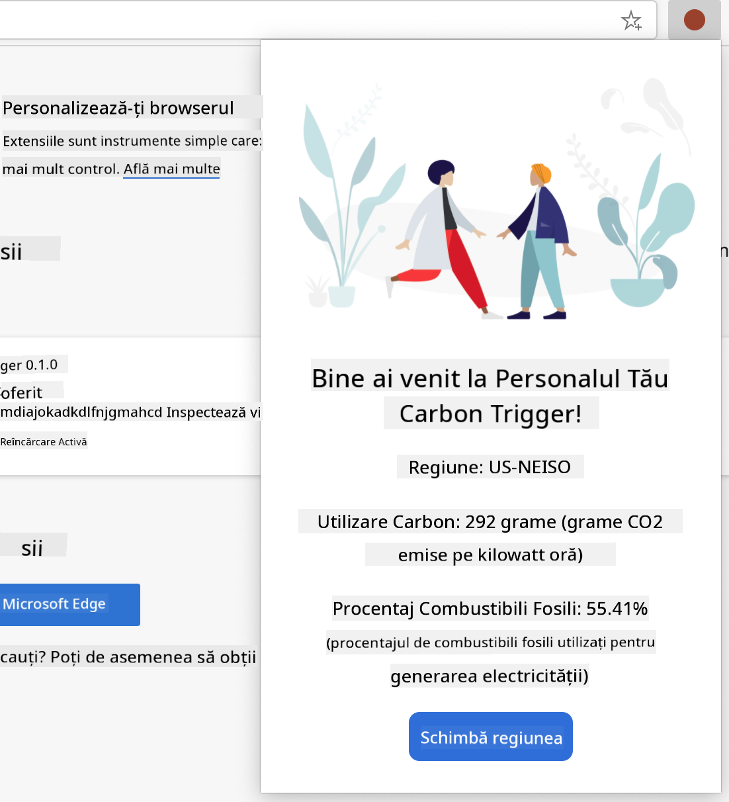

<!--
CO_OP_TRANSLATOR_METADATA:
{
  "original_hash": "0bb55e0b98600afab801eea115228873",
  "translation_date": "2025-08-28T07:41:44+00:00",
  "source_file": "5-browser-extension/1-about-browsers/README.md",
  "language_code": "ro"
}
-->
# Proiect de Extensie pentru Browser Partea 1: Totul despre Browsere


> Sketchnote de [Wassim Chegham](https://dev.to/wassimchegham/ever-wondered-what-happens-when-you-type-in-a-url-in-an-address-bar-in-a-browser-3dob)

## Chestionar Pre-Lecție

[Chestionar pre-lecție](https://ashy-river-0debb7803.1.azurestaticapps.net/quiz/23)

### Introducere

Extensiile pentru browser adaugă funcționalități suplimentare unui browser. Dar înainte de a construi una, ar trebui să înveți puțin despre cum funcționează browserele.

### Despre browser

În această serie de lecții, vei învăța cum să construiești o extensie pentru browser care va funcționa pe browserele Chrome, Firefox și Edge. În această parte, vei descoperi cum funcționează browserele și vei schița elementele extensiei pentru browser.

Dar ce este exact un browser? Este o aplicație software care permite unui utilizator final să acceseze conținut de pe un server și să îl afișeze pe pagini web.

✅ Un pic de istorie: primul browser s-a numit 'WorldWideWeb' și a fost creat de Sir Timothy Berners-Lee în 1990.


> Unele browsere timpurii, via [Karen McGrane](https://www.slideshare.net/KMcGrane/week-4-ixd-history-personal-computing)

Când un utilizator se conectează la internet folosind o adresă URL (Uniform Resource Locator), de obicei utilizând Hypertext Transfer Protocol printr-o adresă `http` sau `https`, browserul comunică cu un server web și preia o pagină web.

În acest moment, motorul de redare al browserului o afișează pe dispozitivul utilizatorului, care poate fi un telefon mobil, un desktop sau un laptop.

Browserele au, de asemenea, capacitatea de a memora în cache conținutul, astfel încât să nu fie necesar să fie preluat de pe server de fiecare dată. Ele pot înregistra istoricul activității de navigare a utilizatorului, pot stoca 'cookies', care sunt mici fragmente de date ce conțin informații utilizate pentru a înregistra activitatea utilizatorului, și multe altele.

Un lucru foarte important de reținut despre browsere este că nu toate sunt la fel! Fiecare browser are punctele sale forte și slabe, iar un dezvoltator web profesionist trebuie să înțeleagă cum să facă paginile web să funcționeze bine pe diferite browsere. Acest lucru include gestionarea ecranelor mici, cum ar fi cele ale telefoanelor mobile, precum și a utilizatorilor care sunt offline.

Un site web foarte util pe care ar trebui să-l salvezi în marcajele browserului tău preferat este [caniuse.com](https://www.caniuse.com). Când construiești pagini web, este foarte util să folosești listele de tehnologii suportate de caniuse pentru a-ți sprijini cât mai bine utilizatorii.

✅ Cum poți afla ce browsere sunt cele mai populare în rândul utilizatorilor site-ului tău web? Verifică analizele - poți instala diverse pachete de analiză ca parte a procesului tău de dezvoltare web, iar acestea îți vor spune ce browsere sunt cele mai utilizate de utilizatorii diferitelor browsere populare.

## Extensii pentru browser

De ce ai vrea să construiești o extensie pentru browser? Este un instrument util pe care îl poți atașa browserului tău atunci când ai nevoie de acces rapid la sarcini pe care le repeți frecvent. De exemplu, dacă ai nevoie să verifici culorile pe diversele pagini web cu care interacționezi, ai putea instala o extensie pentru browser care include un selector de culori. Dacă ai dificultăți în a-ți aminti parolele, ai putea folosi o extensie pentru gestionarea parolelor.

Extensiile pentru browser sunt și distractiv de dezvoltat. Ele tind să gestioneze un număr finit de sarcini pe care le îndeplinesc bine.

✅ Care sunt extensiile tale preferate pentru browser? Ce sarcini îndeplinesc?

### Instalarea extensiilor

Înainte de a începe să construiești, aruncă o privire asupra procesului de construire și implementare a unei extensii pentru browser. Deși fiecare browser diferă puțin în modul în care gestionează această sarcină, procesul este similar pe Chrome și Firefox cu acest exemplu pe Edge:



> Notă: Asigură-te că activezi modul dezvoltator și permiți extensii din alte magazine.

În esență, procesul va fi:

- construiește extensia folosind `npm run build` 
- navighează în browser la panoul de extensii folosind butonul "Settings and more" (pictograma `...`) din colțul din dreapta sus
- dacă este o instalare nouă, alege `load unpacked` pentru a încărca o extensie nouă din folderul său de build (în cazul nostru este `/dist`) 
- sau, apasă `reload` dacă reîncarci extensia deja instalată

✅ Aceste instrucțiuni se referă la extensiile pe care le construiești tu; pentru a instala extensii care au fost lansate în magazinul de extensii asociat fiecărui browser, ar trebui să navighezi la acele [magazine](https://microsoftedge.microsoft.com/addons/Microsoft-Edge-Extensions-Home) și să instalezi extensia dorită.

### Începe

Vei construi o extensie pentru browser care afișează amprenta de carbon a regiunii tale, arătând consumul de energie al regiunii tale și sursa energiei. Extensia va avea un formular care colectează o cheie API pentru a putea accesa API-ul CO2 Signal.

**Ai nevoie de:**

- [o cheie API](https://www.co2signal.com/); introdu adresa ta de email în caseta de pe această pagină și vei primi una
- [codul regiunii tale](http://api.electricitymap.org/v3/zones) corespunzător [Electricity Map](https://www.electricitymap.org/map) (în Boston, de exemplu, folosesc 'US-NEISO').
- [codul de început](../../../../5-browser-extension/start). Descarcă folderul `start`; vei completa codul în acest folder.
- [NPM](https://www.npmjs.com) - NPM este un instrument de gestionare a pachetelor; instalează-l local și pachetele listate în fișierul tău `package.json` vor fi instalate pentru a fi utilizate de activele tale web

✅ Află mai multe despre gestionarea pachetelor în acest [modul excelent de învățare](https://docs.microsoft.com/learn/modules/create-nodejs-project-dependencies/?WT.mc_id=academic-77807-sagibbon)

Acordă-ți un minut pentru a analiza baza de cod:

dist
    -|manifest.json (setările implicite sunt aici)
    -|index.html (markup-ul HTML pentru front-end este aici)
    -|background.js (JS-ul de fundal este aici)
    -|main.js (JS-ul compilat)
src
    -|index.js (codul tău JS merge aici)

✅ Odată ce ai la îndemână cheia API și codul regiunii, salvează-le undeva într-o notă pentru utilizare ulterioară.

### Construiește HTML-ul pentru extensie

Această extensie are două vizualizări. Una pentru a colecta cheia API și codul regiunii:



Și a doua pentru a afișa consumul de carbon al regiunii:



Să începem prin a construi HTML-ul pentru formular și să-l stilizăm cu CSS.

În folderul `/dist`, vei construi un formular și o zonă de rezultate. În fișierul `index.html`, completează zona de formular delimitată:

```HTML
<form class="form-data" autocomplete="on">
	<div>
		<h2>New? Add your Information</h2>
	</div>
	<div>
		<label for="region">Region Name</label>
		<input type="text" id="region" required class="region-name" />
	</div>
	<div>
		<label for="api">Your API Key from tmrow</label>
		<input type="text" id="api" required class="api-key" />
	</div>
	<button class="search-btn">Submit</button>
</form>	
```
Acesta este formularul unde informațiile salvate vor fi introduse și salvate în stocarea locală.

Apoi, creează zona de rezultate; sub ultimul tag de formular, adaugă câteva div-uri:

```HTML
<div class="result">
	<div class="loading">loading...</div>
	<div class="errors"></div>
	<div class="data"></div>
	<div class="result-container">
		<p><strong>Region: </strong><span class="my-region"></span></p>
		<p><strong>Carbon Usage: </strong><span class="carbon-usage"></span></p>
		<p><strong>Fossil Fuel Percentage: </strong><span class="fossil-fuel"></span></p>
	</div>
	<button class="clear-btn">Change region</button>
</div>
```
În acest moment, poți încerca un build. Asigură-te că instalezi dependențele pachetelor acestei extensii:

```
npm install
```

Această comandă va folosi npm, Managerul de Pachete Node, pentru a instala webpack pentru procesul de construire al extensiei tale. Poți vedea rezultatul acestui proces uitându-te în `/dist/main.js` - vei vedea că codul a fost compilat.

Deocamdată, extensia ar trebui să se construiască și, dacă o implementezi în Edge ca extensie, vei vedea un formular afișat frumos.

Felicitări, ai făcut primii pași spre construirea unei extensii pentru browser. În lecțiile următoare, o vei face mai funcțională și mai utilă.

---

## 🚀 Provocare

Aruncă o privire într-un magazin de extensii pentru browser și instalează una în browserul tău. Poți examina fișierele sale în moduri interesante. Ce descoperi?

## Chestionar Post-Lecție

[Chestionar post-lecție](https://ashy-river-0debb7803.1.azurestaticapps.net/quiz/24)

## Recapitulare & Studiu Individual

În această lecție ai învățat puțin despre istoria browserului web; profită de această ocazie pentru a învăța despre cum au imaginat inventatorii World Wide Web utilizarea sa citind mai multe despre istoria sa. Unele site-uri utile includ:

[Istoria Browserelor Web](https://www.mozilla.org/firefox/browsers/browser-history/)

[Istoria Web-ului](https://webfoundation.org/about/vision/history-of-the-web/)

[Un interviu cu Tim Berners-Lee](https://www.theguardian.com/technology/2019/mar/12/tim-berners-lee-on-30-years-of-the-web-if-we-dream-a-little-we-can-get-the-web-we-want)

## Temă 

[Restilizează extensia ta](assignment.md)

---

**Declinare de responsabilitate**:  
Acest document a fost tradus folosind serviciul de traducere AI [Co-op Translator](https://github.com/Azure/co-op-translator). Deși ne străduim să asigurăm acuratețea, vă rugăm să rețineți că traducerile automate pot conține erori sau inexactități. Documentul original în limba sa natală ar trebui considerat sursa autoritară. Pentru informații critice, se recomandă traducerea profesională realizată de un specialist uman. Nu ne asumăm responsabilitatea pentru eventualele neînțelegeri sau interpretări greșite care pot apărea din utilizarea acestei traduceri.