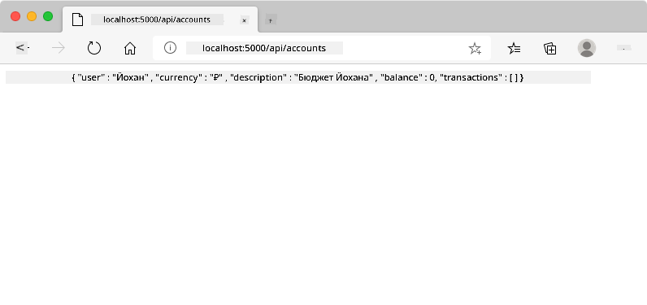
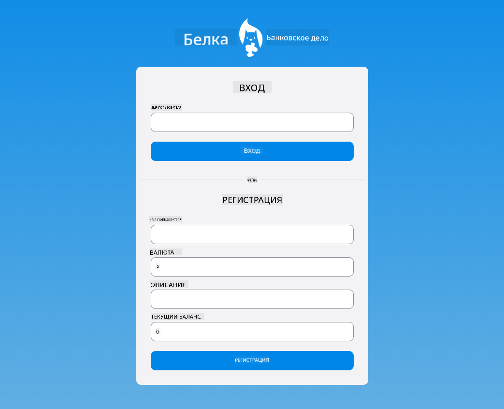

<!--
CO_OP_TRANSLATOR_METADATA:
{
  "original_hash": "b667b7d601e2ee19acb5aa9d102dc9f3",
  "translation_date": "2025-08-26T00:05:53+00:00",
  "source_file": "7-bank-project/2-forms/README.md",
  "language_code": "ru"
}
-->
# Создание банковского приложения. Часть 2: Создание формы входа и регистрации

## Вопросы перед лекцией

[Вопросы перед лекцией](https://ff-quizzes.netlify.app/web/quiz/43)

### Введение

Почти во всех современных веб-приложениях вы можете создать учетную запись, чтобы получить свое личное пространство. Поскольку несколько пользователей могут одновременно использовать веб-приложение, необходим механизм для раздельного хранения данных каждого пользователя и выбора информации для отображения. Мы не будем углубляться в тему [безопасного управления идентификацией пользователей](https://en.wikipedia.org/wiki/Authentication), так как это обширная тема, но убедимся, что каждый пользователь сможет создать одну (или несколько) банковских учетных записей в нашем приложении.

В этой части мы будем использовать HTML-формы для добавления входа и регистрации в наше веб-приложение. Мы рассмотрим, как программно отправлять данные на серверный API, а также как определить базовые правила валидации пользовательских данных.

### Предварительные требования

Для этого урока вам нужно завершить [шаблоны HTML и маршрутизацию](../1-template-route/README.md) веб-приложения. Также необходимо установить [Node.js](https://nodejs.org) и [запустить серверный API](../api/README.md) локально, чтобы можно было отправлять данные для создания учетных записей.

**Обратите внимание**  
Вам потребуется два терминала, работающих одновременно:
1. Для основного банковского приложения, созданного в уроке [шаблоны HTML и маршрутизация](../1-template-route/README.md).
2. Для [серверного API банковского приложения](../api/README.md), который мы только что настроили.

Оба сервера должны быть запущены, чтобы вы могли продолжить урок. Они используют разные порты (`3000` и `5000`), поэтому все должно работать корректно.

Вы можете проверить, что сервер работает, выполнив следующую команду в терминале:

```sh
curl http://localhost:5000/api
# -> should return "Bank API v1.0.0" as a result
```

---

## Форма и элементы управления

Элемент `<form>` инкапсулирует раздел HTML-документа, где пользователь может вводить и отправлять данные с помощью интерактивных элементов управления. Существует множество пользовательских интерфейсных элементов (UI), которые можно использовать в форме, наиболее распространенными из которых являются элементы `<input>` и `<button>`.

Существует множество различных [типов](https://developer.mozilla.org/docs/Web/HTML/Element/input) `<input>`. Например, чтобы создать поле для ввода имени пользователя, можно использовать:

```html
<input id="username" name="username" type="text">
```

Атрибут `name` будет использоваться как имя свойства при отправке данных формы. Атрибут `id` используется для связывания элемента `<label>` с элементом управления формы.

> Ознакомьтесь с полным списком [типов `<input>`](https://developer.mozilla.org/docs/Web/HTML/Element/input) и [других элементов управления формами](https://developer.mozilla.org/docs/Learn/Forms/Other_form_controls), чтобы понять, какие элементы интерфейса можно использовать при создании вашего UI.

✅ Обратите внимание, что `<input>` является [пустым элементом](https://developer.mozilla.org/docs/Glossary/Empty_element), для которого *не следует* добавлять закрывающий тег. Однако вы можете использовать самозакрывающийся синтаксис `<input/>`, но это не обязательно.

Элемент `<button>` в форме имеет особое поведение. Если не указать его атрибут `type`, он автоматически отправит данные формы на сервер при нажатии. Возможные значения атрибута `type`:

- `submit`: Значение по умолчанию в `<form>`, кнопка запускает действие отправки формы.
- `reset`: Кнопка сбрасывает все элементы управления формы к их исходным значениям.
- `button`: Не назначает кнопке никакого поведения по умолчанию. Вы можете назначить ей пользовательские действия с помощью JavaScript.

### Задание

Начнем с добавления формы в шаблон `login`. Нам потребуется поле для *имени пользователя* и кнопка *Login*.

```html
<template id="login">
  <h1>Bank App</h1>
  <section>
    <h2>Login</h2>
    <form id="loginForm">
      <label for="username">Username</label>
      <input id="username" name="user" type="text">
      <button>Login</button>
    </form>
  </section>
</template>
```

Если присмотреться, можно заметить, что мы также добавили элемент `<label>`. Элементы `<label>` используются для добавления названия к элементам управления интерфейса, таким как наше поле имени пользователя. Метки важны для читаемости ваших форм, а также имеют дополнительные преимущества:

- Связывание метки с элементом управления помогает пользователям, использующим вспомогательные технологии (например, экранные дикторы), понять, какие данные от них ожидаются.
- Вы можете нажать на метку, чтобы сразу установить фокус на связанном поле ввода, что упрощает взаимодействие на устройствах с сенсорным экраном.

> [Доступность](https://developer.mozilla.org/docs/Learn/Accessibility/What_is_accessibility) в вебе — это очень важная тема, которая часто упускается из виду. Благодаря [семантическим HTML-элементам](https://developer.mozilla.org/docs/Learn/Accessibility/HTML) несложно создавать доступный контент, если использовать их правильно. Вы можете [узнать больше о доступности](https://developer.mozilla.org/docs/Web/Accessibility), чтобы избежать распространенных ошибок и стать ответственным разработчиком.

Теперь добавим вторую форму для регистрации, сразу под предыдущей:

```html
<hr/>
<h2>Register</h2>
<form id="registerForm">
  <label for="user">Username</label>
  <input id="user" name="user" type="text">
  <label for="currency">Currency</label>
  <input id="currency" name="currency" type="text" value="$">
  <label for="description">Description</label>
  <input id="description" name="description" type="text">
  <label for="balance">Current balance</label>
  <input id="balance" name="balance" type="number" value="0">
  <button>Register</button>
</form>
```

С помощью атрибута `value` мы можем задать значение по умолчанию для определенного поля ввода. Обратите внимание, что поле ввода для `balance` имеет тип `number`. Выглядит ли оно иначе, чем другие поля? Попробуйте взаимодействовать с ним.

✅ Можете ли вы навигировать и взаимодействовать с формами, используя только клавиатуру? Как бы вы это сделали?

## Отправка данных на сервер

Теперь, когда у нас есть функциональный интерфейс, следующий шаг — отправить данные на сервер. Давайте проведем быстрый тест с текущим кодом: что произойдет, если вы нажмете на кнопку *Login* или *Register*?

Вы заметили изменения в строке URL вашего браузера?


Действие по умолчанию для `<form>` — отправка данных формы на текущий URL сервера с использованием [метода GET](https://www.w3.org/Protocols/rfc2616/rfc2616-sec9.html#sec9.3), добавляя данные формы прямо в URL. Однако у этого метода есть недостатки:

- Объем отправляемых данных ограничен (около 2000 символов).
- Данные видны прямо в URL (что не подходит для паролей).
- Метод не работает с загрузкой файлов.

Именно поэтому можно изменить метод на [POST](https://www.w3.org/Protocols/rfc2616/rfc2616-sec9.html#sec9.5), который отправляет данные формы на сервер в теле HTTP-запроса, избегая указанных ограничений.

> Хотя POST — это наиболее часто используемый метод для отправки данных, [в некоторых случаях](https://www.w3.org/2001/tag/doc/whenToUseGet.html) предпочтительнее использовать метод GET, например, при реализации поискового поля.

### Задание

Добавьте свойства `action` и `method` в форму регистрации:

```html
<form id="registerForm" action="//localhost:5000/api/accounts" method="POST">
```

Теперь попробуйте зарегистрировать новую учетную запись с вашим именем. После нажатия кнопки *Register* вы должны увидеть что-то вроде этого:



Если все прошло успешно, сервер должен ответить на ваш запрос [JSON](https://www.json.org/json-en.html)-ответом с данными созданной учетной записи.

✅ Попробуйте зарегистрироваться снова с тем же именем. Что произойдет?

## Отправка данных без перезагрузки страницы

Как вы, вероятно, заметили, есть небольшая проблема с подходом, который мы только что использовали: при отправке формы мы выходим из нашего приложения, и браузер перенаправляет нас на URL сервера. Мы стараемся избегать всех перезагрузок страниц в нашем веб-приложении, так как мы создаем [одностраничное приложение (SPA)](https://en.wikipedia.org/wiki/Single-page_application).

Чтобы отправить данные формы на сервер без перезагрузки страницы, нам нужно использовать JavaScript. Вместо указания URL в свойстве `action` элемента `<form>` вы можете использовать любой JavaScript-код, предваряя его строкой `javascript:`, чтобы выполнить пользовательское действие. Использование этого подхода также означает, что вам придется реализовать некоторые задачи, которые ранее выполнялись автоматически браузером:

- Извлечение данных формы.
- Преобразование и кодирование данных формы в подходящий формат.
- Создание HTTP-запроса и его отправка на сервер.

### Задание

Замените свойство `action` формы регистрации на:

```html
<form id="registerForm" action="javascript:register()">
```

Откройте `app.js` и добавьте новую функцию с именем `register`:

```js
function register() {
  const registerForm = document.getElementById('registerForm');
  const formData = new FormData(registerForm);
  const data = Object.fromEntries(formData);
  const jsonData = JSON.stringify(data);
}
```

Здесь мы извлекаем элемент формы с помощью `getElementById()` и используем помощник [`FormData`](https://developer.mozilla.org/docs/Web/API/FormData), чтобы получить значения из элементов управления формы в виде набора пар ключ/значение. Затем мы преобразуем данные в обычный объект с помощью [`Object.fromEntries()`](https://developer.mozilla.org/docs/Web/JavaScript/Reference/Global_Objects/Object/fromEntries) и, наконец, сериализуем данные в [JSON](https://www.json.org/json-en.html), формат, который часто используется для обмена данными в вебе.

Теперь данные готовы для отправки на сервер. Создайте новую функцию с именем `createAccount`:

```js
async function createAccount(account) {
  try {
    const response = await fetch('//localhost:5000/api/accounts', {
      method: 'POST',
      headers: { 'Content-Type': 'application/json' },
      body: account
    });
    return await response.json();
  } catch (error) {
    return { error: error.message || 'Unknown error' };
  }
}
```

Что делает эта функция? Во-первых, обратите внимание на ключевое слово `async`. Это означает, что функция содержит код, который будет выполняться [**асинхронно**](https://developer.mozilla.org/docs/Web/JavaScript/Reference/Statements/async_function). Использование ключевого слова `await` позволяет дождаться выполнения асинхронного кода — например, ожидания ответа сервера — перед продолжением.

Вот короткое видео об использовании `async/await`:

[](https://youtube.com/watch?v=YwmlRkrxvkk "Async и Await для управления промисами")

> 🎥 Нажмите на изображение выше, чтобы посмотреть видео об async/await.

Мы используем API `fetch()` для отправки JSON-данных на сервер. Этот метод принимает 2 параметра:

- URL сервера, поэтому мы указываем `//localhost:5000/api/accounts`.
- Настройки запроса. Здесь мы устанавливаем метод `POST` и передаем `body` запроса. Поскольку мы отправляем JSON-данные на сервер, нам также нужно установить заголовок `Content-Type` в `application/json`, чтобы сервер знал, как интерпретировать содержимое.

Поскольку сервер ответит на запрос JSON-данными, мы можем использовать `await response.json()`, чтобы разобрать содержимое JSON и вернуть полученный объект. Обратите внимание, что этот метод асинхронный, поэтому мы используем ключевое слово `await`, чтобы убедиться, что любые ошибки при разборе также будут обработаны.

Теперь добавьте немного кода в функцию `register`, чтобы вызвать `createAccount()`:

```js
const result = await createAccount(jsonData);
```

Поскольку мы используем ключевое слово `await`, нам нужно добавить ключевое слово `async` перед функцией `register`:

```js
async function register() {
```

Наконец, добавим несколько логов, чтобы проверить результат. Итоговая функция должна выглядеть так:

```js
async function register() {
  const registerForm = document.getElementById('registerForm');
  const formData = new FormData(registerForm);
  const jsonData = JSON.stringify(Object.fromEntries(formData));
  const result = await createAccount(jsonData);

  if (result.error) {
    return console.log('An error occurred:', result.error);
  }

  console.log('Account created!', result);
}
```

Это было немного долго, но мы справились! Если вы откроете [инструменты разработчика браузера](https://developer.mozilla.org/docs/Learn/Common_questions/What_are_browser_developer_tools) и попробуете зарегистрировать новую учетную запись, вы не увидите изменений на веб-странице, но в консоли появится сообщение, подтверждающее, что все работает.


✅ Как вы думаете, данные отправляются на сервер безопасно? Что, если кто-то сможет перехватить запрос? Вы можете прочитать о [HTTPS](https://en.wikipedia.org/wiki/HTTPS), чтобы узнать больше о безопасной передаче данных.

## Валидация данных

Если вы попробуете зарегистрировать новую учетную запись, не указав имя пользователя, сервер вернет ошибку со статусом [400 (Bad Request)](https://developer.mozilla.org/docs/Web/HTTP/Status/400#:~:text=The%20HyperText%20Transfer%20Protocol%20(HTTP,%2C%20or%20deceptive%20request%20routing).).

Перед отправкой данных на сервер рекомендуется [проверить данные формы](https://developer.mozilla.org/docs/Learn/Forms/Form_validation), чтобы убедиться, что вы отправляете корректный запрос. Элементы управления формами в HTML5 предоставляют встроенную валидацию с использованием различных атрибутов:

- `required`: поле должно быть заполнено, иначе форма не может быть отправлена.
- `minlength` и `maxlength`: определяют минимальное и максимальное количество символов в текстовых полях.
- `min` и `max`: определяют минимальное и максимальное значение числового поля.
- `type`: определяет тип ожидаемых данных, например, `number`, `email`, `file` или [другие встроенные типы](https://developer.mozilla.org/docs/Web/HTML/Element/input). Этот атрибут также может изменить визуальное отображение элемента управления формы.
- `pattern`: позволяет задать [регулярное выражение](https://developer.mozilla.org/docs/Web/JavaScript/Guide/Regular_Expressions) для проверки корректности введенных данных.
Совет: вы можете настроить внешний вид элементов управления формой в зависимости от их валидности, используя CSS-псевдоклассы `:valid` и `:invalid`.
### Задача

Для создания нового аккаунта требуется заполнить два обязательных поля: имя пользователя и валюта. Остальные поля являются необязательными. Обновите HTML-форму, используя атрибут `required` и текст в метке поля, чтобы:

```html
<label for="user">Username (required)</label>
<input id="user" name="user" type="text" required>
...
<label for="currency">Currency (required)</label>
<input id="currency" name="currency" type="text" value="$" required>
```

Хотя данная серверная реализация не накладывает конкретных ограничений на максимальную длину полей, всегда рекомендуется задавать разумные пределы для ввода текста пользователем.

Добавьте атрибут `maxlength` к текстовым полям:

```html
<input id="user" name="user" type="text" maxlength="20" required>
...
<input id="currency" name="currency" type="text" value="$" maxlength="5" required>
...
<input id="description" name="description" type="text" maxlength="100">
```

Теперь, если вы нажмете кнопку *Зарегистрироваться*, и какое-либо поле не будет соответствовать заданным правилам валидации, вы увидите что-то вроде этого:


Валидация, выполняемая *до* отправки данных на сервер, называется **клиентской валидацией**. Однако стоит отметить, что не всегда возможно выполнить все проверки без отправки данных. Например, мы не можем проверить, существует ли уже аккаунт с таким же именем пользователя, без запроса к серверу. Дополнительная валидация, выполняемая на сервере, называется **серверной валидацией**.

Обычно необходимо реализовать обе. Клиентская валидация улучшает пользовательский опыт, предоставляя мгновенную обратную связь, но серверная валидация крайне важна для обеспечения безопасности и корректности данных, с которыми вы работаете.

---

## 🚀 Задание

Отобразите сообщение об ошибке в HTML, если пользователь уже существует.

Вот пример того, как может выглядеть итоговая страница входа после небольшой стилизации:



## Викторина после лекции

[Викторина после лекции](https://ff-quizzes.netlify.app/web/quiz/44)

## Обзор и самостоятельное изучение

Разработчики проявляют большую креативность в создании форм, особенно в отношении стратегий валидации. Узнайте о различных подходах к созданию форм, изучив [CodePen](https://codepen.com); сможете ли вы найти интересные и вдохновляющие примеры форм?

## Задание

[Стилизация вашего банковского приложения](assignment.md)

**Отказ от ответственности**:  
Этот документ был переведен с использованием сервиса автоматического перевода [Co-op Translator](https://github.com/Azure/co-op-translator). Несмотря на наши усилия обеспечить точность, автоматические переводы могут содержать ошибки или неточности. Оригинальный документ на его родном языке следует считать авторитетным источником. Для получения критически важной информации рекомендуется профессиональный перевод человеком. Мы не несем ответственности за любые недоразумения или неправильные интерпретации, возникающие в результате использования данного перевода.