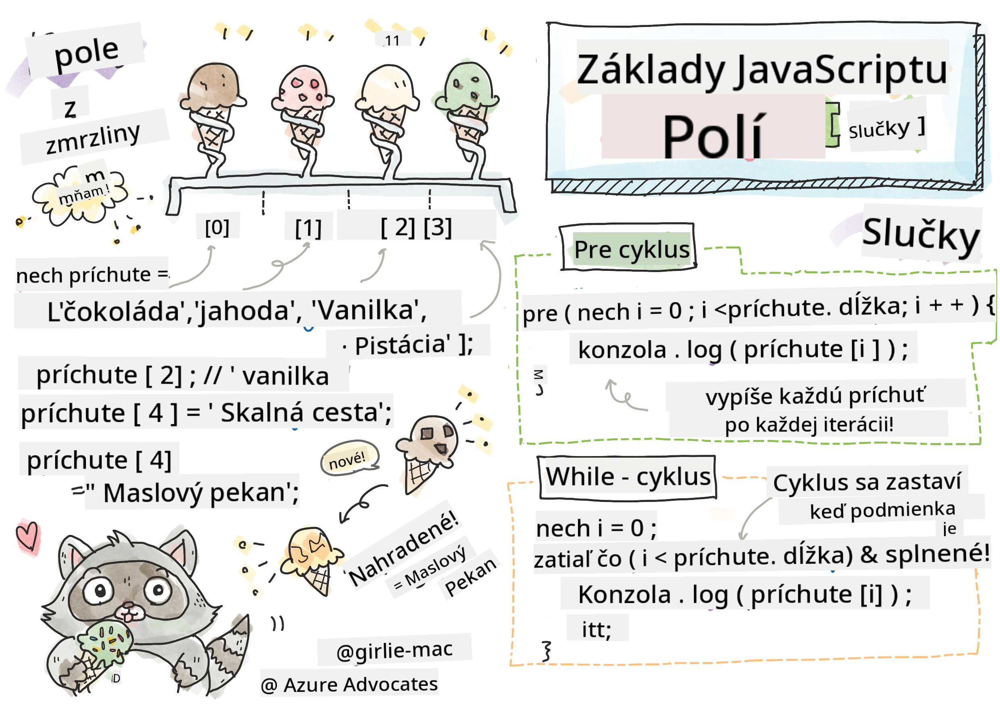

<!--
CO_OP_TRANSLATOR_METADATA:
{
  "original_hash": "3f7f87871312cf6cc12662da7d973182",
  "translation_date": "2025-08-27T22:41:47+00:00",
  "source_file": "2-js-basics/4-arrays-loops/README.md",
  "language_code": "sk"
}
-->
# Základy JavaScriptu: Polia a cykly


> Sketchnote od [Tomomi Imura](https://twitter.com/girlie_mac)

## Kvíz pred prednáškou
[Kvíz pred prednáškou](https://ashy-river-0debb7803.1.azurestaticapps.net/quiz/13)

Táto lekcia pokrýva základy JavaScriptu, jazyka, ktorý poskytuje interaktivitu na webe. V tejto lekcii sa naučíte o poliach a cykloch, ktoré sa používajú na manipuláciu s dátami.

[](https://youtube.com/watch?v=1U4qTyq02Xw "Polia")

[](https://www.youtube.com/watch?v=Eeh7pxtTZ3k "Cykly")

> 🎥 Kliknite na obrázky vyššie pre videá o poliach a cykloch.

> Túto lekciu si môžete prejsť na [Microsoft Learn](https://docs.microsoft.com/learn/modules/web-development-101-arrays/?WT.mc_id=academic-77807-sagibbon)!

## Polia

Práca s dátami je bežnou úlohou v každom programovacom jazyku, a je oveľa jednoduchšia, keď sú dáta organizované v štruktúrovanom formáte, ako sú polia. V poliach sú dáta uložené v štruktúre podobnej zoznamu. Jednou z hlavných výhod polí je, že môžete uložiť rôzne typy dát do jedného poľa.

✅ Polia sú všade okolo nás! Dokážete si predstaviť reálny príklad poľa, ako napríklad pole solárnych panelov?

Syntax pre pole je pár hranatých zátvoriek.

```javascript
let myArray = [];
```

Toto je prázdne pole, ale polia môžu byť deklarované už naplnené dátami. Viacero hodnôt v poli je oddelených čiarkou.

```javascript
let iceCreamFlavors = ["Chocolate", "Strawberry", "Vanilla", "Pistachio", "Rocky Road"];
```

Hodnotám v poli je priradená jedinečná hodnota nazývaná **index**, celé číslo, ktoré je priradené na základe jeho vzdialenosti od začiatku poľa. V príklade vyššie má reťazcová hodnota "Chocolate" index 0 a index "Rocky Road" je 4. Použite index s hranatými zátvorkami na získanie, zmenu alebo vloženie hodnôt poľa.

✅ Prekvapuje vás, že polia začínajú na indexe nula? V niektorých programovacích jazykoch indexy začínajú na 1. Je za tým zaujímavá história, ktorú si môžete [prečítať na Wikipédii](https://en.wikipedia.org/wiki/Zero-based_numbering).

```javascript
let iceCreamFlavors = ["Chocolate", "Strawberry", "Vanilla", "Pistachio", "Rocky Road"];
iceCreamFlavors[2]; //"Vanilla"
```

Index môžete využiť na zmenu hodnoty, napríklad takto:

```javascript
iceCreamFlavors[4] = "Butter Pecan"; //Changed "Rocky Road" to "Butter Pecan"
```

A môžete vložiť novú hodnotu na daný index takto:

```javascript
iceCreamFlavors[5] = "Cookie Dough"; //Added "Cookie Dough"
```

✅ Bežnejší spôsob pridávania hodnôt do poľa je pomocou operátorov poľa, ako je array.push()

Ak chcete zistiť, koľko položiek je v poli, použite vlastnosť `length`.

```javascript
let iceCreamFlavors = ["Chocolate", "Strawberry", "Vanilla", "Pistachio", "Rocky Road"];
iceCreamFlavors.length; //5
```

✅ Vyskúšajte si to sami! Použite konzolu vášho prehliadača na vytvorenie a manipuláciu s poľom podľa vášho výberu.

## Cykly

Cykly nám umožňujú vykonávať opakujúce sa alebo **iteratívne** úlohy, a môžu ušetriť veľa času a kódu. Každá iterácia môže mať rôzne premenné, hodnoty a podmienky. V JavaScripte existujú rôzne typy cyklov, ktoré majú malé rozdiely, ale v podstate robia to isté: prechádzajú dáta.

### For cyklus

Cyklus `for` vyžaduje 3 časti na iteráciu:
- `counter` Premenná, ktorá je zvyčajne inicializovaná číslom, ktoré počíta počet iterácií
- `condition` Výraz, ktorý používa porovnávacie operátory na zastavenie cyklu, keď je `false`
- `iteration-expression` Spúšťa sa na konci každej iterácie, zvyčajne sa používa na zmenu hodnoty counteru
  
```javascript
// Counting up to 10
for (let i = 0; i < 10; i++) {
  console.log(i);
}
```

✅ Spustite tento kód v konzole prehliadača. Čo sa stane, keď urobíte malé zmeny v counteri, podmienke alebo iteratívnom výraze? Dokážete ho spustiť dozadu, vytvoriť odpočítavanie?

### While cyklus

Na rozdiel od syntaxe cyklu `for`, cykly `while` vyžadujú iba podmienku, ktorá zastaví cyklus, keď sa podmienka stane `false`. Podmienky v cykloch zvyčajne závisia od iných hodnôt, ako sú countery, a musia byť spravované počas cyklu. Počiatočné hodnoty counterov musia byť vytvorené mimo cyklu, a akékoľvek výrazy na splnenie podmienky, vrátane zmeny counteru, musia byť udržiavané vo vnútri cyklu.

```javascript
//Counting up to 10
let i = 0;
while (i < 10) {
 console.log(i);
 i++;
}
```

✅ Prečo by ste si vybrali for cyklus namiesto while cyklu? 17 tisíc divákov malo rovnakú otázku na StackOverflow, a niektoré názory [by vás mohli zaujímať](https://stackoverflow.com/questions/39969145/while-loops-vs-for-loops-in-javascript).

## Cykly a polia

Polia sa často používajú s cyklami, pretože väčšina podmienok vyžaduje dĺžku poľa na zastavenie cyklu, a index môže byť tiež hodnotou counteru.

```javascript
let iceCreamFlavors = ["Chocolate", "Strawberry", "Vanilla", "Pistachio", "Rocky Road"];

for (let i = 0; i < iceCreamFlavors.length; i++) {
  console.log(iceCreamFlavors[i]);
} //Ends when all flavors are printed
```

✅ Experimentujte s prechádzaním poľa podľa vášho výberu vo vašej konzole prehliadača. 

---

## 🚀 Výzva

Existujú aj iné spôsoby prechádzania polí než for a while cykly. Existujú [forEach](https://developer.mozilla.org/docs/Web/JavaScript/Reference/Global_Objects/Array/forEach), [for-of](https://developer.mozilla.org/docs/Web/JavaScript/Reference/Statements/for...of) a [map](https://developer.mozilla.org/docs/Web/JavaScript/Reference/Global_Objects/Array/map). Prepíšte váš cyklus poľa pomocou jednej z týchto techník.

## Kvíz po prednáške
[Kvíz po prednáške](https://ashy-river-0debb7803.1.azurestaticapps.net/quiz/14)

## Prehľad a samostatné štúdium

Polia v JavaScripte majú mnoho metód, ktoré sú mimoriadne užitočné na manipuláciu s dátami. [Prečítajte si o týchto metódach](https://developer.mozilla.org/docs/Web/JavaScript/Reference/Global_Objects/Array) a vyskúšajte niektoré z nich (ako push, pop, slice a splice) na poli podľa vášho výberu.

## Zadanie

[Prejdite pole](assignment.md)

---

**Upozornenie**:  
Tento dokument bol preložený pomocou služby AI prekladu [Co-op Translator](https://github.com/Azure/co-op-translator). Aj keď sa snažíme o presnosť, prosím, berte na vedomie, že automatizované preklady môžu obsahovať chyby alebo nepresnosti. Pôvodný dokument v jeho rodnom jazyku by mal byť považovaný za autoritatívny zdroj. Pre kritické informácie sa odporúča profesionálny ľudský preklad. Nenesieme zodpovednosť za akékoľvek nedorozumenia alebo nesprávne interpretácie vyplývajúce z použitia tohto prekladu.