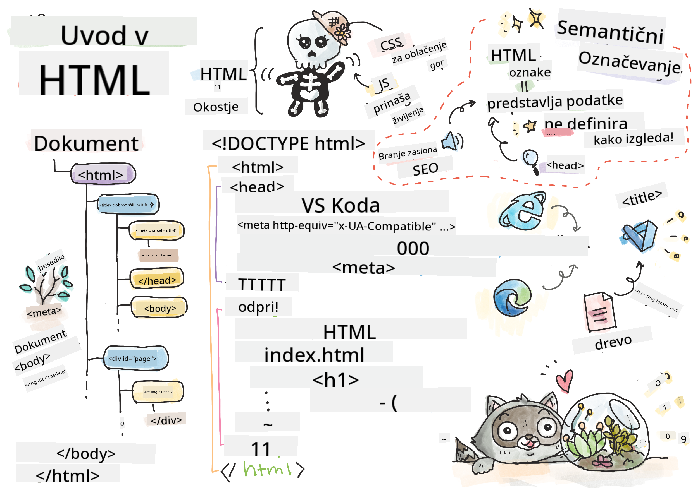
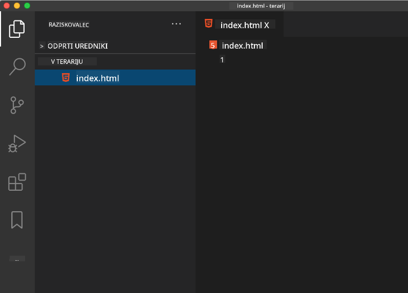

<!--
CO_OP_TRANSLATOR_METADATA:
{
  "original_hash": "46a0639e719b9cf1dfd062aa24cad639",
  "translation_date": "2025-08-27T22:46:16+00:00",
  "source_file": "3-terrarium/1-intro-to-html/README.md",
  "language_code": "sl"
}
-->
# Projekt Terrarij, 1. del: Uvod v HTML


> Sketchnote avtorja [Tomomi Imura](https://twitter.com/girlie_mac)

## Predhodni kviz

[Predhodni kviz](https://ashy-river-0debb7803.1.azurestaticapps.net/quiz/15)

> Oglejte si video

> 
> [](https://www.youtube.com/watch?v=1TvxJKBzhyQ)

### Uvod

HTML ali HyperText Markup Language je 'okostje' spleta. Če CSS 'obleče' vaš HTML in JavaScript vdahne življenje, je HTML telo vaše spletne aplikacije. Sintaksa HTML celo odraža to idejo, saj vključuje oznake "head", "body" in "footer".

V tej lekciji bomo uporabili HTML za postavitev 'okostja' vmesnika našega virtualnega terarija. Imel bo naslov in tri stolpce: desni in levi stolpec, kjer bodo živele premikajoče se rastline, ter osrednje območje, ki bo dejanski stekleni terarij. Do konca te lekcije boste lahko videli rastline v stolpcih, vendar bo vmesnik videti nekoliko nenavadno; ne skrbite, v naslednjem delu boste dodali CSS sloge, da bo vmesnik videti bolje.

### Naloga

Na svojem računalniku ustvarite mapo z imenom 'terrarium' in v njej datoteko z imenom 'index.html'. To lahko storite v Visual Studio Code, potem ko ustvarite mapo terrarium, tako da odprete novo okno VS Code, kliknete 'open folder' in poiščete svojo novo mapo. Kliknite majhen gumb 'file' v raziskovalnem podoknu in ustvarite novo datoteko:



Ali

Uporabite te ukaze v svojem git bash:
* `mkdir terrarium`
* `cd terrarium`
* `touch index.html`
* `code index.html` ali `nano index.html`

> Datoteke index.html brskalniku sporočajo, da je to privzeta datoteka v mapi; URL-ji, kot je `https://anysite.com/test`, so lahko zgrajeni z uporabo strukture map, ki vključuje mapo z imenom `test` in datoteko `index.html` v njej; `index.html` ni nujno prikazan v URL-ju.

---

## DocType in oznake html

Prva vrstica datoteke HTML je njen doctype. Presenetljivo je, da mora biti ta vrstica na samem vrhu datoteke, vendar pove starejšim brskalnikom, da mora brskalnik stran prikazati v standardnem načinu, ki sledi trenutni specifikaciji HTML.

> Nasvet: v VS Code lahko z miško premaknete nad oznako in dobite informacije o njeni uporabi iz referenčnih vodnikov MDN.

Druga vrstica mora biti začetna oznaka `<html>`, takoj za njo pa zaključna oznaka `</html>`. Te oznake so korenski elementi vašega vmesnika.

### Naloga

Dodajte te vrstice na vrh svoje datoteke `index.html`:

```HTML
<!DOCTYPE html>
<html></html>
```

✅ Obstaja nekaj različnih načinov, ki jih je mogoče določiti z nastavitvijo DocType z nizom poizvedbe: [Quirks Mode in Standards Mode](https://developer.mozilla.org/docs/Web/HTML/Quirks_Mode_and_Standards_Mode). Ti načini so bili namenjeni podpori resnično starim brskalnikom, ki se danes običajno ne uporabljajo (Netscape Navigator 4 in Internet Explorer 5). Držite se standardne deklaracije doctype.

---

## 'Head' dokumenta

Območje 'head' dokumenta HTML vključuje ključne informacije o vaši spletni strani, znane tudi kot [metadata](https://developer.mozilla.org/docs/Web/HTML/Element/meta). V našem primeru strežniku, na katerega bo ta stran poslana za prikaz, sporočimo te štiri stvari:

-   naslov strani
-   metapodatke strani, vključno z:
    -   'character set', ki pove, kakšno kodiranje znakov se uporablja na strani
    -   informacije o brskalniku, vključno z `x-ua-compatible`, ki označuje, da je podprt brskalnik IE=edge
    -   informacije o tem, kako naj se obnaša viewport ob nalaganju. Nastavitev viewporta na začetno merilo 1 nadzoruje raven povečave ob prvem nalaganju strani.

### Naloga

Dodajte blok 'head' v svoj dokument med začetne in zaključne oznake `<html>`.

```html
<head>
	<title>Welcome to my Virtual Terrarium</title>
	<meta charset="utf-8" />
	<meta http-equiv="X-UA-Compatible" content="IE=edge" />
	<meta name="viewport" content="width=device-width, initial-scale=1" />
</head>
```

✅ Kaj bi se zgodilo, če bi nastavili meta oznako viewport, kot je ta: `<meta name="viewport" content="width=600">`? Preberite več o [viewportu](https://developer.mozilla.org/docs/Web/HTML/Viewport_meta_tag).

---

## 'Body' dokumenta

### Oznake HTML

V HTML dodajate oznake v svojo datoteko .html, da ustvarite elemente spletne strani. Vsaka oznaka običajno ima začetno in zaključeno oznako, kot je ta: `<p>hello</p>` za označitev odstavka. Ustvarite telo svojega vmesnika tako, da dodate par oznak `<body>` znotraj para oznak `<html>`; vaša oznaka zdaj izgleda takole:

### Naloga

```html
<!DOCTYPE html>
<html>
	<head>
		<title>Welcome to my Virtual Terrarium</title>
		<meta charset="utf-8" />
		<meta http-equiv="X-UA-Compatible" content="IE=edge" />
		<meta name="viewport" content="width=device-width, initial-scale=1" />
	</head>
	<body></body>
</html>
```

Zdaj lahko začnete graditi svojo stran. Običajno uporabljate oznake `<div>` za ustvarjanje ločenih elementov na strani. Ustvarili bomo serijo elementov `<div>`, ki bodo vsebovali slike.

### Slike

Ena oznaka HTML, ki ne potrebuje zaključne oznake, je oznaka ``, ker ima element `src`, ki vsebuje vse informacije, ki jih stran potrebuje za prikaz predmeta.

Ustvarite mapo v svoji aplikaciji z imenom `images` in vanjo dodajte vse slike iz [mape s kodo](../../../../3-terrarium/solution/images); (na voljo je 14 slik rastlin).

### Naloga

Dodajte te slike rastlin v dva stolpca med oznake `<body></body>`:

```html
<div id="page">
	<div id="left-container" class="container">
		<div class="plant-holder">
			
		</div>
		<div class="plant-holder">
			
		</div>
		<div class="plant-holder">
			
		</div>
		<div class="plant-holder">
			
		</div>
		<div class="plant-holder">
			
		</div>
		<div class="plant-holder">
			
		</div>
		<div class="plant-holder">
			
		</div>
	</div>
	<div id="right-container" class="container">
		<div class="plant-holder">
			
		</div>
		<div class="plant-holder">
			
		</div>
		<div class="plant-holder">
			
		</div>
		<div class="plant-holder">
			
		</div>
		<div class="plant-holder">
			
		</div>
		<div class="plant-holder">
			
		</div>
		<div class="plant-holder">
			
		</div>
	</div>
</div>
```

> Opomba: Spans proti Divs. Divs veljajo za 'blokovne' elemente, Spans pa za 'v vrstici'. Kaj bi se zgodilo, če bi te divs spremenili v spans?

S to oznako se rastline zdaj prikažejo na zaslonu. Videti je precej slabo, ker še niso oblikovane s CSS, kar bomo storili v naslednji lekciji.

Vsaka slika ima alt besedilo, ki se prikaže, tudi če slike ne morete videti ali prikazati. To je pomemben atribut za vključitev zaradi dostopnosti. Več o dostopnosti boste izvedeli v prihodnjih lekcijah; za zdaj si zapomnite, da atribut alt zagotavlja alternativne informacije za sliko, če uporabnik iz kakršnega koli razloga ne more videti slike (zaradi počasne povezave, napake v atributu src ali če uporabnik uporablja bralnik zaslona).

✅ Ste opazili, da ima vsaka slika enak alt atribut? Ali je to dobra praksa? Zakaj ali zakaj ne? Ali lahko izboljšate to kodo?

---

## Semantična oznaka

Na splošno je priporočljivo uporabljati smiselno 'semantiko' pri pisanju HTML. Kaj to pomeni? Pomeni, da uporabljate oznake HTML za predstavitev vrste podatkov ali interakcije, za katero so bile zasnovane. Na primer, glavno besedilo naslova na strani naj uporablja oznako `<h1>`.

Dodajte naslednjo vrstico takoj pod začetno oznako `<body>`:

```html
<h1>My Terrarium</h1>
```

Uporaba semantične oznake, kot je uporaba naslovov `<h1>` in neurejenih seznamov `<ul>`, pomaga bralnikom zaslona pri navigaciji po strani. Na splošno naj bodo gumbi napisani kot `<button>` in seznami kot `<li>`. Čeprav je _mogoče_ uporabiti posebej oblikovane elemente `<span>` z obdelovalci klikov za simulacijo gumbov, je za uporabnike z omejitvami bolje, da uporabljajo tehnologije za določanje, kje na strani se nahaja gumb, in interakcijo z njim, če se element pojavi kot gumb. Zaradi tega poskušajte čim bolj uporabljati semantično oznako.

✅ Oglejte si bralnik zaslona in [kako interagira s spletno stranjo](https://www.youtube.com/watch?v=OUDV1gqs9GA). Ali vidite, zakaj bi nesemantična oznaka lahko frustrirala uporabnika?

## Terrarij

Zadnji del tega vmesnika vključuje ustvarjanje oznake, ki bo oblikovana za ustvarjanje terarija.

### Naloga:

Dodajte to oznako nad zadnjo oznako `</div>`:

```html
<div id="terrarium">
	<div class="jar-top"></div>
	<div class="jar-walls">
		<div class="jar-glossy-long"></div>
		<div class="jar-glossy-short"></div>
	</div>
	<div class="dirt"></div>
	<div class="jar-bottom"></div>
</div>
```

✅ Čeprav ste dodali to oznako na zaslon, se ne prikaže ničesar. Zakaj?

---

## 🚀Izziv

Obstajajo nekateri 'starejši' elementi v HTML, ki so še vedno zabavni za uporabo, čeprav ne bi smeli uporabljati zastarelih oznak, kot so [te oznake](https://developer.mozilla.org/docs/Web/HTML/Element#Obsolete_and_deprecated_elements) v svoji oznaki. Kljub temu, ali lahko uporabite staro oznako `<marquee>` za premikanje naslova h1 vodoravno? (če to storite, ne pozabite, da jo kasneje odstranite)

## Zaključni kviz

[Zaključni kviz](https://ashy-river-0debb7803.1.azurestaticapps.net/quiz/16)

## Pregled in samostojno učenje

HTML je 'preizkušen in zanesljiv' sistem gradnikov, ki je pomagal zgraditi splet v to, kar je danes. Naučite se nekaj o njegovi zgodovini, tako da preučite stare in nove oznake. Ali lahko ugotovite, zakaj so bile nekatere oznake zastarele in nekatere dodane? Katere oznake bi lahko bile uvedene v prihodnosti?

Več o gradnji spletnih mest za splet in mobilne naprave si preberite na [Microsoft Learn](https://docs.microsoft.com/learn/modules/build-simple-website/?WT.mc_id=academic-77807-sagibbon).

## Naloga

[Vadite svoj HTML: Zgradite maketo bloga](assignment.md)

---

**Omejitev odgovornosti**:  
Ta dokument je bil preveden z uporabo storitve za prevajanje z umetno inteligenco [Co-op Translator](https://github.com/Azure/co-op-translator). Čeprav si prizadevamo za natančnost, vas prosimo, da upoštevate, da lahko avtomatizirani prevodi vsebujejo napake ali netočnosti. Izvirni dokument v njegovem izvirnem jeziku je treba obravnavati kot avtoritativni vir. Za ključne informacije priporočamo profesionalni človeški prevod. Ne prevzemamo odgovornosti za morebitna nesporazumevanja ali napačne razlage, ki bi nastale zaradi uporabe tega prevoda.