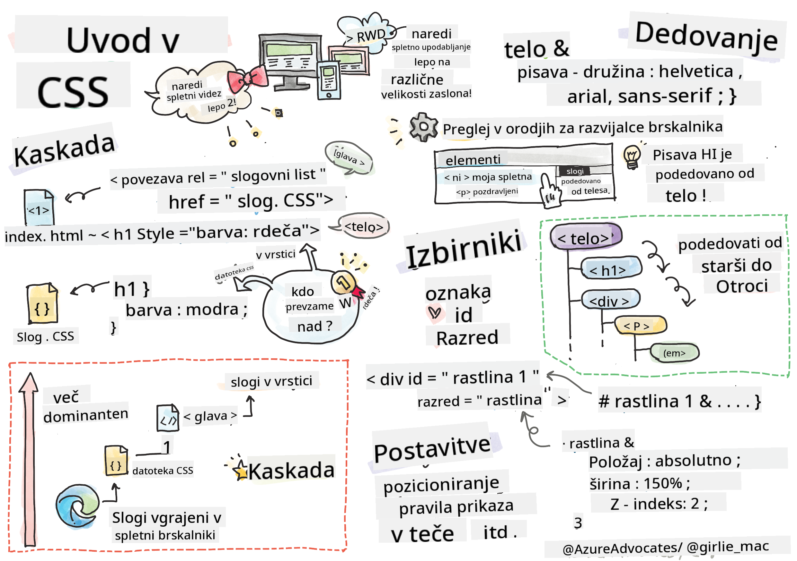
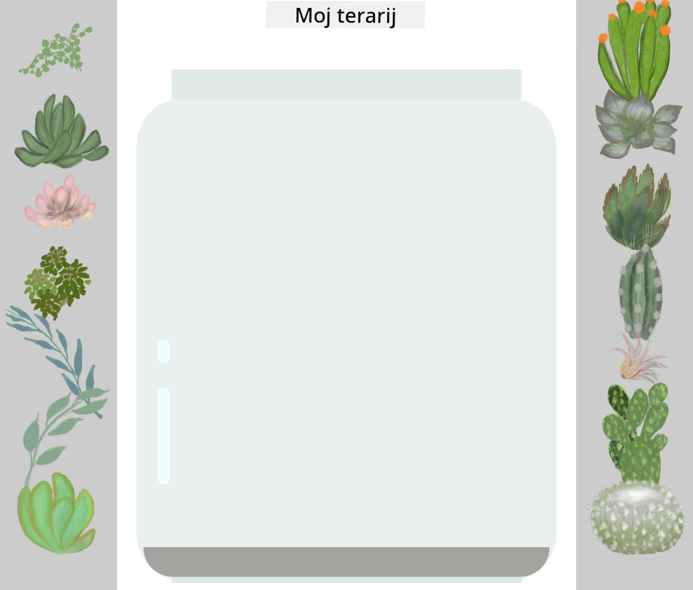

<!--
CO_OP_TRANSLATOR_METADATA:
{
  "original_hash": "e375c2aeb94e2407f2667633d39580bd",
  "translation_date": "2025-08-27T22:48:31+00:00",
  "source_file": "3-terrarium/2-intro-to-css/README.md",
  "language_code": "sl"
}
-->
# Projekt Terrarij, 2. del: Uvod v CSS


> Sketchnote avtorja [Tomomi Imura](https://twitter.com/girlie_mac)

## Predhodni kviz

[Predhodni kviz](https://ff-quizzes.netlify.app/web/quiz/17)

### Uvod

CSS ali kaskadne stilske predloge rešujejo pomemben problem spletnega razvoja: kako narediti, da bo vaša spletna stran videti privlačna. Oblikovanje vaših aplikacij jih naredi bolj uporabne in vizualno privlačne; CSS lahko uporabite tudi za ustvarjanje odzivnega spletnega oblikovanja (RWD) – kar omogoča, da vaše aplikacije izgledajo dobro ne glede na velikost zaslona, na katerem so prikazane. CSS ni namenjen zgolj lepšemu videzu aplikacij; njegova specifikacija vključuje tudi animacije in transformacije, ki omogočajo napredne interakcije v vaših aplikacijah. Skupina za delo na CSS skrbi za vzdrževanje trenutnih specifikacij CSS; njihovo delo lahko spremljate na [spletnem mestu World Wide Web Consortium](https://www.w3.org/Style/CSS/members).

> Opomba: CSS je jezik, ki se razvija, tako kot vse na spletu, in ne vsi brskalniki podpirajo novejše dele specifikacije. Vedno preverite svoje implementacije s pomočjo [CanIUse.com](https://caniuse.com).

V tej lekciji bomo dodali sloge našemu spletnemu terariju in se naučili več o več konceptih CSS: kaskadi, dedovanju, uporabi selektorjev, pozicioniranju in uporabi CSS za gradnjo postavitev. Med procesom bomo postavili terarij in ustvarili dejanski terarij.

### Predpogoj

HTML za vaš terarij mora biti že pripravljen in pripravljen za oblikovanje.

> Oglejte si video

> 
> [](https://www.youtube.com/watch?v=6yIdOIV9p1I)

### Naloga

V svoji mapi za terarij ustvarite novo datoteko z imenom `style.css`. To datoteko uvozite v razdelek `<head>`:

```html
<link rel="stylesheet" href="./style.css" />
```

---

## Kaskada

Kaskadne stilske predloge vključujejo idejo, da se slogi 'kaskadno' uporabljajo glede na njihovo prioriteto. Slogi, ki jih določi avtor spletnega mesta, imajo prednost pred tistimi, ki jih določi brskalnik. Slogi, določeni 'v vrstici', imajo prednost pred tistimi, ki so določeni v zunanji stilski predlogi.

### Naloga

Dodajte slog "color: red" v vrstici v svojo oznako `<h1>`:

```HTML
<h1 style="color: red">My Terrarium</h1>
```

Nato dodajte naslednjo kodo v svojo datoteko `style.css`:

```CSS
h1 {
 color: blue;
}
```

✅ Katera barva se prikaže v vaši spletni aplikaciji? Zakaj? Ali lahko najdete način za preglasitev slogov? Kdaj bi to želeli storiti ali zakaj ne?

---

## Dedovanje

Slogi se dedujejo od slogov prednika do potomca, tako da gnezdeni elementi podedujejo sloge svojih staršev.

### Naloga

Nastavite pisavo telesa na določeno pisavo in preverite pisavo gnezdenega elementa:

```CSS
body {
	font-family: helvetica, arial, sans-serif;
}
```

Odprite konzolo brskalnika na zavihku 'Elements' in opazujte pisavo H1. Podeduje svojo pisavo od telesa, kot je navedeno v brskalniku:


✅ Ali lahko naredite, da gnezden slog podeduje drugo lastnost?

---

## CSS selektorji

### Oznake

Do zdaj ima vaša datoteka `style.css` oblikovane le nekaj oznak, aplikacija pa izgleda precej nenavadno:

```CSS
body {
	font-family: helvetica, arial, sans-serif;
}

h1 {
	color: #3a241d;
	text-align: center;
}
```

Tak način oblikovanja oznake vam omogoča nadzor nad edinstvenimi elementi, vendar morate nadzorovati sloge mnogih rastlin v svojem terariju. Za to morate uporabiti CSS selektorje.

### Id-ji

Dodajte nekaj sloga za postavitev levega in desnega vsebnika. Ker je le en levi vsebnik in en desni vsebnik, so v oznaki označeni z id-ji. Za njihovo oblikovanje uporabite `#`:

```CSS
#left-container {
	background-color: #eee;
	width: 15%;
	left: 0px;
	top: 0px;
	position: absolute;
	height: 100%;
	padding: 10px;
}

#right-container {
	background-color: #eee;
	width: 15%;
	right: 0px;
	top: 0px;
	position: absolute;
	height: 100%;
	padding: 10px;
}
```

Tukaj ste te vsebnike postavili z absolutnim pozicioniranjem na skrajno levo in desno stran zaslona ter uporabili odstotke za njihovo širino, da se lahko prilagodijo majhnim mobilnim zaslonom.

✅ Ta koda se precej ponavlja, zato ni "DRY" (Don't Repeat Yourself); ali lahko najdete boljši način za oblikovanje teh id-jev, morda z id-jem in razredom? Spremeniti bi morali oznako in preoblikovati CSS:

```html
<div id="left-container" class="container"></div>
```

### Razredi

V zgornjem primeru ste oblikovali dva edinstvena elementa na zaslonu. Če želite, da se slogi uporabljajo za več elementov na zaslonu, lahko uporabite CSS razrede. To storite za postavitev rastlin v levem in desnem vsebniku.

Opazite, da ima vsaka rastlina v HTML oznaki kombinacijo id-jev in razredov. Id-ji se tukaj uporabljajo za JavaScript, ki ga boste kasneje dodali za manipulacijo postavitve rastlin v terariju. Razredi pa dajejo vsem rastlinam določen slog.

```html
<div class="plant-holder">
	
</div>
```

Dodajte naslednje v svojo datoteko `style.css`:

```CSS
.plant-holder {
	position: relative;
	height: 13%;
	left: -10px;
}

.plant {
	position: absolute;
	max-width: 150%;
	max-height: 150%;
	z-index: 2;
}
```

Opazno v tem odlomku je mešanje relativnega in absolutnega pozicioniranja, kar bomo obravnavali v naslednjem razdelku. Oglejte si, kako so višine obravnavane z odstotki:

Višino držala za rastline ste nastavili na 13 %, kar je dobra vrednost, da so vse rastline prikazane v vsakem navpičnem vsebniku brez potrebe po drsenju.

Držalo za rastline ste premaknili v levo, da so rastline bolj centrirane znotraj vsebnika. Slike imajo veliko prosojnega ozadja, da so bolj vlečljive, zato jih je treba potisniti v levo, da se bolje prilegajo zaslonu.

Rastlini sami ste dali največjo širino 150 %. To omogoča, da se zmanjša, ko se brskalnik zmanjša. Poskusite spremeniti velikost brskalnika; rastline ostanejo v svojih vsebnikih, vendar se zmanjšajo, da se prilegajo.

Opazna je tudi uporaba z-indexa, ki nadzoruje relativno višino elementa (tako da rastline sedijo na vsebniku in se zdijo, kot da so znotraj terarija).

✅ Zakaj potrebujete tako držalo za rastline kot tudi selektor za rastline v CSS?

## CSS pozicioniranje

Mešanje lastnosti pozicioniranja (obstajajo statično, relativno, fiksno, absolutno in lepljivo pozicioniranje) je lahko nekoliko zapleteno, vendar vam ob pravilni uporabi omogoča dober nadzor nad elementi na vaših straneh.

Absolutno pozicionirani elementi so pozicionirani glede na svojega najbližjega pozicioniranega prednika, in če ga ni, so pozicionirani glede na telo dokumenta.

Relativno pozicionirani elementi so pozicionirani na podlagi navodil CSS za prilagoditev njihove postavitve glede na njihov začetni položaj.

V našem primeru je `plant-holder` relativno pozicioniran element, ki je pozicioniran znotraj absolutno pozicioniranega vsebnika. Rezultat je, da so stranski vsebniki pritrjeni levo in desno, `plant-holder` pa je gnezden, prilagaja se znotraj stranskih vsebnikov in omogoča prostor za postavitev rastlin v navpično vrsto.

> Rastlina sama ima tudi absolutno pozicioniranje, kar je potrebno, da je vlečljiva, kot boste odkrili v naslednji lekciji.

✅ Eksperimentirajte s spreminjanjem vrst pozicioniranja stranskih vsebnikov in držala za rastline. Kaj se zgodi?

## CSS postavitve

Zdaj boste uporabili, kar ste se naučili, za izdelavo samega terarija, vse z uporabo CSS!

Najprej oblikujte otroke div-a `.terrarium` kot zaobljen pravokotnik z uporabo CSS:

```CSS
.jar-walls {
	height: 80%;
	width: 60%;
	background: #d1e1df;
	border-radius: 1rem;
	position: absolute;
	bottom: 0.5%;
	left: 20%;
	opacity: 0.5;
	z-index: 1;
}

.jar-top {
	width: 50%;
	height: 5%;
	background: #d1e1df;
	position: absolute;
	bottom: 80.5%;
	left: 25%;
	opacity: 0.7;
	z-index: 1;
}

.jar-bottom {
	width: 50%;
	height: 1%;
	background: #d1e1df;
	position: absolute;
	bottom: 0%;
	left: 25%;
	opacity: 0.7;
}

.dirt {
	width: 60%;
	height: 5%;
	background: #3a241d;
	position: absolute;
	border-radius: 0 0 1rem 1rem;
	bottom: 1%;
	left: 20%;
	opacity: 0.7;
	z-index: -1;
}
```

Opazite uporabo odstotkov tukaj. Če zmanjšate brskalnik, lahko vidite, kako se kozarec prav tako prilagaja. Opazite tudi odstotke za širine in višine elementov kozarca ter kako je vsak element absolutno pozicioniran v središču, pritrjen na dno pogleda.

Uporabljamo tudi `rem` za border-radius, dolžino, relativno na pisavo. Več o tej vrsti relativnega merjenja preberite v [CSS specifikaciji](https://www.w3.org/TR/css-values-3/#font-relative-lengths).

✅ Poskusite spremeniti barve in prosojnost kozarca v primerjavi s tistimi za zemljo. Kaj se zgodi? Zakaj?

---

## 🚀Izziv

Dodajte 'mehurček' sijaja na spodnje levo območje kozarca, da bo videti bolj steklen. Oblikovali boste `.jar-glossy-long` in `.jar-glossy-short`, da bosta videti kot odsevni sijaj. Tukaj je, kako bi izgledalo:



Za dokončanje kviza po predavanju pojdite skozi ta modul Learn: [Oblikujte svojo HTML aplikacijo s CSS](https://docs.microsoft.com/learn/modules/build-simple-website/4-css-basics/?WT.mc_id=academic-77807-sagibbon)

## Kviz po predavanju

[Kviz po predavanju](https://ff-quizzes.netlify.app/web/quiz/18)

## Pregled in samostojno učenje

CSS se zdi na prvi pogled preprost, vendar se pri poskusu popolnega oblikovanja aplikacije za vse brskalnike in vse velikosti zaslonov pojavijo številni izzivi. CSS-Grid in Flexbox sta orodji, razvita za bolj strukturirano in zanesljivo delo. O teh orodjih se učite z igranjem [Flexbox Froggy](https://flexboxfroggy.com/) in [Grid Garden](https://codepip.com/games/grid-garden/).

## Naloga

[CSS Refactoring](assignment.md)

---

**Omejitev odgovornosti**:  
Ta dokument je bil preveden z uporabo storitve za prevajanje z umetno inteligenco [Co-op Translator](https://github.com/Azure/co-op-translator). Čeprav si prizadevamo za natančnost, vas prosimo, da upoštevate, da lahko avtomatizirani prevodi vsebujejo napake ali netočnosti. Izvirni dokument v njegovem izvirnem jeziku je treba obravnavati kot avtoritativni vir. Za ključne informacije priporočamo profesionalni človeški prevod. Ne prevzemamo odgovornosti za morebitna napačna razumevanja ali napačne interpretacije, ki bi nastale zaradi uporabe tega prevoda.