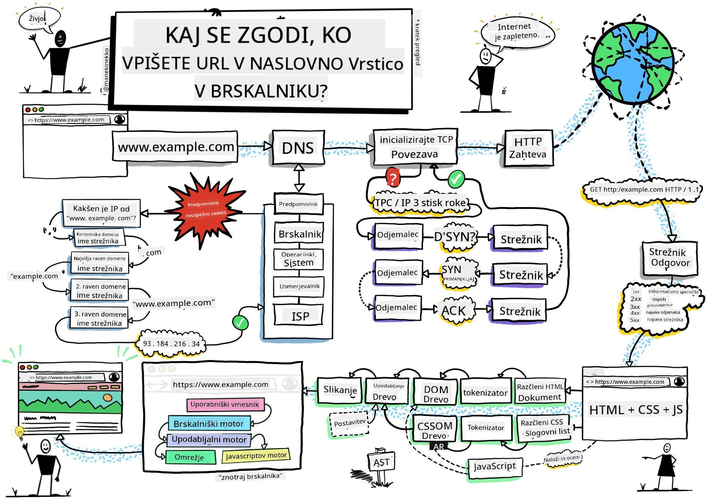
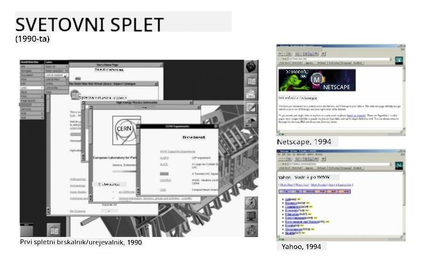
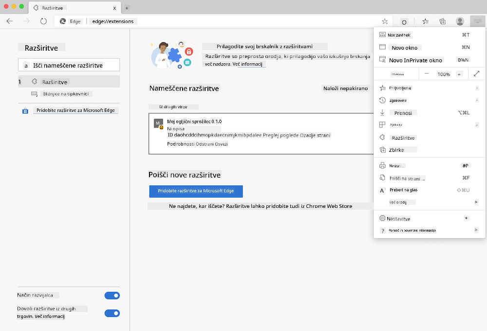
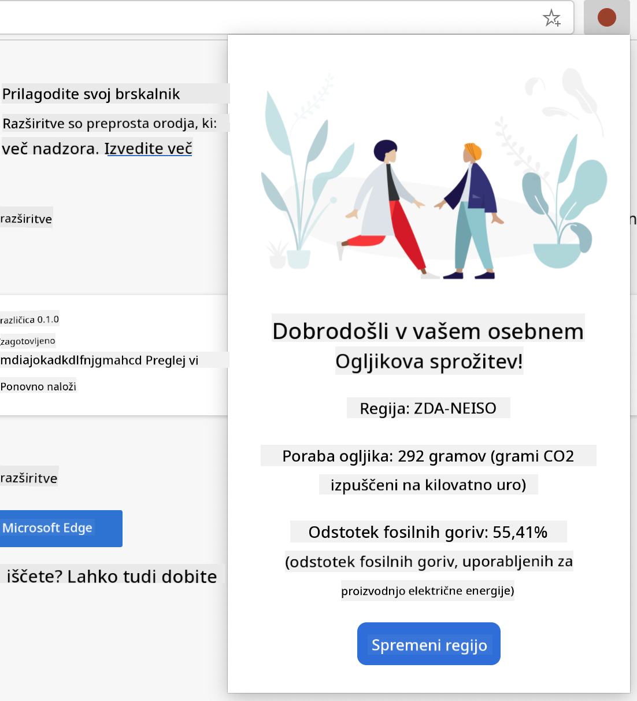

<!--
CO_OP_TRANSLATOR_METADATA:
{
  "original_hash": "0bb55e0b98600afab801eea115228873",
  "translation_date": "2025-08-27T22:13:46+00:00",
  "source_file": "5-browser-extension/1-about-browsers/README.md",
  "language_code": "sl"
}
-->
# Projekt razširitve brskalnika, 1. del: Vse o brskalnikih


> Skica avtorja [Wassim Chegham](https://dev.to/wassimchegham/ever-wondered-what-happens-when-you-type-in-a-url-in-an-address-bar-in-a-browser-3dob)

## Predhodni kviz

[Predhodni kviz](https://ff-quizzes.netlify.app/web/quiz/23)

### Uvod

Razširitve brskalnika dodajo dodatno funkcionalnost brskalniku. Preden pa začnete graditi svojo, se morate naučiti nekaj o tem, kako brskalniki delujejo.

### O brskalniku

V tej seriji lekcij se boste naučili, kako zgraditi razširitev brskalnika, ki bo delovala v brskalnikih Chrome, Firefox in Edge. V tem delu boste odkrili, kako brskalniki delujejo, in pripravili osnovne elemente razširitve brskalnika.

Kaj pa sploh je brskalnik? To je programska aplikacija, ki omogoča končnemu uporabniku dostop do vsebine s strežnika in njeno prikazovanje na spletnih straneh.

✅ Malo zgodovine: prvi brskalnik se je imenoval 'WorldWideWeb' in ga je leta 1990 ustvaril Sir Timothy Berners-Lee.


> Nekateri zgodnji brskalniki, prek [Karen McGrane](https://www.slideshare.net/KMcGrane/week-4-ixd-history-personal-computing)

Ko se uporabnik poveže z internetom z uporabo URL (Uniform Resource Locator) naslova, običajno prek protokola Hypertext Transfer Protocol z naslovom `http` ali `https`, brskalnik komunicira s spletnim strežnikom in pridobi spletno stran.

Na tej točki brskalnikov pogon za upodabljanje prikaže stran na napravi uporabnika, ki je lahko mobilni telefon, namizni računalnik ali prenosnik.

Brskalniki imajo tudi sposobnost predpomnjenja vsebine, da je ni treba vsakič znova pridobiti s strežnika. Lahko beležijo zgodovino uporabnikovega brskanja, shranjujejo 'piškotke', ki so majhni delci podatkov, ki vsebujejo informacije o uporabnikovi aktivnosti, in še več.

Pomembno je vedeti, da vsi brskalniki niso enaki! Vsak brskalnik ima svoje prednosti in slabosti, profesionalni spletni razvijalec pa mora razumeti, kako narediti spletne strani, ki dobro delujejo v različnih brskalnikih. To vključuje obravnavo majhnih zaslonov, kot je mobilni telefon, pa tudi uporabnika, ki je brez povezave.

Zelo uporabna spletna stran, ki jo verjetno želite dodati med zaznamke v brskalniku, ki ga uporabljate, je [caniuse.com](https://www.caniuse.com). Ko gradite spletne strani, je zelo koristno uporabiti sezname podprtih tehnologij na caniuse, da lahko najbolje podprete svoje uporabnike.

✅ Kako lahko ugotovite, kateri brskalniki so najbolj priljubljeni med uporabniki vaše spletne strani? Preverite svojo analitiko - različni analitični paketi, ki jih lahko namestite kot del svojega procesa spletnega razvoja, vam bodo povedali, kateri brskalniki so najbolj uporabljeni.

## Razširitve brskalnika

Zakaj bi želeli zgraditi razširitev brskalnika? To je priročna stvar, ki jo lahko dodate brskalniku, ko potrebujete hiter dostop do nalog, ki jih pogosto ponavljate. Na primer, če pogosto preverjate barve na različnih spletnih straneh, ki jih uporabljate, lahko namestite razširitev za izbiro barv. Če imate težave z zapomnitvijo gesel, lahko uporabite razširitev za upravljanje gesel.

Razširitve brskalnika so tudi zabavne za razvoj. Običajno obvladujejo omejeno število nalog, ki jih opravljajo zelo dobro.

✅ Katere so vaše najljubše razširitve brskalnika? Katere naloge opravljajo?

### Namestitev razširitev

Preden začnete graditi, si oglejte postopek gradnje in uvajanja razširitve brskalnika. Čeprav se vsak brskalnik nekoliko razlikuje v načinu upravljanja tega postopka, je postopek na Chrome in Firefox podoben temu primeru na Edge:



> Opomba: Prepričajte se, da ste vklopili način za razvijalce in omogočili razširitve iz drugih trgovin.

V bistvu bo postopek takšen:

- zgradite svojo razširitev z uporabo `npm run build` 
- v brskalniku se pomaknite na razdelek razširitev z uporabo gumba "Nastavitve in več" (ikona `...`) v zgornjem desnem kotu
- če gre za novo namestitev, izberite `load unpacked`, da naložite novo razširitev iz njene mape za gradnjo (v našem primeru je to `/dist`) 
- ali pa kliknite `reload`, če ponovno nalagate že nameščeno razširitev

✅ Ta navodila se nanašajo na razširitve, ki jih zgradite sami; za namestitev razširitev, ki so bile objavljene v trgovini razširitev brskalnika, se pomaknite na te [trgovine](https://microsoftedge.microsoft.com/addons/Microsoft-Edge-Extensions-Home) in namestite razširitev po svoji izbiri.

### Začnite

Zgradili boste razširitev brskalnika, ki prikazuje ogljični odtis vaše regije, prikazuje porabo energije vaše regije in vir energije. Razširitev bo imela obrazec, ki zbira ključ API, da lahko dostopate do API-ja CO2 Signal.

**Potrebujete:**

- [ključ API](https://www.co2signal.com/); vnesite svoj e-poštni naslov v polje na tej strani in poslali vam ga bodo
- [kodo za vašo regijo](http://api.electricitymap.org/v3/zones), ki ustreza [zemljevidu električne energije](https://www.electricitymap.org/map) (v Bostonu na primer uporabljam 'US-NEISO').
- [začetno kodo](../../../../5-browser-extension/start). Prenesite mapo `start`; v tej mapi boste dokončali kodo.
- [NPM](https://www.npmjs.com) - NPM je orodje za upravljanje paketov; namestite ga lokalno in paketi, navedeni v vaši datoteki `package.json`, bodo nameščeni za uporabo pri vašem spletnem projektu

✅ Več o upravljanju paketov se naučite v tem [odličnem modulu za učenje](https://docs.microsoft.com/learn/modules/create-nodejs-project-dependencies/?WT.mc_id=academic-77807-sagibbon)

Vzemite si trenutek in si oglejte osnovno kodo:

dist
    -|manifest.json (privzete nastavitve tukaj)
    -|index.html (HTML oznake za sprednji del tukaj)
    -|background.js (ozadje JS tukaj)
    -|main.js (zgrajen JS)
src
    -|index.js (vaša JS koda gre sem)

✅ Ko imate ključ API in kodo regije pripravljeno, ju shranite nekam v beležko za prihodnjo uporabo.

### Zgradite HTML za razširitev

Ta razširitev ima dva pogleda. Enega za zbiranje ključa API in kode regije:


In drugega za prikaz ogljične porabe regije:



Začnimo z gradnjo HTML-ja za obrazec in njegovim oblikovanjem s CSS.

V mapi `/dist` boste zgradili obrazec in območje za rezultate. V datoteki `index.html` zapolnite označeno območje obrazca:

```HTML
<form class="form-data" autocomplete="on">
	<div>
		<h2>New? Add your Information</h2>
	</div>
	<div>
		<label for="region">Region Name</label>
		<input type="text" id="region" required class="region-name" />
	</div>
	<div>
		<label for="api">Your API Key from tmrow</label>
		<input type="text" id="api" required class="api-key" />
	</div>
	<button class="search-btn">Submit</button>
</form>	
```
To je obrazec, kjer bodo shranjene informacije vnesene in shranjene v lokalno shrambo.

Nato ustvarite območje za rezultate; pod zadnjo oznako obrazca dodajte nekaj divov:

```HTML
<div class="result">
	<div class="loading">loading...</div>
	<div class="errors"></div>
	<div class="data"></div>
	<div class="result-container">
		<p><strong>Region: </strong><span class="my-region"></span></p>
		<p><strong>Carbon Usage: </strong><span class="carbon-usage"></span></p>
		<p><strong>Fossil Fuel Percentage: </strong><span class="fossil-fuel"></span></p>
	</div>
	<button class="clear-btn">Change region</button>
</div>
```
Na tej točki lahko poskusite zgraditi. Prepričajte se, da ste namestili odvisnosti paketa te razširitve:

```
npm install
```

Ta ukaz bo uporabil npm, upravitelja paketov Node, za namestitev webpacka za proces gradnje vaše razširitve. Webpack je orodje za združevanje, ki obravnava prevajanje kode. Rezultat tega procesa si lahko ogledate v `/dist/main.js` - videli boste, da je koda združena.

Za zdaj bi se morala razširitev zgraditi, in če jo uvedete v Edge kot razširitev, boste videli lepo prikazan obrazec.

Čestitke, naredili ste prve korake k gradnji razširitve brskalnika. V naslednjih lekcijah jo boste naredili bolj funkcionalno in uporabno.

---

## 🚀 Izziv

Oglejte si trgovino z razširitvami brskalnika in namestite eno v svoj brskalnik. Datoteke lahko preučite na zanimive načine. Kaj odkrijete?

## Kviz po predavanju

[Kviz po predavanju](https://ff-quizzes.netlify.app/web/quiz/24)

## Pregled in samostojno učenje

V tej lekciji ste se naučili nekaj o zgodovini spletnega brskalnika; izkoristite to priložnost, da se naučite, kako so si izumitelji svetovnega spleta zamislili njegovo uporabo, tako da preberete več o njegovi zgodovini. Nekaj uporabnih strani vključuje:

[Zgodovina spletnih brskalnikov](https://www.mozilla.org/firefox/browsers/browser-history/)

[Zgodovina spleta](https://webfoundation.org/about/vision/history-of-the-web/)

[Intervju s Timom Berners-Leejem](https://www.theguardian.com/technology/2019/mar/12/tim-berners-lee-on-30-years-of-the-web-if-we-dream-a-little-we-can-get-the-web-we-want)

## Naloga 

[Preoblikujte svojo razširitev](assignment.md)

---

**Omejitev odgovornosti**:  
Ta dokument je bil preveden z uporabo storitve za prevajanje z umetno inteligenco [Co-op Translator](https://github.com/Azure/co-op-translator). Čeprav si prizadevamo za natančnost, vas prosimo, da upoštevate, da lahko avtomatizirani prevodi vsebujejo napake ali netočnosti. Izvirni dokument v njegovem maternem jeziku je treba obravnavati kot avtoritativni vir. Za ključne informacije priporočamo profesionalni človeški prevod. Ne prevzemamo odgovornosti za morebitna nesporazumevanja ali napačne razlage, ki bi nastale zaradi uporabe tega prevoda.