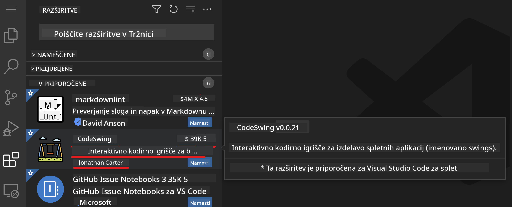
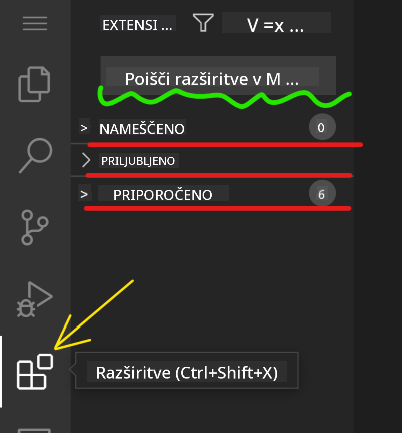
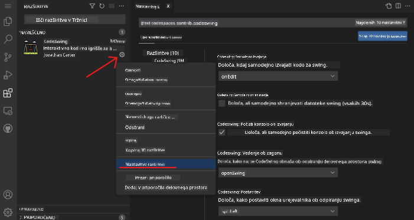

<!--
CO_OP_TRANSLATOR_METADATA:
{
  "original_hash": "7aa6e4f270d38d9cb17f2b5bd86b863d",
  "translation_date": "2025-08-27T22:53:20+00:00",
  "source_file": "8-code-editor/1-using-a-code-editor/README.md",
  "language_code": "sl"
}
-->
# Uporaba urejevalnika kode

Ta lekcija zajema osnove uporabe [VSCode.dev](https://vscode.dev), spletnega urejevalnika kode, ki vam omogoča spreminjanje kode in prispevanje k projektu brez potrebe po namestitvi programske opreme na vaš računalnik.

## Cilji učenja

V tej lekciji boste spoznali:

- Kako uporabljati urejevalnik kode v projektnem okolju
- Kako slediti spremembam z različico nadzora
- Kako prilagoditi urejevalnik za razvoj

### Predpogoji

Preden začnete, morate ustvariti račun na [GitHub](https://github.com). Obiščite [GitHub](https://github.com/) in ustvarite račun, če ga še nimate.

### Uvod

Urejevalnik kode je ključno orodje za pisanje programov in sodelovanje pri obstoječih projektih. Ko boste razumeli osnove urejevalnika in kako uporabljati njegove funkcije, jih boste lahko uporabili pri pisanju kode.

## Začetek z VSCode.dev

[VSCode.dev](https://vscode.dev) je urejevalnik kode na spletu. Ni vam treba ničesar namestiti, saj deluje podobno kot odpiranje katere koli druge spletne strani. Za začetek odprite naslednjo povezavo: [https://vscode.dev](https://vscode.dev). Če niste prijavljeni v [GitHub](https://github.com/), sledite navodilom za prijavo ali ustvarite nov račun in se nato prijavite.

Ko se stran naloži, bo videti podobno kot na tej sliki:


Obstajajo tri glavne sekcije, od leve proti desni:

1. _Aktivnostna vrstica_, ki vključuje nekaj ikon, kot so povečevalno steklo 🔎, zobnik ⚙️ in nekaj drugih.
2. Razširjena aktivnostna vrstica, ki privzeto prikazuje _Raziskovalec_ (_Explorer_), imenovana _stranska vrstica_.
3. Nazadnje, območje kode na desni.

Kliknite na vsako ikono, da prikažete različne menije. Ko končate, kliknite na _Raziskovalec_, da se vrnete na začetno mesto.

Ko začnete ustvarjati ali spreminjati kodo, se to dogaja v največjem območju na desni. To območje boste uporabili tudi za vizualizacijo obstoječe kode, kar boste storili v naslednjem koraku.

## Odprite GitHub repozitorij

Prva stvar, ki jo potrebujete, je odpreti GitHub repozitorij. Obstaja več načinov za odpiranje repozitorija. V tem razdelku boste spoznali dva različna načina, kako odpreti repozitorij in začeti delati na spremembah.

### 1. Z urejevalnikom

Uporabite urejevalnik za odpiranje oddaljenega repozitorija. Če obiščete [VSCode.dev](https://vscode.dev), boste videli gumb _"Open Remote Repository"_:


Lahko uporabite tudi ukazno paleto. Ukazna paleta je vnosno polje, kjer lahko vnesete katero koli besedo, ki je del ukaza ali dejanja, da najdete pravi ukaz za izvedbo. Uporabite meni v zgornjem levem kotu, nato izberite _View_ in nato _Command Palette_, ali pa uporabite naslednjo bližnjico na tipkovnici: Ctrl-Shift-P (na MacOS-u Command-Shift-P).


Ko se meni odpre, vnesite _open remote repository_ in nato izberite prvo možnost. Prikazali se bodo repozitoriji, katerih del ste ali ki ste jih nedavno odprli. Lahko uporabite tudi celoten URL GitHub-a za izbiro enega. Uporabite naslednji URL in ga prilepite v polje:

```
https://github.com/microsoft/Web-Dev-For-Beginners
```

✅ Če je uspešno, boste videli vse datoteke tega repozitorija naložene v urejevalniku besedila.

### 2. Z uporabo URL-ja

Repozitorij lahko naložite tudi neposredno z URL-jem. Na primer, celoten URL trenutnega repozitorija je [https://github.com/microsoft/Web-Dev-For-Beginners](https://github.com/microsoft/Web-Dev-For-Beginners), vendar lahko zamenjate domeno GitHub z `VSCode.dev/github` in repozitorij naložite neposredno. Nastali URL bi bil [https://vscode.dev/github/microsoft/Web-Dev-For-Beginners](https://vscode.dev/github/microsoft/Web-Dev-For-Beginners).

## Urejanje datotek

Ko odprete repozitorij v brskalniku/vscode.dev, je naslednji korak posodabljanje ali spreminjanje projekta.

### 1. Ustvarite novo datoteko

Datoteko lahko ustvarite znotraj obstoječe mape ali v korenskem imeniku/mapi. Za ustvarjanje nove datoteke odprite lokacijo/mapo, kamor želite shraniti datoteko, in izberite ikono _'New file ...'_ na aktivnostni vrstici _(levo)_, ji dodelite ime in pritisnite enter.


### 2. Uredite in shranite datoteko v repozitoriju

Uporaba vscode.dev je koristna, kadar želite hitro posodobiti svoj projekt brez potrebe po lokalni namestitvi programske opreme. 

Za posodobitev kode kliknite ikono 'Explorer', ki se nahaja na aktivnostni vrstici, da si ogledate datoteke in mape v repozitoriju. Izberite datoteko, da jo odprete v območju kode, naredite spremembe in shranite.


Ko končate s posodabljanjem projekta, izberite ikono _`source control`_, ki vsebuje vse nove spremembe, ki ste jih naredili v repozitoriju.

Za ogled sprememb, ki ste jih naredili v projektu, izberite datoteke v mapi `Changes` v razširjeni aktivnostni vrstici. To bo odprlo 'Delovno drevo' (_Working Tree_), kjer boste vizualno videli spremembe, ki ste jih naredili v datoteki. Rdeča označuje izbris, zelena pa dodatek.


Če ste zadovoljni s spremembami, ki ste jih naredili, se pomaknite na mapo `Changes` in kliknite gumb `+`, da pripravite spremembe za oddajo. Priprava pomeni pripravo sprememb za oddajo na GitHub.

Če pa niste zadovoljni z nekaterimi spremembami in jih želite zavreči, se pomaknite na mapo `Changes` in izberite ikono `undo`.

Nato vnesite _sporočilo o oddaji_ (opis spremembe, ki ste jo naredili v projektu), kliknite ikono za preverjanje, da oddate in potisnete spremembe.

Ko končate z delom na projektu, izberite ikono 'hamburger menu' v zgornjem levem kotu, da se vrnete v repozitorij na github.com.


## Uporaba razširitev

Namestitev razširitev v VSCode omogoča dodajanje novih funkcij in možnosti prilagojenega razvojnega okolja v urejevalniku, kar izboljša vaš delovni proces. Te razširitve pomagajo dodati podporo za več programskih jezikov in so pogosto bodisi generične bodisi jezikovno specifične.

Za pregled seznama vseh razpoložljivih razširitev kliknite ikono _`Extensions`_ na aktivnostni vrstici in začnite vnašati ime razširitve v besedilno polje z oznako _'Search Extensions in Marketplace'_.
Videli boste seznam razširitev, vsaka pa vsebuje **ime razširitve, ime založnika, en stavek opisa, število prenosov** in **oceno z zvezdicami**.



Prav tako lahko pregledate vse prej nameščene razširitve v razširjeni mapi _`Installed`_, priljubljene razširitve, ki jih uporablja večina razvijalcev, v mapi _`Popular`_ in priporočene razširitve za vas bodisi na podlagi uporabnikov v istem delovnem prostoru bodisi na podlagi vaših nedavno odprtih datotek v mapi _`Recommended`_.



### 1. Namestitev razširitev

Za namestitev razširitve vnesite ime razširitve v iskalno polje in kliknite nanjo, da si ogledate dodatne informacije o razširitvi v območju kode, ko se prikaže v razširjeni aktivnostni vrstici.

Lahko kliknete _modri gumb za namestitev_ v razširjeni aktivnostni vrstici za namestitev ali uporabite gumb za namestitev, ki se prikaže v območju kode, ko izberete razširitev za nalaganje dodatnih informacij.


### 2. Prilagoditev razširitev

Po namestitvi razširitve boste morda morali prilagoditi njeno delovanje glede na vaše želje. Za to izberite ikono razširitev, in tokrat se bo vaša razširitev pojavila v mapi _Installed_, kliknite na _**ikono zobnika**_ in pojdite na _Extensions Setting_.



### 3. Upravljanje razširitev

Po namestitvi in uporabi razširitve vam vscode.dev ponuja možnosti za upravljanje razširitev glede na različne potrebe. Na primer, lahko se odločite za:

- **Onemogočanje:** _(Začasno onemogočite razširitev, ko je ne potrebujete, vendar je ne želite popolnoma odstraniti)_

    Izberite nameščeno razširitev v razširjeni aktivnostni vrstici > kliknite ikono zobnika > izberite 'Disable' ali 'Disable (Workspace)' **ALI** odprite razširitev v območju kode in kliknite modri gumb Disable.

- **Odstranitev:** Izberite nameščeno razširitev v razširjeni aktivnostni vrstici > kliknite ikono zobnika > izberite 'Uninstall' **ALI** odprite razširitev v območju kode in kliknite modri gumb Uninstall.

---

## Naloga

[Ustvarite spletno stran življenjepisa z uporabo vscode.dev](https://github.com/microsoft/Web-Dev-For-Beginners/blob/main/8-code-editor/1-using-a-code-editor/assignment.md)

## Pregled in samostojno učenje

Preberite več o [VSCode.dev](https://code.visualstudio.com/docs/editor/vscode-web?WT.mc_id=academic-0000-alfredodeza) in nekaterih njegovih drugih funkcijah.

---

**Omejitev odgovornosti**:  
Ta dokument je bil preveden z uporabo storitve za prevajanje z umetno inteligenco [Co-op Translator](https://github.com/Azure/co-op-translator). Čeprav si prizadevamo za natančnost, vas prosimo, da upoštevate, da lahko avtomatizirani prevodi vsebujejo napake ali netočnosti. Izvirni dokument v njegovem maternem jeziku je treba obravnavati kot avtoritativni vir. Za ključne informacije priporočamo profesionalni človeški prevod. Ne prevzemamo odgovornosti za morebitna nesporazumevanja ali napačne razlage, ki bi nastale zaradi uporabe tega prevoda.