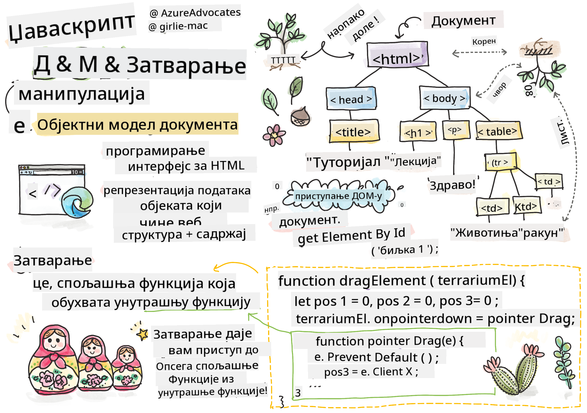
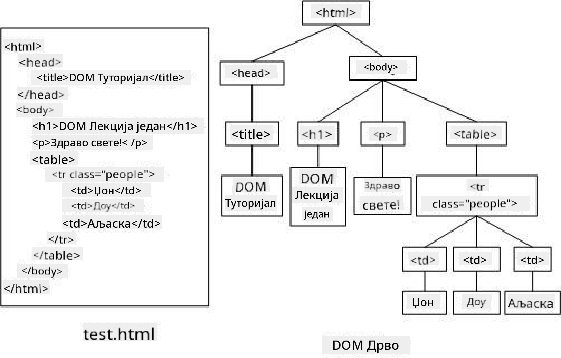

<!--
CO_OP_TRANSLATOR_METADATA:
{
  "original_hash": "30f8903a1f290e3d438dc2c70fe60259",
  "translation_date": "2025-08-28T10:25:08+00:00",
  "source_file": "3-terrarium/3-intro-to-DOM-and-closures/README.md",
  "language_code": "sr"
}
-->
# Пројекат Тераријум, део 3: Манипулација DOM-ом и затварање


> Скетч од [Tomomi Imura](https://twitter.com/girlie_mac)

## Квиз пре предавања

[Квиз пре предавања](https://ashy-river-0debb7803.1.azurestaticapps.net/quiz/19)

### Увод

Манипулација DOM-ом, или "Document Object Model", је кључни аспект веб развоја. Према [MDN](https://developer.mozilla.org/docs/Web/API/Document_Object_Model/Introduction), "Document Object Model (DOM) је представљање података објеката који чине структуру и садржај документа на вебу." Изазови око манипулације DOM-ом често су били разлог за коришћење JavaScript оквира уместо чистог JavaScript-а за управљање DOM-ом, али ми ћемо се снаћи сами!

Поред тога, ова лекција ће представити идеју [JavaScript затварања](https://developer.mozilla.org/docs/Web/JavaScript/Closures), које можете замислити као функцију која је затворена унутар друге функције, тако да унутрашња функција има приступ опсегу спољашње функције.

> JavaScript затварања су обимна и сложена тема. Ова лекција се бави најосновнијом идејом да у коду овог тераријума можете пронаћи затварање: унутрашњу функцију и спољашњу функцију конструисане на начин који омогућава унутрашњој функцији приступ опсегу спољашње функције. За много више информација о томе како ово функционише, посетите [опсежну документацију](https://developer.mozilla.org/docs/Web/JavaScript/Closures).

Користићемо затварање за манипулацију DOM-ом.

Замислите DOM као дрво које представља све начине на које се документ веб странице може манипулисати. Разни API-ји (интерфејси за програмирање апликација) су написани тако да програмери, користећи свој одабрани програмски језик, могу приступити DOM-у и уређивати, мењати, реорганизовати и на друге начине управљати њиме.



> Представљање DOM-а и HTML ознака које га референцирају. Од [Olfa Nasraoui](https://www.researchgate.net/publication/221417012_Profile-Based_Focused_Crawler_for_Social_Media-Sharing_Websites)

У овој лекцији завршићемо наш интерактивни пројекат тераријума креирањем JavaScript-а који ће омогућити кориснику да манипулише биљкама на страници.

### Предуслов

Требало би да имате HTML и CSS за ваш тераријум направљене. До краја ове лекције моћи ћете да премештате биљке унутар и ван тераријума тако што ћете их превлачити.

### Задатак

У вашем фолдеру за тераријум, креирајте нову датотеку под називом `script.js`. Увезите ту датотеку у `<head>` секцију:

```html
	<script src="./script.js" defer></script>
```

> Напомена: користите `defer` приликом увоза спољашње JavaScript датотеке у HTML датотеку како би се JavaScript извршио тек након што се HTML датотека у потпуности учита. Такође можете користити атрибут `async`, који омогућава скрипти да се извршава док се HTML датотека парсира, али у нашем случају је важно да HTML елементи буду у потпуности доступни за превлачење пре него што дозволимо извршавање скрипте за превлачење.
---

## DOM елементи

Прва ствар коју треба да урадите је да креирате референце на елементе које желите да манипулишете у DOM-у. У нашем случају, то су 14 биљака које тренутно чекају у бочним тракама.

### Задатак

```html
dragElement(document.getElementById('plant1'));
dragElement(document.getElementById('plant2'));
dragElement(document.getElementById('plant3'));
dragElement(document.getElementById('plant4'));
dragElement(document.getElementById('plant5'));
dragElement(document.getElementById('plant6'));
dragElement(document.getElementById('plant7'));
dragElement(document.getElementById('plant8'));
dragElement(document.getElementById('plant9'));
dragElement(document.getElementById('plant10'));
dragElement(document.getElementById('plant11'));
dragElement(document.getElementById('plant12'));
dragElement(document.getElementById('plant13'));
dragElement(document.getElementById('plant14'));
```

Шта се овде дешава? Референцирате документ и претражујете његов DOM да бисте пронашли елемент са одређеним Id-јем. Сетите се да сте у првој лекцији о HTML-у дали индивидуалне Id-јеве свакој слици биљке (`id="plant1"`)? Сада ћете искористити тај напор. Након идентификовања сваког елемента, прослеђујете тај елемент функцији под називом `dragElement` коју ћете ускоро направити. Тако је елемент у HTML-у сада омогућен за превлачење, или ће бити ускоро.

✅ Зашто реферишемо елементе по Id-ју? Зашто не по њиховој CSS класи? Можете се вратити на претходну лекцију о CSS-у да бисте одговорили на ово питање.

---

## Затварање

Сада сте спремни да креирате затварање `dragElement`, које је спољашња функција која затвара унутрашњу функцију или функције (у нашем случају, имаћемо три).

Затварања су корисна када једна или више функција требају приступити опсегу спољашње функције. Ево примера:

```javascript
function displayCandy(){
	let candy = ['jellybeans'];
	function addCandy(candyType) {
		candy.push(candyType)
	}
	addCandy('gumdrops');
}
displayCandy();
console.log(candy)
```

У овом примеру, функција `displayCandy` окружује функцију која додаје нову врсту слаткиша у низ који већ постоји у функцији. Ако бисте покренули овај код, низ `candy` би био недефинисан, јер је локална променљива (локална за затварање).

✅ Како можете учинити низ `candy` доступним? Покушајте да га преместите ван затварања. На тај начин, низ постаје глобалан, уместо да остане доступан само локалном опсегу затварања.

### Задатак

Испод декларација елемената у `script.js`, креирајте функцију:

```javascript
function dragElement(terrariumElement) {
	//set 4 positions for positioning on the screen
	let pos1 = 0,
		pos2 = 0,
		pos3 = 0,
		pos4 = 0;
	terrariumElement.onpointerdown = pointerDrag;
}
```

`dragElement` добија свој објекат `terrariumElement` из декларација на врху скрипте. Затим постављате неке локалне позиције на `0` за објекат који је прослеђен функцији. То су локалне променљиве које ће бити манипулисане за сваки елемент док додајете функционалност превлачења и испуштања унутар затварања за сваки елемент. Тераријум ће бити попуњен овим превученим елементима, тако да апликација треба да прати где су постављени.

Поред тога, `terrariumElement` који је прослеђен овој функцији добија догађај `pointerdown`, који је део [web API-ја](https://developer.mozilla.org/docs/Web/API) дизајнираних за помоћ у управљању DOM-ом. `onpointerdown` се активира када се притисне дугме, или у нашем случају, када се додирне елемент који се може превући. Овај обрађивач догађаја ради на [веб и мобилним претраживачима](https://caniuse.com/?search=onpointerdown), са неколико изузетака.

✅ [Обрађивач догађаја `onclick`](https://developer.mozilla.org/docs/Web/API/GlobalEventHandlers/onclick) има много већу подршку међу претраживачима; зашто га не бисте користили овде? Размислите о тачној врсти интеракције са екраном коју покушавате да креирате овде.

---

## Функција Pointerdrag

`terrariumElement` је спреман за превлачење; када се активира догађај `onpointerdown`, позива се функција `pointerDrag`. Додајте ту функцију одмах испод ове линије: `terrariumElement.onpointerdown = pointerDrag;`:

### Задатак 

```javascript
function pointerDrag(e) {
	e.preventDefault();
	console.log(e);
	pos3 = e.clientX;
	pos4 = e.clientY;
}
```

Дешава се неколико ствари. Прво, спречавате подразумеване догађаје који се обично дешавају на `pointerdown` тако што користите `e.preventDefault();`. На тај начин имате већу контролу над понашањем интерфејса.

> Вратите се на ову линију када потпуно изградите датотеку скрипте и пробајте без `e.preventDefault()` - шта се дешава?

Друго, отворите `index.html` у прозору претраживача и инспектирајте интерфејс. Када кликнете на биљку, можете видети како се догађај 'e' хвата. Истражите догађај да видите колико информација се прикупља једним догађајем `pointerdown`!  

Затим, обратите пажњу на то како се локалне променљиве `pos3` и `pos4` постављају на e.clientX. Можете пронаћи вредности `e` у панелу за инспекцију. Ове вредности хватају x и y координате биљке у тренутку када кликнете на њу или је додирнете. Требаће вам прецизна контрола над понашањем биљака док их кликате и превлачите, па пратите њихове координате.

✅ Да ли постаје јасније зашто је цела апликација изграђена са једним великим затварањем? Ако није, како бисте одржавали опсег за сваку од 14 биљака које се могу превући?

Завршите почетну функцију додавањем још две манипулације догађајима показивача испод `pos4 = e.clientY`:

```html
document.onpointermove = elementDrag;
document.onpointerup = stopElementDrag;
```
Сада указујете да желите да биљка буде превучена заједно са показивачем док га померате, и да се гест превлачења заустави када одселектујете биљку. `onpointermove` и `onpointerup` су део истог API-ја као и `onpointerdown`. Интерфејс ће сада бацати грешке јер још нисте дефинисали функције `elementDrag` и `stopElementDrag`, па их следеће изградите.

## Функције elementDrag и stopElementDrag

Завршићете своје затварање додавањем још две унутрашње функције које ће управљати оним што се дешава када превлачите биљку и када престанете да је превлачите. Понашање које желите је да можете превући било коју биљку у било ком тренутку и поставити је било где на екрану. Овај интерфејс је прилично неограничен (на пример, нема зоне за испуштање) како би вам омогућио да дизајнирате свој тераријум тачно онако како желите додавањем, уклањањем и репозиционирањем биљака.

### Задатак

Додајте функцију `elementDrag` одмах након затварајуће витичасте заграде функције `pointerDrag`:

```javascript
function elementDrag(e) {
	pos1 = pos3 - e.clientX;
	pos2 = pos4 - e.clientY;
	pos3 = e.clientX;
	pos4 = e.clientY;
	console.log(pos1, pos2, pos3, pos4);
	terrariumElement.style.top = terrariumElement.offsetTop - pos2 + 'px';
	terrariumElement.style.left = terrariumElement.offsetLeft - pos1 + 'px';
}
```
У овој функцији, доста уређујете почетне позиције 1-4 које сте поставили као локалне променљиве у спољашњој функцији. Шта се овде дешава?

Док превлачите, поново додељујете `pos1` тако што га постављате да буде једнак `pos3` (који сте раније поставили као `e.clientX`) минус тренутна вредност `e.clientX`. Сличну операцију радите за `pos2`. Затим, поново постављате `pos3` и `pos4` на нове X и Y координате елемента. Можете посматрати ове промене у конзоли док превлачите. Затим манипулишете CSS стилом биљке да бисте поставили њену нову позицију на основу нових позиција `pos1` и `pos2`, рачунајући горње и леве X и Y координате биљке на основу поређења њеног офсета са овим новим позицијама.

> `offsetTop` и `offsetLeft` су CSS својства која постављају позицију елемента на основу позиције његовог родитеља; његов родитељ може бити било који елемент који није позициониран као `static`. 

Све ове прерачунавања позиционирања омогућавају вам да фино подесите понашање тераријума и његових биљака.

### Задатак 

Последњи задатак за завршетак интерфејса је додавање функције `stopElementDrag` након затварајуће витичасте заграде функције `elementDrag`:

```javascript
function stopElementDrag() {
	document.onpointerup = null;
	document.onpointermove = null;
}
```

Ова мала функција ресетује догађаје `onpointerup` и `onpointermove` тако да можете или поново започети прогрес ваше биљке тако што ћете је поново почети превлачити, или почети превлачити нову биљку.

✅ Шта се дешава ако не поставите ове догађаје на null?

Сада сте завршили свој пројекат!

🥇Честитамо! Завршили сте свој прелепи тераријум. 

---

## 🚀Изазов

Додајте нови обрађивач догађаја у своје затварање да урадите нешто више са биљкама; на пример, двоструким кликом на биљку доведите је у први план. Будите креативни!

## Квиз после предавања

[Квиз после предавања](https://ashy-river-0debb7803.1.azurestaticapps.net/quiz/20)

## Преглед и самостално учење

Иако превлачење елемената по екрану изгледа тривијално, постоји много начина да се то уради и много замки, у зависности од ефекта који желите. У ствари, постоји читав [API за превлачење и испуштање](https://developer.mozilla.org/docs/Web/API/HTML_Drag_and_Drop_API) који можете испробати. Нисмо га користили у овом модулу јер је ефекат који смо желели био нешто другачији, али пробајте овај API на свом пројекту и видите шта можете постићи.

Пронађите више информација о догађајима показивача у [W3C документацији](https://www.w3.org/TR/pointerevents1/) и на [MDN веб документацији](https://developer.mozilla.org/docs/Web/API/Pointer_events).

Увек проверавајте могућности претраживача користећи [CanIUse.com](https://caniuse.com/).

## Задатак

[Радите мало више са DOM-ом](assignment.md)

---

**Одрицање од одговорности**:  
Овај документ је преведен коришћењем услуге за превођење помоћу вештачке интелигенције [Co-op Translator](https://github.com/Azure/co-op-translator). Иако се трудимо да обезбедимо тачност, молимо вас да имате у виду да аутоматски преводи могу садржати грешке или нетачности. Оригинални документ на његовом изворном језику треба сматрати ауторитативним извором. За критичне информације препоручује се професионални превод од стране људи. Не преузимамо одговорност за било каква погрешна тумачења или неспоразуме који могу настати услед коришћења овог превода.