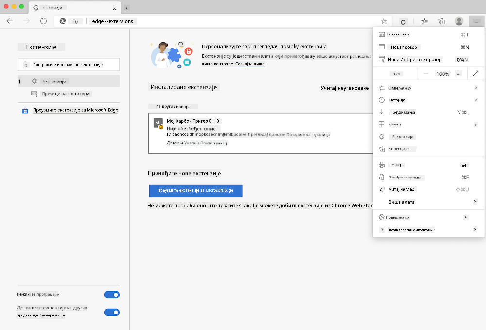
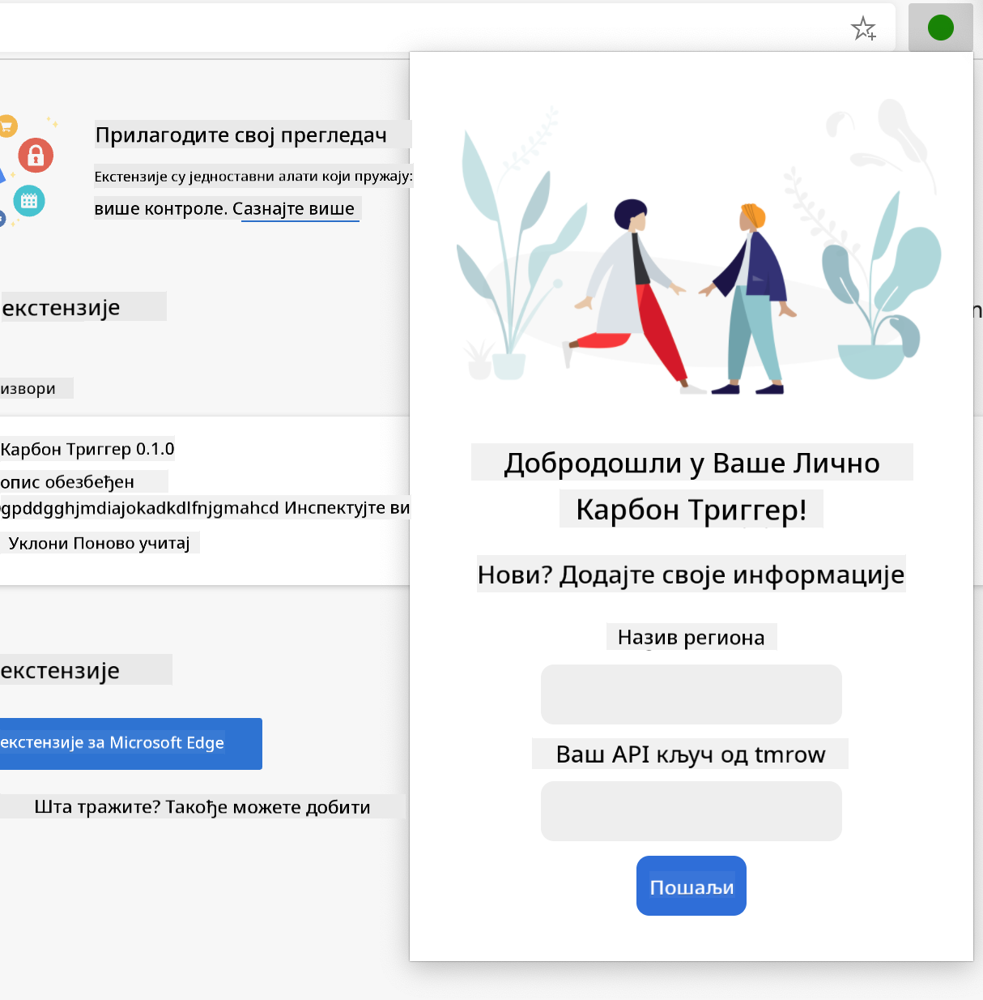
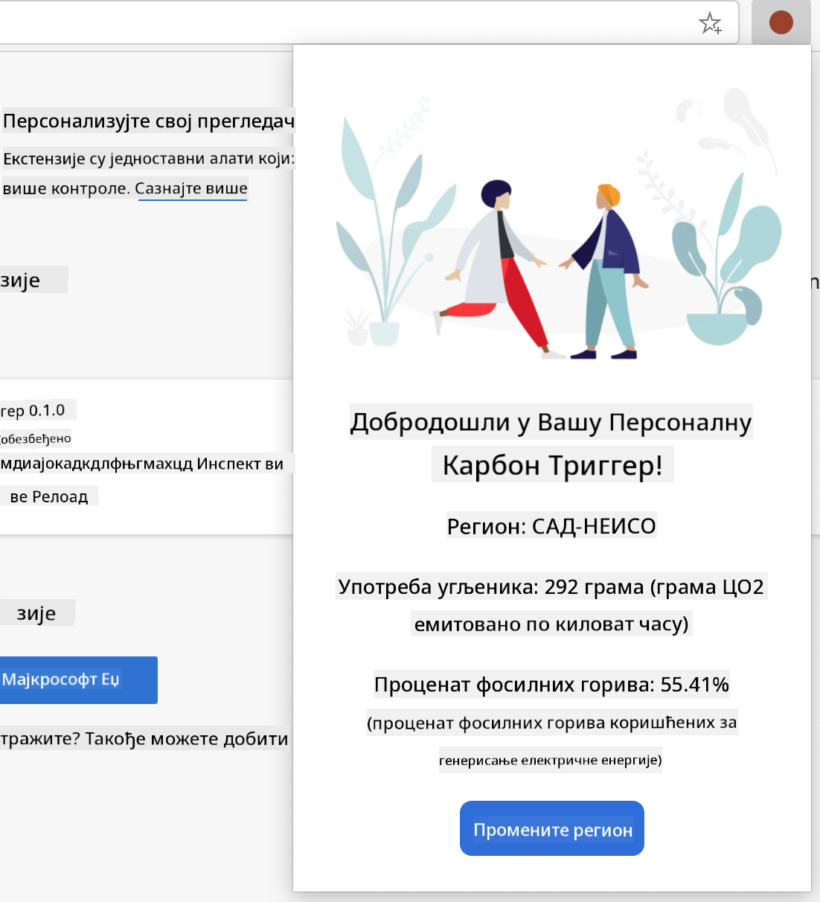

<!--
CO_OP_TRANSLATOR_METADATA:
{
  "original_hash": "0bb55e0b98600afab801eea115228873",
  "translation_date": "2025-08-28T10:08:50+00:00",
  "source_file": "5-browser-extension/1-about-browsers/README.md",
  "language_code": "sr"
}
-->
# Пројекат проширења прегледача, део 1: Све о прегледачима

  
> Скица од [Wassim Chegham](https://dev.to/wassimchegham/ever-wondered-what-happens-when-you-type-in-a-url-in-an-address-bar-in-a-browser-3dob)

## Квиз пре предавања

[Квиз пре предавања](https://ashy-river-0debb7803.1.azurestaticapps.net/quiz/23)

### Увод

Проширења за прегледаче додају додатну функционалност прегледачу. Али пре него што направите једно, требало би да научите мало о томе како прегледачи функционишу.

### О прегледачу

У овој серији лекција научићете како да направите проширење за прегледач које ће радити на Chrome, Firefox и Edge прегледачима. У овом делу ћете открити како прегледачи функционишу и поставити основе за елементе проширења прегледача.

Али шта је заправо прегледач? То је софтверска апликација која омогућава крајњем кориснику да приступи садржају са сервера и прикаже га на веб страницама.

✅ Мало историје: први прегледач се звао 'WorldWideWeb' и направио га је сер Тимоти Бернерс-Ли 1990. године.

  
> Неки од раних прегледача, преко [Karen McGrane](https://www.slideshare.net/KMcGrane/week-4-ixd-history-personal-computing)

Када се корисник повеже на интернет користећи URL (Uniform Resource Locator) адресу, обично преко Hypertext Transfer Protocol-а путем `http` или `https` адресе, прегледач комуницира са веб сервером и преузима веб страницу.

У том тренутку, рендеринг механизам прегледача приказује страницу на уређају корисника, који може бити мобилни телефон, десктоп или лаптоп.

Прегледачи такође имају могућност кеширања садржаја како не би морали да га преузимају са сервера сваки пут. Они могу бележити историју активности корисника, чувати 'колачиће', који су мали делови података који садрже информације о корисниковој активности, и још много тога.

Веома је важно запамтити да сви прегледачи нису исти! Сваки прегледач има своје предности и мане, и професионални веб програмер треба да разуме како да веб странице добро функционишу на различитим прегледачима. Ово укључује прилагођавање малим екранима, као што је екран мобилног телефона, као и корисницима који су офлајн.

Веома користан сајт који би требало да сачувате у обележивачима у прегледачу који користите је [caniuse.com](https://www.caniuse.com). Када правите веб странице, веома је корисно користити листе подржаних технологија на caniuse како бисте најбоље подржали своје кориснике.

✅ Како можете сазнати који су прегледачи најпопуларнији међу корисницима вашег веб сајта? Проверите своју аналитику - можете инсталирати различите пакете за аналитику као део процеса развоја веба, и они ће вам рећи који прегледачи се највише користе.

## Проширења за прегледаче

Зашто бисте желели да направите проширење за прегледач? То је корисна ствар коју можете додати свом прегледачу када вам је потребан брз приступ задацима које често понављате. На пример, ако често проверавате боје на различитим веб страницама, можете инсталирати проширење за избор боја. Ако имате проблема са памћењем лозинки, можете користити проширење за управљање лозинкама.

Проширења за прегледаче су такође забавна за развој. Обично управљају ограниченим бројем задатака које обављају веома добро.

✅ Која су ваша омиљена проширења за прегледаче? Које задатке обављају?

### Инсталирање проширења

Пре него што почнете са развојем, погледајте процес прављења и постављања проширења за прегледач. Иако се сваки прегледач мало разликује у начину на који управља овим задатком, процес је сличан на Chrome и Firefox прегледачима као у овом примеру за Edge:



> Напомена: Обавезно укључите режим за програмере и дозволите проширења из других продавница.

У суштини, процес ће бити:

- направите своје проширење користећи `npm run build`  
- у прегледачу идите на страницу са проширењима користећи дугме "Подешавања и још" (икона `...`) у горњем десном углу  
- ако је у питању нова инсталација, изаберите `load unpacked` да бисте отпремили ново проширење из његовог фолдера за изградњу (у нашем случају то је `/dist`)  
- или, кликните на `reload` ако поново учитавате већ инсталирано проширење  

✅ Ова упутства се односе на проширења која сами направите; да бисте инсталирали проширења која су објављена у продавници проширења за прегледач, требало би да одете на те [продавнице](https://microsoftedge.microsoft.com/addons/Microsoft-Edge-Extensions-Home) и инсталирате проширење по вашем избору.

### Почетак

Направићете проширење за прегледач које приказује угљенични отисак вашег региона, показујући потрошњу енергије и извор енергије у вашем региону. Проширење ће имати форму која прикупља API кључ како бисте могли да приступите CO2 Signal API-ју.

**Потребно вам је:**

- [API кључ](https://www.co2signal.com/); унесите своју е-пошту у поље на овој страници и кључ ће вам бити послат  
- [код за ваш регион](http://api.electricitymap.org/v3/zones) који одговара [Electricity Map](https://www.electricitymap.org/map) (на пример, у Бостону користим 'US-NEISO')  
- [почетни код](../../../../5-browser-extension/start). Преузмите фолдер `start`; довршићете код у овом фолдеру.  
- [NPM](https://www.npmjs.com) - NPM је алат за управљање пакетима; инсталирајте га локално и пакети наведени у вашем `package.json` фајлу ће бити инсталирани за коришћење у вашим веб ресурсима  

✅ Сазнајте више о управљању пакетима у овом [одличном Learn модулу](https://docs.microsoft.com/learn/modules/create-nodejs-project-dependencies/?WT.mc_id=academic-77807-sagibbon)

Одвојите минут да прегледате базу кода:

dist  
    -|manifest.json (подразумеване вредности се постављају овде)  
    -|index.html (HTML ознаке за предњи крај овде)  
    -|background.js (JS за позадину овде)  
    -|main.js (састављени JS)  
src  
    -|index.js (ваш JS код иде овде)  

✅ Када имате свој API кључ и код региона, сачувајте их негде у белешци за будућу употребу.

### Изградња HTML-а за проширење

Ово проширење има два приказа. Један за прикупљање API кључа и кода региона:



И други за приказивање угљеничне потрошње региона:



Почнимо са изградњом HTML-а за форму и стилизовањем помоћу CSS-а.

У фолдеру `/dist`, направите форму и област за резултате. У фајлу `index.html`, попуните означену област за форму:

```HTML
<form class="form-data" autocomplete="on">
	<div>
		<h2>New? Add your Information</h2>
	</div>
	<div>
		<label for="region">Region Name</label>
		<input type="text" id="region" required class="region-name" />
	</div>
	<div>
		<label for="api">Your API Key from tmrow</label>
		<input type="text" id="api" required class="api-key" />
	</div>
	<button class="search-btn">Submit</button>
</form>	
```  
Ово је форма у којој ће се унети и сачувати ваше информације у локалној меморији.

Затим, направите област за резултате; испод завршног тега форме, додајте неке div-ове:

```HTML
<div class="result">
	<div class="loading">loading...</div>
	<div class="errors"></div>
	<div class="data"></div>
	<div class="result-container">
		<p><strong>Region: </strong><span class="my-region"></span></p>
		<p><strong>Carbon Usage: </strong><span class="carbon-usage"></span></p>
		<p><strong>Fossil Fuel Percentage: </strong><span class="fossil-fuel"></span></p>
	</div>
	<button class="clear-btn">Change region</button>
</div>
```  
У овом тренутку, можете покушати изградњу. Обавезно инсталирајте зависности пакета овог проширења:

```
npm install
```  

Ова команда ће користити npm, Node Package Manager, за инсталирање webpack-а за процес изградње вашег проширења. Можете видети излаз овог процеса тако што ћете погледати у `/dist/main.js` - видећете да је код спакован.

За сада, проширење би требало да се изгради и, ако га поставите у Edge као проширење, видећете уредно приказану форму.

Честитамо, направили сте прве кораке ка изградњи проширења за прегледач. У наредним лекцијама учинићете га функционалнијим и кориснијим.

---

## 🚀 Изазов

Погледајте продавницу проширења за прегледаче и инсталирајте једно у свој прегледач. Можете истражити његове фајлове на занимљиве начине. Шта откривате?

## Квиз после предавања

[Квиз после предавања](https://ashy-river-0debb7803.1.azurestaticapps.net/quiz/24)

## Преглед и самостално учење

У овој лекцији сте научили мало о историји веб прегледача; искористите ову прилику да сазнате више о томе како су изумитељи World Wide Web-а замислили његову употребу читајући више о његовој историји. Неки корисни сајтови укључују:

[Историја веб прегледача](https://www.mozilla.org/firefox/browsers/browser-history/)

[Историја веба](https://webfoundation.org/about/vision/history-of-the-web/)

[Интервју са Тимом Бернерс-Лијем](https://www.theguardian.com/technology/2019/mar/12/tim-berners-lee-on-30-years-of-the-web-if-we-dream-a-little-we-can-get-the-web-we-want)

## Задатак

[Промените стил свог проширења](assignment.md)

---

**Одрицање од одговорности**:  
Овај документ је преведен коришћењем услуге за превођење помоћу вештачке интелигенције [Co-op Translator](https://github.com/Azure/co-op-translator). Иако тежимо тачности, молимо вас да имате у виду да аутоматски преводи могу садржати грешке или нетачности. Оригинални документ на његовом изворном језику треба сматрати ауторитативним извором. За критичне информације препоручује се професионални превод од стране људи. Не преузимамо одговорност за било каква погрешна тумачења или неспоразуме који могу настати услед коришћења овог превода.