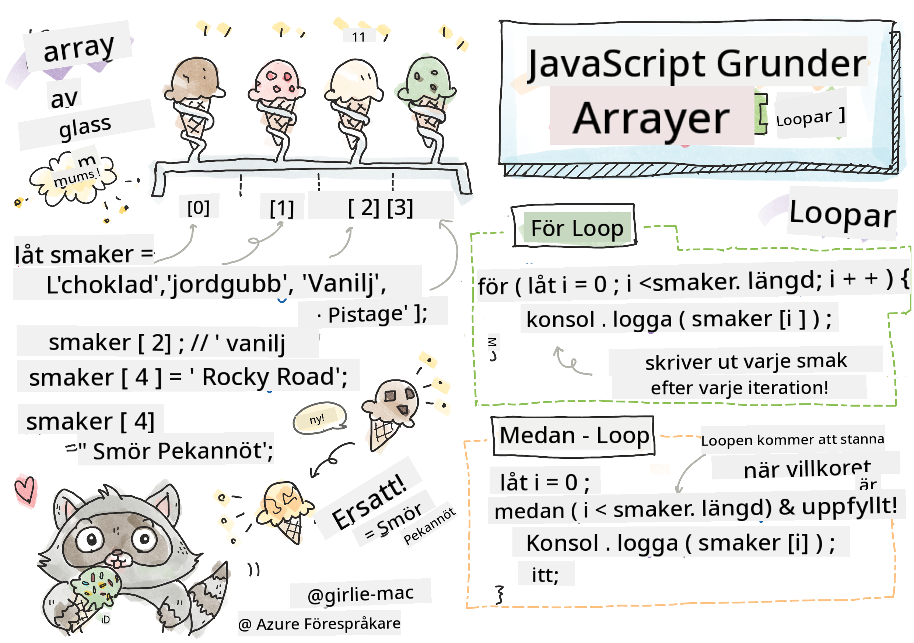

<!--
CO_OP_TRANSLATOR_METADATA:
{
  "original_hash": "3f7f87871312cf6cc12662da7d973182",
  "translation_date": "2025-08-26T21:46:24+00:00",
  "source_file": "2-js-basics/4-arrays-loops/README.md",
  "language_code": "sv"
}
-->
# JavaScript Grunder: Arrayer och Loopar


> Sketchnote av [Tomomi Imura](https://twitter.com/girlie_mac)

## Quiz före föreläsningen
[Quiz före föreläsningen](https://ff-quizzes.netlify.app/web/quiz/13)

Den här lektionen täcker grunderna i JavaScript, språket som ger interaktivitet på webben. I den här lektionen kommer du att lära dig om arrayer och loopar, som används för att manipulera data.

[](https://youtube.com/watch?v=1U4qTyq02Xw "Arrayer")

[](https://www.youtube.com/watch?v=Eeh7pxtTZ3k "Loopar")

> 🎥 Klicka på bilderna ovan för videor om arrayer och loopar.

> Du kan ta den här lektionen på [Microsoft Learn](https://docs.microsoft.com/learn/modules/web-development-101-arrays/?WT.mc_id=academic-77807-sagibbon)!

## Arrayer

Att arbeta med data är en vanlig uppgift i alla programmeringsspråk, och det blir mycket enklare när data är organiserad i en strukturerad form, som arrayer. Med arrayer lagras data i en struktur som liknar en lista. En stor fördel med arrayer är att du kan lagra olika typer av data i en och samma array.

✅ Arrayer finns överallt omkring oss! Kan du komma på ett verkligt exempel på en array, som en solpanel-array?

Syntaxen för en array är ett par hakparenteser.

```javascript
let myArray = [];
```

Detta är en tom array, men arrayer kan deklareras redan fyllda med data. Flera värden i en array separeras med ett komma.

```javascript
let iceCreamFlavors = ["Chocolate", "Strawberry", "Vanilla", "Pistachio", "Rocky Road"];
```

Arrayvärden tilldelas ett unikt värde som kallas **index**, ett heltal som tilldelas baserat på dess avstånd från början av arrayen. I exemplet ovan har strängvärdet "Chocolate" index 0, och indexet för "Rocky Road" är 4. Använd indexet med hakparenteser för att hämta, ändra eller lägga till värden i arrayen.

✅ Är det förvånande att arrayer börjar med index noll? I vissa programmeringsspråk börjar index på 1. Det finns en intressant historia kring detta, som du kan [läsa på Wikipedia](https://en.wikipedia.org/wiki/Zero-based_numbering).

```javascript
let iceCreamFlavors = ["Chocolate", "Strawberry", "Vanilla", "Pistachio", "Rocky Road"];
iceCreamFlavors[2]; //"Vanilla"
```

Du kan använda indexet för att ändra ett värde, så här:

```javascript
iceCreamFlavors[4] = "Butter Pecan"; //Changed "Rocky Road" to "Butter Pecan"
```

Och du kan lägga till ett nytt värde på ett givet index så här:

```javascript
iceCreamFlavors[5] = "Cookie Dough"; //Added "Cookie Dough"
```

✅ Ett vanligare sätt att lägga till värden i en array är att använda arraymetoder som array.push()

För att ta reda på hur många objekt som finns i en array, använd egenskapen `length`.

```javascript
let iceCreamFlavors = ["Chocolate", "Strawberry", "Vanilla", "Pistachio", "Rocky Road"];
iceCreamFlavors.length; //5
```

✅ Testa själv! Använd din webbläsares konsol för att skapa och manipulera en egen array.

## Loopar

Loopar låter oss utföra repetitiva eller **iterativa** uppgifter och kan spara mycket tid och kod. Varje iteration kan variera i sina variabler, värden och villkor. Det finns olika typer av loopar i JavaScript, och de har små skillnader, men gör i princip samma sak: loopar över data.

### For-loop

`for`-loopen kräver 3 delar för att iterera:
- `counter` En variabel som vanligtvis initieras med ett tal som räknar antalet iterationer
- `condition` Ett uttryck som använder jämförelseoperatorer för att få loopen att sluta när det blir `false`
- `iteration-expression` Körs i slutet av varje iteration, vanligtvis används för att ändra counter-värdet
  
```javascript
// Counting up to 10
for (let i = 0; i < 10; i++) {
  console.log(i);
}
```

✅ Kör denna kod i en webbläsares konsol. Vad händer när du gör små ändringar i counter, condition eller iteration-expression? Kan du få den att gå baklänges, som en nedräkning?

### While-loop

Till skillnad från syntaxen för `for`-loopen kräver `while`-loopar endast ett villkor som stoppar loopen när villkoret blir `false`. Villkor i loopar brukar förlita sig på andra värden som counters och måste hanteras under loopen. Startvärden för counters måste skapas utanför loopen, och alla uttryck för att uppfylla ett villkor, inklusive att ändra counter, måste hanteras inne i loopen.

```javascript
//Counting up to 10
let i = 0;
while (i < 10) {
 console.log(i);
 i++;
}
```

✅ Varför skulle du välja en for-loop istället för en while-loop? 17K användare hade samma fråga på StackOverflow, och några av åsikterna [kan vara intressanta för dig](https://stackoverflow.com/questions/39969145/while-loops-vs-for-loops-in-javascript).

## Loopar och Arrayer

Arrayer används ofta med loopar eftersom de flesta villkor kräver arrayens längd för att stoppa loopen, och indexet kan också vara counter-värdet.

```javascript
let iceCreamFlavors = ["Chocolate", "Strawberry", "Vanilla", "Pistachio", "Rocky Road"];

for (let i = 0; i < iceCreamFlavors.length; i++) {
  console.log(iceCreamFlavors[i]);
} //Ends when all flavors are printed
```

✅ Experimentera med att loopa över en egen array i din webbläsares konsol. 

---

## 🚀 Utmaning

Det finns andra sätt att loopa över arrayer än for- och while-loopar. Det finns [forEach](https://developer.mozilla.org/docs/Web/JavaScript/Reference/Global_Objects/Array/forEach), [for-of](https://developer.mozilla.org/docs/Web/JavaScript/Reference/Statements/for...of) och [map](https://developer.mozilla.org/docs/Web/JavaScript/Reference/Global_Objects/Array/map). Skriv om din array-loop med en av dessa tekniker.

## Quiz efter föreläsningen
[Quiz efter föreläsningen](https://ff-quizzes.netlify.app/web/quiz/14)

## Granskning & Självstudier

Arrayer i JavaScript har många metoder kopplade till sig som är extremt användbara för datamanipulation. [Läs om dessa metoder](https://developer.mozilla.org/docs/Web/JavaScript/Reference/Global_Objects/Array) och testa några av dem (som push, pop, slice och splice) på en egen array.

## Uppgift

[Loop en Array](assignment.md)

---

**Ansvarsfriskrivning**:  
Detta dokument har översatts med hjälp av AI-översättningstjänsten [Co-op Translator](https://github.com/Azure/co-op-translator). Även om vi strävar efter noggrannhet, bör det noteras att automatiserade översättningar kan innehålla fel eller felaktigheter. Det ursprungliga dokumentet på dess originalspråk bör betraktas som den auktoritativa källan. För kritisk information rekommenderas professionell mänsklig översättning. Vi ansvarar inte för eventuella missförstånd eller feltolkningar som uppstår vid användning av denna översättning.