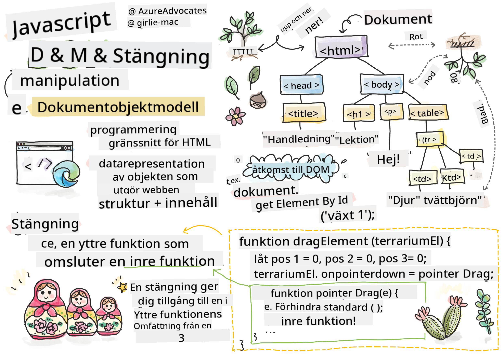
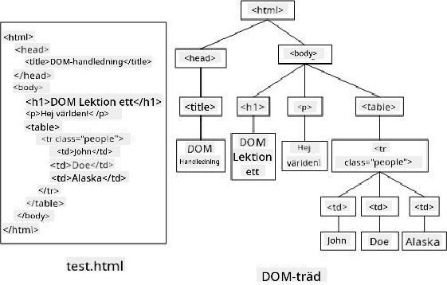
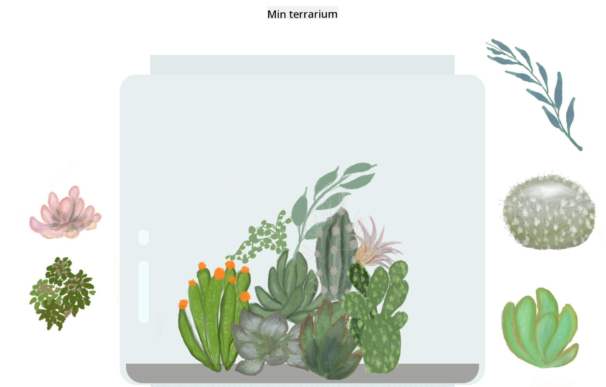

<!--
CO_OP_TRANSLATOR_METADATA:
{
  "original_hash": "30f8903a1f290e3d438dc2c70fe60259",
  "translation_date": "2025-08-26T21:33:28+00:00",
  "source_file": "3-terrarium/3-intro-to-DOM-and-closures/README.md",
  "language_code": "sv"
}
-->
# Terrariumprojekt Del 3: DOM-manipulation och en Sluten Funktion


> Sketchnote av [Tomomi Imura](https://twitter.com/girlie_mac)

## Förkunskapstest

[Förkunskapstest](https://ashy-river-0debb7803.1.azurestaticapps.net/quiz/19)

### Introduktion

Att manipulera DOM, eller "Document Object Model", är en viktig del av webbutveckling. Enligt [MDN](https://developer.mozilla.org/docs/Web/API/Document_Object_Model/Introduction), "Document Object Model (DOM) är den datamodell som representerar objekten som utgör strukturen och innehållet i ett dokument på webben." Utmaningarna kring DOM-manipulation på webben har ofta lett till att JavaScript-ramverk används istället för ren JavaScript för att hantera DOM, men vi ska klara oss själva!

Dessutom kommer denna lektion att introducera idén om en [JavaScript-sluten funktion](https://developer.mozilla.org/docs/Web/JavaScript/Closures), som du kan tänka dig som en funktion som är innesluten av en annan funktion, så att den inre funktionen har tillgång till den yttre funktionens scope.

> JavaScript-slutna funktioner är ett omfattande och komplext ämne. Denna lektion berör den mest grundläggande idén att i terrariets kod kommer du att hitta en sluten funktion: en inre funktion och en yttre funktion konstruerade på ett sätt som tillåter den inre funktionen att få tillgång till den yttre funktionens scope. För mycket mer information om hur detta fungerar, besök den [omfattande dokumentationen](https://developer.mozilla.org/docs/Web/JavaScript/Closures).

Vi kommer att använda en sluten funktion för att manipulera DOM.

Tänk på DOM som ett träd som representerar alla sätt som ett webbsidedokument kan manipuleras. Olika API:er (Application Program Interfaces) har skrivits så att programmerare, med sitt val av programmeringsspråk, kan komma åt DOM och redigera, ändra, omorganisera och på andra sätt hantera det.



> En representation av DOM och HTML-markeringen som refererar till det. Från [Olfa Nasraoui](https://www.researchgate.net/publication/221417012_Profile-Based_Focused_Crawler_for_Social_Media-Sharing_Websites)

I denna lektion kommer vi att slutföra vårt interaktiva terrarieprojekt genom att skapa JavaScript som gör det möjligt för en användare att manipulera växterna på sidan.

### Förutsättningar

Du bör ha byggt HTML och CSS för ditt terrarium. Vid slutet av denna lektion kommer du att kunna flytta växterna in och ut ur terrariet genom att dra dem.

### Uppgift

I din terrariemapp, skapa en ny fil som heter `script.js`. Importera den filen i `<head>`-sektionen:

```html
	<script src="./script.js" defer></script>
```

> Obs: använd `defer` när du importerar en extern JavaScript-fil till HTML-filen för att tillåta att JavaScript körs först efter att HTML-filen har laddats helt. Du kan också använda attributet `async`, vilket tillåter att skriptet körs medan HTML-filen parsas, men i vårt fall är det viktigt att HTML-elementen är fullt tillgängliga för dragning innan vi tillåter att drag-skriptet körs.
---

## DOM-elementen

Det första du behöver göra är att skapa referenser till de element som du vill manipulera i DOM. I vårt fall är det de 14 växterna som för närvarande väntar i sidofälten.

### Uppgift

```html
dragElement(document.getElementById('plant1'));
dragElement(document.getElementById('plant2'));
dragElement(document.getElementById('plant3'));
dragElement(document.getElementById('plant4'));
dragElement(document.getElementById('plant5'));
dragElement(document.getElementById('plant6'));
dragElement(document.getElementById('plant7'));
dragElement(document.getElementById('plant8'));
dragElement(document.getElementById('plant9'));
dragElement(document.getElementById('plant10'));
dragElement(document.getElementById('plant11'));
dragElement(document.getElementById('plant12'));
dragElement(document.getElementById('plant13'));
dragElement(document.getElementById('plant14'));
```

Vad händer här? Du refererar till dokumentet och letar genom dess DOM för att hitta ett element med ett specifikt Id. Kom ihåg att du i den första lektionen om HTML gav individuella Id:n till varje växtbild (`id="plant1"`)? Nu kommer du att använda det arbetet. Efter att ha identifierat varje element skickar du det objektet till en funktion som heter `dragElement` som du snart ska bygga. På så sätt blir elementet i HTML dragbart, eller kommer att bli det snart.

✅ Varför refererar vi till element med Id? Varför inte med deras CSS-klass? Du kan referera till den tidigare lektionen om CSS för att svara på denna fråga.

---

## Den slutna funktionen

Nu är du redo att skapa `dragElement`-funktionen, som är en yttre funktion som innesluter en inre funktion eller funktioner (i vårt fall kommer vi att ha tre).

Slutna funktioner är användbara när en eller flera funktioner behöver få tillgång till en yttre funktions scope. Här är ett exempel:

```javascript
function displayCandy(){
	let candy = ['jellybeans'];
	function addCandy(candyType) {
		candy.push(candyType)
	}
	addCandy('gumdrops');
}
displayCandy();
console.log(candy)
```

I detta exempel omger funktionen `displayCandy` en funktion som lägger till en ny godistyp i en array som redan finns i funktionen. Om du skulle köra denna kod skulle arrayen `candy` vara odefinierad, eftersom den är en lokal variabel (lokal för den slutna funktionen).

✅ Hur kan du göra arrayen `candy` tillgänglig? Försök att flytta den utanför den slutna funktionen. På så sätt blir arrayen global, istället för att förbli endast tillgänglig inom den slutna funktionens lokala scope.

### Uppgift

Under elementdeklarationerna i `script.js`, skapa en funktion:

```javascript
function dragElement(terrariumElement) {
	//set 4 positions for positioning on the screen
	let pos1 = 0,
		pos2 = 0,
		pos3 = 0,
		pos4 = 0;
	terrariumElement.onpointerdown = pointerDrag;
}
```

`dragElement` får sitt `terrariumElement`-objekt från deklarationerna högst upp i skriptet. Sedan sätter du några lokala positioner till `0` för objektet som skickas in i funktionen. Dessa är de lokala variabler som kommer att manipuleras för varje element när du lägger till drag-och-släpp-funktionalitet inom den slutna funktionen för varje element. Terrariet kommer att fyllas med dessa dragna element, så applikationen behöver hålla reda på var de placeras.

Dessutom tilldelas det `terrariumElement` som skickas till denna funktion en `pointerdown`-händelse, som är en del av [webb-API:erna](https://developer.mozilla.org/docs/Web/API) designade för att hjälpa till med DOM-hantering. `onpointerdown` triggas när en knapp trycks ned, eller i vårt fall, ett dragbart element berörs. Denna händelsehanterare fungerar på både [webb- och mobilwebbläsare](https://caniuse.com/?search=onpointerdown), med några få undantag.

✅ [Händelsehanteraren `onclick`](https://developer.mozilla.org/docs/Web/API/GlobalEventHandlers/onclick) har mycket mer stöd över olika webbläsare; varför skulle du inte använda den här? Tänk på den exakta typen av skärminteraktion du försöker skapa här.

---

## Pointerdrag-funktionen

`terrariumElement` är redo att dras runt; när `onpointerdown`-händelsen triggas, anropas funktionen `pointerDrag`. Lägg till den funktionen direkt under denna rad: `terrariumElement.onpointerdown = pointerDrag;`:

### Uppgift 

```javascript
function pointerDrag(e) {
	e.preventDefault();
	console.log(e);
	pos3 = e.clientX;
	pos4 = e.clientY;
}
```

Flera saker händer. Först förhindrar du de standardhändelser som normalt inträffar vid pointerdown genom att använda `e.preventDefault();`. På så sätt har du mer kontroll över gränssnittets beteende.

> Gå tillbaka till denna rad när du har byggt skriptfilen helt och prova utan `e.preventDefault()` - vad händer?

För det andra, öppna `index.html` i ett webbläsarfönster och inspektera gränssnittet. När du klickar på en växt kan du se hur händelsen 'e' fångas. Gräv in i händelsen för att se hur mycket information som samlas in av en enda pointerdown-händelse!  

Nästa steg är att notera hur de lokala variablerna `pos3` och `pos4` sätts till e.clientX. Du kan hitta värdena för `e` i inspektionspanelen. Dessa värden fångar x- och y-koordinaterna för växten vid det ögonblick du klickar på eller berör den. Du behöver finjusterad kontroll över växternas beteende när du klickar och drar dem, så du håller reda på deras koordinater.

✅ Börjar det bli tydligare varför hela appen byggs med en stor sluten funktion? Om den inte fanns, hur skulle du kunna behålla scope för var och en av de 14 dragbara växterna?

Slutför den initiala funktionen genom att lägga till två fler pointerhändelsemanipulationer under `pos4 = e.clientY`:

```html
document.onpointermove = elementDrag;
document.onpointerup = stopElementDrag;
```
Nu anger du att du vill att växten ska dras med pekaren när du flyttar den, och att draggesten ska sluta när du avmarkerar växten. `onpointermove` och `onpointerup` är alla delar av samma API som `onpointerdown`. Gränssnittet kommer att kasta fel nu eftersom du ännu inte har definierat funktionerna `elementDrag` och `stopElementDrag`, så bygg ut dem härnäst.

## Funktionerna elementDrag och stopElementDrag

Du kommer att slutföra din slutna funktion genom att lägga till två fler interna funktioner som hanterar vad som händer när du drar en växt och slutar dra den. Det beteende du vill ha är att du kan dra vilken växt som helst när som helst och placera den var som helst på skärmen. Detta gränssnitt är ganska flexibelt (det finns till exempel ingen drop zone) för att låta dig designa ditt terrarium precis som du vill genom att lägga till, ta bort och omplacera växter.

### Uppgift

Lägg till funktionen `elementDrag` direkt efter den avslutande måsvingeparentesen för `pointerDrag`:

```javascript
function elementDrag(e) {
	pos1 = pos3 - e.clientX;
	pos2 = pos4 - e.clientY;
	pos3 = e.clientX;
	pos4 = e.clientY;
	console.log(pos1, pos2, pos3, pos4);
	terrariumElement.style.top = terrariumElement.offsetTop - pos2 + 'px';
	terrariumElement.style.left = terrariumElement.offsetLeft - pos1 + 'px';
}
```
I denna funktion gör du många ändringar av de initiala positionerna 1-4 som du satte som lokala variabler i den yttre funktionen. Vad händer här?

När du drar omfördelar du `pos1` genom att göra den lika med `pos3` (som du tidigare satte till `e.clientX`) minus det aktuella värdet av `e.clientX`. Du gör en liknande operation för `pos2`. Sedan återställer du `pos3` och `pos4` till de nya X- och Y-koordinaterna för elementet. Du kan se dessa förändringar i konsolen när du drar. Därefter manipulerar du växtens CSS-stil för att ställa in dess nya position baserat på de nya positionerna för `pos1` och `pos2`, och beräknar växtens topp- och vänsterkoordinater baserat på jämförelsen av dess offset med dessa nya positioner.

> `offsetTop` och `offsetLeft` är CSS-egenskaper som ställer in ett elements position baserat på dess förälder; dess förälder kan vara vilket element som helst som inte är positionerat som `static`. 

Alla dessa omräkningar av positioner gör att du kan finjustera terrariets och växternas beteende.

### Uppgift 

Den sista uppgiften för att slutföra gränssnittet är att lägga till funktionen `stopElementDrag` efter den avslutande måsvingeparentesen för `elementDrag`:

```javascript
function stopElementDrag() {
	document.onpointerup = null;
	document.onpointermove = null;
}
```

Denna lilla funktion återställer händelserna `onpointerup` och `onpointermove` så att du antingen kan starta om växtens framsteg genom att börja dra den igen, eller börja dra en ny växt.

✅ Vad händer om du inte ställer in dessa händelser till null?

Nu har du slutfört ditt projekt!

🥇Grattis! Du har färdigställt ditt vackra terrarium. 

---

## 🚀Utmaning

Lägg till en ny händelsehanterare till din slutna funktion för att göra något mer med växterna; till exempel, dubbelklicka på en växt för att flytta den längst fram. Var kreativ!

## Efterkunskapstest

[Efterkunskapstest](https://ashy-river-0debb7803.1.azurestaticapps.net/quiz/20)

## Granskning & Självstudier

Även om det kan verka trivialt att dra element runt på skärmen, finns det många sätt att göra detta och många fallgropar, beroende på vilken effekt du vill uppnå. Faktum är att det finns ett helt [drag-och-släpp-API](https://developer.mozilla.org/docs/Web/API/HTML_Drag_and_Drop_API) som du kan prova. Vi använde det inte i denna modul eftersom effekten vi ville ha var något annorlunda, men prova detta API på ditt eget projekt och se vad du kan åstadkomma.

Hitta mer information om pointerhändelser i [W3C-dokumentationen](https://www.w3.org/TR/pointerevents1/) och på [MDN webbdokumentation](https://developer.mozilla.org/docs/Web/API/Pointer_events).

Kontrollera alltid webbläsarkapabiliteter med [CanIUse.com](https://caniuse.com/).

## Uppgift

[Arbeta lite mer med DOM](assignment.md)

---

**Ansvarsfriskrivning**:  
Detta dokument har översatts med hjälp av AI-översättningstjänsten [Co-op Translator](https://github.com/Azure/co-op-translator). Även om vi strävar efter noggrannhet, bör det noteras att automatiserade översättningar kan innehålla fel eller brister. Det ursprungliga dokumentet på dess originalspråk bör betraktas som den auktoritativa källan. För kritisk information rekommenderas professionell mänsklig översättning. Vi ansvarar inte för eventuella missförstånd eller feltolkningar som kan uppstå vid användning av denna översättning.