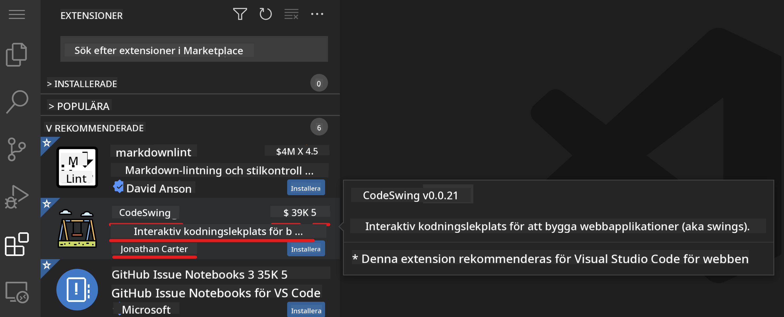
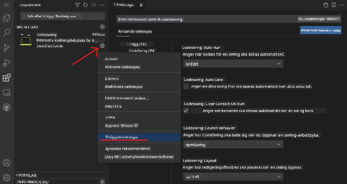

<!--
CO_OP_TRANSLATOR_METADATA:
{
  "original_hash": "7aa6e4f270d38d9cb17f2b5bd86b863d",
  "translation_date": "2025-08-26T22:27:00+00:00",
  "source_file": "8-code-editor/1-using-a-code-editor/README.md",
  "language_code": "sv"
}
-->
# Använda en kodredigerare

Den här lektionen täcker grunderna i att använda [VSCode.dev](https://vscode.dev), en webbaserad kodredigerare, så att du kan göra ändringar i din kod och bidra till ett projekt utan att installera något på din dator.

## Lärandemål

I den här lektionen kommer du att lära dig att:

- Använda en kodredigerare i ett kodprojekt
- Hålla koll på ändringar med versionskontroll
- Anpassa redigeraren för utveckling

### Förkunskaper

Innan du börjar behöver du skapa ett konto hos [GitHub](https://github.com). Navigera till [GitHub](https://github.com/) och skapa ett konto om du inte redan har gjort det.

### Introduktion

En kodredigerare är ett viktigt verktyg för att skriva program och samarbeta med befintliga kodprojekt. När du förstår grunderna i en redigerare och hur du använder dess funktioner kan du tillämpa dem när du skriver kod.

## Kom igång med VSCode.dev

[VSCode.dev](https://vscode.dev) är en kodredigerare på webben. Du behöver inte installera något för att använda den, precis som att öppna vilken annan webbplats som helst. För att komma igång med redigeraren, öppna följande länk: [https://vscode.dev](https://vscode.dev). Om du inte är inloggad på [GitHub](https://github.com/), följ instruktionerna för att logga in eller skapa ett nytt konto och logga sedan in.

När den har laddats bör den se ut ungefär som den här bilden:


Det finns tre huvudsakliga sektioner, från längst till vänster och rör sig mot höger:

1. _Aktivitetsfältet_ som innehåller några ikoner, som förstoringsglaset 🔎, kugghjulet ⚙️ och några andra.
2. Det utökade aktivitetsfältet som som standard visar _Explorer_, kallat _sidofältet_.
3. Och slutligen kodområdet till höger.

Klicka på varje ikon för att visa en annan meny. När du är klar, klicka på _Explorer_ så att du är tillbaka där du började.

När du börjar skapa kod eller ändra befintlig kod kommer det att ske i det största området till höger. Du kommer också att använda detta område för att visualisera befintlig kod, vilket du kommer att göra härnäst.

## Öppna ett GitHub-repository

Det första du behöver göra är att öppna ett GitHub-repository. Det finns flera sätt att öppna ett repository. I det här avsnittet kommer du att se två olika sätt att öppna ett repository så att du kan börja arbeta med ändringar.

### 1. Med redigeraren

Använd själva redigeraren för att öppna ett fjärrrepository. Om du går till [VSCode.dev](https://vscode.dev) kommer du att se en knapp som heter _"Open Remote Repository"_:


Du kan också använda kommandopaletten. Kommandopaletten är en inmatningsruta där du kan skriva vilket ord som helst som är en del av ett kommando eller en åtgärd för att hitta rätt kommando att köra. Använd menyn längst upp till vänster, välj sedan _View_, och välj därefter _Command Palette_, eller använd följande tangentbordsgenväg: Ctrl-Shift-P (på MacOS är det Command-Shift-P).


När menyn öppnas, skriv _open remote repository_, och välj sedan det första alternativet. Flera repositories som du är en del av eller som du har öppnat nyligen kommer att visas. Du kan också använda en fullständig GitHub-URL för att välja ett. Använd följande URL och klistra in den i rutan:

```
https://github.com/microsoft/Web-Dev-For-Beginners
```

✅ Om det lyckas kommer du att se alla filer för detta repository laddade i textredigeraren.

### 2. Använda URL

Du kan också använda en URL direkt för att ladda ett repository. Till exempel är den fullständiga URL:en för det aktuella repositoryt [https://github.com/microsoft/Web-Dev-For-Beginners](https://github.com/microsoft/Web-Dev-For-Beginners), men du kan byta ut GitHub-domänen med `VSCode.dev/github` och ladda repositoryt direkt. Den resulterande URL:en skulle vara [https://vscode.dev/github/microsoft/Web-Dev-For-Beginners](https://vscode.dev/github/microsoft/Web-Dev-For-Beginners).

## Redigera filer

När du har öppnat repositoryt i webbläsaren/vscode.dev är nästa steg att göra uppdateringar eller ändringar i projektet.

### 1. Skapa en ny fil

Du kan antingen skapa en fil i en befintlig mapp eller skapa den i rotkatalogen/mappen. För att skapa en ny fil, öppna en plats/katalog där du vill att filen ska sparas och välj ikonen _'New file ...'_ på aktivitetsfältet _(vänster)_, ge den ett namn och tryck på enter.


### 2. Redigera och spara en fil i repositoryt

Att använda vscode.dev är användbart när du vill göra snabba uppdateringar av ditt projekt utan att behöva ladda någon programvara lokalt.  
För att uppdatera din kod, klicka på 'Explorer'-ikonen, som också finns på aktivitetsfältet, för att visa filer och mappar i repositoryt.  
Välj en fil för att öppna den i kodområdet, gör dina ändringar och spara.


När du är klar med att uppdatera ditt projekt, välj ikonen _`source control`_ som innehåller alla nya ändringar du har gjort i ditt repository.

För att visa de ändringar du har gjort i ditt projekt, välj filerna i mappen `Changes` i det utökade aktivitetsfältet. Detta öppnar ett 'Working Tree' där du visuellt kan se de ändringar du har gjort i filen. Rött visar en borttagning från projektet, medan grönt betyder ett tillägg.


Om du är nöjd med de ändringar du har gjort, hovra över mappen `Changes` och klicka på `+`-knappen för att lägga till ändringarna. Att lägga till ändringar innebär att förbereda dem för att skickas till GitHub.

Om du däremot inte är nöjd med vissa ändringar och vill ta bort dem, hovra över mappen `Changes` och välj ikonen `undo`.

Skriv sedan ett `commit message` _(En beskrivning av ändringen du har gjort i projektet)_, klicka på ikonen `check` för att skicka och publicera dina ändringar.

När du är klar med att arbeta på ditt projekt, välj ikonen `hamburger menu` längst upp till vänster för att återgå till repositoryt på github.com.


## Använda tillägg

Att installera tillägg i VSCode gör det möjligt att lägga till nya funktioner och anpassade utvecklingsmiljöalternativ i din redigerare för att förbättra ditt arbetsflöde. Dessa tillägg hjälper dig också att lägga till stöd för flera programmeringsspråk och är ofta antingen generiska tillägg eller språkbaserade tillägg.

För att bläddra igenom listan över alla tillgängliga tillägg, klicka på ikonen _`Extensions`_ på aktivitetsfältet och börja skriva namnet på tillägget i textfältet märkt _'Search Extensions in Marketplace'_.  
Du kommer att se en lista över tillägg, där varje innehåller **tilläggets namn, utgivarens namn, en kort beskrivning, antal nedladdningar** och **en stjärnklassificering**.



Du kan också visa alla tidigare installerade tillägg genom att expandera mappen _`Installed`_, populära tillägg som används av de flesta utvecklare i mappen _`Popular`_ och rekommenderade tillägg för dig, antingen av användare i samma arbetsyta eller baserat på dina nyligen öppnade filer i mappen _`Recommended`_.


### 1. Installera tillägg

För att installera ett tillägg, skriv tilläggets namn i sökfältet och klicka på det för att visa ytterligare information om tillägget i kodområdet när det visas i det utökade aktivitetsfältet.

Du kan antingen klicka på den _blå installera-knappen_ i det utökade aktivitetsfältet för att installera eller använda installera-knappen som visas i kodområdet när du väljer tillägget för att ladda ytterligare information.


### 2. Anpassa tillägg

Efter att ha installerat tillägget kan du behöva ändra dess beteende och anpassa det baserat på dina preferenser. För att göra detta, välj ikonen Extensions, och den här gången kommer ditt tillägg att visas i mappen _Installed_, klicka på _**Gear-ikonen**_ och navigera till _Extensions Setting_.



### 3. Hantera tillägg

Efter att ha installerat och använt ditt tillägg erbjuder vscode.dev alternativ för att hantera ditt tillägg baserat på olika behov. Till exempel kan du välja att:

- **Inaktivera:** _(Du inaktiverar tillfälligt ett tillägg när du inte längre behöver det men inte vill avinstallera det helt)_

    Välj det installerade tillägget i det utökade aktivitetsfältet > klicka på Gear-ikonen > välj 'Disable' eller 'Disable (Workspace)' **ELLER** öppna tillägget i kodområdet och klicka på den blå Disable-knappen.

- **Avinstallera:** Välj det installerade tillägget i det utökade aktivitetsfältet > klicka på Gear-ikonen > välj 'Uninstall' **ELLER** öppna tillägget i kodområdet och klicka på den blå Uninstall-knappen.

---

## Uppgift

[Skapa en CV-webbplats med vscode.dev](https://github.com/microsoft/Web-Dev-For-Beginners/blob/main/8-code-editor/1-using-a-code-editor/assignment.md)

## Granskning & Självstudier

Läs mer om [VSCode.dev](https://code.visualstudio.com/docs/editor/vscode-web?WT.mc_id=academic-0000-alfredodeza) och några av dess andra funktioner.

---

**Ansvarsfriskrivning**:  
Detta dokument har översatts med hjälp av AI-översättningstjänsten [Co-op Translator](https://github.com/Azure/co-op-translator). Även om vi strävar efter noggrannhet, bör du vara medveten om att automatiska översättningar kan innehålla fel eller felaktigheter. Det ursprungliga dokumentet på dess originalspråk bör betraktas som den auktoritativa källan. För kritisk information rekommenderas professionell mänsklig översättning. Vi ansvarar inte för eventuella missförstånd eller feltolkningar som uppstår vid användning av denna översättning.