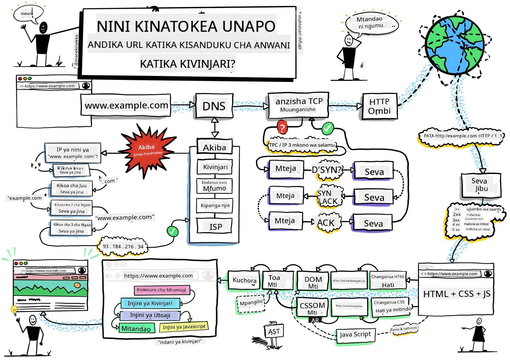
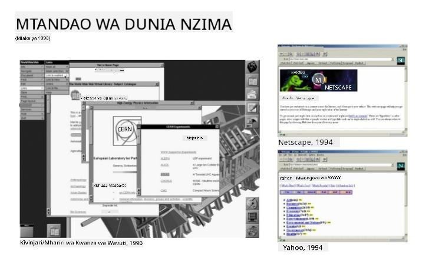
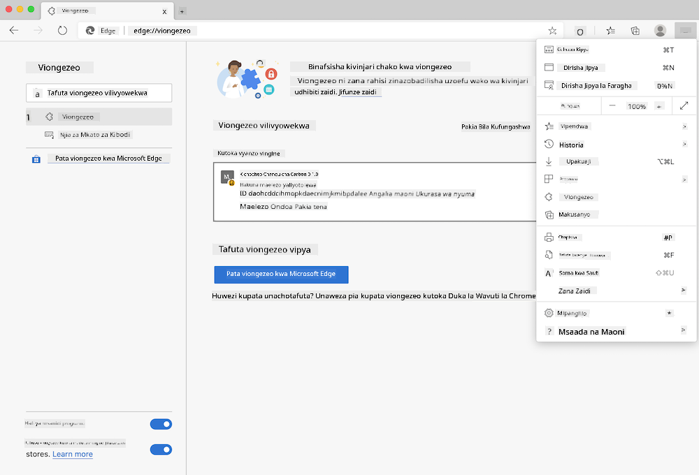
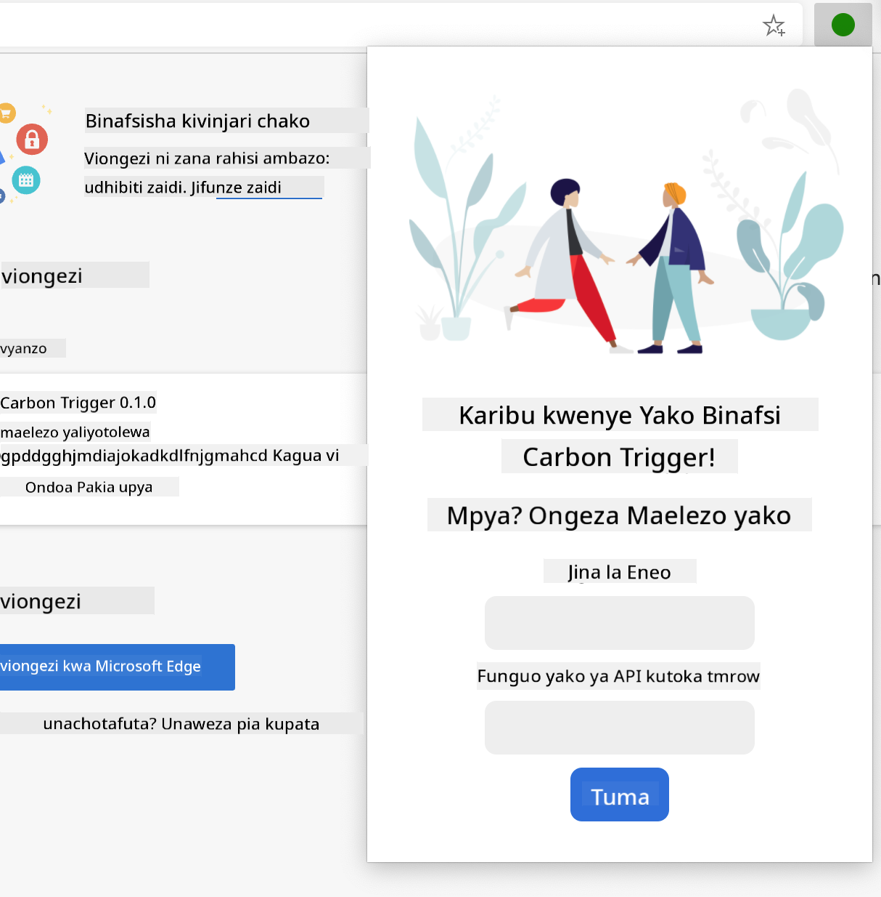

<!--
CO_OP_TRANSLATOR_METADATA:
{
  "original_hash": "0bb55e0b98600afab801eea115228873",
  "translation_date": "2025-08-28T03:39:05+00:00",
  "source_file": "5-browser-extension/1-about-browsers/README.md",
  "language_code": "sw"
}
-->
# Mradi wa Kiendelezi cha Kivinjari Sehemu ya 1: Yote Kuhusu Vivinjari


> Mchoro na [Wassim Chegham](https://dev.to/wassimchegham/ever-wondered-what-happens-when-you-type-in-a-url-in-an-address-bar-in-a-browser-3dob)

## Maswali ya Awali ya Somo

[Maswali ya awali ya somo](https://ff-quizzes.netlify.app/web/quiz/23)

### Utangulizi

Viendelezi vya kivinjari vinaongeza utendaji wa ziada kwenye kivinjari. Lakini kabla ya kujenga kimoja, unapaswa kujifunza kidogo kuhusu jinsi vivinjari vinavyofanya kazi.

### Kuhusu Kivinjari

Katika mfululizo huu wa masomo, utajifunza jinsi ya kujenga kiendelezi cha kivinjari ambacho kitafanya kazi kwenye vivinjari vya Chrome, Firefox, na Edge. Katika sehemu hii, utagundua jinsi vivinjari vinavyofanya kazi na kuunda vipengele vya kiendelezi cha kivinjari.

Lakini kivinjari ni nini hasa? Ni programu ya kompyuta inayomruhusu mtumiaji kufikia maudhui kutoka kwa seva na kuyaonyesha kwenye kurasa za wavuti.

✅ Historia kidogo: kivinjari cha kwanza kilikuwa kinaitwa 'WorldWideWeb' na kilitengenezwa na Sir Timothy Berners-Lee mwaka 1990.


> Baadhi ya vivinjari vya awali, kupitia [Karen McGrane](https://www.slideshare.net/KMcGrane/week-4-ixd-history-personal-computing)

Wakati mtumiaji anapounganishwa kwenye mtandao kwa kutumia anwani ya URL (Uniform Resource Locator), kawaida kupitia Hypertext Transfer Protocol kwa anwani ya `http` au `https`, kivinjari huwasiliana na seva ya wavuti na kuchukua ukurasa wa wavuti.

Kwa wakati huu, injini ya uonyeshaji ya kivinjari huonyesha ukurasa huo kwenye kifaa cha mtumiaji, ambacho kinaweza kuwa simu ya mkononi, kompyuta ya mezani, au kompyuta ndogo.

Vivinjari pia vina uwezo wa kuhifadhi maudhui ili isiwe lazima ipatikane kutoka kwa seva kila wakati. Vinaweza kurekodi historia ya shughuli za kuvinjari za mtumiaji, kuhifadhi 'cookies', ambazo ni vipande vidogo vya data vinavyohifadhi taarifa zinazotumika kuhifadhi shughuli za mtumiaji, na zaidi.

Jambo muhimu sana la kukumbuka kuhusu vivinjari ni kwamba havifanani! Kila kivinjari kina nguvu na udhaifu wake, na mtaalamu wa maendeleo ya wavuti anahitaji kuelewa jinsi ya kufanya kurasa za wavuti zifanye kazi vizuri kwenye vivinjari tofauti. Hii inajumuisha kushughulikia maonyesho madogo kama vile ya simu ya mkononi, pamoja na mtumiaji ambaye yuko nje ya mtandao.

Tovuti muhimu sana ambayo unapaswa kuiweka alama kwenye kivinjari unachopendelea kutumia ni [caniuse.com](https://www.caniuse.com). Unapojenga kurasa za wavuti, ni muhimu kutumia orodha za teknolojia zinazoungwa mkono za caniuse ili uweze kuwasaidia watumiaji wako vyema.

✅ Unawezaje kujua vivinjari gani vinavyopendwa zaidi na watumiaji wa tovuti yako? Angalia takwimu zako - unaweza kusakinisha vifurushi mbalimbali vya takwimu kama sehemu ya mchakato wako wa maendeleo ya wavuti, na vitakuambia vivinjari gani vinavyotumiwa zaidi na vivinjari maarufu.

## Viendelezi vya Kivinjari

Kwa nini ungependa kujenga kiendelezi cha kivinjari? Ni kitu cha manufaa cha kuambatisha kwenye kivinjari chako unapohitaji kufikia haraka kazi unazofanya mara kwa mara. Kwa mfano, ikiwa unajikuta ukihitaji kuangalia rangi kwenye kurasa mbalimbali za wavuti unazoshirikiana nazo, unaweza kusakinisha kiendelezi cha kivinjari cha kuchagua rangi. Ikiwa unapata shida kukumbuka nywila, unaweza kutumia kiendelezi cha kivinjari cha usimamizi wa nywila.

Viendelezi vya kivinjari ni vya kufurahisha kuendeleza pia. Kwa kawaida vinashughulikia idadi ndogo ya kazi ambazo hufanya vizuri.

✅ Ni viendelezi gani vya kivinjari unavyovipenda? Ni kazi gani vinazofanya?

### Kusakinisha Viendelezi

Kabla ya kuanza kujenga, angalia mchakato wa kujenga na kupeleka kiendelezi cha kivinjari. Ingawa kila kivinjari kinatofautiana kidogo katika jinsi kinavyosimamia kazi hii, mchakato ni sawa kwenye Chrome na Firefox kama mfano huu kwenye Edge:



> Kumbuka: Hakikisha kuwasha hali ya msanidi programu na kuruhusu viendelezi kutoka maduka mengine.

Kwa ufupi, mchakato utakuwa:

- jenga kiendelezi chako kwa kutumia `npm run build`  
- tembelea kivinjari kwenye sehemu ya viendelezi kwa kutumia kitufe cha "Settings and more" (ikoni ya `...`) kwenye kona ya juu kulia  
- ikiwa ni usakinishaji mpya, chagua `load unpacked` kupakia kiendelezi kipya kutoka kwenye folda yake ya kujenga (katika kesi yetu ni `/dist`)  
- au, bonyeza `reload` ikiwa unapakua tena kiendelezi kilichosakinishwa tayari  

✅ Maelekezo haya yanahusu viendelezi unavyojijengea mwenyewe; ili kusakinisha viendelezi ambavyo vimeachiliwa kwenye duka la viendelezi vya kivinjari linalohusiana na kila kivinjari, unapaswa kutembelea [maduka hayo](https://microsoftedge.microsoft.com/addons/Microsoft-Edge-Extensions-Home) na kusakinisha kiendelezi unachopendelea.

### Anza

Unakwenda kujenga kiendelezi cha kivinjari kinachoonyesha alama ya kaboni ya eneo lako, ikionyesha matumizi ya nishati ya eneo lako na chanzo cha nishati hiyo. Kiendelezi kitakuwa na fomu inayokusanya funguo ya API ili uweze kufikia API ya CO2 Signal.

**Unahitaji:**

- [funguo ya API](https://www.co2signal.com/); weka barua pepe yako kwenye kisanduku kwenye ukurasa huu na moja itatumwa kwako  
- [msimbo wa eneo lako](http://api.electricitymap.org/v3/zones) unaolingana na [Ramani ya Umeme](https://www.electricitymap.org/map) (katika Boston, kwa mfano, ninatumia 'US-NEISO').  
- [msimbo wa kuanzia](../../../../5-browser-extension/start). Pakua folda ya `start`; utakuwa unakamilisha msimbo katika folda hii.  
- [NPM](https://www.npmjs.com) - NPM ni chombo cha usimamizi wa vifurushi; kisakinishe ndani na vifurushi vilivyoorodheshwa kwenye faili yako ya `package.json` vitasakinishwa kwa matumizi na mali zako za wavuti  

✅ Jifunze zaidi kuhusu usimamizi wa vifurushi katika [moduli bora ya kujifunza](https://docs.microsoft.com/learn/modules/create-nodejs-project-dependencies/?WT.mc_id=academic-77807-sagibbon)

Chukua dakika moja kuangalia msimbo wa msingi:

dist  
    -|manifest.json (mipangilio ya chaguo-msingi hapa)  
    -|index.html (alama ya HTML ya mbele hapa)  
    -|background.js (JS ya nyuma hapa)  
    -|main.js (JS iliyojengwa)  
src  
    -|index.js (msimbo wako wa JS unakwenda hapa)  

✅ Mara tu unapokuwa na funguo yako ya API na msimbo wa eneo tayari, hifadhi hizo mahali fulani kwenye noti kwa matumizi ya baadaye.

### Jenga HTML kwa Kiendelezi

Kiendelezi hiki kina maonyesho mawili. Moja ya kukusanya funguo ya API na msimbo wa eneo:



Na ya pili kuonyesha matumizi ya kaboni ya eneo:


Tuanzie kwa kujenga HTML ya fomu na kuipamba kwa CSS.

Katika folda ya `/dist`, utajenga fomu na eneo la matokeo. Katika faili ya `index.html`, jaza eneo la fomu lililowekwa:

```HTML
<form class="form-data" autocomplete="on">
	<div>
		<h2>New? Add your Information</h2>
	</div>
	<div>
		<label for="region">Region Name</label>
		<input type="text" id="region" required class="region-name" />
	</div>
	<div>
		<label for="api">Your API Key from tmrow</label>
		<input type="text" id="api" required class="api-key" />
	</div>
	<button class="search-btn">Submit</button>
</form>	
```  
Hii ni fomu ambapo taarifa zako zilizohifadhiwa zitaingizwa na kuhifadhiwa kwenye hifadhi ya ndani.

Kisha, tengeneza eneo la matokeo; chini ya tagi ya mwisho ya fomu, ongeza divs kadhaa:

```HTML
<div class="result">
	<div class="loading">loading...</div>
	<div class="errors"></div>
	<div class="data"></div>
	<div class="result-container">
		<p><strong>Region: </strong><span class="my-region"></span></p>
		<p><strong>Carbon Usage: </strong><span class="carbon-usage"></span></p>
		<p><strong>Fossil Fuel Percentage: </strong><span class="fossil-fuel"></span></p>
	</div>
	<button class="clear-btn">Change region</button>
</div>
```  
Kwa wakati huu, unaweza kujaribu kujenga. Hakikisha kusakinisha utegemezi wa vifurushi vya kiendelezi hiki:

```
npm install
```  

Amri hii itatumia npm, Meneja wa Vifurushi vya Node, kusakinisha webpack kwa mchakato wa kujenga kiendelezi chako. Webpack ni kifurushi kinachosimamia kuunganisha msimbo. Unaweza kuona matokeo ya mchakato huu kwa kuangalia `/dist/main.js` - utaona msimbo umeunganishwa.

Kwa sasa, kiendelezi kinapaswa kujengwa na, ikiwa utakipeleka kwenye Edge kama kiendelezi, utaona fomu ikionyeshwa vizuri.

Hongera, umechukua hatua za kwanza kuelekea kujenga kiendelezi cha kivinjari. Katika masomo yanayofuata, utakiimarisha na kukifanya kiwe na manufaa zaidi.

---

## 🚀 Changamoto

Angalia duka la viendelezi vya kivinjari na usakinishe kimoja kwenye kivinjari chako. Unaweza kuchunguza faili zake kwa njia za kuvutia. Unagundua nini?

## Maswali ya Baada ya Somo

[Maswali ya baada ya somo](https://ff-quizzes.netlify.app/web/quiz/24)

## Mapitio na Kujisomea

Katika somo hili ulijifunza kidogo kuhusu historia ya kivinjari cha wavuti; tumia fursa hii kujifunza kuhusu jinsi wavumbuzi wa Mtandao Walimwengu walivyotazamia matumizi yake kwa kusoma zaidi kuhusu historia yake. Baadhi ya tovuti muhimu ni:

[Historia ya Vivinjari vya Wavuti](https://www.mozilla.org/firefox/browsers/browser-history/)

[Historia ya Mtandao](https://webfoundation.org/about/vision/history-of-the-web/)

[Mazungumzo na Tim Berners-Lee](https://www.theguardian.com/technology/2019/mar/12/tim-berners-lee-on-30-years-of-the-web-if-we-dream-a-little-we-can-get-the-web-we-want)

## Kazi  

[Badilisha muonekano wa kiendelezi chako](assignment.md)

---

**Kanusho**:  
Hati hii imetafsiriwa kwa kutumia huduma ya tafsiri ya AI [Co-op Translator](https://github.com/Azure/co-op-translator). Ingawa tunajitahidi kwa usahihi, tafadhali fahamu kuwa tafsiri za kiotomatiki zinaweza kuwa na makosa au kutokuwa sahihi. Hati ya asili katika lugha yake ya awali inapaswa kuzingatiwa kama chanzo cha mamlaka. Kwa taarifa muhimu, inashauriwa kutumia tafsiri ya kitaalamu ya binadamu. Hatutawajibika kwa maelewano mabaya au tafsiri zisizo sahihi zinazotokana na matumizi ya tafsiri hii.