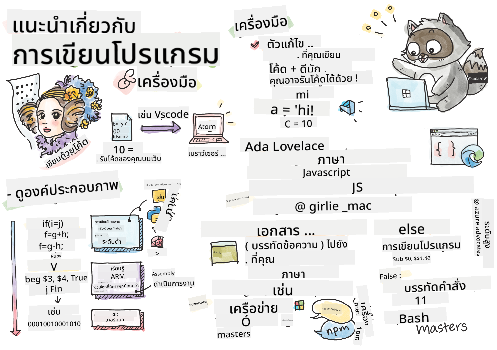

<!--
CO_OP_TRANSLATOR_METADATA:
{
  "original_hash": "c63675cfaf1d223b37bb9fecbfe7c252",
  "translation_date": "2025-08-26T22:22:37+00:00",
  "source_file": "1-getting-started-lessons/1-intro-to-programming-languages/README.md",
  "language_code": "th"
}
-->
# บทนำสู่ภาษาโปรแกรมและเครื่องมือที่จำเป็น

บทเรียนนี้ครอบคลุมพื้นฐานของภาษาโปรแกรม หัวข้อที่กล่าวถึงในที่นี้สามารถนำไปใช้กับภาษาโปรแกรมสมัยใหม่ส่วนใหญ่ได้ ในส่วน "เครื่องมือที่จำเป็น" คุณจะได้เรียนรู้เกี่ยวกับซอฟต์แวร์ที่มีประโยชน์สำหรับนักพัฒนา


> ภาพสเก็ตโน้ตโดย [Tomomi Imura](https://twitter.com/girlie_mac)

## แบบทดสอบก่อนเรียน
[แบบทดสอบก่อนเรียน](https://forms.office.com/r/dru4TE0U9n?origin=lprLink)

## บทนำ

ในบทเรียนนี้ เราจะพูดถึง:

- การเขียนโปรแกรมคืออะไร?
- ประเภทของภาษาโปรแกรม
- องค์ประกอบพื้นฐานของโปรแกรม
- ซอฟต์แวร์และเครื่องมือที่มีประโยชน์สำหรับนักพัฒนามืออาชีพ

> คุณสามารถเรียนบทเรียนนี้ได้ที่ [Microsoft Learn](https://docs.microsoft.com/learn/modules/web-development-101/introduction-programming/?WT.mc_id=academic-77807-sagibbon)!

## การเขียนโปรแกรมคืออะไร?

การเขียนโปรแกรม (หรือที่เรียกว่าการเขียนโค้ด) คือกระบวนการเขียนคำสั่งสำหรับอุปกรณ์ เช่น คอมพิวเตอร์หรืออุปกรณ์มือถือ เราเขียนคำสั่งเหล่านี้ด้วยภาษาโปรแกรม ซึ่งจะถูกแปลความหมายโดยอุปกรณ์ ชุดคำสั่งเหล่านี้อาจถูกเรียกด้วยชื่อที่แตกต่างกัน เช่น *โปรแกรม*, *โปรแกรมคอมพิวเตอร์*, *แอปพลิเคชัน (แอป)* และ *ไฟล์ปฏิบัติการ (executable)*

*โปรแกรม* สามารถเป็นอะไรก็ได้ที่เขียนด้วยโค้ด เช่น เว็บไซต์ เกม และแอปมือถือ แม้ว่าจะสามารถสร้างโปรแกรมได้โดยไม่ต้องเขียนโค้ด แต่ตรรกะพื้นฐานที่อุปกรณ์แปลความหมายนั้นมักจะเขียนด้วยโค้ด โปรแกรมที่ *กำลังทำงาน* หรือ *กำลังประมวลผล* โค้ดคือการดำเนินการตามคำสั่ง อุปกรณ์ที่คุณกำลังอ่านบทเรียนนี้อยู่ก็กำลังรันโปรแกรมเพื่อแสดงผลบนหน้าจอของคุณ

✅ ลองค้นคว้าดูว่าใครที่ถือว่าเป็น "นักเขียนโปรแกรมคอมพิวเตอร์คนแรกของโลก"?

## ภาษาโปรแกรม

ภาษาโปรแกรมช่วยให้นักพัฒนาสามารถเขียนคำสั่งสำหรับอุปกรณ์ได้ อุปกรณ์สามารถเข้าใจได้เพียงไบนารี (1 และ 0) และสำหรับนักพัฒนาส่วนใหญ่ นั่นไม่ใช่วิธีที่มีประสิทธิภาพในการสื่อสาร ภาษาโปรแกรมจึงเป็นสื่อกลางในการสื่อสารระหว่างมนุษย์และคอมพิวเตอร์

ภาษาโปรแกรมมีรูปแบบที่แตกต่างกันและอาจมีวัตถุประสงค์ที่แตกต่างกัน ตัวอย่างเช่น JavaScript ใช้สำหรับแอปพลิเคชันเว็บเป็นหลัก ในขณะที่ Bash ใช้สำหรับระบบปฏิบัติการเป็นหลัก

*ภาษาระดับต่ำ* มักต้องการขั้นตอนน้อยกว่า *ภาษาระดับสูง* ในการแปลคำสั่งสำหรับอุปกรณ์ อย่างไรก็ตาม สิ่งที่ทำให้ภาษาระดับสูงเป็นที่นิยมคือความอ่านง่ายและการสนับสนุนที่ดี JavaScript ถือเป็นภาษาระดับสูง

โค้ดต่อไปนี้แสดงความแตกต่างระหว่างภาษาระดับสูง (JavaScript) และภาษาระดับต่ำ (ARM assembly code)

```javascript
let number = 10
let n1 = 0, n2 = 1, nextTerm;

for (let i = 1; i <= number; i++) {
    console.log(n1);
    nextTerm = n1 + n2;
    n1 = n2;
    n2 = nextTerm;
}
```

```c
 area ascen,code,readonly
 entry
 code32
 adr r0,thumb+1
 bx r0
 code16
thumb
 mov r0,#00
 sub r0,r0,#01
 mov r1,#01
 mov r4,#10
 ldr r2,=0x40000000
back add r0,r1
 str r0,[r2]
 add r2,#04
 mov r3,r0
 mov r0,r1
 mov r1,r3
 sub r4,#01
 cmp r4,#00
 bne back
 end
```

เชื่อหรือไม่ว่า *ทั้งสองโค้ดทำสิ่งเดียวกัน*: พิมพ์ลำดับฟีโบนักชีจนถึง 10

✅ ลำดับฟีโบนักชี [ถูกกำหนด](https://en.wikipedia.org/wiki/Fibonacci_number) เป็นชุดของตัวเลขที่แต่ละตัวเลขเป็นผลรวมของสองตัวเลขก่อนหน้า โดยเริ่มจาก 0 และ 1 ตัวเลข 10 ตัวแรกในลำดับฟีโบนักชีคือ 0, 1, 1, 2, 3, 5, 8, 13, 21 และ 34

## องค์ประกอบของโปรแกรม

คำสั่งเดียวในโปรแกรมเรียกว่า *statement* และมักจะมีตัวอักษรหรือการเว้นบรรทัดที่ระบุว่าคำสั่งสิ้นสุดหรือ *terminate* อย่างไร วิธีการสิ้นสุดของโปรแกรมจะแตกต่างกันไปในแต่ละภาษา

คำสั่งในโปรแกรมอาจพึ่งพาข้อมูลที่ผู้ใช้หรือแหล่งอื่นให้มาเพื่อดำเนินการตามคำสั่ง ข้อมูลสามารถเปลี่ยนแปลงพฤติกรรมของโปรแกรมได้ ดังนั้นภาษาโปรแกรมจึงมาพร้อมกับวิธีการจัดเก็บข้อมูลชั่วคราวเพื่อใช้งานในภายหลัง สิ่งเหล่านี้เรียกว่า *ตัวแปร (variables)* ตัวแปรเป็นคำสั่งที่บอกให้อุปกรณ์บันทึกข้อมูลในหน่วยความจำ ตัวแปรในโปรแกรมคล้ายกับตัวแปรในพีชคณิต ซึ่งมีชื่อเฉพาะและค่าของมันอาจเปลี่ยนแปลงได้ตามเวลา

มีโอกาสที่คำสั่งบางคำสั่งจะไม่ถูกดำเนินการโดยอุปกรณ์ ซึ่งมักเกิดจากการออกแบบโดยนักพัฒนาหรือโดยบังเอิญเมื่อเกิดข้อผิดพลาดที่ไม่คาดคิด การควบคุมประเภทนี้ทำให้แอปพลิเคชันมีความแข็งแกร่งและดูแลรักษาได้ง่ายขึ้น โดยทั่วไป การเปลี่ยนแปลงการควบคุมเหล่านี้จะเกิดขึ้นเมื่อเงื่อนไขบางอย่างเป็นจริง คำสั่งทั่วไปที่ใช้ในโปรแกรมสมัยใหม่เพื่อควบคุมการทำงานของโปรแกรมคือคำสั่ง `if..else`

✅ คุณจะได้เรียนรู้เพิ่มเติมเกี่ยวกับคำสั่งประเภทนี้ในบทเรียนถัดไป

## เครื่องมือที่จำเป็น

[](https://youtube.com/watch?v=69WJeXGBdxg "Tools of the Trade")

> 🎥 คลิกที่ภาพด้านบนเพื่อดูวิดีโอเกี่ยวกับเครื่องมือ

ในส่วนนี้ คุณจะได้เรียนรู้เกี่ยวกับซอฟต์แวร์บางตัวที่อาจมีประโยชน์มากเมื่อคุณเริ่มต้นเส้นทางการพัฒนามืออาชีพ

**สภาพแวดล้อมการพัฒนา (Development Environment)** คือชุดของเครื่องมือและคุณสมบัติเฉพาะที่นักพัฒนาใช้บ่อยเมื่อเขียนซอฟต์แวร์ เครื่องมือเหล่านี้บางส่วนได้รับการปรับแต่งให้เหมาะกับความต้องการเฉพาะของนักพัฒนา และอาจเปลี่ยนแปลงได้เมื่อความสำคัญของงานหรือโครงการส่วนตัวเปลี่ยนไป หรือเมื่อใช้ภาษาโปรแกรมที่แตกต่างกัน สภาพแวดล้อมการพัฒนามีความเฉพาะตัวเหมือนกับนักพัฒนาที่ใช้งานมัน

### โปรแกรมแก้ไขโค้ด (Editors)

หนึ่งในเครื่องมือที่สำคัญที่สุดสำหรับการพัฒนาซอฟต์แวร์คือโปรแกรมแก้ไขโค้ด โปรแกรมแก้ไขโค้ดคือที่ที่คุณเขียนโค้ดและบางครั้งก็เป็นที่ที่คุณรันโค้ด

นักพัฒนาพึ่งพาโปรแกรมแก้ไขโค้ดด้วยเหตุผลเพิ่มเติมดังนี้:

- *การดีบัก (Debugging)* ช่วยค้นหาข้อผิดพลาดและบั๊กโดยการตรวจสอบโค้ดทีละบรรทัด โปรแกรมแก้ไขโค้ดบางตัวมีความสามารถในการดีบัก ซึ่งสามารถปรับแต่งและเพิ่มสำหรับภาษาโปรแกรมเฉพาะได้
- *การไฮไลต์ไวยากรณ์ (Syntax Highlighting)* เพิ่มสีและการจัดรูปแบบข้อความในโค้ด ทำให้อ่านง่ายขึ้น โปรแกรมแก้ไขโค้ดส่วนใหญ่อนุญาตให้ปรับแต่งการไฮไลต์ไวยากรณ์ได้
- *ส่วนขยายและการผสานรวม (Extensions and Integrations)* เป็นเครื่องมือพิเศษสำหรับนักพัฒนา โดยนักพัฒนา เครื่องมือเหล่านี้ไม่ได้ถูกรวมอยู่ในโปรแกรมแก้ไขโค้ดพื้นฐาน ตัวอย่างเช่น นักพัฒนาหลายคนเขียนเอกสารประกอบโค้ดเพื่ออธิบายวิธีการทำงานของโค้ด พวกเขาอาจติดตั้งส่วนขยายตรวจสอบการสะกดคำเพื่อช่วยค้นหาข้อผิดพลาดในเอกสารประกอบ ส่วนขยายส่วนใหญ่ออกแบบมาเพื่อใช้ในโปรแกรมแก้ไขโค้ดเฉพาะ และโปรแกรมแก้ไขโค้ดส่วนใหญ่มาพร้อมกับวิธีการค้นหาส่วนขยายที่มีอยู่
- *การปรับแต่ง (Customization)* ช่วยให้นักพัฒนาสร้างสภาพแวดล้อมการพัฒนาที่ไม่เหมือนใครเพื่อตอบสนองความต้องการของพวกเขา โปรแกรมแก้ไขโค้ดส่วนใหญ่สามารถปรับแต่งได้อย่างมากและอาจอนุญาตให้นักพัฒนาสร้างส่วนขยายที่กำหนดเองได้

#### โปรแกรมแก้ไขโค้ดยอดนิยมและส่วนขยายสำหรับการพัฒนาเว็บ

- [Visual Studio Code](https://code.visualstudio.com/?WT.mc_id=academic-77807-sagibbon)
  - [Code Spell Checker](https://marketplace.visualstudio.com/items?itemName=streetsidesoftware.code-spell-checker)
  - [Live Share](https://marketplace.visualstudio.com/items?itemName=MS-vsliveshare.vsliveshare)
  - [Prettier - Code formatter](https://marketplace.visualstudio.com/items?itemName=esbenp.prettier-vscode)
- [Atom](https://atom.io/)
  - [spell-check](https://atom.io/packages/spell-check)
  - [teletype](https://atom.io/packages/teletype)
  - [atom-beautify](https://atom.io/packages/atom-beautify)
  
- [Sublimetext](https://www.sublimetext.com/)
  - [emmet](https://emmet.io/)
  - [SublimeLinter](http://www.sublimelinter.com/en/stable/)

### เบราว์เซอร์

อีกหนึ่งเครื่องมือสำคัญคือเบราว์เซอร์ นักพัฒนาเว็บพึ่งพาเบราว์เซอร์เพื่อดูว่าโค้ดของพวกเขาทำงานบนเว็บอย่างไร นอกจากนี้ยังใช้เพื่อแสดงองค์ประกอบภาพของหน้าเว็บที่เขียนในโปรแกรมแก้ไขโค้ด เช่น HTML

เบราว์เซอร์หลายตัวมาพร้อมกับ *เครื่องมือสำหรับนักพัฒนา (DevTools)* ซึ่งมีชุดคุณสมบัติและข้อมูลที่เป็นประโยชน์เพื่อช่วยให้นักพัฒนารวบรวมและจับข้อมูลสำคัญเกี่ยวกับแอปพลิเคชันของพวกเขา ตัวอย่างเช่น หากหน้าเว็บมีข้อผิดพลาด บางครั้งการรู้ว่าข้อผิดพลาดเกิดขึ้นเมื่อใดก็เป็นประโยชน์ DevTools ในเบราว์เซอร์สามารถกำหนดค่าให้จับข้อมูลนี้ได้

#### เบราว์เซอร์ยอดนิยมและ DevTools

- [Edge](https://docs.microsoft.com/microsoft-edge/devtools-guide-chromium/?WT.mc_id=academic-77807-sagibbon)
- [Chrome](https://developers.google.com/web/tools/chrome-devtools/)
- [Firefox](https://developer.mozilla.org/docs/Tools)

### เครื่องมือบรรทัดคำสั่ง (Command Line Tools)

นักพัฒนาบางคนชอบมุมมองที่ไม่เน้นกราฟิกสำหรับงานประจำวันของพวกเขาและพึ่งพาบรรทัดคำสั่งเพื่อทำสิ่งนี้ การเขียนโค้ดต้องใช้การพิมพ์จำนวนมาก และนักพัฒนาบางคนชอบที่จะไม่ขัดจังหวะการทำงานบนแป้นพิมพ์ พวกเขาจะใช้คีย์ลัดเพื่อสลับระหว่างหน้าต่างเดสก์ท็อป ทำงานกับไฟล์ต่างๆ และใช้เครื่องมือ งานส่วนใหญ่สามารถทำได้ด้วยเมาส์ แต่ข้อดีอย่างหนึ่งของการใช้บรรทัดคำสั่งคือสามารถทำงานได้มากโดยไม่ต้องสลับระหว่างเมาส์และแป้นพิมพ์ ข้อดีอีกอย่างของบรรทัดคำสั่งคือสามารถกำหนดค่าได้ และคุณสามารถบันทึกการกำหนดค่าที่กำหนดเอง เปลี่ยนแปลงในภายหลัง และนำเข้าไปยังเครื่องพัฒนาอื่นๆ ได้ เนื่องจากสภาพแวดล้อมการพัฒนามีความเฉพาะตัวสำหรับนักพัฒนาแต่ละคน บางคนจะหลีกเลี่ยงการใช้บรรทัดคำสั่ง บางคนจะพึ่งพามันทั้งหมด และบางคนชอบผสมผสานทั้งสองแบบ

### ตัวเลือกบรรทัดคำสั่งยอดนิยม

ตัวเลือกสำหรับบรรทัดคำสั่งจะแตกต่างกันไปตามระบบปฏิบัติการที่คุณใช้

*💻 = มาพร้อมกับระบบปฏิบัติการ*

#### Windows

- [Powershell](https://docs.microsoft.com/powershell/scripting/overview?view=powershell-7/?WT.mc_id=academic-77807-sagibbon) 💻
- [Command Line](https://docs.microsoft.com/windows-server/administration/windows-commands/windows-commands/?WT.mc_id=academic-77807-sagibbon) (หรือที่เรียกว่า CMD) 💻
- [Windows Terminal](https://docs.microsoft.com/windows/terminal/?WT.mc_id=academic-77807-sagibbon)
- [mintty](https://mintty.github.io/)
  
#### MacOS

- [Terminal](https://support.apple.com/guide/terminal/open-or-quit-terminal-apd5265185d-f365-44cb-8b09-71a064a42125/mac) 💻
- [iTerm](https://iterm2.com/)
- [Powershell](https://docs.microsoft.com/powershell/scripting/install/installing-powershell-core-on-macos?view=powershell-7/?WT.mc_id=academic-77807-sagibbon)

#### Linux

- [Bash](https://www.gnu.org/software/bash/manual/html_node/index.html) 💻
- [KDE Konsole](https://docs.kde.org/trunk5/en/konsole/konsole/index.html)
- [Powershell](https://docs.microsoft.com/powershell/scripting/install/installing-powershell-core-on-linux?view=powershell-7/?WT.mc_id=academic-77807-sagibbon)

#### เครื่องมือบรรทัดคำสั่งยอดนิยม

- [Git](https://git-scm.com/) (💻 บนระบบปฏิบัติการส่วนใหญ่)
- [NPM](https://www.npmjs.com/)
- [Yarn](https://classic.yarnpkg.com/en/docs/cli/)

### เอกสารประกอบ

เมื่อนักพัฒนาต้องการเรียนรู้สิ่งใหม่ พวกเขามักจะหันไปหาเอกสารประกอบเพื่อเรียนรู้วิธีการใช้งาน นักพัฒนามักพึ่งพาเอกสารประกอบเพื่อแนะนำวิธีการใช้เครื่องมือและภาษาอย่างถูกต้อง และเพื่อให้เข้าใจลึกซึ้งยิ่งขึ้นว่ามันทำงานอย่างไร

#### เอกสารประกอบยอดนิยมเกี่ยวกับการพัฒนาเว็บ

- [Mozilla Developer Network (MDN)](https://developer.mozilla.org/docs/Web) จาก Mozilla ผู้เผยแพร่เบราว์เซอร์ [Firefox](https://www.mozilla.org/firefox/)
- [Frontend Masters](https://frontendmasters.com/learn/)
- [Web.dev](https://web.dev) จาก Google ผู้เผยแพร่ [Chrome](https://www.google.com/chrome/)
- [เอกสารนักพัฒนาของ Microsoft](https://docs.microsoft.com/microsoft-edge/#microsoft-edge-for-developers) สำหรับ [Microsoft Edge](https://www.microsoft.com/edge)
- [W3 Schools](https://www.w3schools.com/where_to_start.asp)

✅ ลองค้นคว้าดู: ตอนนี้คุณรู้พื้นฐานของสภาพแวดล้อมของนักพัฒนาเว็บแล้ว ลองเปรียบเทียบกับสภาพแวดล้อมของนักออกแบบเว็บดูสิ

---

## 🚀 ความท้าทาย

เปรียบเทียบภาษาโปรแกรมบางภาษา อะไรคือคุณลักษณะเฉพาะของ JavaScript เทียบกับ Java? แล้ว COBOL เทียบกับ Go ล่ะ?

## แบบทดสอบหลังเรียน
[แบบทดสอบหลังเรียน](https://ff-quizzes.netlify.app/web/quiz/2)

## ทบทวนและศึกษาด้วยตนเอง

ศึกษาภาษาโปรแกรมต่างๆ ที่มีให้เลือกสำหรับนักพัฒนา ลองเขียนโค้ดหนึ่งบรรทัดในภาษาหนึ่ง แล้วเขียนใหม่ในอีกสองภาษา คุณได้เรียนรู้อะไรบ้าง?

## การบ้าน

[อ่านเอกสารประกอบ](assignment.md)

---

**ข้อจำกัดความรับผิดชอบ**:  
เอกสารนี้ได้รับการแปลโดยใช้บริการแปลภาษา AI [Co-op Translator](https://github.com/Azure/co-op-translator) แม้ว่าเราจะพยายามให้การแปลมีความถูกต้องมากที่สุด แต่โปรดทราบว่าการแปลโดยอัตโนมัติอาจมีข้อผิดพลาดหรือความไม่ถูกต้อง เอกสารต้นฉบับในภาษาดั้งเดิมควรถือเป็นแหล่งข้อมูลที่เชื่อถือได้ สำหรับข้อมูลที่สำคัญ ขอแนะนำให้ใช้บริการแปลภาษามืออาชีพ เราไม่รับผิดชอบต่อความเข้าใจผิดหรือการตีความผิดที่เกิดจากการใช้การแปลนี้