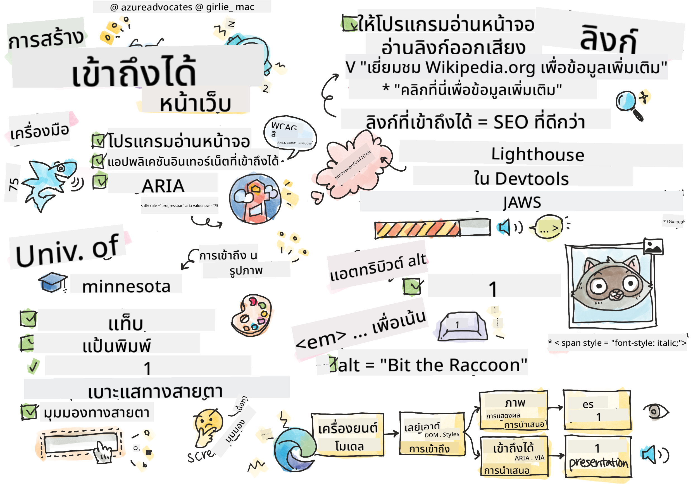

<!--
CO_OP_TRANSLATOR_METADATA:
{
  "original_hash": "e4cd5b1faed4adab5acf720f82798003",
  "translation_date": "2025-08-26T22:18:20+00:00",
  "source_file": "1-getting-started-lessons/3-accessibility/README.md",
  "language_code": "th"
}
-->
# การสร้างเว็บเพจที่เข้าถึงได้


> สเก็ตโน้ตโดย [Tomomi Imura](https://twitter.com/girlie_mac)

## แบบทดสอบก่อนเรียน
[แบบทดสอบก่อนเรียน](https://ashy-river-0debb7803.1.azurestaticapps.net/quiz/5)

> พลังของเว็บอยู่ที่ความเป็นสากล การเข้าถึงโดยทุกคนไม่ว่าจะมีความพิการหรือไม่ถือเป็นสิ่งสำคัญ
>
> \- เซอร์ทิโมธี เบอร์เนิร์ส-ลี ผู้อำนวยการ W3C และผู้คิดค้นเวิลด์ไวด์เว็บ

คำพูดนี้เน้นย้ำถึงความสำคัญของการสร้างเว็บไซต์ที่เข้าถึงได้อย่างชัดเจน แอปพลิเคชันที่ไม่สามารถเข้าถึงได้สำหรับทุกคนถือว่าเป็นการกีดกันโดยนิยาม ในฐานะนักพัฒนาเว็บ เราควรคำนึงถึงการเข้าถึงอยู่เสมอ หากคุณมีจุดมุ่งหมายนี้ตั้งแต่เริ่มต้น คุณจะสามารถสร้างหน้าเว็บที่ทุกคนสามารถเข้าถึงได้ ในบทเรียนนี้ คุณจะได้เรียนรู้เกี่ยวกับเครื่องมือที่ช่วยให้คุณมั่นใจว่าเว็บของคุณเข้าถึงได้ และวิธีการสร้างเว็บโดยคำนึงถึงการเข้าถึง

> คุณสามารถเรียนบทเรียนนี้ได้ที่ [Microsoft Learn](https://docs.microsoft.com/learn/modules/web-development-101/accessibility/?WT.mc_id=academic-77807-sagibbon)!

## เครื่องมือที่ใช้

### โปรแกรมอ่านหน้าจอ

หนึ่งในเครื่องมือที่เป็นที่รู้จักมากที่สุดสำหรับการเข้าถึงคือโปรแกรมอ่านหน้าจอ

[โปรแกรมอ่านหน้าจอ](https://en.wikipedia.org/wiki/Screen_reader) เป็นเครื่องมือที่ใช้กันทั่วไปสำหรับผู้ที่มีความบกพร่องทางการมองเห็น ในขณะที่เราใช้เวลาเพื่อให้เบราว์เซอร์แสดงข้อมูลที่เราต้องการแบ่งปันอย่างถูกต้อง เราก็ต้องมั่นใจว่าโปรแกรมอ่านหน้าจอสามารถทำเช่นเดียวกันได้

ในระดับพื้นฐานที่สุด โปรแกรมอ่านหน้าจอจะอ่านหน้าเว็บจากบนลงล่างด้วยเสียง หากหน้าเว็บของคุณมีแต่ข้อความ โปรแกรมอ่านหน้าจอจะถ่ายทอดข้อมูลในลักษณะเดียวกับเบราว์เซอร์ แน่นอนว่าเว็บเพจมักไม่ได้มีแต่ข้อความเท่านั้น แต่ยังมีลิงก์ กราฟิก สี และองค์ประกอบภาพอื่น ๆ เราต้องใส่ใจเพื่อให้แน่ใจว่าข้อมูลเหล่านี้ถูกอ่านอย่างถูกต้องโดยโปรแกรมอ่านหน้าจอ

นักพัฒนาเว็บทุกคนควรทำความคุ้นเคยกับโปรแกรมอ่านหน้าจอ ดังที่กล่าวไว้ข้างต้น นี่คือเครื่องมือที่ผู้ใช้ของคุณจะใช้ เช่นเดียวกับที่คุณคุ้นเคยกับการทำงานของเบราว์เซอร์ คุณควรเรียนรู้การทำงานของโปรแกรมอ่านหน้าจอ โชคดีที่โปรแกรมอ่านหน้าจอมีอยู่ในระบบปฏิบัติการส่วนใหญ่

เบราว์เซอร์บางตัวมีเครื่องมือและส่วนขยายในตัวที่สามารถอ่านข้อความออกเสียงหรือให้ฟีเจอร์การนำทางพื้นฐาน เช่น [เครื่องมือที่เน้นการเข้าถึงในเบราว์เซอร์ Edge](https://support.microsoft.com/help/4000734/microsoft-edge-accessibility-features) เครื่องมือเหล่านี้ก็สำคัญเช่นกัน แต่ทำงานแตกต่างจากโปรแกรมอ่านหน้าจอ และไม่ควรใช้แทนเครื่องมือทดสอบโปรแกรมอ่านหน้าจอ

✅ ลองใช้โปรแกรมอ่านหน้าจอและเครื่องมืออ่านข้อความในเบราว์เซอร์ บน Windows [Narrator](https://support.microsoft.com/windows/complete-guide-to-narrator-e4397a0d-ef4f-b386-d8ae-c172f109bdb1/?WT.mc_id=academic-77807-sagibbon) มีมาให้โดยค่าเริ่มต้น และ [JAWS](https://webaim.org/articles/jaws/) และ [NVDA](https://www.nvaccess.org/about-nvda/) สามารถติดตั้งเพิ่มเติมได้ บน macOS และ iOS [VoiceOver](https://support.apple.com/guide/voiceover/welcome/10) มีมาให้โดยค่าเริ่มต้น

### การซูม

อีกหนึ่งเครื่องมือที่ผู้มีความบกพร่องทางการมองเห็นใช้กันทั่วไปคือการซูม การซูมแบบพื้นฐานที่สุดคือการซูมแบบคงที่ ซึ่งควบคุมผ่าน `Control + เครื่องหมายบวก (+)` หรือโดยการลดความละเอียดหน้าจอ การซูมประเภทนี้ทำให้ทั้งหน้าเว็บปรับขนาด ดังนั้นการใช้ [การออกแบบที่ตอบสนอง](https://developer.mozilla.org/docs/Learn/CSS/CSS_layout/Responsive_Design) จึงสำคัญเพื่อให้ประสบการณ์ผู้ใช้ดีขึ้นเมื่อระดับการซูมเพิ่มขึ้น

การซูมอีกประเภทหนึ่งใช้ซอฟต์แวร์เฉพาะทางเพื่อขยายพื้นที่หนึ่งของหน้าจอและเลื่อนดู เหมือนกับการใช้แว่นขยายจริง บน Windows [Magnifier](https://support.microsoft.com/windows/use-magnifier-to-make-things-on-the-screen-easier-to-see-414948ba-8b1c-d3bd-8615-0e5e32204198) มีมาให้ในตัว และ [ZoomText](https://www.freedomscientific.com/training/zoomtext/getting-started/) เป็นซอฟต์แวร์ขยายภาพจากผู้ผลิตรายอื่นที่มีฟีเจอร์มากกว่าและฐานผู้ใช้ที่ใหญ่กว่า ทั้ง macOS และ iOS มีซอฟต์แวร์ขยายภาพในตัวที่เรียกว่า [Zoom](https://www.apple.com/accessibility/mac/vision/)

### ตัวตรวจสอบความคมชัด

สีบนเว็บไซต์ต้องถูกเลือกอย่างระมัดระวังเพื่อตอบสนองความต้องการของผู้ที่มีปัญหาการมองเห็นสีหรือผู้ที่มีปัญหาในการมองเห็นสีที่มีความคมชัดต่ำ

✅ ทดสอบเว็บไซต์ที่คุณชอบใช้สำหรับการใช้สีด้วยส่วนขยายเบราว์เซอร์ เช่น [ตัวตรวจสอบสีของ WCAG](https://microsoftedge.microsoft.com/addons/detail/wcag-color-contrast-check/idahaggnlnekelhgplklhfpchbfdmkjp?hl=en-US&WT.mc_id=academic-77807-sagibbon) คุณเรียนรู้อะไร?

### Lighthouse

ในพื้นที่เครื่องมือสำหรับนักพัฒนาของเบราว์เซอร์ คุณจะพบเครื่องมือ Lighthouse เครื่องมือนี้สำคัญสำหรับการดูภาพรวมแรกเกี่ยวกับการเข้าถึง (รวมถึงการวิเคราะห์อื่น ๆ) ของเว็บไซต์ แม้ว่าจะไม่ควรพึ่งพา Lighthouse เพียงอย่างเดียว แต่คะแนน 100% ก็มีประโยชน์เป็นพื้นฐาน

✅ ค้นหา Lighthouse ในแผงเครื่องมือสำหรับนักพัฒนาของเบราว์เซอร์และวิเคราะห์เว็บไซต์ใดก็ได้ คุณค้นพบอะไร?

## การออกแบบเพื่อการเข้าถึง

การเข้าถึงเป็นหัวข้อที่ค่อนข้างใหญ่ เพื่อช่วยคุณ มีแหล่งข้อมูลมากมายที่พร้อมใช้งาน

- [Accessible U - University of Minnesota](https://accessibility.umn.edu/your-role/web-developers)

แม้ว่าเราจะไม่สามารถครอบคลุมทุกแง่มุมของการสร้างเว็บไซต์ที่เข้าถึงได้ แต่ด้านล่างนี้คือหลักการสำคัญที่คุณควรนำไปใช้ การออกแบบหน้าเว็บที่เข้าถึงได้ตั้งแต่เริ่มต้น **ง่ายกว่า** การกลับไปแก้ไขหน้าเว็บที่มีอยู่เพื่อให้เข้าถึงได้

## หลักการแสดงผลที่ดี

### พาเลตสีที่ปลอดภัย

ผู้คนมองโลกในรูปแบบที่แตกต่างกัน รวมถึงสีด้วย เมื่อเลือกชุดสีสำหรับเว็บไซต์ของคุณ คุณควรมั่นใจว่ามันเข้าถึงได้สำหรับทุกคน เครื่องมือที่ยอดเยี่ยมสำหรับการสร้างพาเลตสีคือ [Color Safe](http://colorsafe.co/)

✅ ระบุเว็บไซต์ที่มีปัญหาอย่างมากในการใช้สี ทำไม?

### ใช้ HTML ที่ถูกต้อง

ด้วย CSS และ JavaScript คุณสามารถทำให้องค์ประกอบใด ๆ ดูเหมือนเป็นตัวควบคุมประเภทใดก็ได้ `<span>` สามารถใช้สร้าง `<button>` และ `<b>` สามารถกลายเป็นไฮเปอร์ลิงก์ได้ แม้ว่าสิ่งนี้อาจถูกมองว่าง่ายต่อการจัดสไตล์ แต่ก็ไม่ได้ให้ข้อมูลใด ๆ กับโปรแกรมอ่านหน้าจอ ใช้ HTML ที่เหมาะสมเมื่อสร้างตัวควบคุมบนหน้าเว็บ หากคุณต้องการไฮเปอร์ลิงก์ ให้ใช้ `<a>` การใช้ HTML ที่ถูกต้องสำหรับตัวควบคุมที่ถูกต้องเรียกว่าการใช้ Semantic HTML

✅ ไปที่เว็บไซต์ใดก็ได้และดูว่าผู้ออกแบบและนักพัฒนาใช้ HTML อย่างถูกต้องหรือไม่ คุณสามารถหาปุ่มที่ควรเป็นลิงก์ได้หรือไม่? เคล็ดลับ: คลิกขวาและเลือก 'View Page Source' ในเบราว์เซอร์ของคุณเพื่อดูโค้ดพื้นฐาน

### สร้างลำดับชั้นหัวข้อที่อธิบายได้

ผู้ใช้โปรแกรมอ่านหน้าจอ [พึ่งพาหัวข้ออย่างมาก](https://webaim.org/projects/screenreadersurvey8/#finding) เพื่อค้นหาข้อมูลและนำทางผ่านหน้าเว็บ การเขียนเนื้อหาหัวข้อที่อธิบายได้และใช้แท็กหัวข้อเชิงความหมายเป็นสิ่งสำคัญสำหรับการสร้างเว็บไซต์ที่นำทางได้ง่ายสำหรับผู้ใช้โปรแกรมอ่านหน้าจอ

### ใช้เบาะแสภาพที่ดี

CSS ให้การควบคุมอย่างสมบูรณ์เกี่ยวกับรูปลักษณ์ขององค์ประกอบใด ๆ บนหน้าเว็บ คุณสามารถสร้างกล่องข้อความโดยไม่มีเส้นขอบหรือไฮเปอร์ลิงก์โดยไม่มีเส้นใต้ น่าเสียดายที่การลบเบาะแสเหล่านี้อาจทำให้ผู้ที่พึ่งพาเบาะแสเหล่านี้ยากขึ้นในการจดจำประเภทของตัวควบคุม

## ความสำคัญของข้อความลิงก์

ไฮเปอร์ลิงก์เป็นหัวใจสำคัญของการนำทางเว็บ ดังนั้นการมั่นใจว่าโปรแกรมอ่านหน้าจอสามารถอ่านลิงก์ได้อย่างถูกต้องช่วยให้ผู้ใช้ทุกคนสามารถนำทางเว็บไซต์ของคุณได้

### โปรแกรมอ่านหน้าจอและลิงก์

ตามที่คุณคาดหวัง โปรแกรมอ่านหน้าจอจะอ่านข้อความลิงก์ในลักษณะเดียวกับที่อ่านข้อความอื่น ๆ บนหน้าเว็บ ด้วยเหตุนี้ ข้อความที่แสดงด้านล่างอาจดูเหมือนยอมรับได้อย่างสมบูรณ์

> เพนกวินตัวเล็ก บางครั้งเรียกว่าเพนกวินนางฟ้า เป็นเพนกวินที่เล็กที่สุดในโลก [คลิกที่นี่](https://en.wikipedia.org/wiki/Little_penguin) เพื่อดูข้อมูลเพิ่มเติม

> เพนกวินตัวเล็ก บางครั้งเรียกว่าเพนกวินนางฟ้า เป็นเพนกวินที่เล็กที่สุดในโลก เยี่ยมชม https://en.wikipedia.org/wiki/Little_penguin เพื่อดูข้อมูลเพิ่มเติม

> **NOTE** ดังที่คุณกำลังจะอ่าน คุณควร **ไม่เคย** สร้างลิงก์ที่ดูเหมือนตัวอย่างด้านบน

โปรดจำไว้ว่า โปรแกรมอ่านหน้าจอเป็นอินเทอร์เฟซที่แตกต่างจากเบราว์เซอร์และมีชุดฟีเจอร์ที่แตกต่างกัน

### ปัญหาของการใช้ URL

โปรแกรมอ่านหน้าจอจะอ่านข้อความ หาก URL ปรากฏในข้อความ โปรแกรมอ่านหน้าจอจะอ่าน URL โดยทั่วไป URL ไม่ได้ให้ข้อมูลที่มีความหมาย และอาจฟังดูน่ารำคาญ คุณอาจเคยประสบกับสิ่งนี้หากโทรศัพท์ของคุณเคยอ่านข้อความที่มี URL ออกเสียง

### ปัญหาของ "คลิกที่นี่"

โปรแกรมอ่านหน้าจอยังมีความสามารถในการอ่านเฉพาะไฮเปอร์ลิงก์บนหน้าเว็บ เช่นเดียวกับที่ผู้ที่มองเห็นจะสแกนหน้าเว็บเพื่อหาลิงก์ หากข้อความลิงก์เป็น "คลิกที่นี่" ทั้งหมด ผู้ใช้จะได้ยินเพียง "คลิกที่นี่ คลิกที่นี่ คลิกที่นี่ คลิกที่นี่ คลิกที่นี่ ..." ลิงก์ทั้งหมดจะไม่สามารถแยกแยะได้

### ข้อความลิงก์ที่ดี

ข้อความลิงก์ที่ดีจะอธิบายสั้น ๆ ว่ามีอะไรอยู่ในลิงก์ ในตัวอย่างด้านบนที่พูดถึงเพนกวินตัวเล็ก ลิงก์นั้นนำไปยังหน้าวิกิพีเดียเกี่ยวกับสายพันธุ์ คำว่า *เพนกวินตัวเล็ก* จะเป็นข้อความลิงก์ที่สมบูรณ์แบบเพราะมันทำให้ชัดเจนว่าผู้ใช้จะได้เรียนรู้อะไรหากคลิกลิงก์ - เพนกวินตัวเล็ก

> [เพนกวินตัวเล็ก](https://en.wikipedia.org/wiki/Little_penguin) บางครั้งเรียกว่าเพนกวินนางฟ้า เป็นเพนกวินที่เล็กที่สุดในโลก

✅ ท่องเว็บสักสองสามนาทีเพื่อค้นหาหน้าที่ใช้กลยุทธ์การลิงก์ที่ไม่ชัดเจน เปรียบเทียบกับเว็บไซต์ที่ลิงก์ได้ดีกว่า คุณเรียนรู้อะไร?

#### หมายเหตุเกี่ยวกับเครื่องมือค้นหา

เป็นโบนัสเพิ่มเติมสำหรับการมั่นใจว่าเว็บไซต์ของคุณเข้าถึงได้สำหรับทุกคน คุณจะช่วยให้เครื่องมือค้นหานำทางเว็บไซต์ของคุณได้เช่นกัน เครื่องมือค้นหาใช้ข้อความลิงก์เพื่อเรียนรู้หัวข้อของหน้า ดังนั้นการใช้ข้อความลิงก์ที่ดีช่วยทุกคน!

### ARIA

ลองจินตนาการถึงหน้าเว็บต่อไปนี้:

| สินค้า         | คำอธิบาย         | สั่งซื้อ      |
| -------------- | ----------------- | ------------- |
| Widget         | [คำอธิบาย](../../../../1-getting-started-lessons/3-accessibility/') | [สั่งซื้อ](../../../../1-getting-started-lessons/3-accessibility/') |
| Super widget   | [คำอธิบาย](../../../../1-getting-started-lessons/3-accessibility/') | [สั่งซื้อ](../../../../1-getting-started-lessons/3-accessibility/') |

ในตัวอย่างนี้ การทำซ้ำข้อความคำอธิบายและสั่งซื้อมีเหตุผลสำหรับผู้ที่ใช้เบราว์เซอร์ อย่างไรก็ตาม ผู้ที่ใช้โปรแกรมอ่านหน้าจอจะได้ยินเพียงคำว่า *คำอธิบาย* และ *สั่งซื้อ* ซ้ำ ๆ โดยไม่มีบริบท

เพื่อรองรับสถานการณ์ประเภทนี้ HTML รองรับชุดแอตทริบิวต์ที่เรียกว่า [Accessible Rich Internet Applications (ARIA)](https://developer.mozilla.org/docs/Web/Accessibility/ARIA) แอตทริบิวต์เหล่านี้ช่วยให้คุณให้ข้อมูลเพิ่มเติมแก่โปรแกรมอ่านหน้าจอ

> **NOTE**: เช่นเดียวกับหลายแง่มุมของ HTML การรองรับเบราว์เซอร์และโปรแกรมอ่านหน้าจออาจแตกต่างกัน อย่างไรก็ตาม ลูกค้าหลักส่วนใหญ่รองรับแอตทริบิวต์ ARIA

คุณสามารถใช้ `aria-label` เพื่ออธิบายลิงก์เมื่อรูปแบบของหน้าเว็บไม่อนุญาต คำอธิบายสำหรับ widget สามารถตั้งค่าเป็น

``` html
<a href="#" aria-label="Widget description">description</a>
```

✅ โดยทั่วไป การใช้มาร์กอัปเชิงความหมายตามที่อธิบายไว้ข้างต้นมีความสำคัญมากกว่าการใช้ ARIA แต่บางครั้งไม่มีเทียบเท่าเชิงความหมายสำหรับวิดเจ็ต HTML ต่าง ๆ ตัวอย่างที่ดีคือ Tree ไม่มีเทียบเท่า HTML สำหรับ Tree ดังนั้นคุณระบุ `<div>` ทั่วไปสำหรับองค์ประกอบนี้ด้วย role และค่า aria ที่เหมาะสม [เอกสาร MDN เกี่ยวกับ ARIA](https://developer.mozilla.org/docs/Web/Accessibility/ARIA) มีข้อมูลที่เป็นประโยชน์เพิ่มเติม

```html
<h2 id="tree-label">File Viewer</h2>
<div role="tree" aria-labelledby="tree-label">
  <div role="treeitem" aria-expanded="false" tabindex="0">Uploads</div>
</div>
```

## รูปภาพ

เป็นที่ชัดเจนว่าโปรแกรมอ่านหน้าจอไม่สามารถอ่านสิ่งที่อยู่ในรูปภาพได้โดยอัตโนมัติ การทำให้รูปภาพเข้าถึงได้ไม่ต้องใช้ความพยายามมากนัก - นั่นคือสิ่งที่แอตทริบิวต์ `alt` มีไว้สำหรับ รูปภาพที่มีความหมายทั้งหมดควรมี `alt` เพื่ออธิบายว่ามันคืออะไร
รูปภาพที่เป็นเพียงการตกแต่งควรตั้งค่าแอตทริบิวต์ `alt` เป็นสตริงว่าง: `alt=""` สิ่งนี้ป้องกันไม่ให้โปรแกรมอ่านหน้าจอประกาศรูปภาพตกแต่งโดยไม่จำเป็น

✅ ตามที่คุณคาดหวัง เครื่องมือค้นหาก็ไม่สามารถเข้าใจสิ่งที่อยู่ในรูปภาพได้เช่นกัน พวกเขาใช้ข้อความ alt เช่นกัน ดังนั้นอีกครั้ง การมั่นใจว่าเว็บไซต์ของคุณเข้าถึงได้ให้โบนัสเพิ่มเติม!

## คีย์บอร์ด

ผู้ใช้บางคนไม่สามารถใช้เมาส์หรือแทร็กแพดได้ แต่พึ่งพาการโต้ตอบผ่านคีย์บอร์ดเพื่อเลื่อนจากองค์ประกอบหนึ่งไปยังอีกองค์ประกอบหนึ่ง สิ่งสำคัญคือเว็บไซต์ของคุณต้องนำเสนอเนื้อหาในลำดับที่สมเหตุสมผลเพื่อให้ผู้ใช้คีย์บอร์ดสามารถเข้าถึงองค์ประกอบที่โต้ตอบได้แต่ละรายการเมื่อพวกเขาเลื่อนลงในเอกสาร หากคุณสร้างหน้าเว็บของคุณด้วยมาร์กอัปเชิงความหมายและใช้ CSS เพื่อจัดรูปแบบเลย์เอาต์ภาพ เว็บไซต์ของคุณควรสามารถนำทางด้วยคีย์บอร์ดได้ แต่สิ่งสำคัญคือต้องทดสอบแง่มุมนี้ด้วยตนเอง เรียนรู้เพิ่มเติมเกี่ยวกับ [กลยุทธ์การนำทางด้วยคีย์บอร์ด](https://webaim.org/techniques/keyboard/)

✅ ไปที่เว็บไซต์ใดก็ได้และลองนำทางผ่านมันโดยใช้คีย์บอร์ดเท่านั้น อะไรที่ทำงานได้ดี อะไรที่ไม่ทำงาน? ทำไม?

## สรุป


หลายรัฐบาลมีกฎหมายเกี่ยวกับข้อกำหนดการเข้าถึง โปรดศึกษากฎหมายการเข้าถึงของประเทศที่คุณอาศัยอยู่ มีอะไรบ้างที่ครอบคลุม และมีอะไรบ้างที่ไม่ได้ครอบคลุม ตัวอย่างเช่น [เว็บไซต์รัฐบาลนี้](https://accessibility.blog.gov.uk/)

## งานที่ได้รับมอบหมาย

[วิเคราะห์เว็บไซต์ที่ไม่สามารถเข้าถึงได้](assignment.md)

เครดิต: [Turtle Ipsum](https://github.com/Instrument/semantic-html-sample) โดย Instrument

---

**ข้อจำกัดความรับผิดชอบ**:  
เอกสารนี้ได้รับการแปลโดยใช้บริการแปลภาษา AI [Co-op Translator](https://github.com/Azure/co-op-translator) แม้ว่าเราจะพยายามให้การแปลมีความถูกต้องมากที่สุด แต่โปรดทราบว่าการแปลโดยอัตโนมัติอาจมีข้อผิดพลาดหรือความไม่ถูกต้อง เอกสารต้นฉบับในภาษาดั้งเดิมควรถือเป็นแหล่งข้อมูลที่เชื่อถือได้ สำหรับข้อมูลที่สำคัญ ขอแนะนำให้ใช้บริการแปลภาษามืออาชีพ เราไม่รับผิดชอบต่อความเข้าใจผิดหรือการตีความผิดที่เกิดจากการใช้การแปลนี้