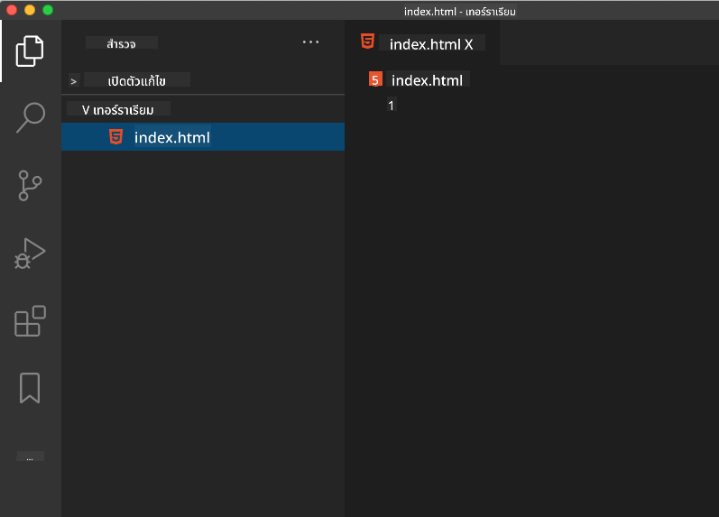

<!--
CO_OP_TRANSLATOR_METADATA:
{
  "original_hash": "46a0639e719b9cf1dfd062aa24cad639",
  "translation_date": "2025-08-26T21:29:13+00:00",
  "source_file": "3-terrarium/1-intro-to-html/README.md",
  "language_code": "th"
}
-->
# โครงการ Terrarium ตอนที่ 1: แนะนำ HTML

  
> ภาพสเก็ตโน้ตโดย [Tomomi Imura](https://twitter.com/girlie_mac)

## แบบทดสอบก่อนเรียน

[แบบทดสอบก่อนเรียน](https://ashy-river-0debb7803.1.azurestaticapps.net/quiz/15)

> ชมวิดีโอ

> 
> [](https://www.youtube.com/watch?v=1TvxJKBzhyQ)

### บทนำ

HTML หรือ HyperText Markup Language เป็นเหมือน "โครงกระดูก" ของเว็บ หาก CSS เป็นการ "แต่งตัว" ให้ HTML และ JavaScript ทำให้มันมีชีวิต HTML ก็คือร่างกายของแอปพลิเคชันเว็บของคุณ โครงสร้างของ HTML ยังสะท้อนแนวคิดนี้ด้วยการมีแท็ก "head", "body" และ "footer"

ในบทเรียนนี้ เราจะใช้ HTML เพื่อวางโครงสร้าง "โครงกระดูก" ของอินเทอร์เฟซ terrarium เสมือนจริงของเรา โดยจะมีชื่อเรื่องและสามคอลัมน์: คอลัมน์ซ้ายและขวาที่มีพืชที่ลากได้ และพื้นที่ตรงกลางที่จะเป็น terrarium ที่ดูเหมือนแก้ว เมื่อจบบทเรียนนี้ คุณจะสามารถเห็นพืชในคอลัมน์ต่าง ๆ ได้ แต่หน้าตาอินเทอร์เฟซอาจดูแปลกไปหน่อย ไม่ต้องกังวล ในส่วนถัดไปคุณจะเพิ่มสไตล์ CSS เพื่อทำให้อินเทอร์เฟซดูดีขึ้น

### งานที่ต้องทำ

บนคอมพิวเตอร์ของคุณ สร้างโฟลเดอร์ชื่อ 'terrarium' และภายในนั้นสร้างไฟล์ชื่อ 'index.html' คุณสามารถทำได้ใน Visual Studio Code หลังจากสร้างโฟลเดอร์ terrarium โดยเปิดหน้าต่าง VS Code ใหม่ คลิก 'open folder' และไปยังโฟลเดอร์ใหม่ของคุณ จากนั้นคลิกปุ่ม 'file' เล็ก ๆ ในแถบ Explorer และสร้างไฟล์ใหม่:



หรือ

ใช้คำสั่งเหล่านี้ใน git bash:
* `mkdir terrarium`
* `cd terrarium`
* `touch index.html`
* `code index.html` หรือ `nano index.html`

> ไฟล์ index.html บอกเบราว์เซอร์ว่าไฟล์นี้เป็นไฟล์เริ่มต้นในโฟลเดอร์ เช่น URL อย่าง `https://anysite.com/test` อาจถูกสร้างขึ้นจากโครงสร้างโฟลเดอร์ที่มีโฟลเดอร์ชื่อ `test` และมี `index.html` อยู่ภายใน; `index.html` ไม่จำเป็นต้องแสดงใน URL

---

## DocType และแท็ก html

บรรทัดแรกของไฟล์ HTML คือ doctype ซึ่งอาจดูแปลกที่คุณต้องมีบรรทัดนี้อยู่ด้านบนสุดของไฟล์ แต่บรรทัดนี้บอกเบราว์เซอร์รุ่นเก่าว่าต้องแสดงหน้าเว็บในโหมดมาตรฐานตามข้อกำหนด HTML ปัจจุบัน

> เคล็ดลับ: ใน VS Code คุณสามารถวางเมาส์เหนือแท็กเพื่อดูข้อมูลเกี่ยวกับการใช้งานจากคู่มืออ้างอิง MDN

บรรทัดที่สองควรเป็นแท็กเปิด `<html>` ตามด้วยแท็กปิด `</html>` แท็กเหล่านี้เป็นองค์ประกอบรากของอินเทอร์เฟซของคุณ

### งานที่ต้องทำ

เพิ่มบรรทัดเหล่านี้ที่ด้านบนของไฟล์ `index.html` ของคุณ:

```HTML
<!DOCTYPE html>
<html></html>
```

✅ มีโหมดที่แตกต่างกันเล็กน้อยที่สามารถกำหนดได้โดยการตั้งค่า DocType ด้วย query string: [Quirks Mode และ Standards Mode](https://developer.mozilla.org/docs/Web/HTML/Quirks_Mode_and_Standards_Mode) โหมดเหล่านี้เคยสนับสนุนเบราว์เซอร์รุ่นเก่ามากที่ไม่ค่อยมีใครใช้ในปัจจุบัน (Netscape Navigator 4 และ Internet Explorer 5) คุณสามารถใช้การประกาศ doctype มาตรฐานได้

---

## 'head' ของเอกสาร

พื้นที่ 'head' ของเอกสาร HTML รวมข้อมูลสำคัญเกี่ยวกับหน้าเว็บของคุณ หรือที่เรียกว่า [metadata](https://developer.mozilla.org/docs/Web/HTML/Element/meta) ในกรณีของเรา เราจะบอกเซิร์ฟเวอร์เว็บที่หน้าเว็บนี้จะถูกส่งไปแสดงผลถึง 4 สิ่งนี้:

-   ชื่อของหน้า
-   เมตาดาต้าของหน้า รวมถึง:
    -   'character set' ที่บอกเกี่ยวกับการเข้ารหัสตัวอักษรที่ใช้ในหน้า
    -   ข้อมูลเบราว์เซอร์ รวมถึง `x-ua-compatible` ซึ่งระบุว่าเบราว์เซอร์ IE=edge ได้รับการสนับสนุน
    -   ข้อมูลเกี่ยวกับการทำงานของ viewport เมื่อโหลดหน้า การตั้งค่า viewport ให้มี initial scale เป็น 1 จะควบคุมระดับการซูมเมื่อโหลดหน้า

### งานที่ต้องทำ

เพิ่มบล็อก 'head' ลงในเอกสารของคุณระหว่างแท็กเปิดและปิด `<html>`

```html
<head>
	<title>Welcome to my Virtual Terrarium</title>
	<meta charset="utf-8" />
	<meta http-equiv="X-UA-Compatible" content="IE=edge" />
	<meta name="viewport" content="width=device-width, initial-scale=1" />
</head>
```

✅ จะเกิดอะไรขึ้นหากคุณตั้งค่า viewport meta tag แบบนี้: `<meta name="viewport" content="width=600">`? อ่านเพิ่มเติมเกี่ยวกับ [viewport](https://developer.mozilla.org/docs/Web/HTML/Viewport_meta_tag)

---

## `body` ของเอกสาร

### แท็ก HTML

ใน HTML คุณเพิ่มแท็กลงในไฟล์ .html เพื่อสร้างองค์ประกอบของหน้าเว็บ แต่ละแท็กมักจะมีแท็กเปิดและปิด เช่น `<p>hello</p>` เพื่อระบุย่อหน้า สร้าง body ของอินเทอร์เฟซของคุณโดยเพิ่มชุดแท็ก `<body>` ภายในคู่แท็ก `<html>` ตอนนี้มาร์กอัปของคุณจะมีลักษณะดังนี้:

### งานที่ต้องทำ

```html
<!DOCTYPE html>
<html>
	<head>
		<title>Welcome to my Virtual Terrarium</title>
		<meta charset="utf-8" />
		<meta http-equiv="X-UA-Compatible" content="IE=edge" />
		<meta name="viewport" content="width=device-width, initial-scale=1" />
	</head>
	<body></body>
</html>
```

ตอนนี้คุณสามารถเริ่มสร้างหน้าเว็บของคุณได้ โดยปกติคุณจะใช้แท็ก `<div>` เพื่อสร้างองค์ประกอบแยกต่างหากในหน้า เราจะสร้างชุดของ `<div>` ที่จะมีภาพ

### รูปภาพ

แท็ก html หนึ่งที่ไม่ต้องการแท็กปิดคือ `` เพราะมันมีองค์ประกอบ `src` ที่มีข้อมูลทั้งหมดที่หน้าเว็บต้องการเพื่อแสดงรายการ

สร้างโฟลเดอร์ในแอปของคุณชื่อ `images` และเพิ่มรูปภาพทั้งหมดใน [โฟลเดอร์ซอร์สโค้ด](../../../../3-terrarium/solution/images); (มีรูปภาพพืช 14 รูป)

### งานที่ต้องทำ

เพิ่มรูปภาพพืชเหล่านั้นลงในสองคอลัมน์ระหว่างแท็ก `<body></body>`:

```html
<div id="page">
	<div id="left-container" class="container">
		<div class="plant-holder">
			
		</div>
		<div class="plant-holder">
			
		</div>
		<div class="plant-holder">
			
		</div>
		<div class="plant-holder">
			
		</div>
		<div class="plant-holder">
			
		</div>
		<div class="plant-holder">
			
		</div>
		<div class="plant-holder">
			
		</div>
	</div>
	<div id="right-container" class="container">
		<div class="plant-holder">
			
		</div>
		<div class="plant-holder">
			
		</div>
		<div class="plant-holder">
			
		</div>
		<div class="plant-holder">
			
		</div>
		<div class="plant-holder">
			
		</div>
		<div class="plant-holder">
			
		</div>
		<div class="plant-holder">
			
		</div>
	</div>
</div>
```

> หมายเหตุ: Spans vs. Divs. Divs ถือเป็นองค์ประกอบ 'block' และ Spans เป็น 'inline' จะเกิดอะไรขึ้นหากคุณเปลี่ยน divs เหล่านี้เป็น spans?

ด้วยมาร์กอัปนี้ พืชจะปรากฏบนหน้าจอ แต่ดูไม่ดีนักเพราะยังไม่ได้จัดสไตล์ด้วย CSS ซึ่งเราจะทำในบทเรียนถัดไป

แต่ละภาพมีข้อความ alt ที่จะปรากฏแม้ว่าคุณจะไม่สามารถดูหรือแสดงภาพได้ นี่เป็นคุณสมบัติสำคัญที่ควรรวมไว้เพื่อการเข้าถึง เรียนรู้เพิ่มเติมเกี่ยวกับการเข้าถึงในบทเรียนอนาคต; สำหรับตอนนี้ โปรดจำไว้ว่าคุณสมบัติ alt ให้ข้อมูลทางเลือกสำหรับภาพหากผู้ใช้ไม่สามารถดูได้ (เนื่องจากการเชื่อมต่อช้า ข้อผิดพลาดในแอตทริบิวต์ src หรือหากผู้ใช้ใช้เครื่องอ่านหน้าจอ)

✅ คุณสังเกตไหมว่าภาพแต่ละภาพมีข้อความ alt เดียวกัน? นี่เป็นแนวปฏิบัติที่ดีหรือไม่? ทำไม? คุณสามารถปรับปรุงโค้ดนี้ได้หรือไม่?

---

## มาร์กอัปเชิงความหมาย

โดยทั่วไป ควรใช้ 'ความหมาย' ที่มีความหมายเมื่อเขียน HTML หมายความว่าอย่างไร? หมายความว่าคุณใช้แท็ก HTML เพื่อแสดงประเภทของข้อมูลหรือการโต้ตอบที่ออกแบบมา ตัวอย่างเช่น ข้อความหัวเรื่องหลักในหน้าควรใช้แท็ก `<h1>`

เพิ่มบรรทัดต่อไปนี้ใต้แท็กเปิด `<body>` ของคุณ:

```html
<h1>My Terrarium</h1>
```

การใช้มาร์กอัปเชิงความหมาย เช่น การให้หัวเรื่องเป็น `<h1>` และรายการที่ไม่ได้เรียงลำดับเป็น `<ul>` ช่วยให้เครื่องอ่านหน้าจอนำทางผ่านหน้าได้ โดยทั่วไป ปุ่มควรเขียนเป็น `<button>` และรายการควรเป็น `<li>` แม้ว่าจะ _เป็นไปได้_ ที่จะใช้ `<span>` ที่มีสไตล์พิเศษพร้อมตัวจัดการคลิกเพื่อเลียนแบบปุ่ม แต่จะดีกว่าสำหรับผู้ใช้ที่มีความบกพร่องในการใช้เทคโนโลยีเพื่อกำหนดตำแหน่งของปุ่มในหน้าและโต้ตอบกับมัน หากองค์ประกอบปรากฏเป็นปุ่ม ด้วยเหตุผลนี้ พยายามใช้มาร์กอัปเชิงความหมายให้มากที่สุด

✅ ลองดูเครื่องอ่านหน้าจอและ [วิธีที่มันโต้ตอบกับหน้าเว็บ](https://www.youtube.com/watch?v=OUDV1gqs9GA) คุณเห็นไหมว่าการมีมาร์กอัปที่ไม่ใช่เชิงความหมายอาจทำให้ผู้ใช้หงุดหงิดได้อย่างไร?

## Terrarium

ส่วนสุดท้ายของอินเทอร์เฟซนี้เกี่ยวข้องกับการสร้างมาร์กอัปที่จะถูกจัดสไตล์ให้เป็น terrarium

### งานที่ต้องทำ:

เพิ่มมาร์กอัปนี้เหนือแท็ก `</div>` สุดท้าย:

```html
<div id="terrarium">
	<div class="jar-top"></div>
	<div class="jar-walls">
		<div class="jar-glossy-long"></div>
		<div class="jar-glossy-short"></div>
	</div>
	<div class="dirt"></div>
	<div class="jar-bottom"></div>
</div>
```

✅ แม้ว่าคุณจะเพิ่มมาร์กอัปนี้ลงในหน้าจอ คุณจะไม่เห็นอะไรเลย ทำไม?

---

## 🚀ความท้าทาย

มีแท็ก 'เก่า' บางแท็กใน HTML ที่ยังคงสนุกที่จะลองเล่น แม้ว่าคุณไม่ควรใช้แท็กที่เลิกใช้แล้ว เช่น [แท็กเหล่านี้](https://developer.mozilla.org/docs/Web/HTML/Element#Obsolete_and_deprecated_elements) ในมาร์กอัปของคุณ แต่คุณสามารถใช้แท็ก `<marquee>` เก่าเพื่อทำให้ชื่อ h1 เลื่อนในแนวนอนได้หรือไม่? (ถ้าคุณทำ อย่าลืมลบออกหลังจากนั้น)

## แบบทดสอบหลังเรียน

[แบบทดสอบหลังเรียน](https://ashy-river-0debb7803.1.azurestaticapps.net/quiz/16)

## ทบทวน & ศึกษาด้วยตนเอง

HTML เป็นระบบโครงสร้างที่ 'เชื่อถือได้' ซึ่งช่วยสร้างเว็บให้เป็นอย่างที่เป็นในปัจจุบัน เรียนรู้เล็กน้อยเกี่ยวกับประวัติของมันโดยศึกษาทั้งแท็กเก่าและใหม่ คุณสามารถหาสาเหตุได้ไหมว่าทำไมบางแท็กถึงเลิกใช้และบางแท็กถึงถูกเพิ่มเข้ามา? แท็กใดที่อาจถูกแนะนำในอนาคต?

เรียนรู้เพิ่มเติมเกี่ยวกับการสร้างเว็บไซต์สำหรับเว็บและอุปกรณ์เคลื่อนที่ได้ที่ [Microsoft Learn](https://docs.microsoft.com/learn/modules/build-simple-website/?WT.mc_id=academic-77807-sagibbon)

## การบ้าน

[ฝึกฝน HTML ของคุณ: สร้างแบบจำลองบล็อก](assignment.md)

---

**ข้อจำกัดความรับผิดชอบ**:  
เอกสารนี้ได้รับการแปลโดยใช้บริการแปลภาษา AI [Co-op Translator](https://github.com/Azure/co-op-translator) แม้ว่าเราจะพยายามให้การแปลมีความถูกต้องมากที่สุด แต่โปรดทราบว่าการแปลโดยอัตโนมัติอาจมีข้อผิดพลาดหรือความไม่ถูกต้อง เอกสารต้นฉบับในภาษาดั้งเดิมควรถือเป็นแหล่งข้อมูลที่เชื่อถือได้ สำหรับข้อมูลที่สำคัญ ขอแนะนำให้ใช้บริการแปลภาษามืออาชีพ เราไม่รับผิดชอบต่อความเข้าใจผิดหรือการตีความผิดที่เกิดจากการใช้การแปลนี้