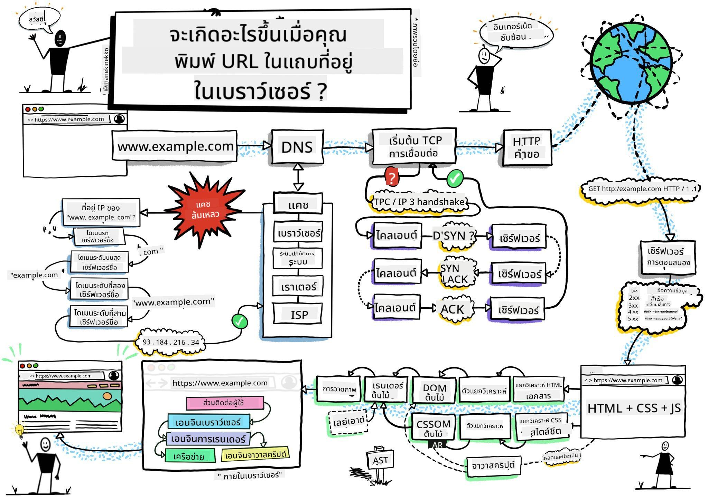
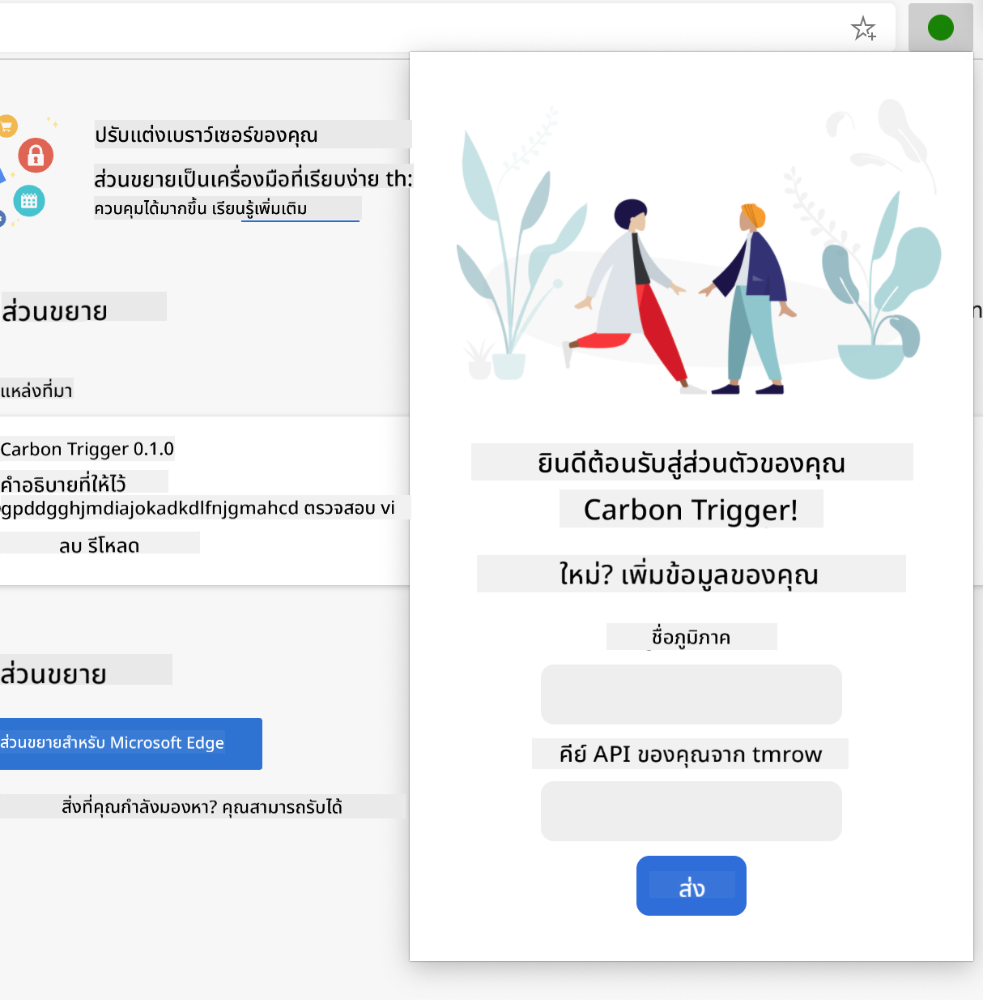
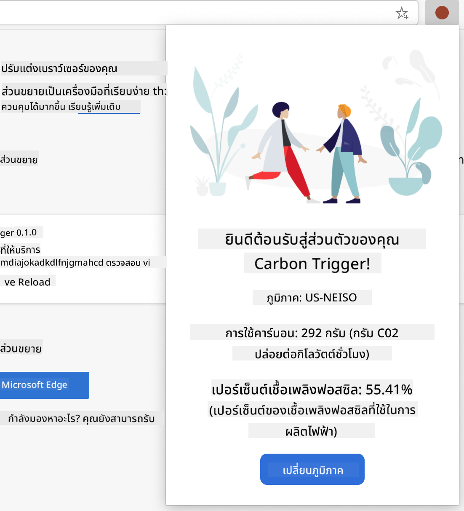

<!--
CO_OP_TRANSLATOR_METADATA:
{
  "original_hash": "0bb55e0b98600afab801eea115228873",
  "translation_date": "2025-08-26T22:38:29+00:00",
  "source_file": "5-browser-extension/1-about-browsers/README.md",
  "language_code": "th"
}
-->
# โครงการส่วนขยายเบราว์เซอร์ ตอนที่ 1: ทุกสิ่งเกี่ยวกับเบราว์เซอร์


> สเก็ตโน้ตโดย [Wassim Chegham](https://dev.to/wassimchegham/ever-wondered-what-happens-when-you-type-in-a-url-in-an-address-bar-in-a-browser-3dob)

## แบบทดสอบก่อนเรียน

[แบบทดสอบก่อนเรียน](https://ashy-river-0debb7803.1.azurestaticapps.net/quiz/23)

### บทนำ

ส่วนขยายเบราว์เซอร์ช่วยเพิ่มฟังก์ชันการทำงานเพิ่มเติมให้กับเบราว์เซอร์ แต่ก่อนที่คุณจะสร้างส่วนขยาย คุณควรเรียนรู้เกี่ยวกับวิธีการทำงานของเบราว์เซอร์เสียก่อน

### เกี่ยวกับเบราว์เซอร์

ในบทเรียนชุดนี้ คุณจะได้เรียนรู้วิธีสร้างส่วนขยายเบราว์เซอร์ที่สามารถใช้งานได้บนเบราว์เซอร์ Chrome, Firefox และ Edge ในส่วนนี้ คุณจะได้ค้นพบวิธีการทำงานของเบราว์เซอร์และวางโครงสร้างองค์ประกอบของส่วนขยายเบราว์เซอร์

แต่เบราว์เซอร์คืออะไร? มันคือแอปพลิเคชันซอฟต์แวร์ที่ช่วยให้ผู้ใช้งานเข้าถึงเนื้อหาจากเซิร์ฟเวอร์และแสดงผลบนหน้าเว็บ

✅ ประวัติเล็กน้อย: เบราว์เซอร์ตัวแรกมีชื่อว่า 'WorldWideWeb' และถูกสร้างขึ้นโดย Sir Timothy Berners-Lee ในปี 1990


> เบราว์เซอร์ยุคแรกบางตัว โดย [Karen McGrane](https://www.slideshare.net/KMcGrane/week-4-ixd-history-personal-computing)

เมื่อผู้ใช้เชื่อมต่อกับอินเทอร์เน็ตโดยใช้ที่อยู่ URL (Uniform Resource Locator) ซึ่งมักใช้โปรโตคอล Hypertext Transfer Protocol ผ่านที่อยู่ `http` หรือ `https` เบราว์เซอร์จะสื่อสารกับเว็บเซิร์ฟเวอร์และดึงหน้าเว็บมาแสดงผล

ในขั้นตอนนี้ เอนจินการเรนเดอร์ของเบราว์เซอร์จะแสดงผลหน้าเว็บบนอุปกรณ์ของผู้ใช้ ซึ่งอาจเป็นโทรศัพท์มือถือ เดสก์ท็อป หรือแล็ปท็อป

เบราว์เซอร์ยังมีความสามารถในการแคชเนื้อหาเพื่อไม่ต้องดึงข้อมูลจากเซิร์ฟเวอร์ทุกครั้ง นอกจากนี้ยังสามารถบันทึกประวัติการใช้งานของผู้ใช้ เก็บ 'คุกกี้' ซึ่งเป็นข้อมูลขนาดเล็กที่ใช้บันทึกกิจกรรมของผู้ใช้ และอื่น ๆ อีกมากมาย

สิ่งสำคัญที่ต้องจำเกี่ยวกับเบราว์เซอร์คือ เบราว์เซอร์ไม่ได้เหมือนกันทั้งหมด! แต่ละเบราว์เซอร์มีจุดแข็งและจุดอ่อนของตัวเอง และนักพัฒนาเว็บมืออาชีพจำเป็นต้องเข้าใจวิธีทำให้หน้าเว็บทำงานได้ดีในทุกเบราว์เซอร์ รวมถึงการจัดการกับหน้าจอขนาดเล็ก เช่น โทรศัพท์มือถือ และผู้ใช้ที่ออฟไลน์

เว็บไซต์ที่มีประโยชน์มากที่คุณควรบุ๊กมาร์กไว้ในเบราว์เซอร์ที่คุณชอบใช้คือ [caniuse.com](https://www.caniuse.com) เมื่อคุณสร้างหน้าเว็บ การใช้รายการเทคโนโลยีที่รองรับของ caniuse จะช่วยให้คุณสนับสนุนผู้ใช้ได้ดีที่สุด

✅ คุณจะทราบได้อย่างไรว่าเบราว์เซอร์ใดเป็นที่นิยมที่สุดในกลุ่มผู้ใช้เว็บไซต์ของคุณ? ตรวจสอบการวิเคราะห์ของคุณ - คุณสามารถติดตั้งแพ็กเกจการวิเคราะห์ต่าง ๆ เป็นส่วนหนึ่งของกระบวนการพัฒนาเว็บ และมันจะบอกคุณว่าเบราว์เซอร์ใดที่ถูกใช้งานมากที่สุด

## ส่วนขยายเบราว์เซอร์

ทำไมคุณถึงอยากสร้างส่วนขยายเบราว์เซอร์? มันเป็นเครื่องมือที่สะดวกในการเพิ่มเข้ากับเบราว์เซอร์เมื่อคุณต้องการเข้าถึงงานที่คุณทำซ้ำบ่อย ๆ ตัวอย่างเช่น หากคุณต้องการตรวจสอบสีบนหน้าเว็บต่าง ๆ ที่คุณใช้งาน คุณอาจติดตั้งส่วนขยายเบราว์เซอร์สำหรับเลือกสี หรือหากคุณมีปัญหาในการจำรหัสผ่าน คุณอาจใช้ส่วนขยายเบราว์เซอร์สำหรับจัดการรหัสผ่าน

การพัฒนาส่วนขยายเบราว์เซอร์ก็สนุกเช่นกัน ส่วนขยายเหล่านี้มักจัดการงานจำนวนจำกัดที่พวกมันทำได้ดี

✅ ส่วนขยายเบราว์เซอร์ที่คุณชื่นชอบคืออะไร? พวกมันทำงานอะไรบ้าง?

### การติดตั้งส่วนขยาย

ก่อนที่คุณจะเริ่มสร้าง ลองดูขั้นตอนการสร้างและการปรับใช้ส่วนขยายเบราว์เซอร์ แม้ว่าแต่ละเบราว์เซอร์จะมีความแตกต่างเล็กน้อยในวิธีการจัดการงานนี้ แต่กระบวนการจะคล้ายกันใน Chrome และ Firefox เช่นเดียวกับตัวอย่างใน Edge:


> หมายเหตุ: อย่าลืมเปิดโหมดนักพัฒนาและอนุญาตให้ติดตั้งส่วนขยายจากร้านค้าอื่น

โดยสรุป กระบวนการจะเป็นดังนี้:

- สร้างส่วนขยายของคุณโดยใช้ `npm run build` 
- ไปที่หน้าเพจส่วนขยายในเบราว์เซอร์โดยใช้ปุ่ม "Settings and more" (ไอคอน `...`) ที่มุมขวาบน
- หากเป็นการติดตั้งใหม่ ให้เลือก `load unpacked` เพื่ออัปโหลดส่วนขยายใหม่จากโฟลเดอร์ที่สร้าง (ในกรณีของเราคือ `/dist`) 
- หรือคลิก `reload` หากคุณกำลังโหลดส่วนขยายที่ติดตั้งไว้แล้วอีกครั้ง

✅ คำแนะนำเหล่านี้เกี่ยวข้องกับส่วนขยายที่คุณสร้างเอง; หากต้องการติดตั้งส่วนขยายที่เผยแพร่ในร้านค้าส่วนขยายเบราว์เซอร์ที่เกี่ยวข้องกับแต่ละเบราว์เซอร์ คุณควรไปที่ [ร้านค้า](https://microsoftedge.microsoft.com/addons/Microsoft-Edge-Extensions-Home) และติดตั้งส่วนขยายที่คุณเลือก

### เริ่มต้น

คุณกำลังจะสร้างส่วนขยายเบราว์เซอร์ที่แสดงรอยเท้าคาร์บอนของภูมิภาคของคุณ โดยแสดงการใช้พลังงานและแหล่งพลังงานของภูมิภาคนั้น ส่วนขยายจะมีฟอร์มที่รวบรวมคีย์ API เพื่อให้คุณสามารถเข้าถึง API ของ CO2 Signal ได้

**สิ่งที่คุณต้องมี:**

- [คีย์ API](https://www.co2signal.com/); ป้อนอีเมลของคุณในช่องบนหน้านี้และคีย์จะถูกส่งถึงคุณ
- [รหัสสำหรับภูมิภาคของคุณ](http://api.electricitymap.org/v3/zones) ที่สอดคล้องกับ [Electricity Map](https://www.electricitymap.org/map) (ในบอสตัน ตัวอย่างเช่น ฉันใช้ 'US-NEISO')
- [โค้ดเริ่มต้น](../../../../5-browser-extension/start) ดาวน์โหลดโฟลเดอร์ `start`; คุณจะต้องเติมโค้ดในโฟลเดอร์นี้
- [NPM](https://www.npmjs.com) - NPM เป็นเครื่องมือจัดการแพ็กเกจ; ติดตั้งมันในเครื่องและแพ็กเกจที่ระบุในไฟล์ `package.json` ของคุณจะถูกติดตั้งเพื่อใช้งานกับทรัพย์สินเว็บของคุณ

✅ เรียนรู้เพิ่มเติมเกี่ยวกับการจัดการแพ็กเกจใน [โมดูลการเรียนรู้ที่ยอดเยี่ยมนี้](https://docs.microsoft.com/learn/modules/create-nodejs-project-dependencies/?WT.mc_id=academic-77807-sagibbon)

ใช้เวลาสักครู่เพื่อดูฐานโค้ด:

dist
    -|manifest.json (ตั้งค่าดีฟอลต์ที่นี่)
    -|index.html (มาร์กอัป HTML ส่วนหน้าอยู่ที่นี่)
    -|background.js (JS พื้นหลังอยู่ที่นี่)
    -|main.js (JS ที่สร้างแล้ว)
src
    -|index.js (โค้ด JS ของคุณอยู่ที่นี่)

✅ เมื่อคุณมีคีย์ API และรหัสภูมิภาคพร้อมแล้ว ให้เก็บข้อมูลเหล่านั้นไว้ในโน้ตสำหรับใช้งานในอนาคต

### สร้าง HTML สำหรับส่วนขยาย

ส่วนขยายนี้มีสองมุมมอง หนึ่งสำหรับรวบรวมคีย์ API และรหัสภูมิภาค:



และอีกหนึ่งสำหรับแสดงการใช้คาร์บอนของภูมิภาค:



เริ่มต้นด้วยการสร้าง HTML สำหรับฟอร์มและจัดแต่งด้วย CSS

ในโฟลเดอร์ `/dist` คุณจะสร้างฟอร์มและพื้นที่แสดงผล ในไฟล์ `index.html` เติมพื้นที่ฟอร์มที่กำหนดไว้:

```HTML
<form class="form-data" autocomplete="on">
	<div>
		<h2>New? Add your Information</h2>
	</div>
	<div>
		<label for="region">Region Name</label>
		<input type="text" id="region" required class="region-name" />
	</div>
	<div>
		<label for="api">Your API Key from tmrow</label>
		<input type="text" id="api" required class="api-key" />
	</div>
	<button class="search-btn">Submit</button>
</form>	
```
นี่คือฟอร์มที่ข้อมูลที่บันทึกไว้จะถูกป้อนและบันทึกลงใน local storage

ถัดไป สร้างพื้นที่แสดงผล; ใต้แท็กฟอร์มสุดท้าย เพิ่ม divs บางส่วน:

```HTML
<div class="result">
	<div class="loading">loading...</div>
	<div class="errors"></div>
	<div class="data"></div>
	<div class="result-container">
		<p><strong>Region: </strong><span class="my-region"></span></p>
		<p><strong>Carbon Usage: </strong><span class="carbon-usage"></span></p>
		<p><strong>Fossil Fuel Percentage: </strong><span class="fossil-fuel"></span></p>
	</div>
	<button class="clear-btn">Change region</button>
</div>
```
ในขั้นตอนนี้ คุณสามารถลองสร้างได้ ตรวจสอบให้แน่ใจว่าติดตั้งแพ็กเกจที่จำเป็นสำหรับส่วนขยายนี้:

```
npm install
```

คำสั่งนี้จะใช้ npm ซึ่งเป็น Node Package Manager เพื่อทำการติดตั้ง webpack สำหรับกระบวนการสร้างส่วนขยายของคุณ Webpack เป็นตัวจัดการการรวมโค้ด คุณสามารถดูผลลัพธ์ของกระบวนการนี้ได้โดยดูใน `/dist/main.js` - คุณจะเห็นว่าโค้ดถูกจัดการรวมกันแล้ว

ในตอนนี้ ส่วนขยายควรสร้างได้ และหากคุณปรับใช้ใน Edge เป็นส่วนขยาย คุณจะเห็นฟอร์มที่แสดงผลอย่างเรียบร้อย

ยินดีด้วย คุณได้เริ่มต้นขั้นตอนแรกในการสร้างส่วนขยายเบราว์เซอร์แล้ว ในบทเรียนถัดไป คุณจะทำให้มันมีฟังก์ชันและมีประโยชน์มากขึ้น

---

## 🚀 ความท้าทาย

ลองดูร้านค้าส่วนขยายเบราว์เซอร์และติดตั้งส่วนขยายหนึ่งตัวลงในเบราว์เซอร์ของคุณ คุณสามารถตรวจสอบไฟล์ของมันในวิธีที่น่าสนใจ คุณค้นพบอะไรบ้าง?

## แบบทดสอบหลังเรียน

[แบบทดสอบหลังเรียน](https://ashy-river-0debb7803.1.azurestaticapps.net/quiz/24)

## ทบทวนและศึกษาด้วยตนเอง

ในบทเรียนนี้ คุณได้เรียนรู้เล็กน้อยเกี่ยวกับประวัติของเบราว์เซอร์ ใช้โอกาสนี้เพื่อเรียนรู้เกี่ยวกับวิธีที่ผู้สร้าง World Wide Web มองเห็นการใช้งานโดยการอ่านเพิ่มเติมเกี่ยวกับประวัติศาสตร์ของมัน เว็บไซต์ที่มีประโยชน์บางแห่ง ได้แก่:

[ประวัติของเบราว์เซอร์เว็บ](https://www.mozilla.org/firefox/browsers/browser-history/)

[ประวัติของเว็บ](https://webfoundation.org/about/vision/history-of-the-web/)

[บทสัมภาษณ์กับ Tim Berners-Lee](https://www.theguardian.com/technology/2019/mar/12/tim-berners-lee-on-30-years-of-the-web-if-we-dream-a-little-we-can-get-the-web-we-want)

## งานที่ได้รับมอบหมาย 

[ปรับแต่งส่วนขยายของคุณ](assignment.md)

---

**ข้อจำกัดความรับผิดชอบ**:  
เอกสารนี้ได้รับการแปลโดยใช้บริการแปลภาษา AI [Co-op Translator](https://github.com/Azure/co-op-translator) แม้ว่าเราจะพยายามให้การแปลมีความถูกต้องมากที่สุด แต่โปรดทราบว่าการแปลโดยอัตโนมัติอาจมีข้อผิดพลาดหรือความไม่ถูกต้อง เอกสารต้นฉบับในภาษาดั้งเดิมควรถือเป็นแหล่งข้อมูลที่เชื่อถือได้ สำหรับข้อมูลที่สำคัญ ขอแนะนำให้ใช้บริการแปลภาษามืออาชีพ เราไม่รับผิดชอบต่อความเข้าใจผิดหรือการตีความที่ผิดพลาดซึ่งเกิดจากการใช้การแปลนี้