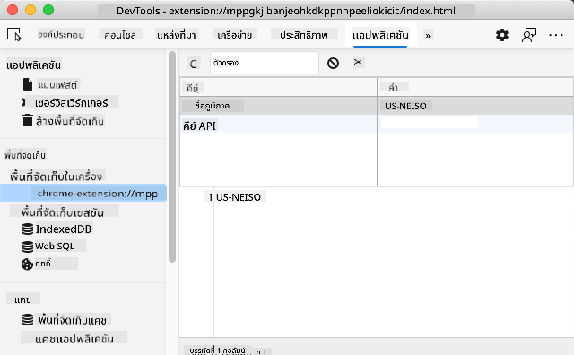

<!--
CO_OP_TRANSLATOR_METADATA:
{
  "original_hash": "e10f168beac4e7b05e30e0eb5c92bf11",
  "translation_date": "2025-08-26T22:33:13+00:00",
  "source_file": "5-browser-extension/2-forms-browsers-local-storage/README.md",
  "language_code": "th"
}
-->
# โครงการส่วนขยายเบราว์เซอร์ ตอนที่ 2: เรียก API และใช้ Local Storage

## แบบทดสอบก่อนเรียน

[แบบทดสอบก่อนเรียน](https://ff-quizzes.netlify.app/web/quiz/25)

### บทนำ

ในบทเรียนนี้ คุณจะได้เรียนรู้วิธีเรียก API โดยการส่งข้อมูลผ่านฟอร์มของส่วนขยายเบราว์เซอร์ และแสดงผลลัพธ์ในส่วนขยายเบราว์เซอร์ของคุณ นอกจากนี้ คุณจะได้เรียนรู้วิธีจัดเก็บข้อมูลใน Local Storage ของเบราว์เซอร์เพื่อใช้อ้างอิงและใช้งานในอนาคต

✅ ทำตามขั้นตอนที่ระบุไว้ในไฟล์ที่เหมาะสมเพื่อทราบว่าควรวางโค้ดของคุณที่ไหน

### ตั้งค่าส่วนประกอบที่จะใช้งานในส่วนขยาย:

จนถึงตอนนี้ คุณได้สร้าง HTML สำหรับฟอร์มและ `<div>` สำหรับผลลัพธ์ในส่วนขยายเบราว์เซอร์ของคุณแล้ว จากนี้ไป คุณจะต้องทำงานในไฟล์ `/src/index.js` และสร้างส่วนขยายของคุณทีละขั้นตอน อ้างอิงบทเรียน [ก่อนหน้า](../1-about-browsers/README.md) เพื่อดูวิธีตั้งค่าโครงการและกระบวนการสร้าง

ในไฟล์ `index.js` ของคุณ เริ่มต้นด้วยการสร้างตัวแปร `const` เพื่อเก็บค่าที่เกี่ยวข้องกับฟิลด์ต่างๆ:

```JavaScript
// form fields
const form = document.querySelector('.form-data');
const region = document.querySelector('.region-name');
const apiKey = document.querySelector('.api-key');

// results
const errors = document.querySelector('.errors');
const loading = document.querySelector('.loading');
const results = document.querySelector('.result-container');
const usage = document.querySelector('.carbon-usage');
const fossilfuel = document.querySelector('.fossil-fuel');
const myregion = document.querySelector('.my-region');
const clearBtn = document.querySelector('.clear-btn');
```

ฟิลด์ทั้งหมดนี้ถูกอ้างอิงโดย css class ที่คุณตั้งค่าไว้ใน HTML ในบทเรียนก่อนหน้า

### เพิ่มตัวฟังเหตุการณ์

ต่อไป เพิ่ม event listeners ให้กับฟอร์มและปุ่มล้างข้อมูลที่รีเซ็ตฟอร์ม เพื่อให้เมื่อผู้ใช้ส่งฟอร์มหรือคลิกปุ่มรีเซ็ต จะมีบางสิ่งเกิดขึ้น และเพิ่มคำสั่งเรียกใช้ฟังก์ชันเริ่มต้นแอปที่ด้านล่างของไฟล์:

```JavaScript
form.addEventListener('submit', (e) => handleSubmit(e));
clearBtn.addEventListener('click', (e) => reset(e));
init();
```

✅ สังเกตการใช้รูปแบบย่อเพื่อฟังเหตุการณ์ submit หรือ click และวิธีที่เหตุการณ์ถูกส่งไปยังฟังก์ชัน handleSubmit หรือ reset คุณสามารถเขียนรูปแบบยาวที่เทียบเท่ากับรูปแบบย่อนี้ได้หรือไม่? คุณชอบรูปแบบไหนมากกว่า?

### สร้างฟังก์ชัน init() และ reset():

ตอนนี้คุณจะสร้างฟังก์ชันที่เริ่มต้นส่วนขยาย ซึ่งเรียกว่า init():

```JavaScript
function init() {
	//if anything is in localStorage, pick it up
	const storedApiKey = localStorage.getItem('apiKey');
	const storedRegion = localStorage.getItem('regionName');

	//set icon to be generic green
	//todo

	if (storedApiKey === null || storedRegion === null) {
		//if we don't have the keys, show the form
		form.style.display = 'block';
		results.style.display = 'none';
		loading.style.display = 'none';
		clearBtn.style.display = 'none';
		errors.textContent = '';
	} else {
        //if we have saved keys/regions in localStorage, show results when they load
        displayCarbonUsage(storedApiKey, storedRegion);
		results.style.display = 'none';
		form.style.display = 'none';
		clearBtn.style.display = 'block';
	}
};

function reset(e) {
	e.preventDefault();
	//clear local storage for region only
	localStorage.removeItem('regionName');
	init();
}

```

ในฟังก์ชันนี้ มีตรรกะที่น่าสนใจ อ่านผ่านแล้วคุณเห็นว่าเกิดอะไรขึ้นบ้าง?

- มีการตั้งค่า `const` สองตัวเพื่อตรวจสอบว่าผู้ใช้ได้จัดเก็บ APIKey และรหัสภูมิภาคใน Local Storage หรือไม่
- หากค่าของตัวใดตัวหนึ่งเป็น null ให้แสดงฟอร์มโดยเปลี่ยน style เป็น 'block'
- ซ่อนพื้นที่ผลลัพธ์ การโหลด และปุ่ม clearBtn และตั้งค่าข้อความแสดงข้อผิดพลาดให้เป็นสตริงว่าง
- หากมี key และ region ให้เริ่มกระบวนการ:
  - เรียก API เพื่อรับข้อมูลการใช้คาร์บอน
  - ซ่อนพื้นที่ผลลัพธ์
  - ซ่อนฟอร์ม
  - แสดงปุ่มรีเซ็ต

ก่อนดำเนินการต่อ จะเป็นประโยชน์ที่จะเรียนรู้เกี่ยวกับแนวคิดสำคัญที่มีอยู่ในเบราว์เซอร์: [LocalStorage](https://developer.mozilla.org/docs/Web/API/Window/localStorage) LocalStorage เป็นวิธีที่มีประโยชน์ในการจัดเก็บสตริงในเบราว์เซอร์ในรูปแบบ `key-value` ซึ่งสามารถจัดการได้โดย JavaScript เพื่อจัดการข้อมูลในเบราว์เซอร์ LocalStorage ไม่มีวันหมดอายุ ในขณะที่ SessionStorage ซึ่งเป็นอีกประเภทหนึ่งของ web storage จะถูกล้างเมื่อปิดเบราว์เซอร์ ประเภทของ storage ต่างๆ มีข้อดีและข้อเสียในการใช้งาน

> หมายเหตุ - ส่วนขยายเบราว์เซอร์ของคุณมี Local Storage ของตัวเอง หน้าต่างเบราว์เซอร์หลักเป็น instance ที่แตกต่างกันและทำงานแยกกัน

คุณตั้งค่า APIKey ให้มีค่าเป็นสตริง ตัวอย่างเช่น และคุณสามารถดูได้ว่ามันถูกตั้งค่าใน Edge โดยการ "ตรวจสอบ" หน้าเว็บ (คุณสามารถคลิกขวาที่เบราว์เซอร์เพื่อ inspect) และไปที่แท็บ Applications เพื่อดู storage



✅ ลองคิดถึงสถานการณ์ที่คุณไม่ควรจัดเก็บข้อมูลบางอย่างใน LocalStorage โดยทั่วไป การวาง API Keys ใน LocalStorage เป็นความคิดที่ไม่ดี! คุณเห็นเหตุผลหรือไม่? ในกรณีของเรา เนื่องจากแอปของเราเป็นเพียงการเรียนรู้และจะไม่ถูกเผยแพร่ใน app store เราจะใช้วิธีนี้

สังเกตว่าคุณใช้ Web API เพื่อจัดการ LocalStorage โดยใช้ `getItem()`, `setItem()`, หรือ `removeItem()` ซึ่งได้รับการสนับสนุนอย่างกว้างขวางในเบราว์เซอร์

ก่อนสร้างฟังก์ชัน `displayCarbonUsage()` ที่ถูกเรียกใน `init()` ให้สร้างฟังก์ชันเพื่อจัดการการส่งฟอร์มเริ่มต้นก่อน

### จัดการการส่งฟอร์ม

สร้างฟังก์ชันชื่อ `handleSubmit` ที่รับอาร์กิวเมนต์ `(e)` หยุดเหตุการณ์ไม่ให้แพร่กระจาย (ในกรณีนี้ เราต้องการหยุดเบราว์เซอร์ไม่ให้รีเฟรช) และเรียกฟังก์ชันใหม่ `setUpUser` โดยส่งอาร์กิวเมนต์ `apiKey.value` และ `region.value` ในวิธีนี้ คุณใช้ค่าทั้งสองที่ถูกนำเข้ามาผ่านฟอร์มเริ่มต้นเมื่อฟิลด์ที่เหมาะสมถูกเติมเต็ม

```JavaScript
function handleSubmit(e) {
	e.preventDefault();
	setUpUser(apiKey.value, region.value);
}
```

✅ ทบทวนความจำ - HTML ที่คุณตั้งค่าไว้ในบทเรียนที่แล้วมีฟิลด์ input สองฟิลด์ที่ `values` ถูกจับผ่าน `const` ที่คุณตั้งค่าไว้ที่ด้านบนของไฟล์ และทั้งสองฟิลด์เป็น `required` ดังนั้นเบราว์เซอร์จะหยุดผู้ใช้ไม่ให้ป้อนค่าที่เป็น null

### ตั้งค่าผู้ใช้

ต่อไปยังฟังก์ชัน `setUpUser` ที่นี่คุณตั้งค่าค่า Local Storage สำหรับ apiKey และ regionName เพิ่มฟังก์ชันใหม่:

```JavaScript
function setUpUser(apiKey, regionName) {
	localStorage.setItem('apiKey', apiKey);
	localStorage.setItem('regionName', regionName);
	loading.style.display = 'block';
	errors.textContent = '';
	clearBtn.style.display = 'block';
	//make initial call
	displayCarbonUsage(apiKey, regionName);
}
```

ฟังก์ชันนี้ตั้งค่าข้อความการโหลดเพื่อแสดงในขณะที่ API ถูกเรียก ตอนนี้คุณมาถึงการสร้างฟังก์ชันที่สำคัญที่สุดของส่วนขยายเบราว์เซอร์นี้แล้ว!

### แสดงการใช้คาร์บอน

ในที่สุดก็ถึงเวลาสอบถาม API!

ก่อนดำเนินการต่อ เราควรพูดถึง API API หรือ [Application Programming Interfaces](https://www.webopedia.com/TERM/A/API.html) เป็นองค์ประกอบสำคัญในเครื่องมือของนักพัฒนาเว็บ พวกเขาให้วิธีมาตรฐานสำหรับโปรแกรมในการโต้ตอบและเชื่อมต่อกัน ตัวอย่างเช่น หากคุณกำลังสร้างเว็บไซต์ที่ต้องการสอบถามฐานข้อมูล อาจมีคนสร้าง API ให้คุณใช้ ในขณะที่มี API หลายประเภท หนึ่งในประเภทที่ได้รับความนิยมมากที่สุดคือ [REST API](https://www.smashingmagazine.com/2018/01/understanding-using-rest-api/)

✅ คำว่า 'REST' ย่อมาจาก 'Representational State Transfer' และมีลักษณะการใช้ URL ที่กำหนดค่าแตกต่างกันเพื่อดึงข้อมูล ลองค้นคว้าเกี่ยวกับประเภทต่างๆ ของ API ที่มีให้สำหรับนักพัฒนา รูปแบบใดที่คุณชอบ?

มีสิ่งสำคัญที่ควรทราบเกี่ยวกับฟังก์ชันนี้ ก่อนอื่น สังเกตคำสำคัญ [`async`](https://developer.mozilla.org/docs/Web/JavaScript/Reference/Statements/async_function) การเขียนฟังก์ชันของคุณให้ทำงานแบบ asynchronous หมายความว่าฟังก์ชันจะรอการดำเนินการ เช่น การคืนค่าข้อมูล ก่อนดำเนินการต่อ

นี่คือวิดีโอสั้นๆ เกี่ยวกับ `async`:

[](https://youtube.com/watch?v=YwmlRkrxvkk "Async และ Await สำหรับการจัดการ promises")

> 🎥 คลิกที่ภาพด้านบนเพื่อดูวิดีโอเกี่ยวกับ async/await

สร้างฟังก์ชันใหม่เพื่อสอบถาม C02Signal API:

```JavaScript
import axios from '../node_modules/axios';

async function displayCarbonUsage(apiKey, region) {
	try {
		await axios
			.get('https://api.co2signal.com/v1/latest', {
				params: {
					countryCode: region,
				},
				headers: {
					'auth-token': apiKey,
				},
			})
			.then((response) => {
				let CO2 = Math.floor(response.data.data.carbonIntensity);

				//calculateColor(CO2);

				loading.style.display = 'none';
				form.style.display = 'none';
				myregion.textContent = region;
				usage.textContent =
					Math.round(response.data.data.carbonIntensity) + ' grams (grams C02 emitted per kilowatt hour)';
				fossilfuel.textContent =
					response.data.data.fossilFuelPercentage.toFixed(2) +
					'% (percentage of fossil fuels used to generate electricity)';
				results.style.display = 'block';
			});
	} catch (error) {
		console.log(error);
		loading.style.display = 'none';
		results.style.display = 'none';
		errors.textContent = 'Sorry, we have no data for the region you have requested.';
	}
}
```

นี่เป็นฟังก์ชันขนาดใหญ่ เกิดอะไรขึ้นที่นี่?

- ตามแนวทางปฏิบัติที่ดีที่สุด คุณใช้คำสำคัญ `async` เพื่อทำให้ฟังก์ชันนี้ทำงานแบบ asynchronous ฟังก์ชันนี้มี `try/catch` block เนื่องจากมันจะคืน promise เมื่อ API คืนค่าข้อมูล เนื่องจากคุณไม่สามารถควบคุมความเร็วที่ API จะตอบกลับ (หรืออาจไม่ตอบกลับเลย!) คุณต้องจัดการความไม่แน่นอนนี้โดยเรียกมันแบบ asynchronous
- คุณกำลังสอบถาม co2signal API เพื่อรับข้อมูลของภูมิภาคของคุณ โดยใช้ API Key ของคุณ ในการใช้ key นั้น คุณต้องใช้การรับรองความถูกต้องใน header parameters
- เมื่อ API ตอบกลับ คุณกำหนดองค์ประกอบต่างๆ ของข้อมูลการตอบกลับไปยังส่วนต่างๆ ของหน้าจอที่คุณตั้งค่าไว้เพื่อแสดงข้อมูลนี้
- หากมีข้อผิดพลาด หรือไม่มีผลลัพธ์ คุณแสดงข้อความแสดงข้อผิดพลาด

✅ การใช้รูปแบบการเขียนโปรแกรมแบบ asynchronous เป็นอีกหนึ่งเครื่องมือที่มีประโยชน์ในชุดเครื่องมือของคุณ อ่าน [เกี่ยวกับวิธีต่างๆ](https://developer.mozilla.org/docs/Web/JavaScript/Reference/Statements/async_function) ที่คุณสามารถกำหนดค่ารูปแบบโค้ดประเภทนี้

ยินดีด้วย! หากคุณสร้างส่วนขยายของคุณ (`npm run build`) และรีเฟรชในส่วนขยายของคุณ คุณจะมีส่วนขยายที่ทำงานได้! สิ่งเดียวที่ยังไม่ทำงานคือไอคอน และคุณจะแก้ไขในบทเรียนถัดไป

---

## 🚀 ความท้าทาย

เราได้พูดถึง API หลายประเภทในบทเรียนนี้ เลือก API เว็บและค้นคว้าอย่างละเอียดเกี่ยวกับสิ่งที่มันนำเสนอ ตัวอย่างเช่น ลองดู API ที่มีอยู่ในเบราว์เซอร์ เช่น [HTML Drag and Drop API](https://developer.mozilla.org/docs/Web/API/HTML_Drag_and_Drop_API) อะไรที่ทำให้ API ดีในความเห็นของคุณ?

## แบบทดสอบหลังเรียน

[แบบทดสอบหลังเรียน](https://ff-quizzes.netlify.app/web/quiz/26)

## ทบทวนและศึกษาด้วยตนเอง

คุณได้เรียนรู้เกี่ยวกับ LocalStorage และ API ในบทเรียนนี้ ซึ่งทั้งสองอย่างมีประโยชน์มากสำหรับนักพัฒนาเว็บมืออาชีพ คุณสามารถคิดได้ไหมว่า LocalStorage และ API ทำงานร่วมกันอย่างไร? ลองคิดดูว่าคุณจะออกแบบเว็บไซต์ที่จัดเก็บรายการเพื่อใช้โดย API อย่างไร

## งานที่ได้รับมอบหมาย

[Adopt an API](assignment.md)

---

**ข้อจำกัดความรับผิดชอบ**:  
เอกสารนี้ได้รับการแปลโดยใช้บริการแปลภาษา AI [Co-op Translator](https://github.com/Azure/co-op-translator) แม้ว่าเราจะพยายามให้การแปลมีความถูกต้องมากที่สุด แต่โปรดทราบว่าการแปลอัตโนมัติอาจมีข้อผิดพลาดหรือความไม่ถูกต้อง เอกสารต้นฉบับในภาษาดั้งเดิมควรถือเป็นแหล่งข้อมูลที่เชื่อถือได้ สำหรับข้อมูลที่สำคัญ ขอแนะนำให้ใช้บริการแปลภาษามืออาชีพ เราไม่รับผิดชอบต่อความเข้าใจผิดหรือการตีความผิดที่เกิดจากการใช้การแปลนี้