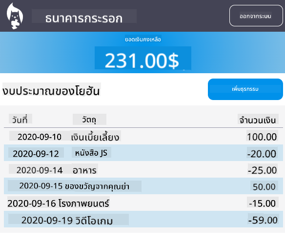

<!--
CO_OP_TRANSLATOR_METADATA:
{
  "original_hash": "f587e913e3f7c0b1c549a05dd74ee8e5",
  "translation_date": "2025-08-26T23:00:06+00:00",
  "source_file": "7-bank-project/3-data/README.md",
  "language_code": "th"
}
-->
# สร้างแอปธนาคาร ตอนที่ 3: วิธีการดึงและใช้งานข้อมูล

## แบบทดสอบก่อนเรียน

[แบบทดสอบก่อนเรียน](https://ff-quizzes.netlify.app/web/quiz/45)

### บทนำ

หัวใจสำคัญของทุกเว็บแอปพลิเคชันคือ *ข้อมูล* ข้อมูลอาจมีหลายรูปแบบ แต่จุดประสงค์หลักคือการแสดงข้อมูลให้ผู้ใช้เห็น ด้วยความซับซ้อนและการโต้ตอบที่เพิ่มขึ้นของเว็บแอป วิธีที่ผู้ใช้เข้าถึงและโต้ตอบกับข้อมูลจึงกลายเป็นส่วนสำคัญของการพัฒนาเว็บ

ในบทเรียนนี้ เราจะเรียนรู้วิธีดึงข้อมูลจากเซิร์ฟเวอร์แบบอะซิงโครนัส และใช้ข้อมูลนี้เพื่อแสดงผลบนหน้าเว็บโดยไม่ต้องโหลด HTML ใหม่

### ความรู้พื้นฐานที่ควรมี

คุณต้องสร้าง [ฟอร์มเข้าสู่ระบบและลงทะเบียน](../2-forms/README.md) ของเว็บแอปในบทเรียนก่อนหน้านี้ และติดตั้ง [Node.js](https://nodejs.org) รวมถึง [รัน API เซิร์ฟเวอร์](../api/README.md) บนเครื่องของคุณเพื่อให้ได้ข้อมูลบัญชี

คุณสามารถทดสอบว่าเซิร์ฟเวอร์ทำงานได้ถูกต้องโดยรันคำสั่งนี้ในเทอร์มินัล:

```sh
curl http://localhost:5000/api
# -> should return "Bank API v1.0.0" as a result
```

---

## AJAX และการดึงข้อมูล

เว็บไซต์แบบดั้งเดิมจะอัปเดตเนื้อหาที่แสดงเมื่อผู้ใช้คลิกลิงก์หรือส่งข้อมูลผ่านฟอร์ม โดยการโหลดหน้า HTML ใหม่ทุกครั้ง เมื่อใดก็ตามที่ต้องโหลดข้อมูลใหม่ เซิร์ฟเวอร์จะส่งหน้า HTML ใหม่ทั้งหมดกลับมา ซึ่งต้องประมวลผลโดยเบราว์เซอร์ กระบวนการนี้จะขัดจังหวะการกระทำของผู้ใช้และจำกัดการโต้ตอบระหว่างการโหลด กระบวนการนี้เรียกว่า *Multi-Page Application* หรือ *MPA*


เมื่อเว็บแอปพลิเคชันเริ่มซับซ้อนและโต้ตอบได้มากขึ้น เทคนิคใหม่ที่เรียกว่า [AJAX (Asynchronous JavaScript and XML)](https://en.wikipedia.org/wiki/Ajax_(programming)) ได้เกิดขึ้น เทคนิคนี้ช่วยให้เว็บแอปสามารถส่งและดึงข้อมูลจากเซิร์ฟเวอร์แบบอะซิงโครนัสโดยใช้ JavaScript โดยไม่ต้องโหลดหน้า HTML ใหม่ ทำให้การอัปเดตเร็วขึ้นและการโต้ตอบราบรื่นขึ้น เมื่อได้รับข้อมูลใหม่จากเซิร์ฟเวอร์ หน้า HTML ปัจจุบันสามารถอัปเดตได้ด้วย JavaScript ผ่าน [DOM](https://developer.mozilla.org/docs/Web/API/Document_Object_Model) API เทคนิคนี้พัฒนาไปสู่สิ่งที่เรียกว่า [*Single-Page Application* หรือ *SPA*](https://en.wikipedia.org/wiki/Single-page_application)


เมื่อ AJAX ถูกนำมาใช้ครั้งแรก API เดียวที่ใช้ดึงข้อมูลแบบอะซิงโครนัสคือ [`XMLHttpRequest`](https://developer.mozilla.org/docs/Web/API/XMLHttpRequest/Using_XMLHttpRequest) แต่เบราว์เซอร์สมัยใหม่ได้เพิ่ม [`Fetch` API](https://developer.mozilla.org/docs/Web/API/Fetch_API) ซึ่งสะดวกและทรงพลังมากกว่า โดยใช้ promises และเหมาะสมกับการจัดการข้อมูล JSON

> แม้ว่าเบราว์เซอร์สมัยใหม่ทั้งหมดจะรองรับ `Fetch API` แต่หากคุณต้องการให้เว็บแอปทำงานบนเบราว์เซอร์รุ่นเก่าหรือเบราว์เซอร์ที่ล้าสมัย ควรตรวจสอบ [ตารางความเข้ากันได้บน caniuse.com](https://caniuse.com/fetch) ก่อนเสมอ

### งานที่ต้องทำ

ใน [บทเรียนก่อนหน้า](../2-forms/README.md) เราได้สร้างฟอร์มลงทะเบียนเพื่อสร้างบัญชีแล้ว ตอนนี้เราจะเพิ่มโค้ดเพื่อเข้าสู่ระบบด้วยบัญชีที่มีอยู่ และดึงข้อมูลบัญชี เปิดไฟล์ `app.js` และเพิ่มฟังก์ชัน `login` ใหม่:

```js
async function login() {
  const loginForm = document.getElementById('loginForm')
  const user = loginForm.user.value;
}
```

ในที่นี้ เราเริ่มต้นด้วยการดึงองค์ประกอบฟอร์มด้วย `getElementById()` และดึงชื่อผู้ใช้จากอินพุตด้วย `loginForm.user.value` ทุกฟอร์มคอนโทรลสามารถเข้าถึงได้ผ่านชื่อ (ที่กำหนดใน HTML ด้วยแอตทริบิวต์ `name`) เป็นพร็อพเพอร์ตีของฟอร์ม

ในลักษณะเดียวกับที่เราทำสำหรับการลงทะเบียน เราจะสร้างฟังก์ชันอีกตัวเพื่อทำการร้องขอข้อมูลจากเซิร์ฟเวอร์ แต่ครั้งนี้เพื่อดึงข้อมูลบัญชี:

```js
async function getAccount(user) {
  try {
    const response = await fetch('//localhost:5000/api/accounts/' + encodeURIComponent(user));
    return await response.json();
  } catch (error) {
    return { error: error.message || 'Unknown error' };
  }
}
```

เราใช้ `fetch` API เพื่อร้องขอข้อมูลจากเซิร์ฟเวอร์แบบอะซิงโครนัส แต่ครั้งนี้เราไม่ต้องการพารามิเตอร์เพิ่มเติมนอกจาก URL ที่จะเรียก เนื่องจากเราเพียงแค่ดึงข้อมูล โดยค่าเริ่มต้น `fetch` จะสร้างคำขอ HTTP [`GET`](https://developer.mozilla.org/docs/Web/HTTP/Methods/GET) ซึ่งเป็นสิ่งที่เราต้องการในที่นี้

✅ `encodeURIComponent()` เป็นฟังก์ชันที่ใช้เข้ารหัสอักขระพิเศษสำหรับ URL หากเราไม่เรียกใช้ฟังก์ชันนี้และใช้ค่า `user` โดยตรงใน URL อาจเกิดปัญหาอะไรได้บ้าง?

ตอนนี้เราจะอัปเดตฟังก์ชัน `login` เพื่อใช้ `getAccount`:

```js
async function login() {
  const loginForm = document.getElementById('loginForm')
  const user = loginForm.user.value;
  const data = await getAccount(user);

  if (data.error) {
    return console.log('loginError', data.error);
  }

  account = data;
  navigate('/dashboard');
}
```

เนื่องจาก `getAccount` เป็นฟังก์ชันแบบอะซิงโครนัส เราจึงต้องใช้คำสั่ง `await` เพื่อรอผลลัพธ์จากเซิร์ฟเวอร์ เช่นเดียวกับคำขอเซิร์ฟเวอร์ใดๆ เราต้องจัดการกรณีที่เกิดข้อผิดพลาดด้วย สำหรับตอนนี้เราจะเพิ่มข้อความใน log เพื่อแสดงข้อผิดพลาด และจะกลับมาปรับปรุงในภายหลัง

จากนั้นเราต้องเก็บข้อมูลไว้ที่ใดที่หนึ่งเพื่อใช้แสดงข้อมูลแดชบอร์ดในภายหลัง เนื่องจากตัวแปร `account` ยังไม่มีอยู่ เราจะสร้างตัวแปร global สำหรับมันที่ด้านบนของไฟล์:

```js
let account = null;
```

หลังจากบันทึกข้อมูลผู้ใช้ลงในตัวแปรแล้ว เราสามารถนำทางจากหน้า *login* ไปยัง *dashboard* โดยใช้ฟังก์ชัน `navigate()` ที่เรามีอยู่แล้ว

สุดท้าย เราต้องเรียกใช้ฟังก์ชัน `login` เมื่อฟอร์มเข้าสู่ระบบถูกส่ง โดยแก้ไข HTML:

```html
<form id="loginForm" action="javascript:login()">
```

ทดสอบว่าทุกอย่างทำงานได้ถูกต้องโดยการลงทะเบียนบัญชีใหม่และลองเข้าสู่ระบบด้วยบัญชีเดียวกัน

ก่อนที่จะไปยังส่วนถัดไป เราสามารถเติมเต็มฟังก์ชัน `register` โดยเพิ่มโค้ดนี้ที่ด้านล่างของฟังก์ชัน:

```js
account = result;
navigate('/dashboard');
```

✅ คุณรู้หรือไม่ว่าโดยค่าเริ่มต้น คุณสามารถเรียกใช้ API เซิร์ฟเวอร์ได้เฉพาะจาก *โดเมนและพอร์ตเดียวกัน* กับหน้าเว็บที่คุณกำลังดูอยู่? นี่เป็นกลไกความปลอดภัยที่เบราว์เซอร์บังคับใช้ แต่เดี๋ยวก่อน เว็บแอปของเราทำงานบน `localhost:3000` ในขณะที่ API เซิร์ฟเวอร์ทำงานบน `localhost:5000` ทำไมถึงใช้งานได้? ด้วยการใช้เทคนิคที่เรียกว่า [Cross-Origin Resource Sharing (CORS)](https://developer.mozilla.org/docs/Web/HTTP/CORS) เราสามารถทำคำขอ HTTP ข้ามต้นทางได้หากเซิร์ฟเวอร์เพิ่มส่วนหัวพิเศษในคำตอบเพื่ออนุญาตข้อยกเว้นสำหรับโดเมนเฉพาะ

> เรียนรู้เพิ่มเติมเกี่ยวกับ API โดยเข้าร่วม [บทเรียนนี้](https://docs.microsoft.com/learn/modules/use-apis-discover-museum-art/?WT.mc_id=academic-77807-sagibbon)

## อัปเดต HTML เพื่อแสดงข้อมูล

ตอนนี้เรามีข้อมูลผู้ใช้แล้ว เราต้องอัปเดต HTML ที่มีอยู่เพื่อแสดงข้อมูลนั้น เรารู้อยู่แล้วว่าจะดึงองค์ประกอบจาก DOM ได้อย่างไร เช่น `document.getElementById()` หลังจากที่คุณมีองค์ประกอบพื้นฐานแล้ว นี่คือ API บางส่วนที่คุณสามารถใช้เพื่อแก้ไขหรือเพิ่มองค์ประกอบลูก:

- ใช้พร็อพเพอร์ตี [`textContent`](https://developer.mozilla.org/docs/Web/API/Node/textContent) เพื่อเปลี่ยนข้อความขององค์ประกอบ โปรดทราบว่าการเปลี่ยนค่านี้จะลบลูกทั้งหมดขององค์ประกอบ (ถ้ามี) และแทนที่ด้วยข้อความที่ให้มา ดังนั้นจึงเป็นวิธีที่มีประสิทธิภาพในการลบลูกทั้งหมดขององค์ประกอบที่กำหนดโดยกำหนดค่าเป็นสตริงว่าง `''`

- ใช้ [`document.createElement()`](https://developer.mozilla.org/docs/Web/API/Document/createElement) ร่วมกับเมธอด [`append()`](https://developer.mozilla.org/docs/Web/API/ParentNode/append) เพื่อสร้างและแนบองค์ประกอบลูกใหม่หนึ่งหรือหลายองค์ประกอบ

✅ การใช้พร็อพเพอร์ตี [`innerHTML`](https://developer.mozilla.org/docs/Web/API/Element/innerHTML) ขององค์ประกอบสามารถเปลี่ยนเนื้อหา HTML ได้เช่นกัน แต่ควรหลีกเลี่ยงเนื่องจากมีความเสี่ยงต่อการโจมตี [cross-site scripting (XSS)](https://developer.mozilla.org/docs/Glossary/Cross-site_scripting)

### งานที่ต้องทำ

ก่อนที่จะไปยังหน้าจอแดชบอร์ด มีสิ่งหนึ่งที่เราควรทำในหน้า *login* ปัจจุบัน หากคุณพยายามเข้าสู่ระบบด้วยชื่อผู้ใช้ที่ไม่มีอยู่ ข้อความจะแสดงในคอนโซล แต่สำหรับผู้ใช้ทั่วไปไม่มีอะไรเปลี่ยนแปลงและคุณไม่รู้ว่าเกิดอะไรขึ้น

เรามาเพิ่มองค์ประกอบ placeholder ในฟอร์มเข้าสู่ระบบเพื่อแสดงข้อความข้อผิดพลาดหากจำเป็น ตำแหน่งที่ดีคือก่อนปุ่ม `<button>`:

```html
...
<div id="loginError"></div>
<button>Login</button>
...
```

องค์ประกอบ `<div>` นี้ว่างเปล่า หมายความว่าจะไม่มีอะไรแสดงบนหน้าจอจนกว่าเราจะเพิ่มเนื้อหาให้กับมัน เราให้ `id` เพื่อให้สามารถดึงได้ง่ายด้วย JavaScript

กลับไปที่ไฟล์ `app.js` และสร้างฟังก์ชันช่วยเหลือใหม่ `updateElement`:

```js
function updateElement(id, text) {
  const element = document.getElementById(id);
  element.textContent = text;
}
```

ฟังก์ชันนี้ค่อนข้างตรงไปตรงมา: เมื่อได้รับ *id* ขององค์ประกอบและ *ข้อความ* มันจะอัปเดตข้อความขององค์ประกอบ DOM ที่มี `id` ตรงกัน เรามาใช้เมธอดนี้แทนข้อความข้อผิดพลาดในฟังก์ชัน `login`:

```js
if (data.error) {
  return updateElement('loginError', data.error);
}
```

ตอนนี้หากคุณพยายามเข้าสู่ระบบด้วยบัญชีที่ไม่ถูกต้อง คุณควรเห็นบางอย่างเช่นนี้:


ตอนนี้เรามีข้อความข้อผิดพลาดที่แสดงผลแบบมองเห็นได้ แต่ถ้าคุณลองใช้กับ screen reader คุณจะสังเกตเห็นว่าไม่มีอะไรถูกประกาศออกมา เพื่อให้ข้อความที่เพิ่มเข้ามาในหน้าแบบไดนามิกถูกประกาศโดย screen reader เราจำเป็นต้องใช้สิ่งที่เรียกว่า [Live Region](https://developer.mozilla.org/docs/Web/Accessibility/ARIA/ARIA_Live_Regions) ในที่นี้เราจะใช้ live region ประเภทหนึ่งที่เรียกว่า alert:

```html
<div id="loginError" role="alert"></div>
```

นำพฤติกรรมเดียวกันนี้ไปใช้กับข้อผิดพลาดในฟังก์ชัน `register` (อย่าลืมอัปเดต HTML)

## แสดงข้อมูลบนแดชบอร์ด

โดยใช้เทคนิคเดียวกับที่เราเพิ่งเรียนรู้ เราจะจัดการแสดงข้อมูลบัญชีบนหน้าแดชบอร์ด

นี่คือลักษณะของออบเจ็กต์บัญชีที่ได้รับจากเซิร์ฟเวอร์:

```json
{
  "user": "test",
  "currency": "$",
  "description": "Test account",
  "balance": 75,
  "transactions": [
    { "id": "1", "date": "2020-10-01", "object": "Pocket money", "amount": 50 },
    { "id": "2", "date": "2020-10-03", "object": "Book", "amount": -10 },
    { "id": "3", "date": "2020-10-04", "object": "Sandwich", "amount": -5 }
  ],
}
```

> หมายเหตุ: เพื่อให้ง่ายขึ้น คุณสามารถใช้บัญชี `test` ที่มีข้อมูลอยู่แล้ว

### งานที่ต้องทำ

เริ่มต้นด้วยการแทนที่ส่วน "Balance" ใน HTML เพื่อเพิ่มองค์ประกอบ placeholder:

```html
<section>
  Balance: <span id="balance"></span><span id="currency"></span>
</section>
```

เราจะเพิ่มส่วนใหม่ด้านล่างเพื่อแสดงคำอธิบายบัญชี:

```html
<h2 id="description"></h2>
```

✅ เนื่องจากคำอธิบายบัญชีทำหน้าที่เป็นหัวเรื่องสำหรับเนื้อหาด้านล่าง จึงถูกทำเครื่องหมายเชิงความหมายว่าเป็นหัวเรื่อง เรียนรู้เพิ่มเติมเกี่ยวกับ [โครงสร้างหัวเรื่อง](https://www.nomensa.com/blog/2017/how-structure-headings-web-accessibility) และพิจารณาโครงสร้างของหน้าเพื่อดูว่าส่วนใดควรเป็นหัวเรื่อง

ต่อไป เราจะสร้างฟังก์ชันใหม่ใน `app.js` เพื่อเติมข้อมูลใน placeholder:

```js
function updateDashboard() {
  if (!account) {
    return navigate('/login');
  }

  updateElement('description', account.description);
  updateElement('balance', account.balance.toFixed(2));
  updateElement('currency', account.currency);
}
```

ก่อนอื่น เราตรวจสอบว่าเรามีข้อมูลบัญชีที่ต้องการก่อนดำเนินการต่อ จากนั้นเราใช้ฟังก์ชัน `updateElement()` ที่เราสร้างขึ้นก่อนหน้านี้เพื่ออัปเดต HTML

> เพื่อให้การแสดงยอดเงินดูสวยงามขึ้น เราใช้เมธอด [`toFixed(2)`](https://developer.mozilla.org/docs/Web/JavaScript/Reference/Global_Objects/Number/toFixed) เพื่อบังคับให้แสดงค่าด้วย 2 หลักหลังจุดทศนิยม

ตอนนี้เราต้องเรียกใช้ฟังก์ชัน `updateDashboard()` ทุกครั้งที่โหลดหน้าแดชบอร์ด หากคุณทำ [งานในบทเรียนที่ 1](../1-template-route/assignment.md) เสร็จแล้ว นี่ควรจะง่าย หากไม่ คุณสามารถใช้การดำเนินการต่อไปนี้

เพิ่มโค้ดนี้ที่ส่วนท้ายของฟังก์ชัน `updateRoute()`:

```js
if (typeof route.init === 'function') {
  route.init();
}
```

และอัปเดตการกำหนดเส้นทางด้วย:

```js
const routes = {
  '/login': { templateId: 'login' },
  '/dashboard': { templateId: 'dashboard', init: updateDashboard }
};
```

ด้วยการเปลี่ยนแปลงนี้ ทุกครั้งที่แสดงหน้าแดชบอร์ด ฟังก์ชัน `updateDashboard()` จะถูกเรียกใช้ หลังจากเข้าสู่ระบบ คุณควรจะสามารถเห็นยอดเงิน สกุลเงิน และคำอธิบายบัญชีได้

## สร้างแถวในตารางแบบไดนามิกด้วย HTML Templates

ใน [บทเรียนแรก](../1-template-route/README.md) เราใช้ HTML templates ร่วมกับเมธอด [`appendChild()`](https://developer.mozilla.org/docs/Web/API/Node/appendChild) เพื่อใช้งานการนำทางในแอปของเรา Templates ยังสามารถมีขนาดเล็กและใช้เติมส่วนที่ซ้ำๆ ของหน้าแบบไดนามิกได้

เราจะใช้วิธีเดียวกันนี้เพื่อแสดงรายการธุรกรรมในตาราง HTML

### งานที่ต้องทำ

เพิ่ม template ใหม่ใน `<body>` ของ HTML:

```html
<template id="transaction">
  <tr>
    <td></td>
    <td></td>
    <td></td>
  </tr>
</template>
```

Template นี้แสดงถึงแถวในตารางเดียว โดยมี 3 คอลัมน์ที่เราต้องเติม: *วันที่* *วัตถุ* และ *จำนวนเงิน* ของธุรกรรม

จากนั้น เพิ่มพร็อพเพอร์ตี `id` ให้กับ `<tbody>` ของตารางใน template แดชบอร์ดเพื่อให้ง่ายต่อการค้นหาโดยใช้ JavaScript:

```html
<tbody id="transactions"></tbody>
```

HTML ของเราพร้อมแล้ว มาสลับไปที่โค้ด JavaScript และสร้างฟังก์ชันใหม่ `createTransactionRow`:

```js
function createTransactionRow(transaction) {
  const template = document.getElementById('transaction');
  const transactionRow = template.content.cloneNode(true);
  const tr = transactionRow.querySelector('tr');
  tr.children[0].textContent = transaction.date;
  tr.children[1].textContent = transaction.object;
  tr.children[2].textContent = transaction.amount.toFixed(2);
  return transactionRow;
}
```

ฟังก์ชันนี้ทำตามชื่อของมัน: โดยใช้ template ที่เราสร้างขึ้นก่อนหน้านี้ มันสร้างแถวใหม่ในตารางและเติมเนื้อหาด้วยข้อมูลธุรกรรม เราจะใช้สิ่งนี้ในฟังก์ชัน `updateDashboard()` เพื่อเติมข้อมูลในตาราง:

```js
const transactionsRows = document.createDocumentFragment();
for (const transaction of account.transactions) {
  const transactionRow = createTransactionRow(transaction);
  transactionsRows.appendChild(transactionRow);
}
updateElement('transactions', transactionsRows);
```

ในที่นี้ เราใช้เมธอด [`document.createDocumentFragment()`](https://developer.mozilla.org/docs/Web/API/Document/createDocumentFragment) ซึ่งสร้าง fragment DOM ใหม่ที่เราสามารถทำงานได้ ก่อนที่จะเพิ่มลงในตาราง HTML ของเราในที่สุด

ยังมีสิ่งหนึ่งที่เราต้องทำก่อนที่โค้ดนี้จะทำงานได้ เนื่องจากฟังก์ชัน `updateElement()` ของเราปัจจุบันรองรับเฉพาะข้อความเท่านั้น เรามาเปลี่ยนโค้ดของมันเล็กน้อย:

```js
function updateElement(id, textOrNode) {
  const element = document.getElementById(id);
  element.textContent = ''; // Removes all children
  element.append(textOrNode);
}
```

เราใช้เมธอด [`append()`](https://developer.mozilla.org/docs/Web/API/ParentNode/append) เนื่องจากมันอนุญาตให้แนบทั้งข้อความหรือ [DOM Nodes](https://developer.mozilla.org/docs/Web/API/Node) กับองค์ประกอบแม่ ซึ่งเหมาะสำหรับทุกกรณีการใช้งานของเรา
หากคุณลองใช้บัญชี `test` เพื่อเข้าสู่ระบบ ตอนนี้คุณควรจะเห็นรายการธุรกรรมบนแดชบอร์ดแล้ว 🎉

---

## 🚀 ความท้าทาย

ทำงานร่วมกันเพื่อทำให้หน้าแดชบอร์ดดูเหมือนแอปธนาคารจริง หากคุณได้ออกแบบแอปของคุณแล้ว ลองใช้ [media queries](https://developer.mozilla.org/docs/Web/CSS/Media_Queries) เพื่อสร้าง [การออกแบบที่ตอบสนอง](https://developer.mozilla.org/docs/Web/Progressive_web_apps/Responsive/responsive_design_building_blocks) ซึ่งทำงานได้ดีทั้งบนอุปกรณ์เดสก์ท็อปและมือถือ

นี่คือตัวอย่างของหน้าแดชบอร์ดที่ได้รับการออกแบบ:



## แบบทดสอบหลังการบรรยาย

[แบบทดสอบหลังการบรรยาย](https://ff-quizzes.netlify.app/web/quiz/46)

## งานที่ได้รับมอบหมาย

[ปรับปรุงและใส่คอมเมนต์ในโค้ดของคุณ](assignment.md)

---

**ข้อจำกัดความรับผิดชอบ**:  
เอกสารนี้ได้รับการแปลโดยใช้บริการแปลภาษา AI [Co-op Translator](https://github.com/Azure/co-op-translator) แม้ว่าเราจะพยายามให้การแปลมีความถูกต้องมากที่สุด แต่โปรดทราบว่าการแปลโดยอัตโนมัติอาจมีข้อผิดพลาดหรือความไม่ถูกต้อง เอกสารต้นฉบับในภาษาดั้งเดิมควรถือเป็นแหล่งข้อมูลที่เชื่อถือได้ สำหรับข้อมูลที่สำคัญ ขอแนะนำให้ใช้บริการแปลภาษามืออาชีพ เราจะไม่รับผิดชอบต่อความเข้าใจผิดหรือการตีความผิดที่เกิดจากการใช้การแปลนี้