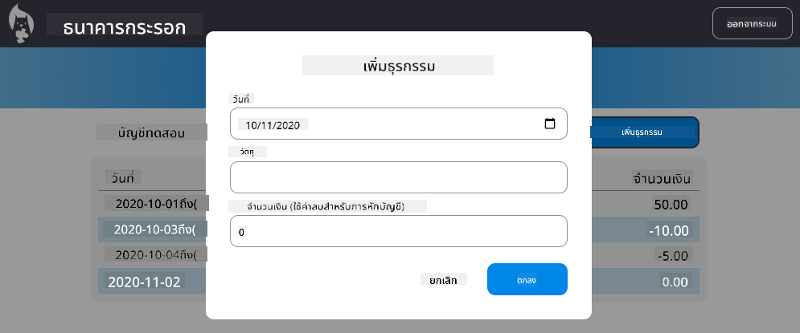

<!--
CO_OP_TRANSLATOR_METADATA:
{
  "original_hash": "4fa20c513e367e9cdd401bf49ae16e33",
  "translation_date": "2025-08-26T23:10:07+00:00",
  "source_file": "7-bank-project/4-state-management/README.md",
  "language_code": "th"
}
-->
# สร้างแอปธนาคาร ตอนที่ 4: แนวคิดการจัดการสถานะ

## แบบทดสอบก่อนเรียน

[แบบทดสอบก่อนเรียน](https://ashy-river-0debb7803.1.azurestaticapps.net/quiz/47)

### บทนำ

เมื่อแอปพลิเคชันเว็บเติบโตขึ้น การติดตามการไหลของข้อมูลทั้งหมดกลายเป็นเรื่องท้าทาย โค้ดใดที่ได้รับข้อมูล หน้าต่างใดที่ใช้ข้อมูลนั้น ข้อมูลต้องได้รับการอัปเดตที่ไหนและเมื่อไหร่... เป็นเรื่องง่ายที่จะจบลงด้วยโค้ดที่ยุ่งเหยิงและยากต่อการดูแลรักษา โดยเฉพาะอย่างยิ่งเมื่อคุณต้องแชร์ข้อมูลระหว่างหน้าต่างๆ ของแอป เช่น ข้อมูลผู้ใช้ แนวคิดของ *การจัดการสถานะ* มีอยู่ในโปรแกรมทุกประเภทมาโดยตลอด แต่เมื่อแอปเว็บมีความซับซ้อนมากขึ้น การจัดการสถานะกลายเป็นจุดสำคัญที่ต้องพิจารณาในระหว่างการพัฒนา

ในส่วนสุดท้ายนี้ เราจะพิจารณาแอปที่เราได้สร้างขึ้นเพื่อทบทวนวิธีการจัดการสถานะ โดยรองรับการรีเฟรชเบราว์เซอร์ได้ทุกเมื่อ และสามารถเก็บข้อมูลไว้ได้ตลอดเซสชันของผู้ใช้

### สิ่งที่ต้องมีมาก่อน

คุณจำเป็นต้องทำส่วน [การดึงข้อมูล](../3-data/README.md) ของแอปเว็บให้เสร็จสมบูรณ์ก่อนบทเรียนนี้ นอกจากนี้ คุณยังต้องติดตั้ง [Node.js](https://nodejs.org) และ [รันเซิร์ฟเวอร์ API](../api/README.md) บนเครื่องของคุณเพื่อจัดการข้อมูลบัญชี

คุณสามารถทดสอบว่าเซิร์ฟเวอร์ทำงานได้อย่างถูกต้องโดยการรันคำสั่งนี้ในเทอร์มินัล:

```sh
curl http://localhost:5000/api
# -> should return "Bank API v1.0.0" as a result
```

---

## ทบทวนการจัดการสถานะ

ใน [บทเรียนก่อนหน้า](../3-data/README.md) เราได้แนะนำแนวคิดพื้นฐานของสถานะในแอปของเราด้วยตัวแปร `account` แบบโกลบอลที่เก็บข้อมูลธนาคารของผู้ใช้ที่ล็อกอินอยู่ในปัจจุบัน อย่างไรก็ตาม การใช้งานในปัจจุบันของเรายังมีข้อบกพร่อง ลองรีเฟรชหน้าขณะอยู่ในแดชบอร์ดดูสิ เกิดอะไรขึ้น?

มีปัญหา 3 ข้อในโค้ดปัจจุบัน:

- สถานะไม่ได้ถูกเก็บไว้ เมื่อรีเฟรชเบราว์เซอร์ คุณจะกลับไปที่หน้าล็อกอิน
- มีฟังก์ชันหลายตัวที่แก้ไขสถานะ เมื่อแอปเติบโตขึ้น อาจทำให้ยากต่อการติดตามการเปลี่ยนแปลง และง่ายที่จะลืมอัปเดตบางส่วน
- สถานะไม่ได้ถูกล้าง ดังนั้นเมื่อคุณคลิก *Logout* ข้อมูลบัญชียังคงอยู่แม้ว่าคุณจะอยู่ในหน้าล็อกอิน

เราอาจอัปเดตโค้ดของเราเพื่อแก้ไขปัญหาเหล่านี้ทีละข้อ แต่จะทำให้เกิดการทำซ้ำของโค้ดมากขึ้นและทำให้แอปซับซ้อนและยากต่อการดูแลรักษา หรือเราสามารถหยุดคิดใหม่เกี่ยวกับกลยุทธ์ของเราได้

> ปัญหาอะไรที่เรากำลังพยายามแก้ไขจริงๆ?

[การจัดการสถานะ](https://en.wikipedia.org/wiki/State_management) คือการหาวิธีที่ดีในการแก้ปัญหาเฉพาะสองข้อ:

- จะทำให้การไหลของข้อมูลในแอปเข้าใจง่ายได้อย่างไร?
- จะทำให้ข้อมูลสถานะสอดคล้องกับอินเทอร์เฟซผู้ใช้เสมอ (และในทางกลับกัน) ได้อย่างไร?

เมื่อคุณจัดการกับปัญหาเหล่านี้แล้ว ปัญหาอื่นๆ ที่คุณอาจมีอาจได้รับการแก้ไขไปแล้วหรือกลายเป็นเรื่องง่ายขึ้นที่จะจัดการ มีวิธีการมากมายในการแก้ปัญหาเหล่านี้ แต่เราจะเลือกใช้วิธีแก้ปัญหาทั่วไปที่ประกอบด้วย **การรวมศูนย์ข้อมูลและวิธีการเปลี่ยนแปลงข้อมูล** การไหลของข้อมูลจะเป็นดังนี้:


> เราจะไม่ครอบคลุมส่วนที่ข้อมูลกระตุ้นการอัปเดตมุมมองโดยอัตโนมัติ เนื่องจากเกี่ยวข้องกับแนวคิดขั้นสูงของ [Reactive Programming](https://en.wikipedia.org/wiki/Reactive_programming) ซึ่งเป็นหัวข้อที่ดีสำหรับการศึกษาเพิ่มเติม

✅ มีไลบรารีมากมายที่มีแนวทางต่างๆ ในการจัดการสถานะ เช่น [Redux](https://redux.js.org) ซึ่งเป็นตัวเลือกยอดนิยม ลองศึกษาคอนเซปต์และรูปแบบที่ใช้ เพราะมักจะเป็นวิธีที่ดีในการเรียนรู้ปัญหาที่อาจเกิดขึ้นในแอปเว็บขนาดใหญ่และวิธีแก้ไข

### งาน

เราจะเริ่มต้นด้วยการปรับโครงสร้างโค้ดเล็กน้อย แทนที่การประกาศ `account` ด้วย:

```js
let account = null;
```

ด้วย:

```js
let state = {
  account: null
};
```

แนวคิดคือการ *รวมศูนย์* ข้อมูลแอปทั้งหมดไว้ในออบเจ็กต์สถานะเดียว ตอนนี้เรามีเพียง `account` ในสถานะ ดังนั้นจึงไม่ได้เปลี่ยนแปลงมากนัก แต่สร้างเส้นทางสำหรับการพัฒนาในอนาคต

เรายังต้องอัปเดตฟังก์ชันที่ใช้งานมัน ในฟังก์ชัน `register()` และ `login()` ให้แทนที่ `account = ...` ด้วย `state.account = ...`;

ที่ด้านบนของฟังก์ชัน `updateDashboard()` ให้เพิ่มบรรทัดนี้:

```js
const account = state.account;
```

การปรับโครงสร้างนี้เองไม่ได้ทำให้เกิดการปรับปรุงมากนัก แต่แนวคิดคือการวางรากฐานสำหรับการเปลี่ยนแปลงถัดไป

## ติดตามการเปลี่ยนแปลงข้อมูล

ตอนนี้เราได้ตั้งค่าออบเจ็กต์ `state` เพื่อเก็บข้อมูลของเราแล้ว ขั้นตอนต่อไปคือการรวมศูนย์การอัปเดต เป้าหมายคือทำให้การติดตามการเปลี่ยนแปลงและเวลาที่เกิดขึ้นง่ายขึ้น

เพื่อหลีกเลี่ยงการเปลี่ยนแปลงที่เกิดขึ้นกับออบเจ็กต์ `state` การพิจารณาให้มันเป็น [*immutable*](https://en.wikipedia.org/wiki/Immutable_object) หรือไม่สามารถแก้ไขได้เลยก็เป็นแนวปฏิบัติที่ดี
[แบบทดสอบหลังการบรรยาย](https://ashy-river-0debb7803.1.azurestaticapps.net/quiz/48)

## งานที่ได้รับมอบหมาย

[สร้าง "เพิ่มธุรกรรม" ในรูปแบบของหน้าต่างสนทนา](assignment.md)

นี่คือตัวอย่างผลลัพธ์หลังจากทำงานที่ได้รับมอบหมายเสร็จสิ้น:



---

**ข้อจำกัดความรับผิดชอบ**:  
เอกสารนี้ได้รับการแปลโดยใช้บริการแปลภาษา AI [Co-op Translator](https://github.com/Azure/co-op-translator) แม้ว่าเราจะพยายามให้การแปลมีความถูกต้องมากที่สุด แต่โปรดทราบว่าการแปลโดยอัตโนมัติอาจมีข้อผิดพลาดหรือความไม่ถูกต้อง เอกสารต้นฉบับในภาษาดั้งเดิมควรถือเป็นแหล่งข้อมูลที่เชื่อถือได้ สำหรับข้อมูลที่สำคัญ ขอแนะนำให้ใช้บริการแปลภาษามืออาชีพ เราจะไม่รับผิดชอบต่อความเข้าใจผิดหรือการตีความผิดที่เกิดจากการใช้การแปลนี้