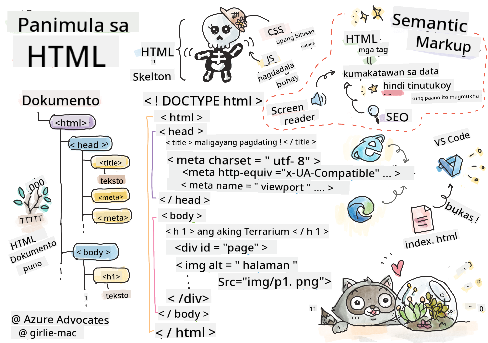
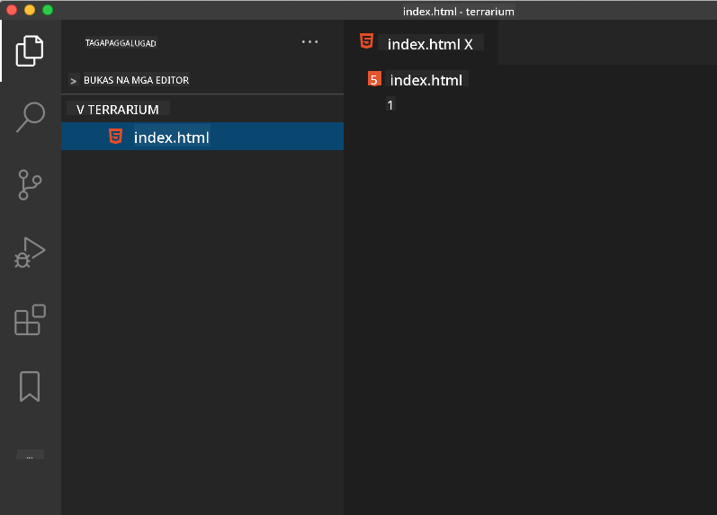

<!--
CO_OP_TRANSLATOR_METADATA:
{
  "original_hash": "46a0639e719b9cf1dfd062aa24cad639",
  "translation_date": "2025-08-27T22:57:28+00:00",
  "source_file": "3-terrarium/1-intro-to-html/README.md",
  "language_code": "tl"
}
-->
# Terrarium Project Part 1: Panimula sa HTML


> Sketchnote ni [Tomomi Imura](https://twitter.com/girlie_mac)

## Pre-Lecture Quiz

[Pre-lecture quiz](https://ff-quizzes.netlify.app/web/quiz/15)


> Panoorin ang video

> 
> [](https://www.youtube.com/watch?v=1TvxJKBzhyQ)

### Panimula

Ang HTML, o HyperText Markup Language, ang 'balangkas' ng web. Kung ang CSS ang 'nagpapaganda' sa iyong HTML at ang JavaScript ang nagbibigay-buhay dito, ang HTML ang katawan ng iyong web application. Ang syntax ng HTML ay sumasalamin sa ideyang ito, dahil kasama nito ang mga tag tulad ng "head", "body", at "footer".

Sa araling ito, gagamitin natin ang HTML upang ilayout ang 'balangkas' ng interface ng ating virtual terrarium. Magkakaroon ito ng pamagat at tatlong column: isang kanan at kaliwang column kung saan matatagpuan ang mga draggable na halaman, at isang gitnang bahagi na magiging aktwal na terrarium na mukhang salamin. Sa pagtatapos ng araling ito, makikita mo ang mga halaman sa mga column, ngunit medyo kakaiba ang itsura ng interface; huwag mag-alala, sa susunod na seksyon ay magdadagdag ka ng mga estilo gamit ang CSS upang mas maganda ang itsura nito.

### Gawain

Sa iyong computer, gumawa ng folder na tinatawag na 'terrarium' at sa loob nito, isang file na tinatawag na 'index.html'. Maaari mo itong gawin sa Visual Studio Code pagkatapos mong likhain ang terrarium folder sa pamamagitan ng pagbukas ng bagong VS Code window, pag-click sa 'open folder', at pag-navigate sa iyong bagong folder. I-click ang maliit na 'file' button sa Explorer pane at gumawa ng bagong file:



O

Gamitin ang mga command na ito sa iyong git bash:
* `mkdir terrarium`
* `cd terrarium`
* `touch index.html`
* `code index.html` o `nano index.html`

> Ang mga index.html file ay nagpapahiwatig sa browser na ito ang default na file sa isang folder; ang mga URL tulad ng `https://anysite.com/test` ay maaaring binuo gamit ang istruktura ng folder na may kasamang folder na tinatawag na `test` na may `index.html` sa loob nito; hindi kailangang ipakita ang `index.html` sa URL.

---

## Ang DocType at html tags

Ang unang linya ng isang HTML file ay ang doctype nito. Medyo nakakagulat na kailangan mong ilagay ang linyang ito sa pinakataas ng file, ngunit sinasabi nito sa mga lumang browser na kailangang i-render ng browser ang pahina sa standard mode, na sumusunod sa kasalukuyang html specification.

> Tip: sa VS Code, maaari kang mag-hover sa isang tag at makakuha ng impormasyon tungkol sa paggamit nito mula sa MDN Reference guides.

Ang pangalawang linya ay dapat ang opening tag ng `<html>`, na sinusundan ng closing tag nito na `</html>`. Ang mga tag na ito ang root elements ng iyong interface.

### Gawain

Idagdag ang mga linyang ito sa itaas ng iyong `index.html` file:

```HTML
<!DOCTYPE html>
<html></html>
```

✅ May ilang iba't ibang mode na maaaring matukoy sa pamamagitan ng pag-set ng DocType gamit ang query string: [Quirks Mode at Standards Mode](https://developer.mozilla.org/docs/Web/HTML/Quirks_Mode_and_Standards_Mode). Ang mga mode na ito ay ginagamit upang suportahan ang mga lumang browser na hindi na karaniwang ginagamit ngayon (Netscape Navigator 4 at Internet Explorer 5). Maaari kang manatili sa standard doctype declaration.

---

## Ang 'head' ng dokumento

Ang 'head' na bahagi ng HTML document ay naglalaman ng mahalagang impormasyon tungkol sa iyong web page, na kilala rin bilang [metadata](https://developer.mozilla.org/docs/Web/HTML/Element/meta). Sa ating kaso, sinasabi natin sa web server kung saan ipapadala ang pahinang ito upang ma-render, ang apat na bagay na ito:

-   ang pamagat ng pahina
-   metadata ng pahina kabilang ang:
    -   ang 'character set', na nagsasabi kung anong character encoding ang ginagamit sa pahina
    -   impormasyon ng browser, kabilang ang `x-ua-compatible` na nagpapahiwatig na sinusuportahan ang browser na IE=edge
    -   impormasyon tungkol sa kung paano dapat kumilos ang viewport kapag ito ay na-load. Ang pag-set ng viewport na may initial scale na 1 ay kumokontrol sa zoom level kapag unang na-load ang pahina.

### Gawain

Magdagdag ng 'head' block sa iyong dokumento sa pagitan ng opening at closing `<html>` tags.

```html
<head>
	<title>Welcome to my Virtual Terrarium</title>
	<meta charset="utf-8" />
	<meta http-equiv="X-UA-Compatible" content="IE=edge" />
	<meta name="viewport" content="width=device-width, initial-scale=1" />
</head>
```

✅ Ano ang mangyayari kung mag-set ka ng viewport meta tag tulad nito: `<meta name="viewport" content="width=600">`? Magbasa pa tungkol sa [viewport](https://developer.mozilla.org/docs/Web/HTML/Viewport_meta_tag).

---

## Ang `body` ng dokumento

### HTML Tags

Sa HTML, nagdadagdag ka ng mga tag sa iyong .html file upang lumikha ng mga elemento ng isang web page. Karaniwan, ang bawat tag ay may opening at closing tag, tulad nito: `<p>hello</p>` upang ipahiwatig ang isang talata. Lumikha ng katawan ng iyong interface sa pamamagitan ng pagdaragdag ng isang set ng `<body>` tags sa loob ng `<html>` tag pair; ang iyong markup ay magiging ganito:

### Gawain

```html
<!DOCTYPE html>
<html>
	<head>
		<title>Welcome to my Virtual Terrarium</title>
		<meta charset="utf-8" />
		<meta http-equiv="X-UA-Compatible" content="IE=edge" />
		<meta name="viewport" content="width=device-width, initial-scale=1" />
	</head>
	<body></body>
</html>
```

Ngayon, maaari mo nang simulan ang pagbuo ng iyong pahina. Karaniwan, ginagamit mo ang `<div>` tags upang lumikha ng magkakahiwalay na elemento sa isang pahina. Lilikha tayo ng serye ng `<div>` elements na maglalaman ng mga larawan.

### Mga Larawan

Ang isang html tag na hindi nangangailangan ng closing tag ay ang `` tag, dahil mayroon itong `src` element na naglalaman ng lahat ng impormasyon na kailangan ng pahina upang i-render ang item.

Gumawa ng folder sa iyong app na tinatawag na `images` at doon, idagdag ang lahat ng mga larawan mula sa [source code folder](../../../../3-terrarium/solution/images); (mayroong 14 na larawan ng mga halaman).

### Gawain

Idagdag ang mga larawan ng halaman sa dalawang column sa pagitan ng `<body></body>` tags:

```html
<div id="page">
	<div id="left-container" class="container">
		<div class="plant-holder">
			
		</div>
		<div class="plant-holder">
			
		</div>
		<div class="plant-holder">
			
		</div>
		<div class="plant-holder">
			
		</div>
		<div class="plant-holder">
			
		</div>
		<div class="plant-holder">
			
		</div>
		<div class="plant-holder">
			
		</div>
	</div>
	<div id="right-container" class="container">
		<div class="plant-holder">
			
		</div>
		<div class="plant-holder">
			
		</div>
		<div class="plant-holder">
			
		</div>
		<div class="plant-holder">
			
		</div>
		<div class="plant-holder">
			
		</div>
		<div class="plant-holder">
			
		</div>
		<div class="plant-holder">
			
		</div>
	</div>
</div>
```

> Note: Spans vs. Divs. Ang Divs ay itinuturing na 'block' elements, at ang Spans ay 'inline'. Ano ang mangyayari kung gagawin mong spans ang mga divs na ito?

Sa markup na ito, ang mga halaman ay lalabas na sa screen. Mukhang hindi maganda, dahil hindi pa sila naka-style gamit ang CSS, at gagawin natin iyon sa susunod na aralin.

Ang bawat larawan ay may alt text na lalabas kahit hindi mo makita o ma-render ang larawan. Mahalagang attribute ito para sa accessibility. Matuto pa tungkol sa accessibility sa mga susunod na aralin; sa ngayon, tandaan na ang alt attribute ay nagbibigay ng alternatibong impormasyon para sa isang larawan kung sakaling hindi ito makita ng user (dahil sa mabagal na koneksyon, error sa src attribute, o kung gumagamit ang user ng screen reader).

✅ Napansin mo ba na ang bawat larawan ay may parehong alt tag? Magandang kasanayan ba ito? Bakit o bakit hindi? Paano mo mapapabuti ang code na ito?

---

## Semantic markup

Sa pangkalahatan, mas mainam na gumamit ng makabuluhang 'semantics' kapag nagsusulat ng HTML. Ano ang ibig sabihin nito? Nangangahulugan ito na ginagamit mo ang mga HTML tags upang kumatawan sa uri ng data o interaksyon na dinisenyo para sa kanila. Halimbawa, ang pangunahing pamagat na teksto sa isang pahina ay dapat gumamit ng `<h1>` tag.

Idagdag ang sumusunod na linya sa ibaba ng iyong opening `<body>` tag:

```html
<h1>My Terrarium</h1>
```

Ang paggamit ng semantic markup tulad ng paggamit ng `<h1>` para sa mga header at `<ul>` para sa unordered lists ay tumutulong sa mga screen reader na mag-navigate sa isang pahina. Sa pangkalahatan, ang mga button ay dapat isulat bilang `<button>` at ang mga listahan ay dapat `<li>`. Bagama't _posible_ na gumamit ng specially styled `<span>` elements na may click handlers upang gayahin ang mga button, mas mainam para sa mga may kapansanan na gumamit ng teknolohiya upang matukoy kung saan sa isang pahina matatagpuan ang isang button, at makipag-ugnayan dito, kung ang elemento ay lumalabas bilang isang button. Para sa kadahilanang ito, subukang gumamit ng semantic markup hangga't maaari.

✅ Tingnan ang isang screen reader at [kung paano ito nakikipag-ugnayan sa isang web page](https://www.youtube.com/watch?v=OUDV1gqs9GA). Nakikita mo ba kung bakit maaaring makainis ang user sa hindi semantic markup?

## Ang terrarium

Ang huling bahagi ng interface na ito ay kinabibilangan ng paglikha ng markup na i-style upang lumikha ng terrarium.

### Gawain:

Idagdag ang markup na ito sa itaas ng huling `</div>` tag:

```html
<div id="terrarium">
	<div class="jar-top"></div>
	<div class="jar-walls">
		<div class="jar-glossy-long"></div>
		<div class="jar-glossy-short"></div>
	</div>
	<div class="dirt"></div>
	<div class="jar-bottom"></div>
</div>
```

✅ Kahit na idinagdag mo ang markup na ito sa screen, wala kang makikitang na-render. Bakit?

---

## 🚀Hamunin

May ilang kakaibang 'lumang' tags sa HTML na masaya pa ring gamitin, bagama't hindi mo dapat gamitin ang mga deprecated tags tulad ng [mga tag na ito](https://developer.mozilla.org/docs/Web/HTML/Element#Obsolete_and_deprecated_elements) sa iyong markup. Gayunpaman, maaari mo bang gamitin ang lumang `<marquee>` tag upang gawing horizontal na gumagalaw ang h1 title? (kung gagawin mo, huwag kalimutang alisin ito pagkatapos)

## Post-Lecture Quiz

[Post-lecture quiz](https://ff-quizzes.netlify.app/web/quiz/16)

## Review & Self Study

Ang HTML ay ang 'subok na' sistema ng pagbuo na tumulong sa pagbuo ng web sa kung ano ito ngayon. Alamin ang kaunti tungkol sa kasaysayan nito sa pamamagitan ng pag-aaral ng mga lumang at bagong tags. Kaya mo bang alamin kung bakit ang ilang tags ay na-deprecate at ang iba ay idinagdag? Anong tags ang maaaring ipakilala sa hinaharap?

Matuto pa tungkol sa pagbuo ng mga site para sa web at mga mobile device sa [Microsoft Learn](https://docs.microsoft.com/learn/modules/build-simple-website/?WT.mc_id=academic-77807-sagibbon).


## Takdang-Aralin

[Sanayin ang iyong HTML: Gumawa ng blog mockup](assignment.md)

---

**Paunawa**:  
Ang dokumentong ito ay isinalin gamit ang AI translation service na [Co-op Translator](https://github.com/Azure/co-op-translator). Bagama't sinisikap naming maging tumpak, tandaan na ang mga awtomatikong pagsasalin ay maaaring maglaman ng mga pagkakamali o hindi pagkakatugma. Ang orihinal na dokumento sa kanyang katutubong wika ang dapat ituring na opisyal na sanggunian. Para sa mahalagang impormasyon, inirerekomenda ang propesyonal na pagsasalin ng tao. Hindi kami mananagot sa anumang hindi pagkakaunawaan o maling interpretasyon na maaaring magmula sa paggamit ng pagsasaling ito.