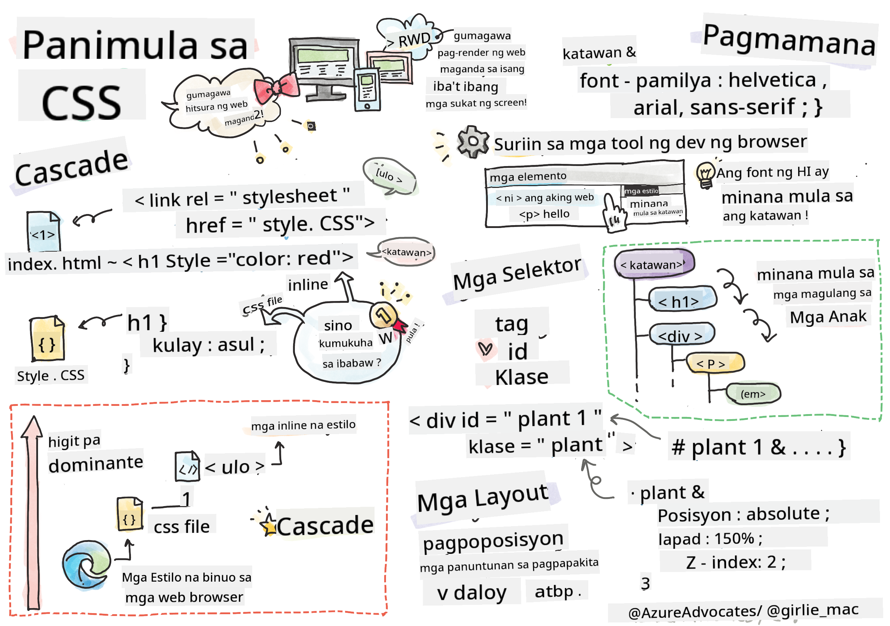
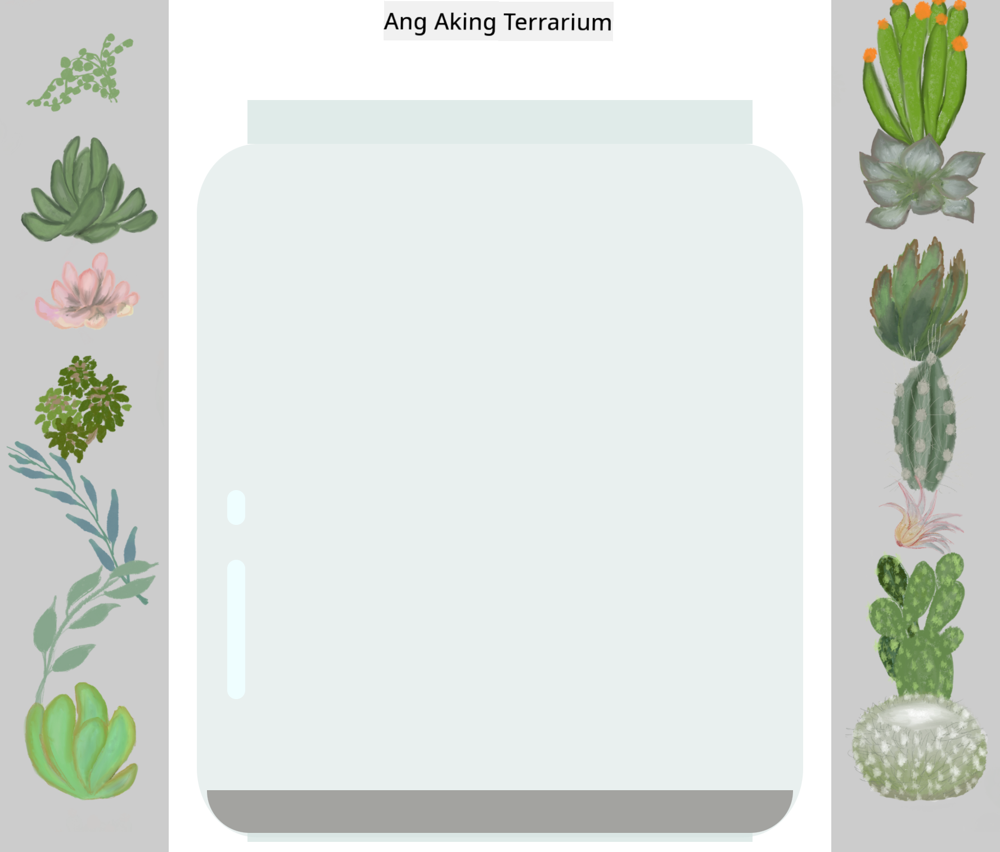

<!--
CO_OP_TRANSLATOR_METADATA:
{
  "original_hash": "e375c2aeb94e2407f2667633d39580bd",
  "translation_date": "2025-08-27T23:00:18+00:00",
  "source_file": "3-terrarium/2-intro-to-css/README.md",
  "language_code": "tl"
}
-->
# Terrarium Project Part 2: Panimula sa CSS


> Sketchnote ni [Tomomi Imura](https://twitter.com/girlie_mac)

## Pre-Lecture Quiz

[Pre-lecture quiz](https://ashy-river-0debb7803.1.azurestaticapps.net/quiz/17)

### Panimula

Ang CSS, o Cascading Style Sheets, ay nag-aalok ng solusyon sa mahalagang problema sa web development: kung paano gawing maganda ang hitsura ng iyong website. Ang pag-istilo sa iyong mga app ay nagpapaganda sa kanilang usability at aesthetic; maaari mo ring gamitin ang CSS para sa Responsive Web Design (RWD) - upang magmukhang maayos ang iyong mga app kahit anong laki ng screen ang gamit. Hindi lang tungkol sa pagpapaganda ng hitsura ang CSS; kasama sa spec nito ang mga animation at transform na nagbibigay-daan sa mas sopistikadong interaksyon para sa iyong mga app. Ang CSS Working Group ang tumutulong sa pagpapanatili ng kasalukuyang mga CSS specification; maaari mong sundan ang kanilang trabaho sa [World Wide Web Consortium's site](https://www.w3.org/Style/CSS/members).

> Tandaan, ang CSS ay isang wika na patuloy na nagbabago, tulad ng lahat ng bagay sa web, at hindi lahat ng browser ay sumusuporta sa mga mas bagong bahagi ng specification. Palaging suriin ang iyong mga implementasyon sa pamamagitan ng [CanIUse.com](https://caniuse.com).

Sa araling ito, magdadagdag tayo ng mga estilo sa ating online terrarium at matututo ng higit pa tungkol sa ilang konsepto ng CSS: ang cascade, inheritance, at ang paggamit ng selectors, positioning, at paggamit ng CSS para bumuo ng mga layout. Sa proseso, ilalayout natin ang terrarium at gagawin ang aktwal na terrarium mismo.

### Paunang Kaalaman

Dapat ay mayroon ka nang HTML para sa iyong terrarium na handa nang istiluhin.

> Panoorin ang video

> 
> [](https://www.youtube.com/watch?v=6yIdOIV9p1I)

### Gawain

Sa iyong terrarium folder, gumawa ng bagong file na tinatawag na `style.css`. I-import ang file na iyon sa seksyong `<head>`:

```html
<link rel="stylesheet" href="./style.css" />
```

---

## Ang Cascade

Ang Cascading Style Sheets ay nagtataglay ng ideya na ang mga estilo ay 'nagka-cascade' kung saan ang aplikasyon ng isang estilo ay ginagabayan ng priyoridad nito. Ang mga estilo na itinakda ng may-akda ng website ay may priyoridad kaysa sa mga itinakda ng browser. Ang mga estilo na itinakda 'inline' ay may priyoridad kaysa sa mga itinakda sa isang external style sheet.

### Gawain

Magdagdag ng inline style na "color: red" sa iyong `<h1>` tag:

```HTML
<h1 style="color: red">My Terrarium</h1>
```

Pagkatapos, idagdag ang sumusunod na code sa iyong `style.css` file:

```CSS
h1 {
 color: blue;
}
```

✅ Anong kulay ang lumalabas sa iyong web app? Bakit? Maaari mo bang hanapin ang paraan para i-override ang mga estilo? Kailan mo gustong gawin ito, o bakit hindi?

---

## Inheritance

Ang mga estilo ay namamana mula sa isang ancestor style patungo sa isang descendent, kung saan ang mga nested na elemento ay namamana ang mga estilo ng kanilang mga magulang.

### Gawain

Itakda ang font ng body sa isang ibinigay na font, at suriin kung ang font ng isang nested na elemento:

```CSS
body {
	font-family: helvetica, arial, sans-serif;
}
```

Buksan ang console ng iyong browser sa tab na 'Elements' at obserbahan ang font ng H1. Namamana nito ang font mula sa body, tulad ng nakasaad sa loob ng browser:


✅ Maaari mo bang gawing iba ang property na namamana ng isang nested na estilo?

---

## CSS Selectors

### Tags

Sa ngayon, ang iyong `style.css` file ay may kaunting mga tag na istiluhin, at mukhang kakaiba ang app:

```CSS
body {
	font-family: helvetica, arial, sans-serif;
}

h1 {
	color: #3a241d;
	text-align: center;
}
```

Ang ganitong paraan ng pag-istilo ng isang tag ay nagbibigay sa iyo ng kontrol sa mga natatanging elemento, ngunit kailangan mong kontrolin ang mga estilo ng maraming halaman sa iyong terrarium. Para magawa ito, kailangan mong gamitin ang CSS selectors.

### Ids

Magdagdag ng ilang estilo para ilayout ang mga kaliwa at kanang container. Dahil may isa lang kaliwang container at isa lang kanang container, binigyan sila ng mga id sa markup. Para istiluhin ang mga ito, gamitin ang `#`:

```CSS
#left-container {
	background-color: #eee;
	width: 15%;
	left: 0px;
	top: 0px;
	position: absolute;
	height: 100%;
	padding: 10px;
}

#right-container {
	background-color: #eee;
	width: 15%;
	right: 0px;
	top: 0px;
	position: absolute;
	height: 100%;
	padding: 10px;
}
```

Dito, inilagay mo ang mga container na ito gamit ang absolute positioning sa pinakakaliwa at pinakanan ng screen, at gumamit ng mga porsyento para sa kanilang lapad upang mag-scale para sa maliliit na mobile screen.

✅ Ang code na ito ay medyo paulit-ulit, kaya hindi "DRY" (Don't Repeat Yourself); maaari mo bang hanapin ang mas mahusay na paraan para istiluhin ang mga id na ito, marahil gamit ang isang id at isang class? Kailangan mong baguhin ang markup at i-refactor ang CSS:

```html
<div id="left-container" class="container"></div>
```

### Classes

Sa halimbawa sa itaas, istinilo mo ang dalawang natatanging elemento sa screen. Kung gusto mong ang mga estilo ay mag-apply sa maraming elemento sa screen, maaari kang gumamit ng CSS classes. Gawin ito para ilayout ang mga halaman sa kaliwa at kanang container.

Pansinin na ang bawat halaman sa HTML markup ay may kombinasyon ng mga id at class. Ang mga id dito ay ginagamit ng JavaScript na idadagdag mo sa susunod para manipulahin ang paglalagay ng halaman sa terrarium. Ang mga class, gayunpaman, ay nagbibigay ng isang estilo sa lahat ng halaman.

```html
<div class="plant-holder">
	
</div>
```

Idagdag ang sumusunod sa iyong `style.css` file:

```CSS
.plant-holder {
	position: relative;
	height: 13%;
	left: -10px;
}

.plant {
	position: absolute;
	max-width: 150%;
	max-height: 150%;
	z-index: 2;
}
```

Kapansin-pansin sa snippet na ito ang halo ng relative at absolute positioning, na tatalakayin natin sa susunod na seksyon. Tingnan ang paraan ng paghawak sa mga taas gamit ang porsyento:

Itinakda mo ang taas ng plant holder sa 13%, isang magandang numero upang matiyak na ang lahat ng halaman ay ipinapakita sa bawat vertical container nang hindi nangangailangan ng pag-scroll.

Itinakda mo ang plant holder na lumipat sa kaliwa upang ang mga halaman ay mas nakasentro sa kanilang container. Ang mga imahe ay may malaking dami ng transparent na background upang gawing mas madaling i-drag, kaya kailangang itulak sa kaliwa upang mas magkasya sa screen.

Pagkatapos, ang halaman mismo ay binigyan ng max-width na 150%. Pinapayagan nitong mag-scale pababa habang ang browser ay nag-scale pababa. Subukang i-resize ang iyong browser; nananatili ang mga halaman sa kanilang mga container ngunit nag-scale pababa upang magkasya.

Kapansin-pansin din ang paggamit ng z-index, na kumokontrol sa relative altitude ng isang elemento (upang ang mga halaman ay nakaupo sa ibabaw ng container at mukhang nakaupo sa loob ng terrarium).

✅ Bakit kailangan mo ng parehong plant holder at plant CSS selector?

## CSS Positioning

Ang paghahalo ng mga position properties (may static, relative, fixed, absolute, at sticky positions) ay maaaring medyo mahirap, ngunit kapag ginawa nang maayos, nagbibigay ito ng magandang kontrol sa mga elemento sa iyong mga pahina.

Ang mga absolute positioned na elemento ay nakaposisyon batay sa kanilang pinakamalapit na positioned na mga ancestor, at kung wala, ito ay nakaposisyon ayon sa document body.

Ang mga relative positioned na elemento ay nakaposisyon batay sa direksyon ng CSS upang ayusin ang kanilang placement mula sa kanilang initial na posisyon.

Sa ating halimbawa, ang `plant-holder` ay isang relative-positioned na elemento na nakaposisyon sa loob ng isang absolute-positioned na container. Ang resultant na behavior ay ang mga sidebar container ay naka-pin sa kaliwa at kanan, at ang plant-holder ay nested, ina-adjust ang sarili sa loob ng mga sidebar, nagbibigay ng espasyo para sa mga halaman na ilagay sa isang vertical na hanay.

> Ang `plant` mismo ay mayroon ding absolute positioning, na kinakailangan upang gawing draggable ito, tulad ng matutuklasan mo sa susunod na aralin.

✅ Subukan ang pagpapalit ng mga uri ng positioning ng mga side container at ng plant-holder. Ano ang nangyayari?

## CSS Layouts

Ngayon ay gagamitin mo ang natutunan upang buuin ang terrarium mismo, lahat gamit ang CSS!

Una, istiluhin ang mga anak ng `.terrarium` div bilang isang rounded rectangle gamit ang CSS:

```CSS
.jar-walls {
	height: 80%;
	width: 60%;
	background: #d1e1df;
	border-radius: 1rem;
	position: absolute;
	bottom: 0.5%;
	left: 20%;
	opacity: 0.5;
	z-index: 1;
}

.jar-top {
	width: 50%;
	height: 5%;
	background: #d1e1df;
	position: absolute;
	bottom: 80.5%;
	left: 25%;
	opacity: 0.7;
	z-index: 1;
}

.jar-bottom {
	width: 50%;
	height: 1%;
	background: #d1e1df;
	position: absolute;
	bottom: 0%;
	left: 25%;
	opacity: 0.7;
}

.dirt {
	width: 60%;
	height: 5%;
	background: #3a241d;
	position: absolute;
	border-radius: 0 0 1rem 1rem;
	bottom: 1%;
	left: 20%;
	opacity: 0.7;
	z-index: -1;
}
```

Pansinin ang paggamit ng porsyento dito. Kung i-scale mo ang iyong browser pababa, makikita mo kung paano nag-scale ang jar. Pansinin din ang mga lapad at taas na porsyento para sa mga elemento ng jar at kung paano ang bawat elemento ay naka-position sa gitna, naka-pin sa ilalim ng viewport.

Gumagamit din tayo ng `rem` para sa border-radius, isang font-relative na haba. Basahin ang higit pa tungkol sa ganitong uri ng relative measurement sa [CSS spec](https://www.w3.org/TR/css-values-3/#font-relative-lengths).

✅ Subukang baguhin ang mga kulay at opacity ng jar kumpara sa mga nasa lupa. Ano ang nangyayari? Bakit?

---

## 🚀Hamunin

Magdagdag ng 'bubble' shine sa kaliwang ibabang bahagi ng jar upang magmukhang mas parang salamin. Istiluhin ang `.jar-glossy-long` at `.jar-glossy-short` upang magmukhang reflected shine. Ganito ang magiging hitsura:



Upang makumpleto ang post-lecture quiz, dumaan sa Learn module na ito: [Style your HTML app with CSS](https://docs.microsoft.com/learn/modules/build-simple-website/4-css-basics/?WT.mc_id=academic-77807-sagibbon)

## Post-Lecture Quiz

[Post-lecture quiz](https://ashy-river-0debb7803.1.azurestaticapps.net/quiz/18)

## Review & Self Study

Ang CSS ay mukhang simple, ngunit maraming hamon kapag sinusubukang istiluhin ang isang app nang perpekto para sa lahat ng browser at lahat ng laki ng screen. Ang CSS-Grid at Flexbox ay mga tool na na-develop upang gawing mas structured at mas maaasahan ang trabaho. Matuto tungkol sa mga tool na ito sa pamamagitan ng paglalaro ng [Flexbox Froggy](https://flexboxfroggy.com/) at [Grid Garden](https://codepip.com/games/grid-garden/).

## Takdang-Aralin

[CSS Refactoring](assignment.md)

---

**Paunawa**:  
Ang dokumentong ito ay isinalin gamit ang AI translation service na [Co-op Translator](https://github.com/Azure/co-op-translator). Bagama't sinisikap naming maging tumpak, tandaan na ang mga awtomatikong pagsasalin ay maaaring maglaman ng mga pagkakamali o hindi pagkakatugma. Ang orihinal na dokumento sa kanyang katutubong wika ang dapat ituring na opisyal na sanggunian. Para sa mahalagang impormasyon, inirerekomenda ang propesyonal na pagsasalin ng tao. Hindi kami mananagot sa anumang hindi pagkakaunawaan o maling interpretasyon na maaaring magmula sa paggamit ng pagsasaling ito.