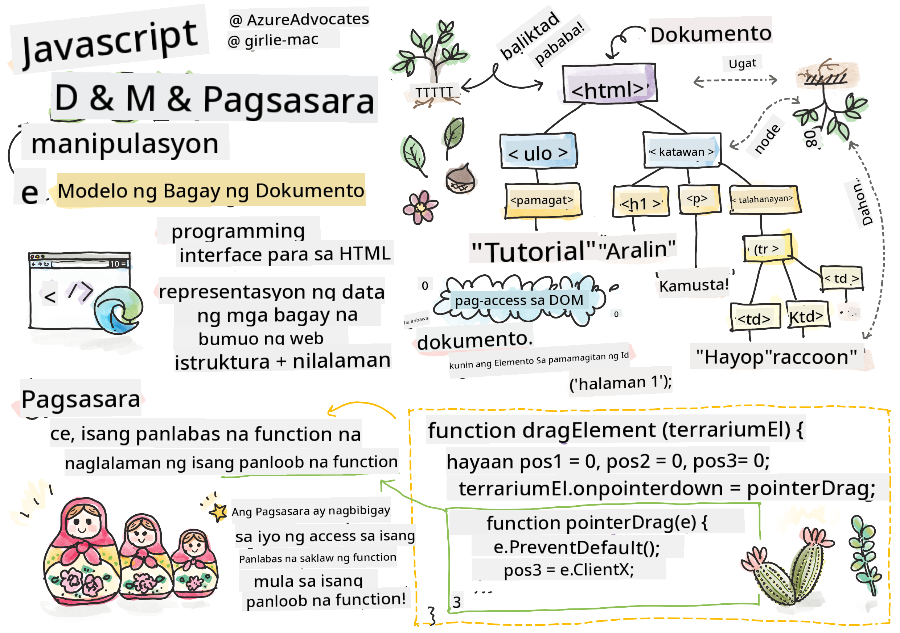
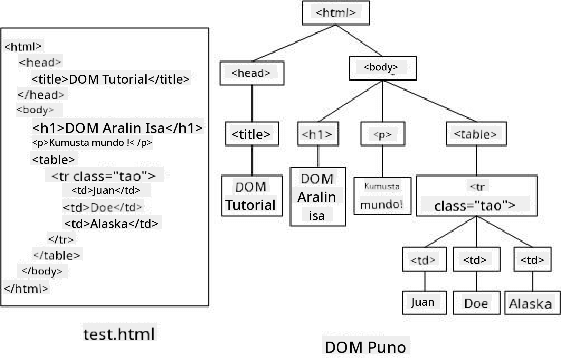
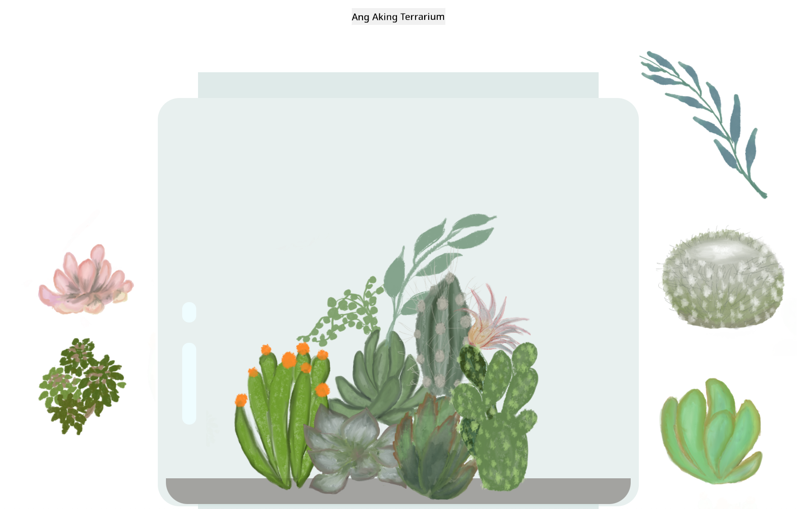

<!--
CO_OP_TRANSLATOR_METADATA:
{
  "original_hash": "30f8903a1f290e3d438dc2c70fe60259",
  "translation_date": "2025-08-27T23:02:42+00:00",
  "source_file": "3-terrarium/3-intro-to-DOM-and-closures/README.md",
  "language_code": "tl"
}
-->
# Terrarium Project Part 3: Manipulasyon ng DOM at isang Closure


> Sketchnote ni [Tomomi Imura](https://twitter.com/girlie_mac)

## Pre-Lecture Quiz

[Pre-lecture quiz](https://ff-quizzes.netlify.app/web/quiz/19)

### Panimula

Ang manipulasyon ng DOM, o "Document Object Model," ay isang mahalagang aspeto ng web development. Ayon sa [MDN](https://developer.mozilla.org/docs/Web/API/Document_Object_Model/Introduction), "Ang Document Object Model (DOM) ay ang representasyon ng data ng mga bagay na bumubuo sa istruktura at nilalaman ng isang dokumento sa web." Ang mga hamon sa paligid ng manipulasyon ng DOM sa web ay madalas na nagiging dahilan ng paggamit ng mga JavaScript framework sa halip na vanilla JavaScript upang pamahalaan ang DOM, ngunit kakayanin natin ito nang mag-isa!

Bukod dito, ipakikilala sa araling ito ang ideya ng isang [JavaScript closure](https://developer.mozilla.org/docs/Web/JavaScript/Closures), na maaari mong isipin bilang isang function na nakapaloob sa isa pang function upang ang inner function ay may access sa scope ng outer function.

> Ang JavaScript closures ay isang malawak at komplikadong paksa. Ang araling ito ay tumatalakay sa pinaka-pangunahing ideya na sa code ng terrarium na ito, makakakita ka ng isang closure: isang inner function at isang outer function na nakabuo sa paraang nagbibigay-daan sa inner function na ma-access ang scope ng outer function. Para sa mas detalyadong impormasyon kung paano ito gumagana, bisitahin ang [malawak na dokumentasyon](https://developer.mozilla.org/docs/Web/JavaScript/Closures).

Gagamit tayo ng closure upang manipulahin ang DOM.

Isipin ang DOM bilang isang puno, na kumakatawan sa lahat ng paraan kung paano maaaring manipulahin ang isang dokumento ng web page. Iba't ibang mga API (Application Program Interfaces) ang naisulat upang ang mga programmer, gamit ang kanilang napiling programming language, ay ma-access at ma-edit, mabago, maayos, at mapamahalaan ang DOM.



> Isang representasyon ng DOM at ang HTML markup na tumutukoy dito. Mula kay [Olfa Nasraoui](https://www.researchgate.net/publication/221417012_Profile-Based_Focused_Crawler_for_Social_Media-Sharing_Websites)

Sa araling ito, tatapusin natin ang ating interactive na terrarium project sa pamamagitan ng paggawa ng JavaScript na magpapahintulot sa isang user na manipulahin ang mga halaman sa pahina.

### Kinakailangan

Dapat ay mayroon ka nang HTML at CSS para sa iyong terrarium. Sa pagtatapos ng araling ito, magagawa mong ilipat ang mga halaman papasok at palabas ng terrarium sa pamamagitan ng pag-drag sa mga ito.

### Gawain

Sa iyong terrarium folder, gumawa ng bagong file na tinatawag na `script.js`. I-import ang file na ito sa seksyon ng `<head>`:

```html
	<script src="./script.js" defer></script>
```

> Tandaan: gumamit ng `defer` kapag nag-i-import ng external na JavaScript file sa HTML file upang ang JavaScript ay mag-execute lamang pagkatapos ma-load nang buo ang HTML file. Maaari mo ring gamitin ang `async` attribute, na nagpapahintulot sa script na mag-execute habang ang HTML file ay nagpa-parse, ngunit sa ating kaso, mahalagang maging ganap na available ang mga HTML element para sa pag-drag bago natin paganahin ang drag script.
---

## Ang mga Elemento ng DOM

Ang unang bagay na kailangan mong gawin ay gumawa ng mga reference sa mga elementong nais mong manipulahin sa DOM. Sa ating kaso, ito ang 14 na halaman na kasalukuyang naghihintay sa mga side bar.

### Gawain

```html
dragElement(document.getElementById('plant1'));
dragElement(document.getElementById('plant2'));
dragElement(document.getElementById('plant3'));
dragElement(document.getElementById('plant4'));
dragElement(document.getElementById('plant5'));
dragElement(document.getElementById('plant6'));
dragElement(document.getElementById('plant7'));
dragElement(document.getElementById('plant8'));
dragElement(document.getElementById('plant9'));
dragElement(document.getElementById('plant10'));
dragElement(document.getElementById('plant11'));
dragElement(document.getElementById('plant12'));
dragElement(document.getElementById('plant13'));
dragElement(document.getElementById('plant14'));
```

Ano ang nangyayari dito? Ikaw ay nagre-refer sa dokumento at naghahanap sa DOM nito upang makahanap ng elemento na may partikular na Id. Tandaan sa unang aralin sa HTML na binigyan mo ng mga indibidwal na Id ang bawat imahe ng halaman (`id="plant1"`)? Ngayon ay gagamitin mo ang pagsisikap na iyon. Matapos matukoy ang bawat elemento, ipapasa mo ang item na iyon sa isang function na tinatawag na `dragElement` na gagawin mo sa ilang sandali. Sa gayon, ang elemento sa HTML ay magiging drag-enabled, o magiging ganap na sa ilang sandali.

✅ Bakit natin nire-refer ang mga elemento sa pamamagitan ng Id? Bakit hindi sa pamamagitan ng kanilang CSS class? Maaaring balikan ang nakaraang aralin sa CSS upang sagutin ang tanong na ito.

---

## Ang Closure

Ngayon ay handa ka nang gumawa ng `dragElement` closure, na isang outer function na naglalaman ng isang inner function o mga function (sa ating kaso, magkakaroon tayo ng tatlo).

Ang mga closure ay kapaki-pakinabang kapag ang isa o higit pang mga function ay kailangang ma-access ang scope ng isang outer function. Narito ang isang halimbawa:

```javascript
function displayCandy(){
	let candy = ['jellybeans'];
	function addCandy(candyType) {
		candy.push(candyType)
	}
	addCandy('gumdrops');
}
displayCandy();
console.log(candy)
```

Sa halimbawang ito, ang displayCandy function ay nakapalibot sa isang function na naglalagay ng bagong uri ng kendi sa isang array na umiiral na sa function. Kung patatakbuhin mo ang code na ito, ang `candy` array ay magiging undefined, dahil ito ay isang lokal na variable (lokal sa closure).

✅ Paano mo magagawang accessible ang `candy` array? Subukang ilipat ito sa labas ng closure. Sa ganitong paraan, ang array ay magiging global, sa halip na manatiling available lamang sa lokal na scope ng closure.

### Gawain

Sa ilalim ng mga deklarasyon ng elemento sa `script.js`, gumawa ng isang function:

```javascript
function dragElement(terrariumElement) {
	//set 4 positions for positioning on the screen
	let pos1 = 0,
		pos2 = 0,
		pos3 = 0,
		pos4 = 0;
	terrariumElement.onpointerdown = pointerDrag;
}
```

Ang `dragElement` ay nakakakuha ng `terrariumElement` object mula sa mga deklarasyon sa itaas ng script. Pagkatapos, magse-set ka ng ilang lokal na posisyon sa `0` para sa object na ipinasa sa function. Ito ang mga lokal na variable na mamanipulahin para sa bawat elemento habang nagdadagdag ka ng drag at drop functionality sa loob ng closure sa bawat elemento. Ang terrarium ay mapupuno ng mga elementong ito na na-drag, kaya kailangang subaybayan ng application kung saan sila inilalagay.

Bukod dito, ang terrariumElement na ipinapasa sa function na ito ay na-assign ng isang `pointerdown` event, na bahagi ng [web APIs](https://developer.mozilla.org/docs/Web/API) na idinisenyo upang makatulong sa pamamahala ng DOM. Ang `onpointerdown` ay nagti-trigger kapag pinindot ang isang button, o sa ating kaso, kapag hinawakan ang isang draggable na elemento. Ang event handler na ito ay gumagana sa parehong [web at mobile browsers](https://caniuse.com/?search=onpointerdown), na may ilang mga eksepsyon.

✅ Ang [event handler na `onclick`](https://developer.mozilla.org/docs/Web/API/GlobalEventHandlers/onclick) ay may mas malawak na suporta sa iba't ibang browser; bakit hindi mo ito gagamitin dito? Isipin ang eksaktong uri ng screen interaction na sinusubukan mong likhain dito.

---

## Ang Pointerdrag Function

Ang `terrariumElement` ay handa nang i-drag; kapag na-trigger ang `onpointerdown` event, ang function na `pointerDrag` ay tatawagin. Idagdag ang function na iyon sa ilalim ng linyang ito: `terrariumElement.onpointerdown = pointerDrag;`:

### Gawain 

```javascript
function pointerDrag(e) {
	e.preventDefault();
	console.log(e);
	pos3 = e.clientX;
	pos4 = e.clientY;
}
```

Maraming nangyayari dito. Una, pinipigilan mo ang default na mga event na karaniwang nangyayari sa pointerdown sa pamamagitan ng paggamit ng `e.preventDefault();`. Sa ganitong paraan, mas may kontrol ka sa behavior ng interface.

> Balikan ang linyang ito kapag ganap mo nang nabuo ang script file at subukang tanggalin ang `e.preventDefault()` - ano ang mangyayari?

Pangalawa, buksan ang `index.html` sa isang browser window, at i-inspect ang interface. Kapag nag-click ka sa isang halaman, makikita mo kung paano na-capture ang 'e' event. Suriin ang event upang makita kung gaano karaming impormasyon ang nakukuha ng isang pointer down event!  

Pansinin din kung paano na-set ang mga lokal na variable na `pos3` at `pos4` sa e.clientX. Makikita mo ang mga `e` value sa inspection pane. Ang mga value na ito ay nagre-record ng x at y coordinates ng halaman sa sandaling i-click o hawakan mo ito. Kakailanganin mo ng detalyadong kontrol sa behavior ng mga halaman habang ini-click at ini-drag ang mga ito, kaya't sinusubaybayan mo ang kanilang mga coordinates.

✅ Mas nagiging malinaw ba kung bakit ang buong app na ito ay binuo gamit ang isang malaking closure? Kung hindi ito ginawa, paano mo mapapanatili ang scope para sa bawat isa sa 14 na draggable na halaman?

Kumpletuhin ang initial function sa pamamagitan ng pagdaragdag ng dalawa pang pointer event manipulations sa ilalim ng `pos4 = e.clientY`:

```html
document.onpointermove = elementDrag;
document.onpointerup = stopElementDrag;
```
Ngayon ay ipinapahiwatig mo na nais mong i-drag ang halaman kasabay ng pointer habang ini-move ito, at para sa dragging gesture na huminto kapag na-deselect ang halaman. Ang `onpointermove` at `onpointerup` ay bahagi ng parehong API tulad ng `onpointerdown`. Magkakaroon ng mga error ang interface ngayon dahil hindi mo pa nade-define ang `elementDrag` at ang `stopElementDrag` functions, kaya't buuin ang mga ito sa susunod.

## Ang elementDrag at stopElementDrag Functions

Tatapusin mo ang iyong closure sa pamamagitan ng pagdaragdag ng dalawa pang internal functions na hahawak sa kung ano ang mangyayari kapag ini-drag mo ang isang halaman at kapag tumigil ka sa pag-drag nito. Ang behavior na nais mo ay magawa mong i-drag ang anumang halaman anumang oras at ilagay ito kahit saan sa screen. Ang interface na ito ay medyo malaya (walang drop zone halimbawa) upang payagan kang idisenyo ang iyong terrarium ayon sa gusto mo sa pamamagitan ng pagdaragdag, pag-aalis, at muling pagpoposisyon ng mga halaman.

### Gawain

Idagdag ang `elementDrag` function sa ilalim ng closing curly bracket ng `pointerDrag`:

```javascript
function elementDrag(e) {
	pos1 = pos3 - e.clientX;
	pos2 = pos4 - e.clientY;
	pos3 = e.clientX;
	pos4 = e.clientY;
	console.log(pos1, pos2, pos3, pos4);
	terrariumElement.style.top = terrariumElement.offsetTop - pos2 + 'px';
	terrariumElement.style.left = terrariumElement.offsetLeft - pos1 + 'px';
}
```
Sa function na ito, marami kang ina-edit sa mga initial positions 1-4 na na-set mo bilang mga lokal na variable sa outer function. Ano ang nangyayari dito?

Habang ini-drag mo, nire-reassign mo ang `pos1` sa pamamagitan ng paggawa nitong katumbas ng `pos3` (na na-set mo kanina bilang `e.clientX`) minus ang kasalukuyang `e.clientX` value. Gumagawa ka ng katulad na operasyon sa `pos2`. Pagkatapos, nire-reset mo ang `pos3` at `pos4` sa mga bagong X at Y coordinates ng elemento. Maaari mong panoorin ang mga pagbabagong ito sa console habang ini-drag mo. Pagkatapos, mamanipulahin mo ang css style ng halaman upang i-set ang bagong posisyon nito batay sa mga bagong posisyon ng `pos1` at `pos2`, kinakalkula ang top at left X at Y coordinates ng halaman batay sa paghahambing ng offset nito sa mga bagong posisyon.

> Ang `offsetTop` at `offsetLeft` ay mga CSS properties na nagse-set ng posisyon ng isang elemento batay sa posisyon ng magulang nito; ang magulang nito ay maaaring anumang elemento na hindi naka-set bilang `static`. 

Ang lahat ng muling pagkalkula ng posisyon na ito ay nagbibigay-daan sa iyo upang ma-fine-tune ang behavior ng terrarium at ng mga halaman nito.

### Gawain 

Ang huling gawain upang makumpleto ang interface ay ang pagdaragdag ng `stopElementDrag` function pagkatapos ng closing curly bracket ng `elementDrag`:

```javascript
function stopElementDrag() {
	document.onpointerup = null;
	document.onpointermove = null;
}
```

Ang maliit na function na ito ay nire-reset ang `onpointerup` at `onpointermove` events upang maaari mong i-restart ang progreso ng iyong halaman sa pamamagitan ng pagsisimulang i-drag ito muli, o magsimulang mag-drag ng bagong halaman.

✅ Ano ang mangyayari kung hindi mo i-set ang mga events na ito sa null?

Ngayon ay natapos mo na ang iyong proyekto!

🥇Binabati kita! Natapos mo na ang iyong magandang terrarium. 

---

## 🚀Hamunin

Magdagdag ng bagong event handler sa iyong closure upang gumawa ng iba pang bagay sa mga halaman; halimbawa, i-double click ang isang halaman upang ilagay ito sa harapan. Maging malikhain!

## Post-Lecture Quiz

[Post-lecture quiz](https://ff-quizzes.netlify.app/web/quiz/20)

## Review at Pag-aaral sa Sarili

Habang ang pag-drag ng mga elemento sa screen ay tila simple, maraming paraan upang gawin ito at maraming mga hamon, depende sa epekto na nais mong makamit. Sa katunayan, mayroong isang buong [drag and drop API](https://developer.mozilla.org/docs/Web/API/HTML_Drag_and_Drop_API) na maaari mong subukan. Hindi natin ito ginamit sa module na ito dahil ang epekto na nais natin ay medyo naiiba, ngunit subukan ang API na ito sa sarili mong proyekto at tingnan kung ano ang maaari mong makamit.

Maghanap ng higit pang impormasyon tungkol sa pointer events sa [W3C docs](https://www.w3.org/TR/pointerevents1/) at sa [MDN web docs](https://developer.mozilla.org/docs/Web/API/Pointer_events).

Laging suriin ang kakayahan ng browser gamit ang [CanIUse.com](https://caniuse.com/).

## Takdang-Aralin

[Magtrabaho pa sa DOM](assignment.md)

---

**Paunawa**:  
Ang dokumentong ito ay isinalin gamit ang AI translation service na [Co-op Translator](https://github.com/Azure/co-op-translator). Bagama't sinisikap naming maging tumpak, tandaan na ang mga awtomatikong pagsasalin ay maaaring maglaman ng mga pagkakamali o hindi pagkakatugma. Ang orihinal na dokumento sa kanyang katutubong wika ang dapat ituring na opisyal na sanggunian. Para sa mahalagang impormasyon, inirerekomenda ang propesyonal na pagsasalin ng tao. Hindi kami mananagot sa anumang hindi pagkakaunawaan o maling interpretasyon na maaaring magmula sa paggamit ng pagsasaling ito.