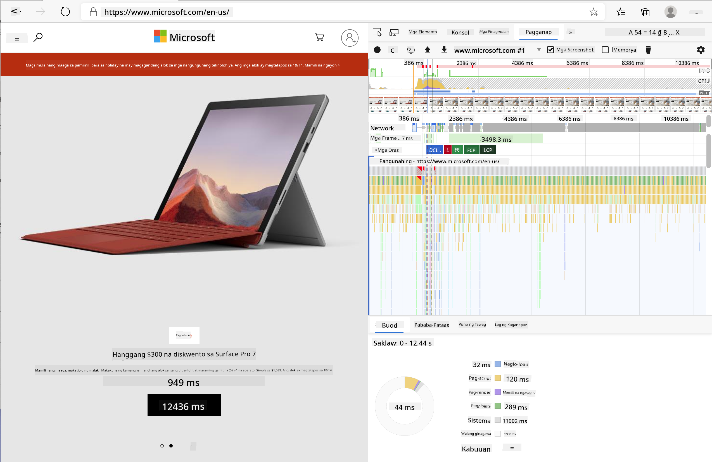
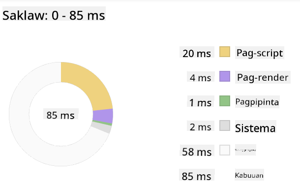

<!--
CO_OP_TRANSLATOR_METADATA:
{
  "original_hash": "f198c6b817b4b2a99749f4662e7cae98",
  "translation_date": "2025-08-27T22:22:05+00:00",
  "source_file": "5-browser-extension/3-background-tasks-and-performance/README.md",
  "language_code": "tl"
}
-->
# Browser Extension Project Part 3: Alamin ang Tungkol sa Background Tasks at Performance

## Pre-Lecture Quiz

[Pre-lecture quiz](https://ff-quizzes.netlify.app/web/quiz/27)

### Panimula

Sa huling dalawang aralin ng module na ito, natutunan mo kung paano gumawa ng form at display area para sa data na kinukuha mula sa isang API. Ito ay isang karaniwang paraan ng paglikha ng presensya sa web. Natutunan mo rin kung paano mag-handle ng asynchronous na pagkuha ng data. Halos tapos na ang iyong browser extension.

Ang natitira ay ang pamamahala ng ilang background tasks, kabilang ang pag-refresh ng kulay ng icon ng extension, kaya magandang pagkakataon ito upang pag-usapan kung paano pinamamahalaan ng browser ang ganitong uri ng gawain. Isipin natin ang mga browser tasks sa konteksto ng performance ng iyong web assets habang ginagawa mo ang mga ito.

## Mga Pangunahing Kaalaman sa Web Performance

> "Ang performance ng website ay tungkol sa dalawang bagay: gaano kabilis mag-load ang pahina, at gaano kabilis tumakbo ang code dito." -- [Zack Grossbart](https://www.smashingmagazine.com/2012/06/javascript-profiling-chrome-developer-tools/)

Ang paksa ng kung paano gawing napakabilis ang iyong mga website sa lahat ng uri ng device, para sa lahat ng uri ng user, sa lahat ng uri ng sitwasyon, ay hindi nakakagulat na malawak. Narito ang ilang mga punto na dapat tandaan habang gumagawa ka ng isang karaniwang web project o browser extension.

Ang unang bagay na kailangan mong gawin upang matiyak na ang iyong site ay tumatakbo nang mahusay ay ang mangolekta ng data tungkol sa performance nito. Ang unang lugar upang gawin ito ay sa developer tools ng iyong web browser. Sa Edge, maaari mong piliin ang "Settings and more" button (ang icon na tatlong tuldok sa kanang itaas ng browser), pagkatapos ay mag-navigate sa More Tools > Developer Tools at buksan ang Performance tab. Maaari mo ring gamitin ang keyboard shortcuts na `Ctrl` + `Shift` + `I` sa Windows o `Option` + `Command` + `I` sa Mac upang buksan ang developer tools.

Ang Performance tab ay naglalaman ng Profiling tool. Buksan ang isang website (subukan, halimbawa, [https://www.microsoft.com](https://www.microsoft.com/?WT.mc_id=academic-77807-sagibbon)) at i-click ang 'Record' button, pagkatapos ay i-refresh ang site. Itigil ang recording anumang oras, at makikita mo ang mga routine na nabuo upang 'script', 'render', at 'paint' ang site:



✅ Bisitahin ang [Microsoft Documentation](https://docs.microsoft.com/microsoft-edge/devtools-guide/performance/?WT.mc_id=academic-77807-sagibbon) tungkol sa Performance panel sa Edge

> Tip: upang makakuha ng tumpak na pagbabasa ng startup time ng iyong website, i-clear ang cache ng iyong browser

Piliin ang mga elemento ng profile timeline upang mag-zoom in sa mga event na nangyayari habang naglo-load ang iyong pahina.

Kumuha ng snapshot ng performance ng iyong pahina sa pamamagitan ng pagpili ng bahagi ng profile timeline at pagtingin sa summary pane:



Suriin ang Event Log pane upang makita kung may anumang event na tumagal ng higit sa 15 ms:


✅ Kilalanin ang iyong profiler! Buksan ang developer tools sa site na ito at tingnan kung may mga bottleneck. Ano ang pinakamabagal na asset na naglo-load? Ang pinakamabilis?

## Mga Profiling Checks

Sa pangkalahatan, may ilang "problem areas" na dapat bantayan ng bawat web developer kapag gumagawa ng site upang maiwasan ang hindi kanais-nais na sorpresa kapag oras na para i-deploy sa production.

**Asset sizes**: Ang web ay naging 'mas mabigat', at sa gayon ay mas mabagal, sa nakalipas na ilang taon. Ang ilan sa bigat na ito ay may kinalaman sa paggamit ng mga imahe.

✅ Tingnan ang [Internet Archive](https://httparchive.org/reports/page-weight) para sa isang historical na pananaw sa page weight at higit pa.

Isang magandang kasanayan ang tiyakin na ang iyong mga imahe ay na-optimize at naihatid sa tamang laki at resolusyon para sa iyong mga user.

**DOM traversals**: Kailangang buuin ng browser ang Document Object Model nito batay sa code na isinulat mo, kaya't nasa interes ng magandang page performance na panatilihing minimal ang iyong mga tag, gamit lamang at inaayos ang kailangan ng pahina. Sa puntong ito, ang sobrang CSS na nauugnay sa isang pahina ay maaaring ma-optimize; ang mga style na kailangang gamitin lamang sa isang pahina ay hindi kailangang isama sa pangunahing style sheet, halimbawa.

**JavaScript**: Ang bawat JavaScript developer ay dapat magbantay para sa 'render-blocking' scripts na kailangang i-load bago ma-traverse at ma-paint ang natitirang bahagi ng DOM sa browser. Isaalang-alang ang paggamit ng `defer` sa iyong inline scripts (tulad ng ginawa sa Terrarium module).

✅ Subukan ang ilang mga site sa isang [Site Speed Test website](https://www.webpagetest.org/) upang matuto nang higit pa tungkol sa mga karaniwang pagsusuri na ginagawa upang matukoy ang performance ng site.

Ngayon na mayroon kang ideya kung paano i-render ng browser ang mga asset na ipinapadala mo dito, tingnan natin ang huling ilang bagay na kailangan mong gawin upang makumpleto ang iyong extension:

### Gumawa ng Function para Kalkulahin ang Kulay

Sa `/src/index.js`, magdagdag ng function na tinatawag na `calculateColor()` pagkatapos ng serye ng mga `const` variables na itinakda mo upang makakuha ng access sa DOM:

```JavaScript
function calculateColor(value) {
	let co2Scale = [0, 150, 600, 750, 800];
	let colors = ['#2AA364', '#F5EB4D', '#9E4229', '#381D02', '#381D02'];

	let closestNum = co2Scale.sort((a, b) => {
		return Math.abs(a - value) - Math.abs(b - value);
	})[0];
	console.log(value + ' is closest to ' + closestNum);
	let num = (element) => element > closestNum;
	let scaleIndex = co2Scale.findIndex(num);

	let closestColor = colors[scaleIndex];
	console.log(scaleIndex, closestColor);

	chrome.runtime.sendMessage({ action: 'updateIcon', value: { color: closestColor } });
}
```

Ano ang nangyayari dito? Ipinapasa mo ang isang value (ang carbon intensity) mula sa API call na natapos mo sa huling aralin, at pagkatapos ay kinakalkula mo kung gaano kalapit ang value nito sa index na ipinakita sa colors array. Pagkatapos ay ipinapadala mo ang pinakamalapit na color value sa chrome runtime.

Ang chrome.runtime ay may [API](https://developer.chrome.com/extensions/runtime) na humahawak sa lahat ng uri ng background tasks, at ang iyong extension ay ginagamit ito:

> "Gamitin ang chrome.runtime API upang kunin ang background page, magbalik ng mga detalye tungkol sa manifest, at makinig at tumugon sa mga event sa lifecycle ng app o extension. Maaari mo ring gamitin ang API na ito upang i-convert ang relative path ng mga URL sa fully-qualified URLs."

✅ Kung dine-develop mo ang browser extension na ito para sa Edge, maaaring magulat ka na gumagamit ka ng chrome API. Ang mga mas bagong bersyon ng Edge browser ay tumatakbo sa Chromium browser engine, kaya maaari mong gamitin ang mga tool na ito.

> Tandaan, kung nais mong i-profile ang isang browser extension, ilunsad ang dev tools mula sa loob ng extension mismo, dahil ito ay sarili nitong hiwalay na browser instance.

### Mag-set ng Default Icon Color

Ngayon, sa `init()` function, itakda ang icon na maging generic green sa simula sa pamamagitan ng muling pagtawag sa chrome's `updateIcon` action:

```JavaScript
chrome.runtime.sendMessage({
	action: 'updateIcon',
		value: {
			color: 'green',
		},
});
```

### Tawagin ang Function, I-execute ang Call

Susunod, tawagin ang function na ginawa mo sa pamamagitan ng pagdaragdag nito sa promise na ibinalik ng C02Signal API:

```JavaScript
//let CO2...
calculateColor(CO2);
```

At sa wakas, sa `/dist/background.js`, magdagdag ng listener para sa mga background action calls na ito:

```JavaScript
chrome.runtime.onMessage.addListener(function (msg, sender, sendResponse) {
	if (msg.action === 'updateIcon') {
		chrome.browserAction.setIcon({ imageData: drawIcon(msg.value) });
	}
});
//borrowed from energy lollipop extension, nice feature!
function drawIcon(value) {
	let canvas = document.createElement('canvas');
	let context = canvas.getContext('2d');

	context.beginPath();
	context.fillStyle = value.color;
	context.arc(100, 100, 50, 0, 2 * Math.PI);
	context.fill();

	return context.getImageData(50, 50, 100, 100);
}
```

Sa code na ito, nagdaragdag ka ng listener para sa anumang mga mensahe na papunta sa backend task manager. Kung ito ay tinatawag na 'updateIcon', pagkatapos ay ang susunod na code ay tatakbo upang gumuhit ng icon ng tamang kulay gamit ang Canvas API.

✅ Matututo ka pa tungkol sa Canvas API sa [Space Game lessons](../../6-space-game/2-drawing-to-canvas/README.md).

Ngayon, i-rebuild ang iyong extension (`npm run build`), i-refresh at ilunsad ang iyong extension, at panoorin ang pagbabago ng kulay. Panahon na ba para mag-ayos o maghugas ng pinggan? Ngayon alam mo na!

Binabati kita, nakagawa ka ng isang kapaki-pakinabang na browser extension at natutunan ang higit pa tungkol sa kung paano gumagana ang browser at kung paano i-profile ang performance nito.

---

## 🚀 Hamon

Suriin ang ilang open source websites na matagal nang umiiral, at, batay sa kanilang GitHub history, tingnan kung maaari mong matukoy kung paano sila na-optimize sa paglipas ng mga taon para sa performance, kung mayroon man. Ano ang pinaka-karaniwang problema?

## Post-Lecture Quiz

[Post-lecture quiz](https://ff-quizzes.netlify.app/web/quiz/28)

## Review & Self Study

Isaalang-alang ang pag-subscribe sa isang [performance newsletter](https://perf.email/)

Suriin ang ilan sa mga paraan kung paano sinusukat ng mga browser ang web performance sa pamamagitan ng pagtingin sa performance tabs sa kanilang web tools. May nakita ka bang malalaking pagkakaiba?

## Assignment

[Analyze a site for performance](assignment.md)

---

**Paunawa**:  
Ang dokumentong ito ay isinalin gamit ang AI translation service na [Co-op Translator](https://github.com/Azure/co-op-translator). Bagama't sinisikap naming maging tumpak, pakitandaan na ang mga awtomatikong pagsasalin ay maaaring maglaman ng mga pagkakamali o hindi pagkakatugma. Ang orihinal na dokumento sa orihinal nitong wika ang dapat ituring na opisyal na sanggunian. Para sa mahalagang impormasyon, inirerekomenda ang propesyonal na pagsasalin ng tao. Hindi kami mananagot sa anumang hindi pagkakaunawaan o maling interpretasyon na maaaring magmula sa paggamit ng pagsasaling ito.