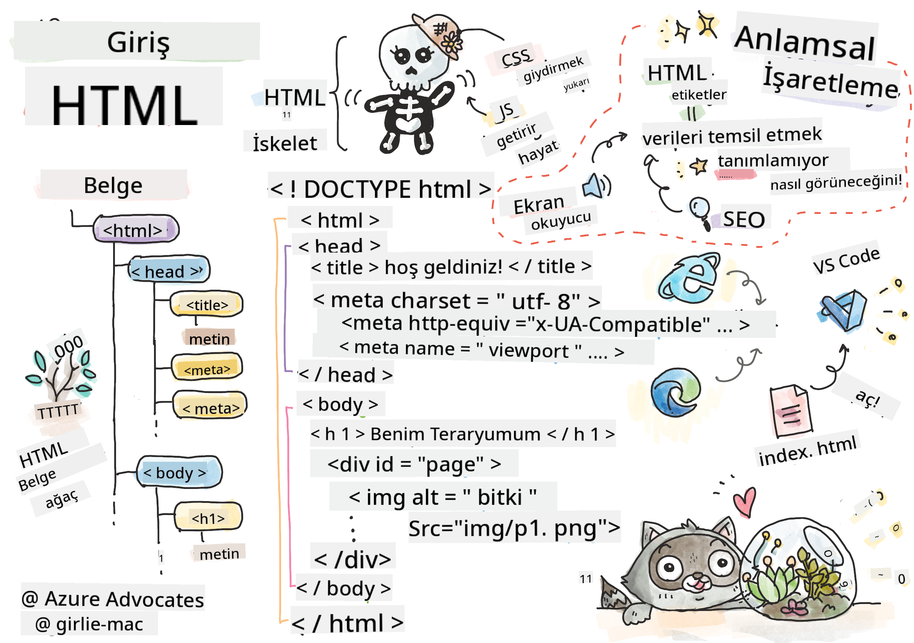
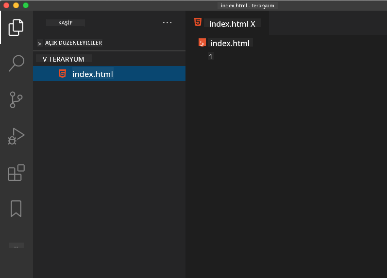

<!--
CO_OP_TRANSLATOR_METADATA:
{
  "original_hash": "46a0639e719b9cf1dfd062aa24cad639",
  "translation_date": "2025-08-25T21:11:01+00:00",
  "source_file": "3-terrarium/1-intro-to-html/README.md",
  "language_code": "tr"
}
-->
# Teraryum Projesi Bölüm 1: HTML'e Giriş


> Sketchnote: [Tomomi Imura](https://twitter.com/girlie_mac)

## Ders Öncesi Test

[Ders öncesi testi](https://ff-quizzes.netlify.app/web/quiz/15)

> Videoyu izleyin

> 
> [](https://www.youtube.com/watch?v=1TvxJKBzhyQ)

### Giriş

HTML, yani HyperText Markup Language, webin 'iskeleti'dir. Eğer CSS HTML'inizi 'giydiriyor' ve JavaScript ona hayat veriyorsa, HTML web uygulamanızın bedenidir. HTML'in sözdizimi bile bu fikri yansıtır; "head", "body" ve "footer" etiketlerini içerir.

Bu derste, sanal teraryumumuzun arayüzünün 'iskeletini' oluşturmak için HTML kullanacağız. Bir başlık ve üç sütun olacak: sürüklenebilir bitkilerin bulunduğu sağ ve sol sütunlar ve ortada cam görünümlü teraryum olacak bir alan. Dersin sonunda, sütunlarda bitkileri görebileceksiniz, ancak arayüz biraz garip görünecek; endişelenmeyin, bir sonraki bölümde arayüze CSS stilleri ekleyerek daha iyi görünmesini sağlayacağız.

### Görev

Bilgisayarınızda 'terrarium' adında bir klasör oluşturun ve içinde 'index.html' adında bir dosya oluşturun. Bunu, teraryum klasörünüzü oluşturduktan sonra Visual Studio Code'da yeni bir VS Code penceresi açarak, 'klasör aç' seçeneğine tıklayarak ve yeni klasörünüze giderek yapabilirsiniz. Explorer panelindeki küçük 'dosya' düğmesine tıklayın ve yeni dosyayı oluşturun:



Veya

Git bash üzerinde şu komutları kullanın:
* `mkdir terrarium`
* `cd terrarium`
* `touch index.html`
* `code index.html` veya `nano index.html`

> index.html dosyaları, bir tarayıcıya bir klasördeki varsayılan dosya olduğunu belirtir; `https://anysite.com/test` gibi URL'ler, içinde `index.html` bulunan `test` adında bir klasör yapısı kullanılarak oluşturulabilir; URL'de `index.html` görünmek zorunda değildir.

---

## DocType ve html etiketleri

Bir HTML dosyasının ilk satırı, onun doctype'ıdır. Bu satırın dosyanın en üstünde olması gerektiği biraz şaşırtıcı olabilir, ancak bu, eski tarayıcılara sayfanın mevcut HTML spesifikasyonuna uygun olarak standart modda işlenmesi gerektiğini söyler.

> İpucu: VS Code'da bir etiketin üzerine geldiğinizde, MDN Referans kılavuzlarından kullanımına dair bilgi alabilirsiniz.

İkinci satır, `<html>` etiketinin açılış etiketi olmalı ve hemen ardından kapanış etiketi `</html>` gelmelidir. Bu etiketler, arayüzünüzün kök öğeleridir.

### Görev

`index.html` dosyanızın en üstüne şu satırları ekleyin:

```HTML
<!DOCTYPE html>
<html></html>
```

✅ DocType'ı bir sorgu dizesiyle ayarlayarak belirlenebilecek birkaç farklı mod vardır: [Quirks Modu ve Standart Mod](https://developer.mozilla.org/docs/Web/HTML/Quirks_Mode_and_Standards_Mode). Bu modlar, genellikle artık kullanılmayan çok eski tarayıcıları (Netscape Navigator 4 ve Internet Explorer 5) desteklemek için kullanılırdı. Standart doctype deklarasyonuna bağlı kalabilirsiniz.

---

## Belgenin 'head' kısmı

HTML belgesinin 'head' alanı, web sayfanız hakkında [meta veriler](https://developer.mozilla.org/docs/Web/HTML/Element/meta) olarak bilinen önemli bilgileri içerir. Bizim durumumuzda, bu sayfanın gönderileceği ve işleneceği web sunucusuna şu dört şeyi bildiririz:

-   sayfanın başlığı
-   sayfa meta verileri, şunları içerir:
    -   sayfada kullanılan karakter kodlaması hakkında bilgi veren 'karakter seti'
    -   tarayıcı bilgileri, `x-ua-compatible` dahil, bu IE=edge tarayıcısının desteklendiğini belirtir
    -   sayfa yüklendiğinde görünüm alanının nasıl davranması gerektiği bilgisi. Görünüm alanını 1 başlangıç ölçeğine ayarlamak, sayfa ilk yüklendiğinde yakınlaştırma seviyesini kontrol eder.

### Görev

Açılış ve kapanış `<html>` etiketleri arasına belgenize bir 'head' bloğu ekleyin.

```html
<head>
	<title>Welcome to my Virtual Terrarium</title>
	<meta charset="utf-8" />
	<meta http-equiv="X-UA-Compatible" content="IE=edge" />
	<meta name="viewport" content="width=device-width, initial-scale=1" />
</head>
```

✅ Görünüm alanı meta etiketini şu şekilde ayarlarsanız ne olur: `<meta name="viewport" content="width=600">`? [Görünüm alanı](https://developer.mozilla.org/docs/Web/HTML/Viewport_meta_tag) hakkında daha fazla bilgi edinin.

---

## Belgenin `body` kısmı

### HTML Etiketleri

HTML'de, bir web sayfasının öğelerini oluşturmak için .html dosyanıza etiketler eklersiniz. Her etiket genellikle bir açılış ve kapanış etiketi içerir, örneğin: `<p>merhaba</p>` bir paragrafı belirtir. Arayüzünüzün gövdesini oluşturmak için `<html>` etiket çiftinin içine bir `<body>` etiketi seti ekleyin; işaretlemeniz şimdi şu şekilde görünür:

### Görev

```html
<!DOCTYPE html>
<html>
	<head>
		<title>Welcome to my Virtual Terrarium</title>
		<meta charset="utf-8" />
		<meta http-equiv="X-UA-Compatible" content="IE=edge" />
		<meta name="viewport" content="width=device-width, initial-scale=1" />
	</head>
	<body></body>
</html>
```

Artık sayfanızı oluşturmaya başlayabilirsiniz. Genellikle, bir sayfadaki ayrı öğeleri oluşturmak için `<div>` etiketlerini kullanırsınız. Görselleri içerecek bir dizi `<div>` öğesi oluşturacağız.

### Görseller

Kapanış etiketi gerektirmeyen bir html etiketi `` etiketidir, çünkü `src` öğesi, sayfanın öğeyi işlemek için ihtiyaç duyduğu tüm bilgileri içerir.

Uygulamanızda `images` adında bir klasör oluşturun ve içine [kaynak kod klasöründeki](../../../../3-terrarium/solution/images) tüm görselleri ekleyin; (14 bitki görseli var).

### Görev

Bu bitki görsellerini `<body></body>` etiketleri arasına iki sütun halinde ekleyin:

```html
<div id="page">
	<div id="left-container" class="container">
		<div class="plant-holder">
			
		</div>
		<div class="plant-holder">
			
		</div>
		<div class="plant-holder">
			
		</div>
		<div class="plant-holder">
			
		</div>
		<div class="plant-holder">
			
		</div>
		<div class="plant-holder">
			
		</div>
		<div class="plant-holder">
			
		</div>
	</div>
	<div id="right-container" class="container">
		<div class="plant-holder">
			
		</div>
		<div class="plant-holder">
			
		</div>
		<div class="plant-holder">
			
		</div>
		<div class="plant-holder">
			
		</div>
		<div class="plant-holder">
			
		</div>
		<div class="plant-holder">
			
		</div>
		<div class="plant-holder">
			
		</div>
	</div>
</div>
```

> Not: Span'lar ve Div'ler. Div'ler 'blok' öğeleri olarak kabul edilir ve Span'lar 'satır içi'dir. Bu div'leri span'lara dönüştürürseniz ne olur?

Bu işaretlemeyle, bitkiler artık ekranda görünüyor. Ancak oldukça kötü görünüyor, çünkü henüz CSS kullanılarak stillendirilmediler; bunu bir sonraki derste yapacağız.

Her görsel, bir görseli göremediğinizde veya işleyemediğinizde bile görünen alternatif bir metin içerir. Bu, erişilebilirlik için önemli bir özelliktir. Erişilebilirlik hakkında daha fazla bilgi edinmek için ilerideki derslere göz atın; şimdilik, alt özelliğinin, bir kullanıcı bir nedenle görseli görüntüleyemediğinde (yavaş bağlantı, src özelliğinde bir hata veya bir ekran okuyucu kullanımı gibi) alternatif bilgi sağladığını unutmayın.

✅ Her görselin aynı alt etiketine sahip olduğunu fark ettiniz mi? Bu iyi bir uygulama mı? Neden veya neden değil? Bu kodu geliştirebilir misiniz?

---

## Anlamsal işaretleme

Genel olarak, HTML yazarken anlamlı 'anlamsallık' kullanmak tercih edilir. Bu ne anlama gelir? Bu, HTML etiketlerini, tasarlandıkları veri türü veya etkileşim türünü temsil etmek için kullanmanız gerektiği anlamına gelir. Örneğin, bir sayfadaki ana başlık metni bir `<h1>` etiketi kullanmalıdır.

Açılış `<body>` etiketinizin hemen altına şu satırı ekleyin:

```html
<h1>My Terrarium</h1>
```

Başlıkların `<h1>` ve sırasız listelerin `<ul>` olarak işlenmesi gibi anlamsal işaretleme kullanmak, ekran okuyucuların bir sayfada gezinmesine yardımcı olur. Genel olarak, düğmeler `<button>` olarak yazılmalı ve listeler `<li>` olmalıdır. Özel olarak stillendirilmiş `<span>` öğelerini tıklama işleyicileriyle düğme gibi göstermek _mümkün_ olsa da, engelli kullanıcıların bir sayfada bir düğmenin nerede olduğunu belirlemek ve onunla etkileşim kurmak için teknolojileri kullanması daha iyidir. Bu nedenle, mümkün olduğunca anlamsal işaretleme kullanmaya çalışın.

✅ Bir ekran okuyucunun [bir web sayfasıyla nasıl etkileşim kurduğuna](https://www.youtube.com/watch?v=OUDV1gqs9GA) bir göz atın. Anlamsal olmayan işaretlemenin kullanıcıyı neden hayal kırıklığına uğratabileceğini görebiliyor musunuz?

## Teraryum

Bu arayüzün son kısmı, bir teraryum oluşturmak için stillendirilecek işaretlemeyi oluşturmayı içerir.

### Görev:

Son `</div>` etiketinin üzerine şu işaretlemeyi ekleyin:

```html
<div id="terrarium">
	<div class="jar-top"></div>
	<div class="jar-walls">
		<div class="jar-glossy-long"></div>
		<div class="jar-glossy-short"></div>
	</div>
	<div class="dirt"></div>
	<div class="jar-bottom"></div>
</div>
```

✅ Bu işaretlemeyi eklemenize rağmen ekranda hiçbir şeyin görünmediğini fark ettiniz mi? Neden?

---

## 🚀Zorluk

HTML'de hala eğlenceli olan bazı 'eski' etiketler var, ancak [bu etiketler](https://developer.mozilla.org/docs/Web/HTML/Element#Obsolete_and_deprecated_elements) gibi kullanımdan kaldırılmış etiketleri işaretlemenizde kullanmamalısınız. Yine de, `<marquee>` etiketini kullanarak h1 başlığını yatay olarak kaydırabilir misiniz? (Eğer yaparsanız, sonrasında kaldırmayı unutmayın)

## Ders Sonrası Test

[Ders sonrası testi](https://ff-quizzes.netlify.app/web/quiz/16)

## Gözden Geçirme ve Kendi Kendine Çalışma

HTML, webi bugünkü haline getiren 'denenmiş ve doğru' yapı taşı sistemidir. Eski ve yeni etiketler hakkında biraz bilgi edinerek tarihini öğrenin. Bazı etiketlerin neden kullanımdan kaldırıldığını ve bazılarının neden eklendiğini anlayabilir misiniz? Gelecekte hangi etiketlerin tanıtılabileceğini tahmin edebilir misiniz?

Web ve mobil cihazlar için siteler oluşturmayı [Microsoft Learn](https://docs.microsoft.com/learn/modules/build-simple-website/?WT.mc_id=academic-77807-sagibbon) adresinden öğrenin.

## Ödev

[HTML pratiği yapın: Bir blog taslağı oluşturun](assignment.md)

**Feragatname**:  
Bu belge, AI çeviri hizmeti [Co-op Translator](https://github.com/Azure/co-op-translator) kullanılarak çevrilmiştir. Doğruluk için çaba göstersek de, otomatik çevirilerin hata veya yanlışlık içerebileceğini lütfen unutmayın. Belgenin orijinal dili, yetkili kaynak olarak kabul edilmelidir. Kritik bilgiler için profesyonel insan çevirisi önerilir. Bu çevirinin kullanımından kaynaklanan yanlış anlamalar veya yanlış yorumlamalar için sorumluluk kabul etmiyoruz.