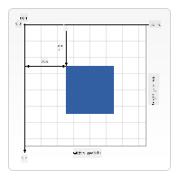

<!--
CO_OP_TRANSLATOR_METADATA:
{
  "original_hash": "41be8d35e7f30aa9dad10773c35e89c4",
  "translation_date": "2025-08-25T22:19:26+00:00",
  "source_file": "6-space-game/2-drawing-to-canvas/README.md",
  "language_code": "tr"
}
-->
# Uzay Oyunu Yapımı Bölüm 2: Kahraman ve Canavarları Tuvale Çizmek

## Ders Öncesi Test

[Ders öncesi testi](https://ff-quizzes.netlify.app/web/quiz/31)

## Tuval (Canvas)

Tuval, varsayılan olarak içeriği olmayan bir HTML öğesidir; boş bir tuval gibidir. Üzerine çizim yaparak içerik eklemeniz gerekir.

✅ MDN'de [Canvas API hakkında daha fazla bilgi edinin](https://developer.mozilla.org/docs/Web/API/Canvas_API).

Genellikle sayfanın gövdesinin bir parçası olarak şu şekilde tanımlanır:

```html
<canvas id="myCanvas" width="200" height="100"></canvas>
```

Yukarıda, `id`, `width` ve `height` ayarlarını yapıyoruz.

- `id`: Tuvale etkileşimde bulunmanız gerektiğinde bir referans alabilmek için bunu ayarlayın.
- `width`: Bu, öğenin genişliğidir.
- `height`: Bu, öğenin yüksekliğidir.

## Basit Geometri Çizimi

Tuval, bir şeyleri çizmek için Kartezyen koordinat sistemini kullanır. Bu nedenle, bir şeyin nerede olduğunu ifade etmek için x ve y eksenlerini kullanır. `0,0` konumu sol üst köşeyi temsil eder ve sağ alt köşe, tuvalin GENİŞLİK ve YÜKSEKLİK değerleriyle belirlenir.

  
> Görsel [MDN](https://developer.mozilla.org/docs/Web/API/Canvas_API/Tutorial/Drawing_shapes) kaynağından alınmıştır.

Tuval öğesi üzerine çizim yapmak için şu adımları izlemelisiniz:

1. Tuval öğesine bir **referans alın**.
2. Tuval öğesi üzerinde yer alan Bağlam (Context) öğesine bir **referans alın**.
3. Bağlam öğesini kullanarak bir **çizim işlemi gerçekleştirin**.

Yukarıdaki adımların kodu genellikle şu şekilde görünür:

```javascript
// draws a red rectangle
//1. get the canvas reference
canvas = document.getElementById("myCanvas");

//2. set the context to 2D to draw basic shapes
ctx = canvas.getContext("2d");

//3. fill it with the color red
ctx.fillStyle = 'red';

//4. and draw a rectangle with these parameters, setting location and size
ctx.fillRect(0,0, 200, 200) // x,y,width, height
```

✅ Canvas API çoğunlukla 2D şekillere odaklanır, ancak bir web sitesine 3D öğeler de çizebilirsiniz; bunun için [WebGL API](https://developer.mozilla.org/docs/Web/API/WebGL_API) kullanabilirsiniz.

Canvas API ile şunları çizebilirsiniz:

- **Geometrik şekiller**: Dikdörtgen çizmenin nasıl yapıldığını gösterdik, ancak daha fazlasını da çizebilirsiniz.
- **Metin**: İstediğiniz yazı tipi ve renkte metin çizebilirsiniz.
- **Görseller**: Örneğin bir .jpg veya .png gibi bir görsel varlığını temel alarak görseller çizebilirsiniz.

✅ Deneyin! Dikdörtgen çizmeyi öğrendiniz, bir sayfaya bir daire çizebilir misiniz? CodePen'deki bazı ilginç Canvas çizimlerine göz atın. İşte [özellikle etkileyici bir örnek](https://codepen.io/dissimulate/pen/KrAwx).

## Bir Görsel Varlığı Yükleme ve Çizme

Bir görsel varlığı yüklemek için bir `Image` nesnesi oluşturur ve `src` özelliğini ayarlarsınız. Daha sonra, kullanılmaya hazır olduğunu bilmek için `load` olayını dinlersiniz. Kod şu şekilde görünür:

### Varlık Yükleme

```javascript
const img = new Image();
img.src = 'path/to/my/image.png';
img.onload = () => {
  // image loaded and ready to be used
}
```

### Varlık Yükleme Deseni

Yukarıdaki işlemi şu şekilde bir yapı içinde sarmalamanız önerilir, böylece kullanımı daha kolay olur ve yalnızca tamamen yüklendiğinde işlem yaparsınız:

```javascript
function loadAsset(path) {
  return new Promise((resolve) => {
    const img = new Image();
    img.src = path;
    img.onload = () => {
      // image loaded and ready to be used
      resolve(img);
    }
  })
}

// use like so

async function run() {
  const heroImg = await loadAsset('hero.png')
  const monsterImg = await loadAsset('monster.png')
}

```

Ekrana oyun varlıklarını çizmek için kodunuz şu şekilde görünür:

```javascript
async function run() {
  const heroImg = await loadAsset('hero.png')
  const monsterImg = await loadAsset('monster.png')

  canvas = document.getElementById("myCanvas");
  ctx = canvas.getContext("2d");
  ctx.drawImage(heroImg, canvas.width/2,canvas.height/2);
  ctx.drawImage(monsterImg, 0,0);
}
```

## Şimdi Oyununuzu Yapmaya Başlama Zamanı

### Ne Yapılacak

Bir Canvas öğesi içeren bir web sayfası oluşturacaksınız. Bu öğe `1024*768` boyutlarında siyah bir ekran gösterecek. Size iki görsel sağladık:

- Kahraman gemisi

   

- 5*5 canavar

   

### Geliştirmeye Başlamak İçin Önerilen Adımlar

`your-work` alt klasöründe sizin için oluşturulmuş dosyaları bulun. Şunları içermelidir:

```bash
-| assets
  -| enemyShip.png
  -| player.png
-| index.html
-| app.js
-| package.json
```

Bu klasörün bir kopyasını Visual Studio Code'da açın. Yerel bir geliştirme ortamı kurulu olmalıdır, tercihen Visual Studio Code ile birlikte NPM ve Node yüklü olmalıdır. Bilgisayarınızda `npm` kurulu değilse, [bunu nasıl yapacağınızı buradan öğrenebilirsiniz](https://www.npmjs.com/get-npm).

Projenize `your_work` klasörüne giderek başlayın:

```bash
cd your-work
npm start
```

Yukarıdaki komut, `http://localhost:5000` adresinde bir HTTP Sunucusu başlatacaktır. Bir tarayıcı açın ve bu adresi girin. Şu anda boş bir sayfa göreceksiniz, ancak bu değişecek.

> Not: Ekrandaki değişiklikleri görmek için tarayıcınızı yenileyin.

### Kod Ekleme

Aşağıdaki görevleri çözmek için `your-work/app.js` dosyasına gerekli kodu ekleyin:

1. **Bir tuval çizin** ve arka planı siyah yapın  
   > ipucu: `/app.js` dosyasındaki uygun TODO'nun altına iki satır ekleyin, `ctx` öğesini siyah olarak ayarlayın ve üst/sol koordinatları 0,0 olarak, yükseklik ve genişliği tuvalin boyutlarına eşit olarak ayarlayın.
2. **Doku yükleyin**  
   > ipucu: Görüntüleri `await loadTexture` kullanarak ve görüntü yolunu geçirerek ekleyin. Henüz ekranda görünmeyecekler!
3. **Kahramanı ekranın alt yarısının ortasına çizin**  
   > ipucu: `drawImage` API'sini kullanarak heroImg'yi ekrana çizin, `canvas.width / 2 - 45` ve `canvas.height - canvas.height / 4)` ayarlarını yapın.
4. **5*5 canavar çizin**  
   > ipucu: Şimdi düşmanları ekrana çizmek için kodu yorumdan çıkarabilirsiniz. Ardından, `createEnemies` fonksiyonuna gidin ve onu tamamlayın.

   İlk olarak, bazı sabitler ayarlayın:

    ```javascript
    const MONSTER_TOTAL = 5;
    const MONSTER_WIDTH = MONSTER_TOTAL * 98;
    const START_X = (canvas.width - MONSTER_WIDTH) / 2;
    const STOP_X = START_X + MONSTER_WIDTH;
    ```

    ardından, canavarlar dizisini ekrana çizmek için bir döngü oluşturun:

    ```javascript
    for (let x = START_X; x < STOP_X; x += 98) {
        for (let y = 0; y < 50 * 5; y += 50) {
          ctx.drawImage(enemyImg, x, y);
        }
      }
    ```

## Sonuç

Tamamlanmış sonuç şu şekilde görünmelidir:


## Çözüm

Lütfen önce kendiniz çözmeyi deneyin, ancak takılırsanız bir [çözüme](../../../../6-space-game/2-drawing-to-canvas/solution/app.js) göz atabilirsiniz.

---

## 🚀 Meydan Okuma

2D odaklı Canvas API ile çizim yapmayı öğrendiniz; [WebGL API](https://developer.mozilla.org/docs/Web/API/WebGL_API)'ye bir göz atın ve bir 3D nesne çizmeyi deneyin.

## Ders Sonrası Test

[Ders sonrası testi](https://ff-quizzes.netlify.app/web/quiz/32)

## Gözden Geçirme ve Kendi Kendine Çalışma

Canvas API hakkında daha fazla bilgi edinmek için [bunu okuyun](https://developer.mozilla.org/docs/Web/API/Canvas_API).

## Ödev

[Canvas API ile oynayın](assignment.md)

**Feragatname**:  
Bu belge, AI çeviri hizmeti [Co-op Translator](https://github.com/Azure/co-op-translator) kullanılarak çevrilmiştir. Doğruluk için çaba göstersek de, otomatik çevirilerin hata veya yanlışlık içerebileceğini lütfen unutmayın. Belgenin orijinal dili, yetkili kaynak olarak kabul edilmelidir. Kritik bilgiler için profesyonel insan çevirisi önerilir. Bu çevirinin kullanımından kaynaklanan yanlış anlamalar veya yanlış yorumlamalar için sorumluluk kabul etmiyoruz.