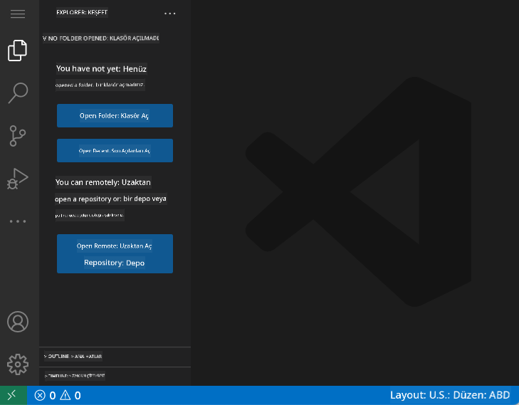
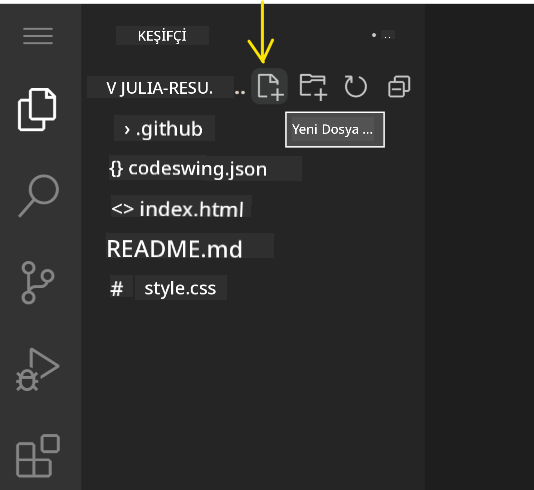
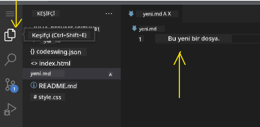
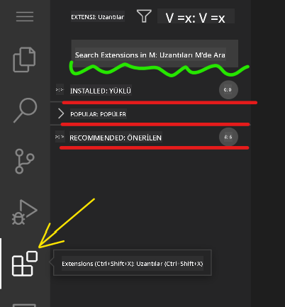

<!--
CO_OP_TRANSLATOR_METADATA:
{
  "original_hash": "7aa6e4f270d38d9cb17f2b5bd86b863d",
  "translation_date": "2025-08-25T23:20:15+00:00",
  "source_file": "8-code-editor/1-using-a-code-editor/README.md",
  "language_code": "tr"
}
-->
# Bir kod editörü kullanma

Bu ders, web tabanlı bir kod editörü olan [VSCode.dev](https://vscode.dev) kullanmanın temellerini kapsar. Böylece bilgisayarınıza herhangi bir şey yüklemeden kodlarınızı değiştirebilir ve bir projeye katkıda bulunabilirsiniz.

<!----
TODO: isteğe bağlı bir görsel ekle

> Sketchnote by [Author name](https://example.com)
---->

<!---
## Ders Öncesi Test
[Ders öncesi test](https://ff-quizzes.netlify.app/web/quiz/3)
---->

## Öğrenme hedefleri

Bu derste şunları öğreneceksiniz:

- Bir kod projesinde bir kod editörü kullanma
- Sürüm kontrolü ile değişiklikleri takip etme
- Geliştirme için editörü özelleştirme

### Ön Koşullar

Başlamadan önce [GitHub](https://github.com) ile bir hesap oluşturmanız gerekecek. [GitHub](https://github.com/) adresine gidin ve henüz bir hesabınız yoksa bir hesap oluşturun.

### Giriş

Bir kod editörü, program yazmak ve mevcut kod projeleriyle iş birliği yapmak için temel bir araçtır. Bir editörün temellerini ve özelliklerini nasıl kullanacağınızı anladığınızda, bunları kod yazarken uygulayabilirsiniz.

## VSCode.dev ile başlama

[VSCode.dev](https://vscode.dev), web üzerinde bir kod editörüdür. Bunu kullanmak için herhangi bir şey yüklemenize gerek yoktur; tıpkı başka bir web sitesini açar gibi kullanabilirsiniz. Editörü kullanmaya başlamak için şu bağlantıyı açın: [https://vscode.dev](https://vscode.dev). Eğer [GitHub](https://github.com/) hesabınıza giriş yapmadıysanız, giriş yapmanız veya yeni bir hesap oluşturmanız için yönlendirmeleri takip edin.

Yüklendiğinde, aşağıdaki görsele benzer bir ekran görmelisiniz:



Soldan sağa doğru üç ana bölüm vardır:

1. _Aktivite çubuğu_, büyüteç 🔎, dişli ⚙️ gibi bazı simgeleri içerir.
2. Varsayılan olarak _Gezgin_ (_Explorer_) olarak genişletilmiş olan _yan çubuk_.
3. Ve son olarak, sağdaki kod alanı.

Her bir simgeye tıklayarak farklı menüleri görüntüleyebilirsiniz. İşiniz bittiğinde, başladığınız yere geri dönmek için _Gezgin_ simgesine tıklayın.

Kod yazmaya veya mevcut kodu değiştirmeye başladığınızda, bu işlemler sağdaki en büyük alanda gerçekleşir. Mevcut kodu görüntülemek için de bu alanı kullanacaksınız.

## Bir GitHub deposu açma

İlk olarak, bir GitHub deposu açmanız gerekecek. Bir depoyu açmanın birden fazla yolu vardır. Bu bölümde, değişiklik yapmaya başlamak için bir depoyu açmanın iki farklı yolunu göreceksiniz.

### 1. Editör ile

Bir uzak depoyu açmak için doğrudan editörü kullanabilirsiniz. [VSCode.dev](https://vscode.dev) adresine giderseniz, bir _"Uzak Depo Aç"_ (_Open Remote Repository_) düğmesi göreceksiniz:


Ayrıca komut paletini kullanabilirsiniz. Komut paleti, bir komutun veya bir eylemin parçası olan herhangi bir kelimeyi yazabileceğiniz ve doğru komutu bulabileceğiniz bir giriş kutusudur. Sol üstteki menüyü kullanarak _Görünüm_ (_View_) seçeneğini seçin ve ardından _Komut Paleti_ (_Command Palette_) seçeneğini seçin veya şu klavye kısayolunu kullanın: Ctrl-Shift-P (MacOS'ta Command-Shift-P).


Menü açıldığında, _uzak depo aç_ yazın ve ardından ilk seçeneği seçin. Parçası olduğunuz veya daha önce açtığınız birden fazla depo görünecektir. Ayrıca bir GitHub URL'sini tam olarak kullanarak bir depo seçebilirsiniz. Aşağıdaki URL'yi kullanın ve kutuya yapıştırın:

```
https://github.com/microsoft/Web-Dev-For-Beginners
```

✅ Başarılı olursa, bu depodaki tüm dosyaları metin editöründe yüklü olarak göreceksiniz.

### 2. URL kullanarak

Bir depoyu yüklemek için doğrudan bir URL de kullanabilirsiniz. Örneğin, mevcut depo için tam URL [https://github.com/microsoft/Web-Dev-For-Beginners](https://github.com/microsoft/Web-Dev-For-Beginners) şeklindedir, ancak GitHub alan adını `VSCode.dev/github` ile değiştirerek depoyu doğrudan yükleyebilirsiniz. Ortaya çıkan URL şu şekilde olur: [https://vscode.dev/github/microsoft/Web-Dev-For-Beginners](https://vscode.dev/github/microsoft/Web-Dev-For-Beginners).

## Dosyaları düzenleme

Depoyu tarayıcıda veya vscode.dev'de açtıktan sonra, bir sonraki adım projeyi güncellemek veya değiştirmek olacaktır.

### 1. Yeni bir dosya oluşturma

Bir dosyayı mevcut bir klasörün içine veya kök dizine/klasöre oluşturabilirsiniz. Yeni bir dosya oluşturmak için, dosyanın kaydedileceği konumu/dizini açın ve _'Yeni dosya ...'_ simgesini aktivite çubuğunda _(sol)_ seçin, bir ad verin ve enter tuşuna basın.



### 2. Depodaki bir dosyayı düzenleme ve kaydetme

Vscode.dev, projenizde hızlı güncellemeler yapmak istediğinizde herhangi bir yazılımı yerel olarak yüklemenize gerek kalmadan kullanışlıdır. Kodunuzu güncellemek için, aktivite çubuğunda bulunan 'Gezgin' simgesine tıklayın ve depodaki dosya ve klasörleri görüntüleyin. Bir dosyayı seçin, kod alanında açın, değişikliklerinizi yapın ve kaydedin.



Projenizi güncellemeyi tamamladıktan sonra, depodaki yaptığınız tüm yeni değişiklikleri içeren _`sürüm kontrolü`_ simgesini seçin.

Projenizde yaptığınız değişiklikleri görüntülemek için, genişletilmiş aktivite çubuğundaki `Değişiklikler` klasöründeki dosyaları seçin. Bu, dosyada yaptığınız değişiklikleri görsel olarak görebileceğiniz bir 'Çalışma Ağacı' (_Working Tree_) açacaktır. Kırmızı, projeden bir çıkarımı, yeşil ise bir eklemeyi ifade eder.


Yaptığınız değişikliklerden memnunsanız, `Değişiklikler` klasörünün üzerine gelin ve değişiklikleri hazırlamak için `+` düğmesine tıklayın. Hazırlama, değişikliklerinizi GitHub'a göndermeye hazırlamak anlamına gelir.

Ancak, bazı değişikliklerden memnun değilseniz ve bunları iptal etmek istiyorsanız, `Değişiklikler` klasörünün üzerine gelin ve `geri al` simgesini seçin.

Ardından, bir `commit mesajı` yazın _(Projeye yaptığınız değişikliğin açıklaması)_, değişiklikleri göndermek ve kaydetmek için `onay simgesine` tıklayın.

Projenizde çalışmayı tamamladıktan sonra, sol üstteki `hamburger menü simgesini` seçerek github.com'daki depoya geri dönün.


## Uzantıları kullanma

VSCode'da uzantılar yüklemek, editörünüze yeni özellikler eklemenizi ve geliştirme ortamı seçeneklerini özelleştirmenizi sağlar. Bu uzantılar, geliştirme iş akışınızı iyileştirmek için birden fazla programlama dili desteği eklemenize de yardımcı olur ve genellikle genel uzantılar veya dil tabanlı uzantılar olarak sınıflandırılır.

Mevcut tüm uzantıların listesini görüntülemek için, aktivite çubuğundaki _`Uzantılar simgesine`_ tıklayın ve _'Marketplace'te Uzantıları Ara'_ etiketli metin alanına uzantının adını yazmaya başlayın. 

Bir uzantının adı, yayıncının adı, bir cümlelik açıklaması, indirme sayısı ve yıldız derecelendirmesi gibi bilgileri içeren bir liste göreceksiniz.


Ayrıca, daha önce yüklediğiniz tüm uzantıları _`Yüklü klasöründe`_, çoğu geliştirici tarafından kullanılan popüler uzantıları _`Popüler klasöründe`_ ve aynı çalışma alanındaki kullanıcılar tarafından önerilen veya son açtığınız dosyalara dayalı önerilen uzantıları _`Önerilen klasöründe`_ görüntüleyebilirsiniz.



### 1. Uzantıları Yükleme

Bir uzantıyı yüklemek için, arama alanına uzantının adını yazın ve genişletilmiş aktivite çubuğunda göründüğünde üzerine tıklayın. Uzantı hakkında ek bilgileri kod alanında görüntüleyebilirsiniz. Uzantıyı yüklemek için genişletilmiş aktivite çubuğundaki _mavi yükleme düğmesine_ veya kod alanında görünen yükleme düğmesine tıklayın.


### 2. Uzantıları Özelleştirme

Uzantıyı yükledikten sonra, davranışını değiştirmek ve tercihleriniz doğrultusunda özelleştirmek isteyebilirsiniz. Bunu yapmak için, Uzantılar simgesini seçin ve bu kez uzantınız _Yüklü klasöründe_ görünecektir. _**Dişli simgesine**_ tıklayın ve _Uzantı Ayarları_ seçeneğine gidin.


### 3. Uzantıları Yönetme

Uzantıyı yükledikten ve kullandıktan sonra, vscode.dev farklı ihtiyaçlara göre uzantınızı yönetme seçenekleri sunar. Örneğin, şunları yapabilirsiniz:

- **Devre Dışı Bırakma:** _(Bir uzantıyı tamamen kaldırmak istemediğinizde ancak geçici olarak devre dışı bırakmak istediğinizde kullanılır)_

    Genişletilmiş aktivite çubuğunda yüklü uzantıyı seçin > Dişli simgesine tıklayın > 'Devre Dışı Bırak' veya 'Çalışma Alanında Devre Dışı Bırak' seçeneğini seçin **VEYA** Uzantıyı kod alanında açın ve mavi Devre Dışı Bırak düğmesine tıklayın.

- **Kaldırma:** Genişletilmiş aktivite çubuğunda yüklü uzantıyı seçin > Dişli simgesine tıklayın > 'Kaldır' seçeneğini seçin **VEYA** Uzantıyı kod alanında açın ve mavi Kaldır düğmesine tıklayın.

---

## Ödev
[vscode.dev kullanarak bir özgeçmiş web sitesi oluşturun](https://github.com/microsoft/Web-Dev-For-Beginners/blob/main/8-code-editor/1-using-a-code-editor/assignment.md)

<!----
## Ders Sonrası Test
[Ders sonrası test](https://ff-quizzes.netlify.app/web/quiz/4)
---->

## Gözden Geçirme ve Kendi Kendine Çalışma

[VSCode.dev](https://code.visualstudio.com/docs/editor/vscode-web?WT.mc_id=academic-0000-alfredodeza) hakkında daha fazla bilgi edinin ve diğer özelliklerini keşfedin.

**Feragatname**:  
Bu belge, AI çeviri hizmeti [Co-op Translator](https://github.com/Azure/co-op-translator) kullanılarak çevrilmiştir. Doğruluk için çaba göstersek de, otomatik çevirilerin hata veya yanlışlık içerebileceğini lütfen unutmayın. Belgenin orijinal dili, yetkili kaynak olarak kabul edilmelidir. Kritik bilgiler için profesyonel insan çevirisi önerilir. Bu çevirinin kullanımından kaynaklanan yanlış anlamalar veya yanlış yorumlamalar için sorumluluk kabul etmiyoruz.