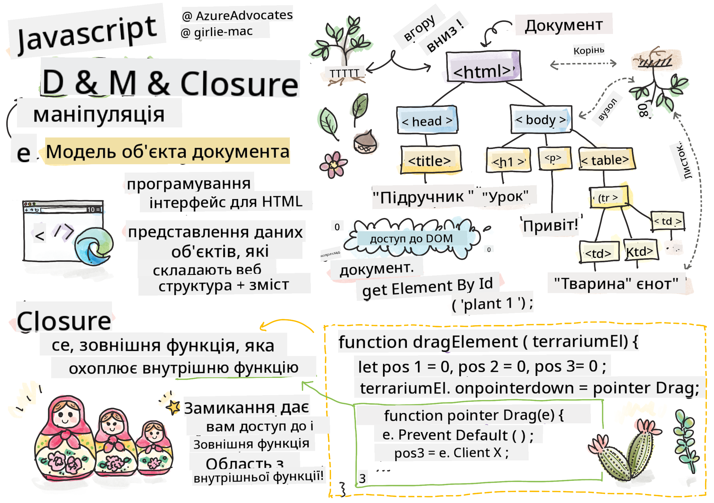
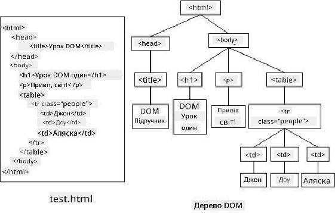
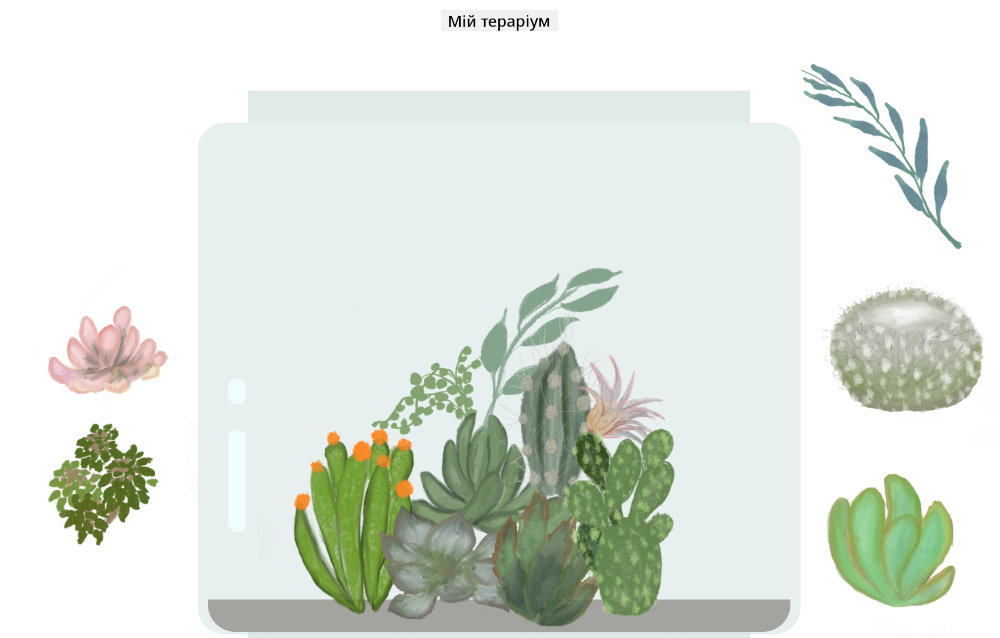

<!--
CO_OP_TRANSLATOR_METADATA:
{
  "original_hash": "30f8903a1f290e3d438dc2c70fe60259",
  "translation_date": "2025-08-27T22:38:32+00:00",
  "source_file": "3-terrarium/3-intro-to-DOM-and-closures/README.md",
  "language_code": "uk"
}
-->
# Проєкт "Тераріум", частина 3: Маніпуляція DOM і замикання


> Скетчнот від [Tomomi Imura](https://twitter.com/girlie_mac)

## Передлекційна вікторина

[Передлекційна вікторина](https://ff-quizzes.netlify.app/web/quiz/19)

### Вступ

Маніпуляція DOM, або "Document Object Model", є ключовим аспектом веброзробки. Згідно з [MDN](https://developer.mozilla.org/docs/Web/API/Document_Object_Model/Introduction), "Document Object Model (DOM) — це представлення даних об'єктів, які складають структуру та зміст документа в Інтернеті". Виклики, пов'язані з маніпуляцією DOM, часто спонукали розробників використовувати JavaScript-фреймворки замість чистого JavaScript для управління DOM, але ми впораємося самостійно!

Крім того, цей урок познайомить вас із поняттям [замикання в JavaScript](https://developer.mozilla.org/docs/Web/JavaScript/Closures), яке можна уявити як функцію, вкладену в іншу функцію, що дозволяє внутрішній функції отримувати доступ до області видимості зовнішньої функції.

> Замикання в JavaScript — це велика і складна тема. У цьому уроці ми торкнемося найосновнішої ідеї: у коді цього тераріуму ви знайдете замикання — внутрішню функцію та зовнішню функцію, побудовані таким чином, щоб внутрішня функція мала доступ до області видимості зовнішньої функції. Для більш детальної інформації про те, як це працює, відвідайте [розширену документацію](https://developer.mozilla.org/docs/Web/JavaScript/Closures).

Ми використаємо замикання для маніпуляції DOM.

Уявіть DOM як дерево, яке представляє всі способи, якими можна маніпулювати документом вебсторінки. Було створено різні API (інтерфейси програмування додатків), щоб програмісти могли отримувати доступ до DOM і редагувати, змінювати, переставляти та іншим чином керувати ним, використовуючи свою улюблену мову програмування.



> Представлення DOM і HTML-розмітки, яка його посилається. Від [Olfa Nasraoui](https://www.researchgate.net/publication/221417012_Profile-Based_Focused_Crawler_for_Social_Media-Sharing_Websites)

У цьому уроці ми завершимо наш інтерактивний проєкт тераріуму, створивши JavaScript, який дозволить користувачеві маніпулювати рослинами на сторінці.

### Передумови

Ви повинні мати готові HTML і CSS для вашого тераріуму. До кінця цього уроку ви зможете переміщати рослини в тераріум і з нього, перетягуючи їх.

### Завдання

У папці вашого тераріуму створіть новий файл під назвою `script.js`. Імпортуйте цей файл у секцію `<head>`:

```html
	<script src="./script.js" defer></script>
```

> Примітка: використовуйте `defer` при імпорті зовнішнього JavaScript-файлу в HTML-файл, щоб дозволити виконання JavaScript лише після повного завантаження HTML-файлу. Ви також можете використовувати атрибут `async`, який дозволяє скрипту виконуватися під час парсингу HTML-файлу, але в нашому випадку важливо, щоб елементи HTML були повністю доступні для перетягування перед виконанням скрипту.

---

## Елементи DOM

Перше, що вам потрібно зробити, — це створити посилання на елементи, якими ви хочете маніпулювати в DOM. У нашому випадку це 14 рослин, які зараз знаходяться в бічних панелях.

### Завдання

```html
dragElement(document.getElementById('plant1'));
dragElement(document.getElementById('plant2'));
dragElement(document.getElementById('plant3'));
dragElement(document.getElementById('plant4'));
dragElement(document.getElementById('plant5'));
dragElement(document.getElementById('plant6'));
dragElement(document.getElementById('plant7'));
dragElement(document.getElementById('plant8'));
dragElement(document.getElementById('plant9'));
dragElement(document.getElementById('plant10'));
dragElement(document.getElementById('plant11'));
dragElement(document.getElementById('plant12'));
dragElement(document.getElementById('plant13'));
dragElement(document.getElementById('plant14'));
```

Що тут відбувається? Ви посилаєтеся на документ і шукаєте в його DOM елемент із певним Id. Пам'ятаєте, як у першому уроці з HTML ви дали індивідуальні Id кожному зображенню рослини (`id="plant1"`)? Тепер ви скористаєтеся цією роботою. Після ідентифікації кожного елемента ви передаєте цей елемент у функцію `dragElement`, яку ви створите за хвилину. Таким чином, елемент у HTML тепер готовий до перетягування або скоро буде.

✅ Чому ми посилаємося на елементи за Id? Чому не за їх CSS-класом? Ви можете звернутися до попереднього уроку з CSS, щоб відповісти на це запитання.

---

## Замикання

Тепер ви готові створити замикання `dragElement`, яке є зовнішньою функцією, що охоплює внутрішню функцію або функції (у нашому випадку їх буде три).

Замикання корисні, коли одна або кілька функцій потребують доступу до області видимості зовнішньої функції. Ось приклад:

```javascript
function displayCandy(){
	let candy = ['jellybeans'];
	function addCandy(candyType) {
		candy.push(candyType)
	}
	addCandy('gumdrops');
}
displayCandy();
console.log(candy)
```

У цьому прикладі функція `displayCandy` охоплює функцію, яка додає новий тип цукерок до масиву, що вже існує у функції. Якщо ви запустите цей код, масив `candy` буде недоступним, оскільки він є локальною змінною (локальною для замикання).

✅ Як зробити масив `candy` доступним? Спробуйте перемістити його за межі замикання. Таким чином, масив стане глобальним, а не залишатиметься доступним лише для локальної області видимості замикання.

### Завдання

Під оголошеннями елементів у `script.js` створіть функцію:

```javascript
function dragElement(terrariumElement) {
	//set 4 positions for positioning on the screen
	let pos1 = 0,
		pos2 = 0,
		pos3 = 0,
		pos4 = 0;
	terrariumElement.onpointerdown = pointerDrag;
}
```

`dragElement` отримує свій об'єкт `terrariumElement` із оголошень у верхній частині скрипту. Потім ви встановлюєте деякі локальні позиції на `0` для об'єкта, переданого у функцію. Це локальні змінні, які будуть маніпулюватися для кожного елемента, коли ви додасте функціональність перетягування до кожного елемента в замиканні. Тераріум буде заповнений цими перетягнутими елементами, тому додаток має відстежувати, де вони розміщені.

Крім того, елемент `terrariumElement`, переданий у цю функцію, отримує подію `pointerdown`, яка є частиною [веб API](https://developer.mozilla.org/docs/Web/API), створених для допомоги в управлінні DOM. `onpointerdown` спрацьовує, коли натискається кнопка або, у нашому випадку, торкається елемент, який можна перетягувати. Цей обробник подій працює як у [веббраузерах, так і в мобільних браузерах](https://caniuse.com/?search=onpointerdown), з кількома винятками.

✅ [Обробник подій `onclick`](https://developer.mozilla.org/docs/Web/API/GlobalEventHandlers/onclick) має набагато більшу підтримку між браузерами; чому б не використати його тут? Подумайте про точний тип взаємодії зі сторінкою, який ви намагаєтеся створити.

---

## Функція Pointerdrag

Елемент `terrariumElement` готовий до перетягування; коли подія `onpointerdown` спрацьовує, викликається функція `pointerDrag`. Додайте цю функцію прямо під рядком: `terrariumElement.onpointerdown = pointerDrag;`:

### Завдання 

```javascript
function pointerDrag(e) {
	e.preventDefault();
	console.log(e);
	pos3 = e.clientX;
	pos4 = e.clientY;
}
```

Відбувається кілька речей. По-перше, ви запобігаєте стандартним подіям, які зазвичай відбуваються при pointerdown, використовуючи `e.preventDefault();`. Таким чином, ви отримуєте більше контролю над поведінкою інтерфейсу.

> Поверніться до цього рядка, коли ви повністю створите файл скрипту, і спробуйте без `e.preventDefault()` — що відбувається?

По-друге, відкрийте `index.html` у вікні браузера та перевірте інтерфейс. Коли ви натискаєте на рослину, ви можете побачити, як подія 'e' захоплюється. Досліджуйте подію, щоб побачити, скільки інформації збирається за одну подію pointerdown!  

Далі зверніть увагу, як локальні змінні `pos3` і `pos4` встановлюються на e.clientX. Ви можете знайти значення `e` у панелі інспекції. Ці значення захоплюють координати x і y рослини в момент її натискання або торкання. Вам потрібен детальний контроль над поведінкою рослин під час їх натискання та перетягування, тому ви відстежуєте їх координати.

✅ Чи стає зрозумілішим, чому весь цей додаток побудований на одному великому замиканні? Як би ви підтримували область видимості для кожної з 14 рослин, які можна перетягувати, якщо б це було не так?

Завершіть початкову функцію, додавши ще дві маніпуляції подіями pointer під `pos4 = e.clientY`:

```html
document.onpointermove = elementDrag;
document.onpointerup = stopElementDrag;
```
Тепер ви вказуєте, що хочете, щоб рослина перетягувалася разом із вказівником під час його переміщення, і щоб жест перетягування припинявся, коли ви знімаєте вибір рослини. `onpointermove` і `onpointerup` є частинами того ж API, що й `onpointerdown`. Інтерфейс зараз буде видавати помилки, оскільки ви ще не визначили функції `elementDrag` і `stopElementDrag`, тому створіть їх наступними.

## Функції elementDrag і stopElementDrag

Ви завершите своє замикання, додавши ще дві внутрішні функції, які будуть обробляти те, що відбувається, коли ви перетягуєте рослину і припиняєте її перетягування. Поведінка, яку ви хочете, полягає в тому, щоб ви могли перетягувати будь-яку рослину в будь-який час і розміщувати її будь-де на екрані. Цей інтерфейс досить нейтральний (наприклад, немає зони скидання), щоб дозволити вам створити свій тераріум саме так, як вам подобається, додаючи, видаляючи та змінюючи положення рослин.

### Завдання

Додайте функцію `elementDrag` прямо після закриваючої фігурної дужки функції `pointerDrag`:

```javascript
function elementDrag(e) {
	pos1 = pos3 - e.clientX;
	pos2 = pos4 - e.clientY;
	pos3 = e.clientX;
	pos4 = e.clientY;
	console.log(pos1, pos2, pos3, pos4);
	terrariumElement.style.top = terrariumElement.offsetTop - pos2 + 'px';
	terrariumElement.style.left = terrariumElement.offsetLeft - pos1 + 'px';
}
```
У цій функції ви багато редагуєте початкові позиції 1-4, які ви встановили як локальні змінні у зовнішній функції. Що тут відбувається?

Під час перетягування ви перепризначаєте `pos1`, роблячи його рівним `pos3` (який ви встановили раніше як `e.clientX`) мінус поточне значення `e.clientX`. Ви виконуєте аналогічну операцію для `pos2`. Потім ви скидаєте `pos3` і `pos4` до нових координат X і Y елемента. Ви можете спостерігати ці зміни в консолі під час перетягування. Потім ви маніпулюєте стилем css рослини, щоб встановити її нову позицію на основі нових позицій `pos1` і `pos2`, обчислюючи верхні та ліві координати X і Y рослини, порівнюючи її зміщення з цими новими позиціями.

> `offsetTop` і `offsetLeft` — це властивості CSS, які встановлюють позицію елемента на основі його батьківського елемента; його батьком може бути будь-який елемент, який не має позиції `static`. 

Усі ці перерахунки позицій дозволяють вам точно налаштувати поведінку тераріуму та його рослин.

### Завдання 

Останнє завдання для завершення інтерфейсу — додати функцію `stopElementDrag` після закриваючої фігурної дужки функції `elementDrag`:

```javascript
function stopElementDrag() {
	document.onpointerup = null;
	document.onpointermove = null;
}
```

Ця невелика функція скидає події `onpointerup` і `onpointermove`, щоб ви могли або перезапустити прогрес вашої рослини, почавши її перетягувати знову, або почати перетягувати нову рослину.

✅ Що відбувається, якщо ви не встановите ці події в null?

Тепер ваш проєкт завершено!

🥇Вітаємо! Ви завершили свій чудовий тераріум! 

---

## 🚀Виклик

Додайте новий обробник подій до вашого замикання, щоб зробити щось ще з рослинами; наприклад, подвійне клацання на рослині, щоб перемістити її на передній план. Проявіть креативність!

## Післялекційна вікторина

[Післялекційна вікторина](https://ff-quizzes.netlify.app/web/quiz/20)

## Огляд і самостійне навчання

Хоча перетягування елементів на екрані здається тривіальним, існує багато способів зробити це і багато підводних каменів, залежно від ефекту, якого ви прагнете. Насправді існує цілий [API для перетягування](https://developer.mozilla.org/docs/Web/API/HTML_Drag_and_Drop_API), який ви можете спробувати. Ми не використовували його в цьому модулі, оскільки ефект, який ми хотіли, був дещо іншим, але спробуйте цей API у своєму власному проєкті і подивіться, чого ви можете досягти.

Знайдіть більше інформації про події вказівника в [документації W3C](https://www.w3.org/TR/pointerevents1/) і на [MDN web docs](https://developer.mozilla.org/docs/Web/API/Pointer_events).

Завжди перевіряйте можливості браузера за допомогою [CanIUse.com](https://caniuse.com/).

## Завдання

[Попрацюйте трохи більше з DOM](assignment.md)

---

**Відмова від відповідальності**:  
Цей документ був перекладений за допомогою сервісу автоматичного перекладу [Co-op Translator](https://github.com/Azure/co-op-translator). Хоча ми прагнемо до точності, будь ласка, майте на увазі, що автоматичні переклади можуть містити помилки або неточності. Оригінальний документ на його рідній мові слід вважати авторитетним джерелом. Для критичної інформації рекомендується професійний людський переклад. Ми не несемо відповідальності за будь-які непорозуміння або неправильні тлумачення, що виникають внаслідок використання цього перекладу.