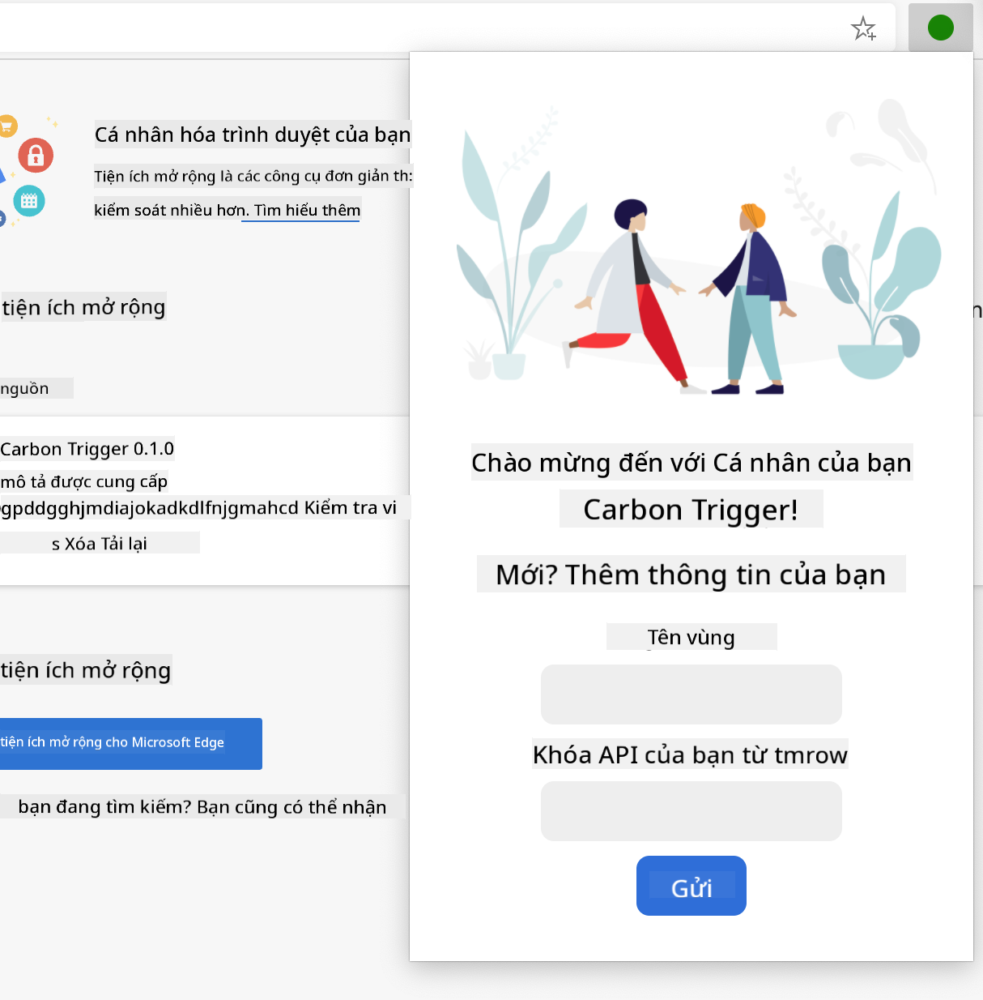
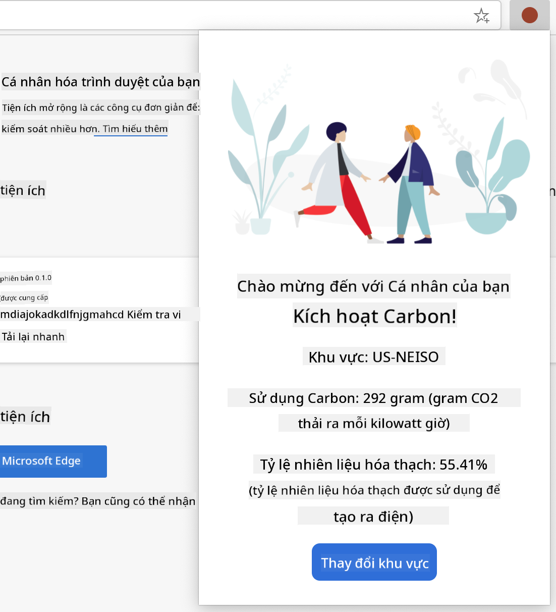

<!--
CO_OP_TRANSLATOR_METADATA:
{
  "original_hash": "0bb55e0b98600afab801eea115228873",
  "translation_date": "2025-08-27T22:16:32+00:00",
  "source_file": "5-browser-extension/1-about-browsers/README.md",
  "language_code": "vi"
}
-->
# Dự án Tiện ích Mở rộng Trình duyệt Phần 1: Tìm hiểu về Trình duyệt


> Hình minh họa bởi [Wassim Chegham](https://dev.to/wassimchegham/ever-wondered-what-happens-when-you-type-in-a-url-in-an-address-bar-in-a-browser-3dob)

## Câu hỏi trước bài giảng

[Câu hỏi trước bài giảng](https://ff-quizzes.netlify.app/web/quiz/23)

### Giới thiệu

Tiện ích mở rộng trình duyệt bổ sung các chức năng bổ trợ cho trình duyệt. Nhưng trước khi bạn xây dựng một tiện ích, bạn cần tìm hiểu một chút về cách trình duyệt hoạt động.

### Về trình duyệt

Trong loạt bài học này, bạn sẽ học cách xây dựng một tiện ích mở rộng trình duyệt có thể hoạt động trên các trình duyệt Chrome, Firefox và Edge. Trong phần này, bạn sẽ khám phá cách trình duyệt hoạt động và xây dựng các thành phần của tiện ích mở rộng trình duyệt.

Nhưng trình duyệt thực chất là gì? Đó là một ứng dụng phần mềm cho phép người dùng cuối truy cập nội dung từ máy chủ và hiển thị nó trên các trang web.

✅ Một chút lịch sử: trình duyệt đầu tiên có tên là 'WorldWideWeb' và được tạo ra bởi Sir Timothy Berners-Lee vào năm 1990.


> Một số trình duyệt đầu tiên, qua [Karen McGrane](https://www.slideshare.net/KMcGrane/week-4-ixd-history-personal-computing)

Khi người dùng kết nối internet bằng địa chỉ URL (Uniform Resource Locator), thường sử dụng Giao thức Truyền tải Siêu văn bản qua địa chỉ `http` hoặc `https`, trình duyệt sẽ giao tiếp với máy chủ web và lấy về một trang web.

Tại thời điểm này, công cụ kết xuất của trình duyệt sẽ hiển thị trang web trên thiết bị của người dùng, có thể là điện thoại di động, máy tính để bàn hoặc máy tính xách tay.

Trình duyệt cũng có khả năng lưu trữ nội dung vào bộ nhớ đệm để không phải lấy lại từ máy chủ mỗi lần. Chúng có thể ghi lại lịch sử hoạt động duyệt web của người dùng, lưu trữ 'cookie', là những mẩu dữ liệu nhỏ chứa thông tin được sử dụng để lưu trữ hoạt động của người dùng, và nhiều hơn thế nữa.

Một điều rất quan trọng cần nhớ về trình duyệt là chúng không giống nhau! Mỗi trình duyệt có những điểm mạnh và điểm yếu riêng, và một nhà phát triển web chuyên nghiệp cần hiểu cách làm cho các trang web hoạt động tốt trên nhiều trình duyệt khác nhau. Điều này bao gồm việc xử lý các màn hình nhỏ như điện thoại di động, cũng như người dùng đang ở chế độ ngoại tuyến.

Một trang web rất hữu ích mà bạn nên đánh dấu trong trình duyệt yêu thích của mình là [caniuse.com](https://www.caniuse.com). Khi bạn xây dựng các trang web, việc sử dụng danh sách các công nghệ được hỗ trợ của caniuse sẽ rất hữu ích để bạn có thể hỗ trợ tốt nhất cho người dùng của mình.

✅ Làm thế nào để bạn biết trình duyệt nào phổ biến nhất với người dùng trang web của bạn? Kiểm tra phân tích của bạn - bạn có thể cài đặt các gói phân tích khác nhau như một phần của quy trình phát triển web, và chúng sẽ cho bạn biết trình duyệt nào được sử dụng nhiều nhất bởi các trình duyệt phổ biến.

## Tiện ích mở rộng trình duyệt

Tại sao bạn muốn xây dựng một tiện ích mở rộng trình duyệt? Đây là một công cụ tiện lợi để gắn vào trình duyệt khi bạn cần truy cập nhanh vào các tác vụ mà bạn thường lặp lại. Ví dụ, nếu bạn thường xuyên cần kiểm tra màu sắc trên các trang web mà bạn tương tác, bạn có thể cài đặt một tiện ích mở rộng chọn màu. Nếu bạn gặp khó khăn trong việc nhớ mật khẩu, bạn có thể sử dụng một tiện ích quản lý mật khẩu.

Tiện ích mở rộng trình duyệt cũng rất thú vị để phát triển. Chúng thường quản lý một số lượng tác vụ nhất định và thực hiện chúng rất tốt.

✅ Tiện ích mở rộng trình duyệt yêu thích của bạn là gì? Chúng thực hiện những tác vụ nào?

### Cài đặt tiện ích mở rộng

Trước khi bắt đầu xây dựng, hãy xem qua quy trình xây dựng và triển khai một tiện ích mở rộng trình duyệt. Mặc dù mỗi trình duyệt có một chút khác biệt trong cách quản lý nhiệm vụ này, quy trình trên Chrome và Firefox tương tự như ví dụ trên Edge:


> Lưu ý: Đảm bảo bật chế độ nhà phát triển và cho phép tiện ích từ các cửa hàng khác.

Về cơ bản, quy trình sẽ là:

- xây dựng tiện ích mở rộng của bạn bằng cách sử dụng `npm run build` 
- điều hướng trong trình duyệt đến bảng tiện ích mở rộng bằng cách sử dụng nút "Cài đặt và hơn thế nữa" (biểu tượng `...`) ở góc trên bên phải
- nếu đây là cài đặt mới, chọn `load unpacked` để tải lên một tiện ích mở rộng mới từ thư mục build của nó (trong trường hợp của chúng ta là `/dist`) 
- hoặc, nhấp vào `reload` nếu bạn đang tải lại tiện ích mở rộng đã được cài đặt

✅ Các hướng dẫn này áp dụng cho các tiện ích mở rộng bạn tự xây dựng; để cài đặt các tiện ích mở rộng đã được phát hành trên cửa hàng tiện ích mở rộng của từng trình duyệt, bạn nên điều hướng đến các [cửa hàng](https://microsoftedge.microsoft.com/addons/Microsoft-Edge-Extensions-Home) đó và cài đặt tiện ích mở rộng mà bạn chọn.

### Bắt đầu

Bạn sẽ xây dựng một tiện ích mở rộng trình duyệt hiển thị dấu chân carbon của khu vực của bạn, cho thấy mức sử dụng năng lượng và nguồn năng lượng của khu vực. Tiện ích mở rộng sẽ có một biểu mẫu thu thập khóa API để bạn có thể truy cập API của CO2 Signal.

**Bạn cần:**

- [một khóa API](https://www.co2signal.com/); nhập email của bạn vào ô trên trang này và một khóa sẽ được gửi cho bạn
- [mã cho khu vực của bạn](http://api.electricitymap.org/v3/zones) tương ứng với [Electricity Map](https://www.electricitymap.org/map) (ví dụ, ở Boston, tôi sử dụng 'US-NEISO').
- [mã khởi đầu](../../../../5-browser-extension/start). Tải xuống thư mục `start`; bạn sẽ hoàn thành mã trong thư mục này.
- [NPM](https://www.npmjs.com) - NPM là một công cụ quản lý gói; cài đặt nó cục bộ và các gói được liệt kê trong tệp `package.json` của bạn sẽ được cài đặt để sử dụng cho tài sản web của bạn

✅ Tìm hiểu thêm về quản lý gói trong [mô-đun học tập xuất sắc này](https://docs.microsoft.com/learn/modules/create-nodejs-project-dependencies/?WT.mc_id=academic-77807-sagibbon)

Dành một chút thời gian để xem qua cơ sở mã:

dist
    -|manifest.json (các thiết lập mặc định ở đây)
    -|index.html (đánh dấu HTML giao diện người dùng ở đây)
    -|background.js (JS nền ở đây)
    -|main.js (JS đã được xây dựng)
src
    -|index.js (mã JS của bạn sẽ ở đây)

✅ Khi bạn đã có khóa API và mã khu vực, hãy lưu chúng ở đâu đó trong ghi chú để sử dụng sau này.

### Xây dựng HTML cho tiện ích mở rộng

Tiện ích mở rộng này có hai giao diện. Một để thu thập khóa API và mã khu vực:



Và giao diện thứ hai để hiển thị mức sử dụng carbon của khu vực:



Hãy bắt đầu bằng cách xây dựng HTML cho biểu mẫu và tạo kiểu cho nó bằng CSS.

Trong thư mục `/dist`, bạn sẽ xây dựng một biểu mẫu và một khu vực hiển thị kết quả. Trong tệp `index.html`, điền vào khu vực biểu mẫu được phân định:

```HTML
<form class="form-data" autocomplete="on">
	<div>
		<h2>New? Add your Information</h2>
	</div>
	<div>
		<label for="region">Region Name</label>
		<input type="text" id="region" required class="region-name" />
	</div>
	<div>
		<label for="api">Your API Key from tmrow</label>
		<input type="text" id="api" required class="api-key" />
	</div>
	<button class="search-btn">Submit</button>
</form>	
```
Đây là biểu mẫu nơi thông tin đã lưu của bạn sẽ được nhập và lưu vào bộ nhớ cục bộ.

Tiếp theo, tạo khu vực hiển thị kết quả; dưới thẻ biểu mẫu cuối cùng, thêm một số div:

```HTML
<div class="result">
	<div class="loading">loading...</div>
	<div class="errors"></div>
	<div class="data"></div>
	<div class="result-container">
		<p><strong>Region: </strong><span class="my-region"></span></p>
		<p><strong>Carbon Usage: </strong><span class="carbon-usage"></span></p>
		<p><strong>Fossil Fuel Percentage: </strong><span class="fossil-fuel"></span></p>
	</div>
	<button class="clear-btn">Change region</button>
</div>
```
Tại thời điểm này, bạn có thể thử xây dựng. Đảm bảo cài đặt các gói phụ thuộc của tiện ích mở rộng này:

```
npm install
```

Lệnh này sẽ sử dụng npm, Trình quản lý Gói Node, để cài đặt webpack cho quy trình xây dựng tiện ích mở rộng của bạn. Webpack là một trình gói giúp biên dịch mã. Bạn có thể xem đầu ra của quy trình này bằng cách nhìn vào `/dist/main.js` - bạn sẽ thấy mã đã được gói lại.

Hiện tại, tiện ích mở rộng nên được xây dựng và, nếu bạn triển khai nó vào Edge như một tiện ích mở rộng, bạn sẽ thấy một biểu mẫu được hiển thị gọn gàng.

Chúc mừng bạn, bạn đã thực hiện những bước đầu tiên để xây dựng một tiện ích mở rộng trình duyệt. Trong các bài học tiếp theo, bạn sẽ làm cho nó trở nên hữu ích và chức năng hơn.

---

## 🚀 Thử thách

Hãy xem qua một cửa hàng tiện ích mở rộng trình duyệt và cài đặt một tiện ích vào trình duyệt của bạn. Bạn có thể kiểm tra các tệp của nó theo những cách thú vị. Bạn phát hiện ra điều gì?

## Câu hỏi sau bài giảng

[Câu hỏi sau bài giảng](https://ff-quizzes.netlify.app/web/quiz/24)

## Ôn tập & Tự học

Trong bài học này, bạn đã tìm hiểu một chút về lịch sử của trình duyệt web; hãy tận dụng cơ hội này để tìm hiểu về cách những người sáng tạo ra World Wide Web hình dung việc sử dụng nó bằng cách đọc thêm về lịch sử của nó. Một số trang web hữu ích bao gồm:

[Lịch sử của Trình duyệt Web](https://www.mozilla.org/firefox/browsers/browser-history/)

[Lịch sử của Web](https://webfoundation.org/about/vision/history-of-the-web/)

[Một cuộc phỏng vấn với Tim Berners-Lee](https://www.theguardian.com/technology/2019/mar/12/tim-berners-lee-on-30-years-of-the-web-if-we-dream-a-little-we-can-get-the-web-we-want)

## Bài tập 

[Thay đổi giao diện tiện ích mở rộng của bạn](assignment.md)

---

**Tuyên bố miễn trừ trách nhiệm**:  
Tài liệu này đã được dịch bằng dịch vụ dịch thuật AI [Co-op Translator](https://github.com/Azure/co-op-translator). Mặc dù chúng tôi cố gắng đảm bảo độ chính xác, xin lưu ý rằng các bản dịch tự động có thể chứa lỗi hoặc không chính xác. Tài liệu gốc bằng ngôn ngữ bản địa nên được coi là nguồn tham khảo chính thức. Đối với các thông tin quan trọng, chúng tôi khuyến nghị sử dụng dịch vụ dịch thuật chuyên nghiệp từ con người. Chúng tôi không chịu trách nhiệm cho bất kỳ sự hiểu lầm hoặc diễn giải sai nào phát sinh từ việc sử dụng bản dịch này.