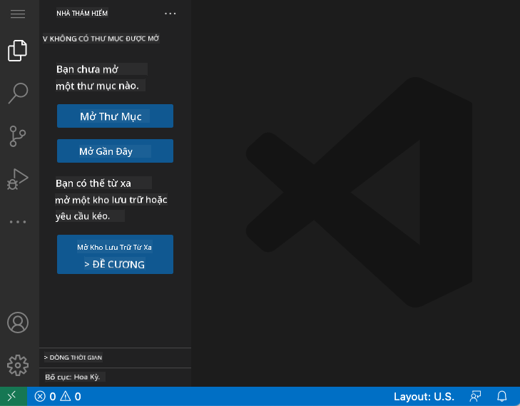
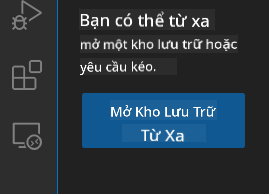
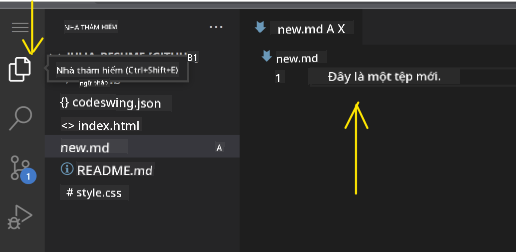
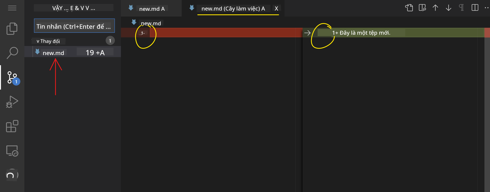
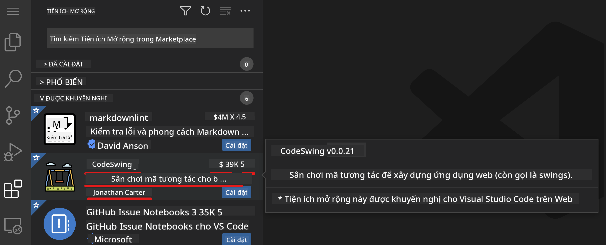
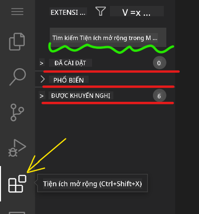
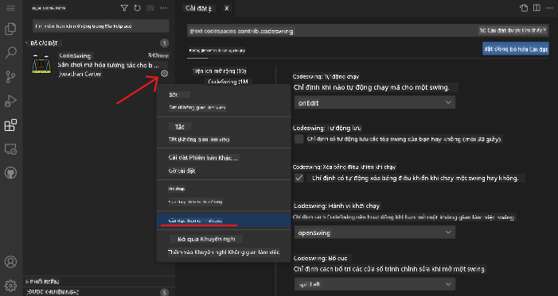

<!--
CO_OP_TRANSLATOR_METADATA:
{
  "original_hash": "7aa6e4f270d38d9cb17f2b5bd86b863d",
  "translation_date": "2025-08-27T23:04:37+00:00",
  "source_file": "8-code-editor/1-using-a-code-editor/README.md",
  "language_code": "vi"
}
-->
# Sử dụng trình chỉnh sửa mã

Bài học này giới thiệu những kiến thức cơ bản về việc sử dụng [VSCode.dev](https://vscode.dev), một trình chỉnh sửa mã trên web, để bạn có thể thay đổi mã và đóng góp vào một dự án mà không cần cài đặt bất kỳ phần mềm nào trên máy tính của mình.

## Mục tiêu học tập

Trong bài học này, bạn sẽ học cách:

- Sử dụng trình chỉnh sửa mã trong một dự án mã nguồn
- Theo dõi các thay đổi với hệ thống kiểm soát phiên bản
- Tùy chỉnh trình chỉnh sửa để phát triển

### Yêu cầu trước

Trước khi bắt đầu, bạn cần tạo một tài khoản trên [GitHub](https://github.com). Truy cập [GitHub](https://github.com/) và tạo tài khoản nếu bạn chưa có.

### Giới thiệu

Trình chỉnh sửa mã là một công cụ thiết yếu để viết chương trình và cộng tác trong các dự án mã nguồn hiện có. Khi bạn hiểu được những kiến thức cơ bản về trình chỉnh sửa và cách sử dụng các tính năng của nó, bạn sẽ có thể áp dụng chúng khi viết mã.

## Bắt đầu với VSCode.dev

[VSCode.dev](https://vscode.dev) là một trình chỉnh sửa mã trên web. Bạn không cần cài đặt bất kỳ phần mềm nào để sử dụng nó, giống như việc mở một trang web thông thường. Để bắt đầu với trình chỉnh sửa, hãy mở liên kết sau: [https://vscode.dev](https://vscode.dev). Nếu bạn chưa đăng nhập vào [GitHub](https://github.com/), hãy làm theo hướng dẫn để đăng nhập hoặc tạo tài khoản mới và sau đó đăng nhập.

Khi trình chỉnh sửa tải xong, giao diện sẽ trông giống như hình dưới đây:



Có ba phần chính, từ trái sang phải:

1. _Thanh hoạt động_ bao gồm một số biểu tượng, như kính lúp 🔎, bánh răng ⚙️, và một vài biểu tượng khác.
2. Thanh hoạt động mở rộng, mặc định là _Explorer_, được gọi là _Thanh bên_.
3. Và cuối cùng là khu vực mã ở bên phải.

Nhấp vào từng biểu tượng để hiển thị các menu khác nhau. Sau khi hoàn tất, nhấp vào _Explorer_ để quay lại nơi bạn bắt đầu.

Khi bạn bắt đầu tạo mã hoặc chỉnh sửa mã hiện có, các thao tác sẽ diễn ra trong khu vực lớn nhất ở bên phải. Bạn cũng sẽ sử dụng khu vực này để xem mã hiện có, điều mà bạn sẽ làm tiếp theo.

## Mở một kho lưu trữ GitHub

Điều đầu tiên bạn cần làm là mở một kho lưu trữ GitHub. Có nhiều cách để mở một kho lưu trữ. Trong phần này, bạn sẽ thấy hai cách khác nhau để mở một kho lưu trữ và bắt đầu làm việc với các thay đổi.

### 1. Sử dụng trình chỉnh sửa

Sử dụng trình chỉnh sửa để mở một kho lưu trữ từ xa. Nếu bạn truy cập [VSCode.dev](https://vscode.dev), bạn sẽ thấy nút _"Open Remote Repository"_:



Bạn cũng có thể sử dụng bảng lệnh. Bảng lệnh là một hộp nhập liệu nơi bạn có thể gõ bất kỳ từ nào liên quan đến một lệnh hoặc hành động để tìm lệnh phù hợp để thực thi. Sử dụng menu ở góc trên bên trái, sau đó chọn _View_, và chọn _Command Palette_, hoặc sử dụng phím tắt: Ctrl-Shift-P (trên MacOS là Command-Shift-P).


Khi menu mở ra, gõ _open remote repository_, và sau đó chọn tùy chọn đầu tiên. Nhiều kho lưu trữ mà bạn tham gia hoặc đã mở gần đây sẽ xuất hiện. Bạn cũng có thể sử dụng một URL GitHub đầy đủ để chọn một kho lưu trữ. Sử dụng URL sau và dán vào hộp:

```
https://github.com/microsoft/Web-Dev-For-Beginners
```

✅ Nếu thành công, bạn sẽ thấy tất cả các tệp của kho lưu trữ này được tải trong trình chỉnh sửa văn bản.

### 2. Sử dụng URL

Bạn cũng có thể sử dụng trực tiếp một URL để tải một kho lưu trữ. Ví dụ, URL đầy đủ của kho lưu trữ hiện tại là [https://github.com/microsoft/Web-Dev-For-Beginners](https://github.com/microsoft/Web-Dev-For-Beginners), nhưng bạn có thể thay thế tên miền GitHub bằng `VSCode.dev/github` và tải kho lưu trữ trực tiếp. URL kết quả sẽ là [https://vscode.dev/github/microsoft/Web-Dev-For-Beginners](https://vscode.dev/github/microsoft/Web-Dev-For-Beginners).

## Chỉnh sửa tệp

Sau khi bạn đã mở kho lưu trữ trên trình duyệt/vscode.dev, bước tiếp theo là thực hiện các cập nhật hoặc thay đổi cho dự án.

### 1. Tạo một tệp mới

Bạn có thể tạo tệp trong một thư mục hiện có hoặc tạo nó trong thư mục gốc. Để tạo một tệp mới, mở vị trí/thư mục nơi bạn muốn lưu tệp và chọn biểu tượng _'New file ...'_ trên thanh hoạt động _(bên trái)_, đặt tên cho tệp và nhấn Enter.


### 2. Chỉnh sửa và lưu tệp trong kho lưu trữ

Sử dụng vscode.dev rất hữu ích khi bạn muốn thực hiện các cập nhật nhanh chóng cho dự án mà không cần tải phần mềm về máy.

Để cập nhật mã, nhấp vào biểu tượng 'Explorer', cũng nằm trên thanh hoạt động, để xem các tệp và thư mục trong kho lưu trữ. Chọn một tệp để mở nó trong khu vực mã, thực hiện các thay đổi và lưu lại.



Sau khi bạn hoàn tất việc cập nhật dự án, chọn biểu tượng _`source control`_ để xem tất cả các thay đổi mới mà bạn đã thực hiện trong kho lưu trữ.

Để xem các thay đổi bạn đã thực hiện, chọn tệp trong thư mục `Changes` trên thanh hoạt động mở rộng. Điều này sẽ mở một 'Working Tree' để bạn có thể trực quan hóa các thay đổi. Màu đỏ biểu thị phần bị loại bỏ khỏi dự án, trong khi màu xanh lá cây biểu thị phần được thêm vào.



Nếu bạn hài lòng với các thay đổi, di chuột qua thư mục `Changes` và nhấp vào nút `+` để đưa các thay đổi vào giai đoạn chuẩn bị. Giai đoạn chuẩn bị có nghĩa là chuẩn bị các thay đổi để cam kết chúng lên GitHub.

Nếu bạn không hài lòng với một số thay đổi và muốn loại bỏ chúng, di chuột qua thư mục `Changes` và chọn biểu tượng `undo`.

Sau đó, nhập một `commit message` _(Mô tả về thay đổi bạn đã thực hiện đối với dự án)_, nhấp vào biểu tượng `check` để cam kết và đẩy các thay đổi của bạn.

Khi hoàn tất công việc trên dự án, chọn biểu tượng `hamburger menu` ở góc trên bên trái để quay lại kho lưu trữ trên github.com.


## Sử dụng tiện ích mở rộng

Cài đặt tiện ích mở rộng trên VSCode cho phép bạn thêm các tính năng mới và tùy chỉnh môi trường phát triển trên trình chỉnh sửa để cải thiện quy trình làm việc. Các tiện ích mở rộng này cũng giúp bạn thêm hỗ trợ cho nhiều ngôn ngữ lập trình và thường là tiện ích mở rộng chung hoặc tiện ích mở rộng dựa trên ngôn ngữ.

Để duyệt qua danh sách tất cả các tiện ích mở rộng có sẵn, nhấp vào biểu tượng _`Extensions`_ trên thanh hoạt động và bắt đầu gõ tên tiện ích mở rộng vào trường văn bản có nhãn _'Search Extensions in Marketplace'_.

Bạn sẽ thấy danh sách các tiện ích mở rộng, mỗi tiện ích bao gồm **tên tiện ích, tên nhà xuất bản, mô tả ngắn, số lượt tải xuống** và **xếp hạng sao**.



Bạn cũng có thể xem tất cả các tiện ích mở rộng đã cài đặt trước đó bằng cách mở rộng thư mục _`Installed`_, các tiện ích mở rộng phổ biến được sử dụng bởi hầu hết các nhà phát triển trong thư mục _`Popular`_, và các tiện ích mở rộng được đề xuất cho bạn dựa trên các tệp bạn đã mở gần đây hoặc người dùng trong cùng workspace trong thư mục _`Recommended`_.



### 1. Cài đặt tiện ích mở rộng

Để cài đặt một tiện ích mở rộng, gõ tên tiện ích vào trường tìm kiếm và nhấp vào tiện ích để xem thêm thông tin về tiện ích trên khu vực mã khi nó xuất hiện trên thanh hoạt động mở rộng.

Bạn có thể nhấp vào nút _Install_ màu xanh trên thanh hoạt động mở rộng để cài đặt hoặc sử dụng nút cài đặt xuất hiện trên khu vực mã khi bạn chọn tiện ích để tải thêm thông tin.


### 2. Tùy chỉnh tiện ích mở rộng

Sau khi cài đặt tiện ích mở rộng, bạn có thể cần chỉnh sửa hành vi của nó và tùy chỉnh theo sở thích của mình. Để làm điều này, chọn biểu tượng Extensions, và lần này, tiện ích mở rộng của bạn sẽ xuất hiện trong thư mục _Installed_, nhấp vào biểu tượng _**Gear**_ và điều hướng đến _Extensions Setting_.



### 3. Quản lý tiện ích mở rộng

Sau khi cài đặt và sử dụng tiện ích mở rộng, vscode.dev cung cấp các tùy chọn để quản lý tiện ích mở rộng dựa trên các nhu cầu khác nhau. Ví dụ, bạn có thể chọn:

- **Disable:** _(Tạm thời vô hiệu hóa tiện ích mở rộng khi bạn không cần sử dụng nhưng không muốn gỡ cài đặt hoàn toàn)_

    Chọn tiện ích mở rộng đã cài đặt trên thanh hoạt động mở rộng > nhấp vào biểu tượng Gear > chọn 'Disable' hoặc 'Disable (Workspace)' **HOẶC** Mở tiện ích mở rộng trên khu vực mã và nhấp vào nút Disable màu xanh.

- **Uninstall:** Chọn tiện ích mở rộng đã cài đặt trên thanh hoạt động mở rộng > nhấp vào biểu tượng Gear > chọn 'Uninstall' **HOẶC** Mở tiện ích mở rộng trên khu vực mã và nhấp vào nút Uninstall màu xanh.

---

## Bài tập
[Tạo một trang web sơ yếu lý lịch bằng vscode.dev](https://github.com/microsoft/Web-Dev-For-Beginners/blob/main/8-code-editor/1-using-a-code-editor/assignment.md)

## Ôn tập & Tự học

Đọc thêm về [VSCode.dev](https://code.visualstudio.com/docs/editor/vscode-web?WT.mc_id=academic-0000-alfredodeza) và một số tính năng khác của nó.

---

**Tuyên bố miễn trừ trách nhiệm**:  
Tài liệu này đã được dịch bằng dịch vụ dịch thuật AI [Co-op Translator](https://github.com/Azure/co-op-translator). Mặc dù chúng tôi cố gắng đảm bảo độ chính xác, xin lưu ý rằng các bản dịch tự động có thể chứa lỗi hoặc không chính xác. Tài liệu gốc bằng ngôn ngữ bản địa nên được coi là nguồn thông tin chính thức. Đối với các thông tin quan trọng, khuyến nghị sử dụng dịch vụ dịch thuật chuyên nghiệp bởi con người. Chúng tôi không chịu trách nhiệm cho bất kỳ sự hiểu lầm hoặc diễn giải sai nào phát sinh từ việc sử dụng bản dịch này.